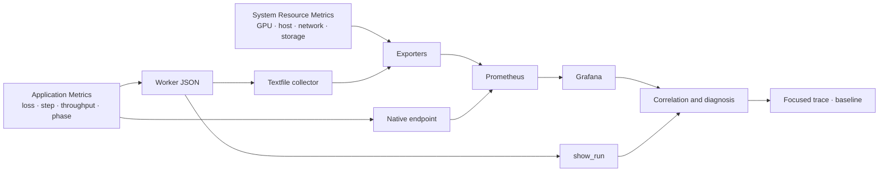

# Post-Training Telemetry

분산 학습 실행의 상태와 성능을 관측하는 collector, metric SDK, dashboard와 분석 도구입니다.
먼저 host·GPU·통신·저장소와 학습 지표에서 이상이 발생한 시간·node·rank를 찾고, 원인 분석이 필요할 때만 해당 구간의 짧은 trace를 수집합니다.
Synthetic demo는 dashboard 동작을 보여 주기 위한 예시이며 실제 LLM 학습 결과와 구분합니다.
VERL Agent RL은 run·stage·worker/node/device·evidence를 잇는 correlation layer를 추가로 사용합니다.

이 저장소는 cluster와 workload lifecycle을 소유하는 launcher를 포함하지 않습니다.
`scripts/run_verl_with_telemetry.sh`는 사용자가 전달한 VERL 명령에 logger·sidecar만 붙이는 선택적 wrapper입니다.
[`post-training-lab`](https://github.com/daegyu94/post-training-lab)은 이 저장소를 `third_party/post-training-telemetry` submodule로 참조합니다.

## Observation Model

관측 데이터는 누가 값을 생산하는지에 따라 두 경로로 나뉩니다.

| 경로 | 답하는 질문 | 대표 신호 | 생산자 |
| --- | --- | --- | --- |
| System Resource Metrics | GPU, host, network와 storage가 어떤 상태인가? | utilization, memory, power, traffic, I/O, SMART | GPU sampler, Node Exporter, system exporter |
| Application Metrics | workload가 어떤 단계에서 어떤 성능을 내는가? | loss, step, throughput, timer, phase | framework adapter, `MetricEmitter`, native exporter |



Application metric에서 `run_id`와 worker를 선택하고, 같은 시간 범위와 node의 system resource metric을 함께 해석합니다.
System resource metric은 자원이 어디에서 포화됐는지 보여 주고, application metric은 그때 workload가 무엇을 하고 있었는지 보여 줍니다.
`network`, `checkpoint`, `data_movement`처럼 두 경로에 걸친 영역은 metric 이름이 아니라 실제 source를 기준으로 구분합니다.
Agent RL의 request·trajectory ID와 tool event는 Prometheus label이 아니라 JSONL event·trace에 기록하고, run manifest가 native endpoint와 profile artifact를 연결합니다.

## Layout

| 경로 | 내용 |
| --- | --- |
| `post_training_telemetry/metrics/` | framework를 import하지 않는 application metric SDK와 textfile 변환 |
| `post_training_telemetry/adapters/` | Hugging Face Trainer와 VERL file logger adapter |
| `post_training_telemetry/events.py`, `manifest.py` | Agent RL phase span과 실행별 source·artifact correlation |
| `post_training_telemetry/` | GPU·host resource sampler, topology·live demo, stack 검증, `show_run`, run summary |
| `scripts/` | tool 설치, `node`·`storage`·`server` role 실행, profile·NCCL baseline |
| `examples/dashboards/` | Grafana dashboard와 Docker Compose 예시 |
| `config/` | Metrics Contract |

## Python Package Usage

`post-training-lab`과 source checkout을 함께 개발할 때는 저장소 루트를 `PYTHONPATH`에 추가합니다.
이 방식이 `post-training-lab` launcher의 기본값이며 checkout된 submodule commit을 그대로 사용합니다.

```bash
export PYTHONPATH="/path/to/post-training-telemetry${PYTHONPATH:+:$PYTHONPATH}"
```

독립된 application에서 Python module만 사용하려면 선택적으로 설치할 수 있습니다.

```bash
python -m pip install /path/to/post-training-telemetry
```

설치 후에는 `PYTHONPATH`를 설정하지 않아도 `post_training_telemetry`를 import할 수 있습니다.
로컬에서 telemetry source를 함께 수정할 때는 `python -m pip install -e /path/to/post-training-telemetry`를 사용할 수 있습니다.
Shell script, dashboard와 demo fixture는 Python package에 포함되지 않으므로 해당 기능은 source checkout에서 실행합니다.

## Start Here

System resource metric을 수집하고 dashboard를 실행하려면 [분산 실행 모니터링](docs/monitoring.md)에서 시작합니다.
Training metric을 함께 보려면 [Application Metrics Guide](docs/application-metrics.md)에 따라 adapter나 emitter를 연결합니다.
VERL을 처음 연결할 때는 [VERL Telemetry Quick Start](docs/verl-quickstart.md)의 비침투적 wrapper 경로를 먼저 사용합니다.
Multi-node, RL-Insight, 3FS와 custom event는 [Agent RL Telemetry Guide](docs/agent-rl.md)에서 확장합니다.
이상이 발견되면 [실행 분석](docs/analysis.md)에서 두 경로를 연관 지어 보고, 필요한 구간에만 selected-rank trace나 hardware baseline을 추가합니다.
지표를 추가하거나 의미를 해석할 때는 [Metrics Contract](docs/metrics.md)의 이름·단위·측정 범위를 따릅니다.

| 목적 | 문서 |
| --- | --- |
| host, GPU, network, storage collector와 dashboard 실행 | [분산 실행 모니터링](docs/monitoring.md) |
| application에 metric emitter나 framework adapter 연결 | [Application Metrics Guide](docs/application-metrics.md) |
| 기존 VERL 명령에 telemetry를 처음 연결 | [VERL Telemetry Quick Start](docs/verl-quickstart.md) |
| VERL Agent RL의 stage·worker·resource·evidence 확장 | [Agent RL Telemetry Guide](docs/agent-rl.md) |
| 두 경로의 상관분석, 실행 요약, trace, hardware baseline | [실행 분석](docs/analysis.md) |
| metric 이름·단위·scope, label, workflow phase | [Metrics Contract](docs/metrics.md) |

## Local Validation

GPU workload를 실행하기 전에 기본 도구 상태와 테스트를 로컬 환경에서 확인합니다.
다음 명령은 저장소 루트에서 실행합니다.
`setup.sh`는 `.venv`와 pytest만 준비하며 CUDA PyTorch, NCCL Tests, Python package는 설치하지 않습니다.

```bash
bash scripts/setup.sh
. .venv/bin/activate
bash scripts/check_tools.sh
python -m pytest -q
for f in scripts/*.sh; do bash -n "$f"; done
```

미설치 도구 표시는 해당 기능을 아직 사용할 수 없다는 뜻이며 다른 로컬 검사는 계속 실행할 수 있습니다.

## Migrating from `observability/`

`post-training-lab/observability`에서 분리하면서 다음 이름이 바뀌었습니다.
`training_*` application metric 이름은 그대로입니다.

| 이전 | 현재 |
| --- | --- |
| `scripts/run_observability.sh` | `scripts/run_telemetry.sh` |
| `scripts/install_observability_tools.sh` | `scripts/install_telemetry_tools.sh` |
| `scripts/validate_observability.sh` | `scripts/validate_stack.sh` |
| `observatory_metrics` | `post_training_telemetry.metrics` |
| `profiling_lab` | `post_training_telemetry` |
| `profiling_lab.telemetry` | `post_training_telemetry.gpu_sampler` |
| `profiling_lab.observability` | `post_training_telemetry.stack` |
| `resource_sampler.py`, `run_summary.py` (저장소 루트) | `post_training_telemetry.resource_sampler`, `post_training_telemetry.run_summary` |
| `OBSERVATORY_RUN_ID`, `OBSERVATORY_METRICS_DIR`, `OBSERVATORY_METRICS_INTERVAL` | `TELEMETRY_RUN_ID`, `TELEMETRY_METRICS_DIR`, `TELEMETRY_METRICS_INTERVAL` |
| `<output>/observatory-metrics/`, textfile `observatory.prom` | `<output>/telemetry-metrics/`, `application.prom` |
| Prometheus metric `profiling_gpu_*`, `profiling_topology_*` | `telemetry_gpu_*`, `telemetry_topology_*` |
| `examples/observability/` | `examples/dashboards/` |
| `OBSERVABILITY_TARGETS`, `OBSERVABILITY_LOG_ROOTS` | `TELEMETRY_TARGETS`, `TELEMETRY_LOG_ROOTS` |
| 기본 `TOOLS_DIR` `~/.local/share/observability-tools` | `TOOLS_DIR` 필수 지정 |
| Prometheus job `observability` | `telemetry` |
| Grafana uid `observability-{overview,prometheus,loki}` | `telemetry-{overview,prometheus,loki}` |

기존 tool 설치를 다시 내려받지 않으려면 `TOOLS_DIR`에 이전 경로를 지정합니다.
Prometheus job과 Grafana uid가 바뀌었으므로 이전 monitoring state의 TSDB·dashboard와 새 시계열은 이어지지 않습니다.
