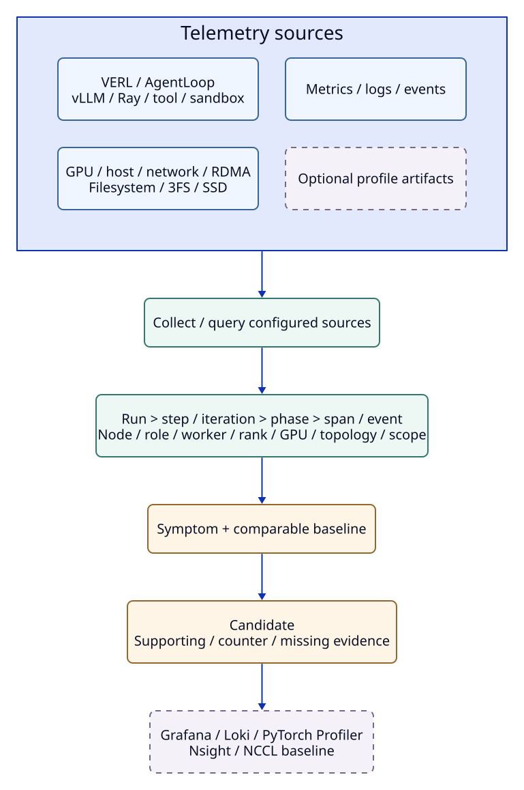
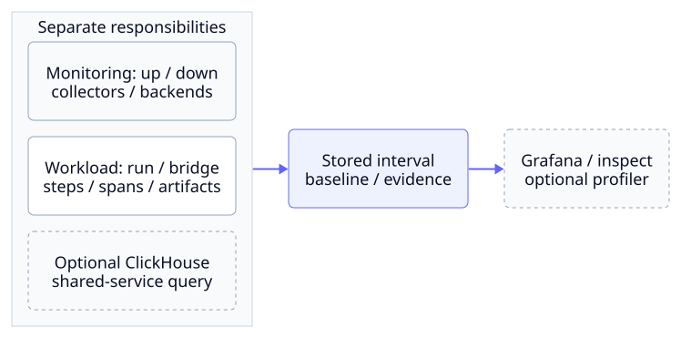
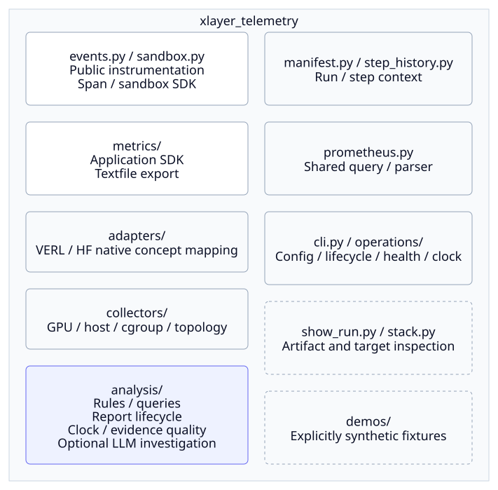
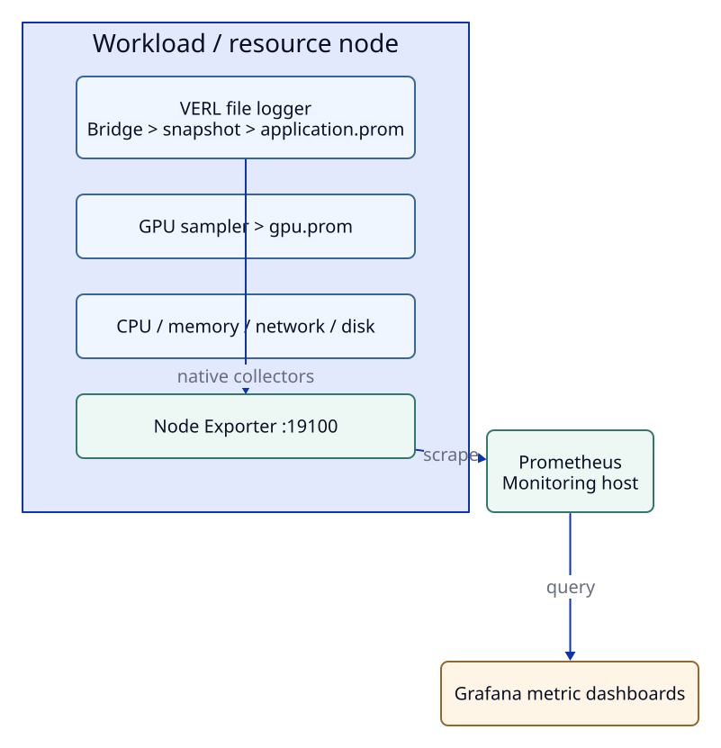
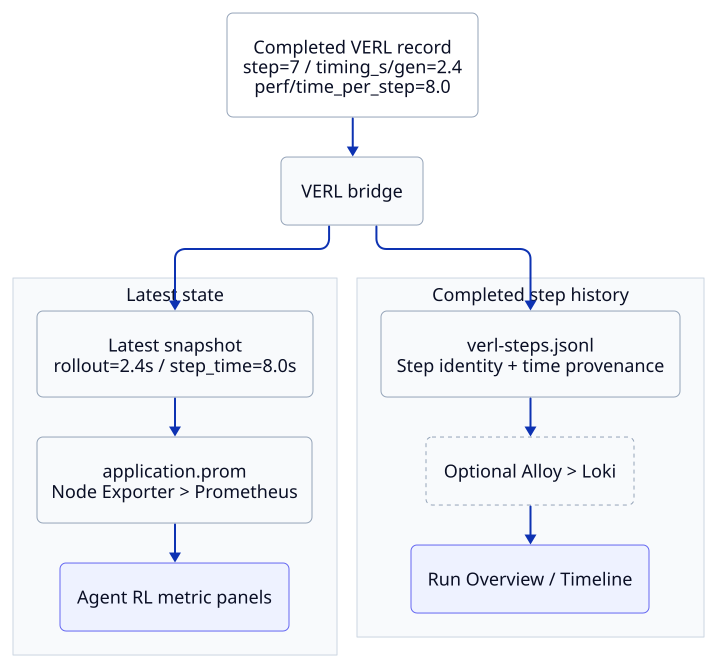

# How XLayer Telemetry Works

[Start Here](index.md#start-here)의 연결 순서에 따라 process·파일·source의 역할을 설명합니다.
실행 명령은 [VERL Quickstart](verl-quickstart.md), 추가 source 설정은 [Cross-Layer Integration](agent-rl.md)을 따릅니다.

## Why XLayer Exists

XLayer는 VERL과 서브시스템의 telemetry를 **Collect → Correlate → Diagnose**합니다.
Run·step·phase 문맥에서 느린 구간의 bottleneck candidate와 missing evidence를 제시합니다.
Prometheus·Grafana·Loki는 저장·query·시각화를, XLayer는 workload 문맥·baseline·investigation을 담당합니다.



**Collect**는 설정한 source를 수집·조회합니다.
Wrapper는 file logger bridge를 시작하며 native endpoint·node collector·log·ClickHouse는 별도로 연결합니다.

**Correlate**는 workload interval의 시간·identity·scope를 맞춥니다.
Span의 trace/parent 관계와 resource의 node·device·topology를 보존하고 step 경계·clock을 확인합니다.
동시 변화만으로 run별 사용량을 단정하지 않습니다.

**Diagnose**는 current/baseline과 evidence에서 조사 후보를 만듭니다.
Rule·선택적 LLM 경로는 근거와 누락 정보를 남기며, log·profile은 상세 증거로 탐색합니다.
모든 log·profile을 자동 진단 입력으로 넣지는 않습니다.

Grafana·Prometheus는 step·rollout·weight sync·worker·KV offload를 같은 실행 단위로 해석하지 않습니다.
GPU utilization 40%, 3FS p99 15 ms, RDMA 250 Gbps가 동시에 보여도 어느 run의 phase와 관련됐는지는 별도 조사해야 합니다.
XLayer는 workload interval·scope로 연결해 가설을 만들며 공유 사용량을 자동 귀속하지 않습니다.

OpenTelemetry의 metric·trace·log·event·profile 및 resource 개념은 interoperability의 기반입니다.
XLayer의 기존 `trace_id`·`span_id`는 이를 고려해 유지하지만 OpenTelemetry 규격만으로 storage path가 병목이라는 판단이 자동으로 생기지는 않습니다.
DeepFlow의 eBPF·network/service path visibility는 환경에 있을 때 소비할 수 있는 유용한 signal source이며, XLayer가 그 수집 stack을 다시 만들지는 않습니다.
Nsight Systems·PyTorch Profiler 같은 전문 profiler는 저수준 상세 분석 도구이므로 XLayer는 상시 저비용 관측에서 의심 구간을 고르고 필요한 때 그 도구로 이동합니다.
DCGM 또는 기존 GPU sampler, Node Exporter, Loki도 기존 역할 그대로 사용합니다.

`analysis/diagnosis_analysis.py`는 framework와 독립적인 signal·scope·baseline·participant로 rule을 평가하고, `analysis/diagnostics.py`는 VERL 이력과 Prometheus·3FS를 연결합니다.
[공통 Prometheus client](https://github.com/daegyu94/xlayer-telemetry/blob/main/xlayer_telemetry/prometheus.py)는 rule·LLM·clock 검사에서 같은 series parser를 사용합니다.

`SandboxRecorder`는 외부 runtime lifecycle을 기존 span으로 기록하고, `collectors/sandbox_sampler.py`는 안정적인 cgroup v2 subtree를 Node Exporter textfile로 노출합니다.
Cgroup과 local NVMe의 node/device metric은 별도 scope입니다.

Grafana/Loki projection 없이도 원본 진단 JSON을 읽을 수 있으며 [schema·rule·조사 순서](diagnosis.md)는 한곳에서 관리합니다.
Integration은 VERL 중심이지만 SDK·core 모델은 다른 framework adapter에도 사용할 수 있습니다.

## Greenfield Design and Migration

지금 새로 설계해도 사용자 진입점은 `xltel`, 조사 화면은 Grafana, 저장·query는 기존 backend를 선택합니다.
XLayer가 소유할 핵심은 실행 문맥과 evidence 해석이며, process 관리와 source 수집은 작은 경계로 분리합니다.
CLI의 `up/status/down`은 현재 수집 상태, `run/inspect`는 workload 실행과 저장된 결과를 다룹니다.




### Requirements and Invariants

- 기존 VERL command와 environment를 존중하고 wrapper가 workload exit code를 보존합니다.
- SDK의 기록 실패와 backend query 실패는 workload 결과와 별도로 남깁니다.
- 종료 대상은 이 config가 생성한 process이며 PID·start time·boot ID·session과 lock으로 소유 범위를 확인합니다.
- Metric은 sampled observation, event/span은 실행 이력, profile은 선택한 구간의 상세 artifact입니다.
- `run_id / step / phase` 외에도 observer/resource node, worker/rank/device, interval·clock 품질과 observation scope를 확인합니다.
- Trace 관계는 계측된 호출에 한하며 시간상 겹친 shared resource를 run 사용량으로 귀속하지 않습니다.
- Source 미설정, query 실패, no data, stale sample과 workload 종료를 구분합니다.

Cluster는 monitoring config와 backend label의 namespace입니다.
SDK event의 cluster 구분은 현재 collector 배포 문맥에 의존하므로 서로 다른 cluster의 run directory를 하나의 collector input에 섞지 않습니다.
Observer는 step을 기록한 node이며 resource node는 실제 GPU·NIC·storage·sandbox가 위치한 node입니다.
Dedicated sandbox도 같은 context 모델을 사용하고 trace/span context를 RPC 경계로 전달합니다.

### Keep, Refactor, Redesign

| 영역 | 판단 | 현재 적용과 후속 방향 |
| --- | --- | --- |
| Collect → Correlate → Diagnose | KEEP | Source 수집, interval/entity 연결, pure rule evaluation 경계를 유지합니다. |
| Prometheus / Loki / ClickHouse | KEEP | Metric query, log·event projection, 3FS service window의 역할을 유지합니다. Run artifact는 backend 없이도 읽습니다. |
| Wrapper / SDK / adapter / collector | KEEP | Workload launch, 계측 API, framework 명칭 변환, node 수집을 각각 담당합니다. |
| `xltel` command와 ownership | KEEP | Lifecycle shell 구현은 하나로 유지하고 CLI에서 재사용합니다. Remote node 배치는 외부 orchestration 책임입니다. |
| Run → Step → Candidate → Evidence → Detail | KEEP | 실제 Grafana navigation으로 검증합니다. Overview/Focus는 canonical panel을 재사용합니다. |
| Health와 saved-run 요약 | REFACTOR | 현재 endpoint 상태와 저장된 workload outcome·snapshot을 분리합니다. Snapshot 선택은 내용의 identity와 producer timestamp를 사용합니다. |
| Native source health | REFACTOR | 한 target snapshot을 collector/native 판단에 공유하고 source identity index로 조회합니다. Optional config 오류는 전체 health 결과를 없애지 않습니다. |
| Event evidence와 query provenance | REFACTOR | 파일명 대신 event semantics로 tool span을 선택하고 실제 실행한 query를 canonical signal에 연결합니다. |
| Config와 launcher 계약 | REDESIGN, 단계적 | TOML을 public 설정으로 유지하되 Python/Bash의 기본값·tool version 중복을 공통 계약으로 옮깁니다. Lifecycle parity test 이후 항목별로 이동합니다. |
| Optional analysis source 선택 | REDESIGN, 단계적 | 기본 query 전체를 시도하는 구조에서 configured capability에 따른 query 선택으로 전환합니다. 사용자 query override와 bounded retry를 먼저 보존해야 합니다. |
| 장시간 이력 조회 | 측정 후 결정 | Bounded cache와 deadline을 유지하고 실제 run 크기에서 비용을 측정한 뒤 persistent index를 도입합니다. |

이번 refactor는 metric label, dashboard UID, 파일 schema version과 lifecycle 소유권을 바꾸지 않습니다.
`operations/run_artifacts.py`는 CLI가 공유하는 저장된 run의 읽기 모델이며 backend 조회나 workload 생존 판정을 하지 않습니다.
`subsystems.summarize_sources`는 이미 조회한 target을 해석하고 native source inspection은 diagnosis engine을 import하지 않습니다.

### Operational and Historical State

`status`의 service/target 상태는 현재 조회 결과입니다.
`latest_run`과 `metrics.verl`은 저장된 artifact를 읽으며 snapshot에 `scope=stored_artifact`를 표시합니다.
기록에 `workload.status=running`이 남아 있어도 process 생존의 증거는 아니므로 `recorded_at`과 telemetry completeness를 함께 봅니다.
종료된 run의 오래된 snapshot만으로 monitoring stack을 unhealthy로 바꾸지 않습니다.

새 manifest의 observer가 있으면 해당 run/node의 trainer snapshot만 선택합니다.
여러 observer가 있는데 manifest에 observer가 없으면 임의로 한 node를 고르지 않고 `identity=ambiguous`로 남깁니다.
Identity가 빠진 기존 `verl-trainer-driver.json`은 `legacy_unverified`로 표시하며 명시적인 run/node 불일치는 허용하지 않습니다.

Config는 사용자 입력, `state/`는 managed service의 PID·generated config·backend data·log, `runs/`는 workload별 artifact입니다.
`down`은 process를 종료하며 이력이나 config를 삭제하지 않습니다.
기존 directory를 옮기는 migration은 필요하지 않고, 향후 경로 구조를 바꾼다면 명시적인 변환 도구와 기존 artifact 읽기 검증을 먼저 제공합니다.

후속 migration은 **source capability 명시 → config/launcher 계약 통합 → 실규모 이력 조회 측정** 순서가 적절합니다.
각 단계에서 기존 CLI happy path, signal/exit 처리, optional source 부재, mixed-node negative case와 Grafana context 유지 검증을 통과해야 합니다.

### Package Responsibilities

구현은 수집·SDK·framework 연결·분석의 책임으로 나눕니다.
루트의 `events.py`, `sandbox.py`, `manifest.py`, step 이력은 application에서 사용하는 실행 문맥을 제공하고, 작은 공통 파일·수치·identity helper도 유지합니다.
Python import와 module 실행 경로도 책임별 package로 통일합니다.



`metrics`와 `events`를 import해도 collector나 LLM diagnosis를 함께 적재하지 않습니다.
Collector는 관측치를 생산하고 `analysis`는 그 값의 시간·entity·scope·품질을 확인하므로 수집 코드가 diagnosis 판정에 의존하지 않습니다.
Analysis의 source 조회는 기존 Prometheus와 ClickHouse를 사용하며 새 telemetry backend를 만들지 않습니다.

Synthetic demo는 `demos`에 모아 실제 수집·분석 구현과 구분합니다.
Shell launcher·example·test도 같은 module 경로를 사용하며, 루트에 중복 entrypoint를 두지 않습니다.

Checkout의 `scripts/`는 실행 helper, `examples/`는 recipe·fixture, `config/`는 계약, `docs/`는 안내를 담당합니다.
공개 API·작은 공통 helper와 `test_<module>.py` 구조는 유지합니다.

### Python Module Paths

기존 루트의 collector·analysis 호환 wrapper는 제거했습니다.
외부 Python 코드에서 직접 import하거나 `python -m`으로 실행했다면 아래 경로로 변경합니다.
각 행의 `<module>`은 같은 행에 나열된 이름 중 하나입니다.

| 이전 루트 module | 현재 경로 |
| --- | --- |
| `diagnostics`, `diagnosis_analysis`, `clock_quality`, `evidence_quality`, `llm_diagnosis`, `llm_investigation` | `xlayer_telemetry.analysis.<module>` |
| `gpu_sampler`, `resource_sampler`, `sandbox_sampler`, `topology_textfile` | `xlayer_telemetry.collectors.<module>` |
| `live_demo` | `xlayer_telemetry.demos.live` |
| `diagnosis_demo` | `xlayer_telemetry.demos.diagnosis` |

예를 들어 `DiagnosticEngine` import와 단일 진단 실행은 다음과 같습니다.

```python
from xlayer_telemetry.analysis.diagnostics import DiagnosticEngine
```

```bash
python -m xlayer_telemetry.analysis.diagnostics --help
```

이전 checkout에서 wheel을 빌드했다면 생성물인 `build/`를 먼저 정리해 옛 module이 packaging cache에 남지 않게 합니다.
일반 설치한 Python 환경에는 업데이트한 checkout을 `python -m pip install --force-reinstall /path/to/xlayer-telemetry`로 다시 설치합니다.
Editable 설치는 checkout의 변경을 바로 읽습니다.
`metrics`·`events`·`sandbox`의 공개 SDK 경로와 metric·event·diagnosis 파일 형식은 유지하므로 저장된 run을 변환할 필요는 없습니다.
`scripts/`의 실행 helper를 호출하는 외부 프로젝트는 module 경로를 직접 쓰지 않는 한 호출 방식을 바꿀 필요가 없습니다.
Standalone Step Explorer의 HTML·Python 서버는 제거했습니다.
완료 step 탐색은 Grafana의 Run Overview → Cross-Layer Timeline을 사용하고, Loki가 없는 저장된 run은 `python -m xlayer_telemetry.show_run "$RUN_ROOT"`으로 읽습니다.
검증 기록의 명령은 실행 당시 경로를 보존하며, 현재 명령은 각 사용 가이드를 따릅니다.

### When to Revisit eBPF

현재 XLayer의 기본 수집·진단 경로에는 eBPF가 필요하지 않습니다.
Node Exporter의 network·disk 값은 node 또는 device 전체이므로 process별 사용량이 필요할 수 있지만, PID별 CPU·memory·disk I/O 합계는 먼저 [OpenTelemetry Host Metrics의 process scraper](https://github.com/open-telemetry/opentelemetry-collector-contrib/blob/main/receiver/hostmetricsreceiver/README.md) 같은 기존 source로 확인할 수 있습니다.
반면 [RDMA userspace fast path](https://docs.kernel.org/infiniband/user_verbs.html)와 [3FS USRBIO](https://github.com/deepseek-ai/3FS/blob/main/src/lib/api/UsrbIo.md)는 일반 socket·read/write probe만으로 run별 I/O를 자동 귀속할 수 없습니다.
VERL의 run·step·phase 의미도 application 계측에서 계속 받아야 합니다.

실제 느린 run에서 process별 file I/O 지연, network flow 또는 scheduler wait가 반복해서 진단의 missing evidence로 남을 때만 eBPF를 재검토합니다.
그때는 한 사례에 기존 profiler나 eBPF 도구를 짧게 적용해 evidence가 채워지는지와 학습 성능 영향을 확인합니다.
DeepFlow는 지속적인 flow·service 조사에, Beyla는 tool·reward·inference RPC 조사에 필요한 경우 optional source로 평가합니다.
외부 PID를 run·worker와 연결하지 못하면 관측 scope를 process 또는 node로 유지하고 특정 run의 사용량으로 표시하지 않습니다.
Sandbox filesystem의 syscall·OverlayFS copy-up 원인이 계속 누락될 때에도 profiler를 해당 구간에만 선택적으로 붙입니다.

## The Basic Path

Node collector와 monitoring server는 별도 process입니다.
Wrapper는 VERL과 bridge를 함께 시작하고, node collector는 같은 node의 snapshot을 Prometheus 형식으로 노출하며, monitoring server는 exporter를 조회합니다.



Bridge는 VERL의 `logs/verl-metrics.jsonl`에서 완료된 step record를 읽고 알려진 scalar를 공통 metric 이름으로 변환합니다.
예를 들어 `timing_s/gen`은 `rl_stage_duration_seconds{phase="rollout"}`으로, `perf/time_per_step`은 `training_step_time_seconds`로 옮깁니다.
Bridge는 새 snapshot으로 이전 snapshot을 교체하고, 별도로 `telemetry-events/verl-steps.jsonl`에 완료 step event를 누적합니다.
Node collector의 변환 process는 기본 2초마다 snapshot을 읽어 `application.prom`을 갱신합니다.
GPU sampler가 만드는 `gpu.prom`과 host 지표도 Node Exporter의 `:19100/metrics`에서 함께 노출되며, Prometheus는 기본 2초마다 이를 조회합니다.
Grafana는 Prometheus에 저장된 시계열을 query하므로 JSON 파일을 직접 읽지 않습니다.

Application snapshot과 topology collector는 손상된 파일·sample을 건너뛰고 정상 producer의 지표를 계속 내보냅니다.
JSONL 조회도 malformed JSON, UTF-8 오류와 object가 아닌 행을 건너뜁니다.
누락된 값을 0으로 채우지는 않으므로 source와 freshness를 함께 확인합니다.
Snapshot 교체에는 쓰기마다 별도의 임시 파일을 사용해 같은 process의 동시 export도 파일을 충돌 없이 교체합니다.

## Follow One Completed Step

예를 들어 VERL file logger가 step 7의 `timing_s/gen=2.4`와 `perf/time_per_step=8.0`을 기록했다고 가정합니다.
아래 숫자는 변환 경로를 설명하기 위한 예시이며 실제 학습 측정값이 아닙니다.



Bridge가 변환한 step 7 snapshot을 collector가 읽고 Prometheus가 scrape하면 panel이 갱신됩니다.
다음 step 완료 전까지 이전 값이 유지됩니다.
Step event는 JSONL에 쌓이고 Alloy·Loki를 켜면 Run Overview의 Step Explorer 목록에 나타납니다.
Logger의 stage duration에는 start/end timestamp가 없어 시간 구간은 추정치입니다.

## What Each File Is For

`RUN_ROOT`는 한 run의 증거, `OUTPUT_DIR`은 collector 상태입니다.
단일 run은 `TELEMETRY_METRICS_DIR=$RUN_ROOT/telemetry-metrics`로 연결합니다.
`verl_local.sh node`는 기본적으로 `RUN_ROOT` 부모의 `*/telemetry-metrics`를 발견하며, 직접 실행 시 `TELEMETRY_RUNS_ROOT`로 선택합니다.
발견 모드는 기본 300초 freshness·run 종료 상태를 확인하되 원본 파일은 보존합니다.


JSON snapshot은 최신 상태를 빠르게 노출하기 위한 것이므로 모든 step의 이력이 아닙니다.
원본 step scalar 이력은 VERL file logger에, 관측된 완료 경계는 event JSONL에 남습니다.
Prometheus에는 scrape에 잡힌 시계열만 남고 기본 보존 기간은 1일입니다.
Run artifact와 collector state는 별도 로컬 파일이므로 두 경로의 용량과 보존 기간을 각각 관리합니다.

## Failure Boundaries and Operating Limits

XLayer는 관측된 변화로 조사 범위를 좁히는 도구입니다.
다음 한계는 기능을 켜거나 dashboard에 값이 보인다는 사실만으로 해소되지 않습니다.

| 한계 | 현재 대응과 사용 조건 |
| --- | --- |
| **Correlation은 원인 증명이 아닙니다.** 공유 GPU·NIC·3FS·serving engine의 사용량을 run별로 자동 분리하지 않습니다. | Scope·entity를 보존하고, process·cgroup·client 계측이나 경쟁 부하를 통제한 비교 실험으로 확인합니다. 서로 다른 GPU의 memory·eviction을 하나의 강한 근거로 합치지 않습니다. |
| **Step보다 거친 관측이 있습니다.** File logger 경계는 근사치이며, async update와 rollout은 겹칠 수 있습니다. Scrape·rate window 안의 짧은 spike도 분리되지 않을 수 있습니다. | Producer timestamp·명시적 span을 사용하고 clock·sampling quality를 확인합니다. Clock guard는 시각을 보정하거나 사라진 표본을 복원하지 않습니다. |
| **자동 계측 범위가 제한됩니다.** Endpoint 등록만으로 전체 호출 체인, RDMA/USRBIO의 process별 I/O, GPU kernel·allocator 동작을 얻지는 못합니다. | Native source·log 경로와 remote worker 계측을 별도로 연결합니다. 저수준 원인은 Nsight·PyTorch Profiler 같은 targeted profiling으로 확인합니다. |
| **Diagnosis는 관측 가능한 가설입니다.** Rule에 없는 패턴, 비교 조건이 다른 baseline, LLM의 잘못된 해석을 완전히 배제할 수 없습니다. | Workload 비교 조건과 supporting/counter/missing evidence를 확인합니다. `no_anomaly_observed`는 수집한 신호·적용한 rule에서 찾지 못했다는 뜻이며 전체 시스템 정상 보증이 아닙니다. |
| **Telemetry는 best-effort입니다.** Synchronous I/O는 workload를 지연시킬 수 있고, bounded async queue·disk 오류·강제 종료로 데이터가 빠질 수 있습니다. | Node-local 기록, 선택적 async I/O, drop/error·completeness 상태를 사용합니다. 무손실 수집이나 zero overhead를 보장하지 않습니다. |
| **긴 run에는 용량·조회 비용 관리가 필요합니다.** Cache 초과·재시작 시 JSONL 전체 scan이 가능하고 persistent time index와 artifact 자동 정리는 없습니다. | Backend budget·worker deadline을 유지하고 run/log 용량을 관리합니다. [Backend retention](monitoring.md#retain-data-for-completed-runs)을 조사 기간에 맞추며, 만료된 metric은 남은 step 이력으로 복원할 수 없습니다. |
| **배포·가용성은 별도 책임입니다.** `xltel`은 현재 host의 소유 process를 관리하며 cluster scheduler·remote 배포·HA를 제공하지 않습니다. | Linux collector와 cgroup v2, NVIDIA GPU sampler 등 source별 조건을 확인하고 원격 배포·backend 백업은 기존 운영 도구로 관리합니다. |

실제 VERL sync/async·Docker sandbox·GPU·3FS/ClickHouse와 두 VM의 검증 기록이 있습니다.
이는 독립 물리 GPU/storage cluster의 모든 조합이나 대규모 장기 run의 비용·정확도를 보장하지 않으며, [검증 기록](validation/README.md)의 실행 조건과 미검증 범위를 함께 읽습니다.

### Failure Isolation

Wrapper는 workload exit code와 `telemetry-health.json`의 수집 상태를 별도로 남깁니다.
최종 export 실패로 workload 결과를 덮지 않으며, `flock`과 process ownership 검증으로 같은 run의 중복 실행과 무관한 process 종료를 막습니다.
Sidecar 종료는 TERM 후 2초, 필요하면 소유 group에 KILL 후 2초까지 기다리지만 kernel I/O 자체를 강제로 완료시키지는 못합니다.

Bridge는 완성된 newline record를 읽고 malformed line은 건너뜁니다.
파일 교체·축소와 읽은 끝부분의 최대 256 byte 변화를 확인하지만 임의의 rewrite나 삭제된 미수집 record를 모두 복원하지는 못하므로 rename rotation을 권장합니다.
Producer timestamp가 없는 backlog는 외부 resource와의 step correlation을 제한하며 backend 수집 지연·일시 오류는 bounded retry로 처리합니다.

SDK의 `from_env()`는 잘못된 설정에서 `None`을 반환하지만 명시적 constructor의 입력 오류는 호출자에게 전달합니다.
[Bounded background writer](application-metrics.md#optional-background-io)와 [analysis deadline/cache](diagnosis.md#backend-query-budget)는 지연과 자원 사용을 제한하는 선택지이며, 데이터 완전성과 filesystem 응답을 보증하지 않습니다.

## Add One Source at a Time

기본 경로가 정상인 뒤 추가 source를 연결합니다.
Source마다 저장소와 화면이 달라서 endpoint를 하나 등록하는 것만으로 모든 패널이 채워지지 않습니다.

| Source | 수집 경로 | 주로 확인할 곳 |
| --- | --- | --- |
| VERL 완료 step | File logger > bridge > snapshot > Node Exporter > Prometheus | Run Overview, Agent RL |
| GPU·CPU·memory·network·disk | GPU sampler·Node Exporter > Prometheus | Run Overview, Compute, Data & Storage |
| vLLM·Ray native metrics | 각 `/metrics` endpoint > Prometheus `native` job | vLLM: Agent RL, Ray: Prometheus query 화면 또는 Grafana Explore·진단 |
| Workload log·step event | File > Alloy > Loki | Run Logs, Grafana Step Explorer |
| 3FS FUSE mount·SSD | Node Exporter·선택적 SMART exporter > Prometheus | Data & Storage |
| 3FS service latency | ClickHouse > 선택적 diagnostics process | `diagnostics/latest.json`, `show_run` |
| Custom tool span | Application SDK > JSONL event > 선택적 Alloy/Loki | `show_run`, 원본 event, Cross-Layer Timeline |
| 진단 후보·timeline | Diagnostics JSON > Alloy > Loki, EventRecorder JSONL > Alloy > Loki | Bottleneck Summary, Cross-Layer Timeline; Loki 없이 JSON·`show_run` |

3FS의 POSIX/FUSE mount 용량과 node disk I/O는 host 관측치입니다.
3FS service latency는 ClickHouse 진단 경로이고, Grafana의 Data & Storage 패널에 자동 표시되지 않습니다.
vLLM KV offload rate도 vLLM endpoint의 지표이며 filesystem tier나 특정 3FS write량을 직접 뜻하지 않습니다.
[Mooncake Store](agent-rl.md#observe-mooncake-kv-storage)는 같은 Prometheus native 경로로 connector RPC·master cache·client DFS evidence를 추가합니다.
VERL + vLLM + Mooncake + 3FS 배포에서는 기본 관측 대상이며 다른 workload에 Mooncake 설치를 요구하지 않습니다.
Client의 descriptor DFS metric과 3FS ClickHouse service metric은 별도 scope이며 Mooncake를 XLayer 내부 runtime이나 필수 dependency로 넣지 않습니다.
각 source를 켜는 명령과 전제 조건은 [확장 가이드](agent-rl.md#choose-the-next-source)와 [Monitoring Guide](monitoring.md#add-run-logs-with-loki)에 있습니다.

## Match Identity and Time

Application snapshot에는 `run_id`·worker·node가 들어갑니다.
같은 machine의 논리 node 이름을 source마다 동일하게 사용합니다.
Node target은 `TELEMETRY_TARGETS` 왼쪽 이름, native source는 `labels.node`, Loki는 collector의 `NODE_NAME`을 사용합니다.
Log의 Run은 directory 이름이므로 telemetry `run_id`와 다를 수 있습니다.

System metric과 shared vLLM·Ray·3FS service metric에는 특정 VERL `run_id`가 자동으로 붙지 않습니다.
같은 시간대와 node·role·device를 선택해 비교하고, 여러 node에서는 clock을 동기화합니다.
VERL file logger에는 원본 step 시작·종료 timestamp가 없어서 Step Explorer는 bridge가 관측한 완료 시각에서 보고된 step 시간을 빼 분석 구간을 추정합니다.
Bridge 시작 전에 존재하던 기록이나 종료 후 재생한 기록은 원래 실행 시각을 복원할 수 없으므로 시간 구간을 `unknown`으로 남기고 외부 resource metric과 연결하지 않습니다.
`ingested_at`은 파일을 읽은 시각이며 `source_event_time`을 대신하지 않습니다.
Async mode에서는 이 구간이 trainer update를 나타내며, 동시에 실행된 rollout이나 storage I/O가 해당 update에 속한다고 보장하지 않습니다.
구간 해석은 [Step Explorer](dashboards.md#read-a-step)에 자세히 설명합니다.

### Multi-node Correlation Boundary

GPU 번호 `0`과 worker 번호 `0`은 node마다 반복됩니다.
Resource identity는 cluster·node·device, application identity는 run·node·producer·role·worker를 함께 사용하며, snapshot/event 파일명에도 node와 run을 포함합니다.
같은 directory에 여러 node의 snapshot을 저장해도 node collector는 자신의 `NODE_NAME`과 일치하는 snapshot만 노출합니다.
기존 파일은 계속 읽을 수 있지만 SDK upgrade 이후 고정 파일명을 읽는 외부 script는 JSON의 identity나 `*.json` 목록을 사용해야 합니다.
Log directory는 각 node에서 실제로 생성한 파일만 Alloy가 읽도록 분리합니다.
Shared directory 전체를 여러 Alloy가 동시에 tail하면 중복 수집이나 잘못된 collector node label이 생길 수 있습니다.

Prometheus scrape timestamp와 application/span의 node wall clock은 서로 다른 시간 source입니다.
`EventRecorder`의 duration은 monotonic clock으로 계산하고 wall clock jump가 감지된 span은 `clock_discontinuity`로 표시합니다.
이는 duration을 보호하지만 서로 다른 node의 절대 timestamp를 맞추지는 않습니다.
Trace ID와 parent span ID는 clock 차이가 있어도 관계를 보존하며, resource window와의 시간 overlap은 별도 clock 검증이 필요합니다.

Cluster를 지정한 diagnosis는 기존 Node Exporter의 `node_time_seconds`와 `node_timex_sync_status`로 current/baseline의 clock 상태를 검사합니다.
차이가 크거나 source가 없거나 오래됐거나 kernel이 unsynchronized를 보고하면 raw evidence는 남기고 cross-layer candidate와 resource delta를 보류합니다.
Scrape-relative offset에는 network/collection delay가 포함되므로 NTP 측정이나 timestamp 자동 보정으로 사용하지 않습니다.
Clock 검사를 통과해도 polling 오차, 1분 rate window, shared-service attribution 제한은 남습니다.
선택적 [userspace calibration](time-alignment.md)은 monitoring host와의 four-timestamp exchange를 사용합니다.
SDK·bridge는 원본 시각을 보존하고 보정된 investigation window·uncertainty를 기록하며, Prometheus scrape timestamp를 다시 이동시키지 않습니다.
Rule·LLM·Loki·Timeline은 해당 window를 사용하고 reference mismatch·만료·clock jump·coverage 부족 시 판단을 보류합니다.
3FS producer timestamp와 일반 application log는 별도 clock 검증이 필요합니다.
실행 순서는 [Multi-node Monitoring](monitoring.md#monitor-gpu-and-storage-nodes-together)에 설명합니다.

## Design Principles

1. **Workload와 수집기를 분리합니다.** Wrapper는 기존 VERL 명령을 실행하고 file logger와 bridge를 붙이며 VERL source를 고치지 않습니다.
   수집기나 선택적 diagnostics 오류를 조사할 수 있도록 별도 log를 남기고 workload의 종료 코드를 보존합니다.
2. **신호의 생산자와 측정 범위를 유지합니다.** Trainer duration은 application 값이고 GPU·disk는 device/node 값이며 3FS latency는 shared service 값입니다.
   같은 시각의 변화는 병목 후보이지 run별 정확한 사용량이나 인과관계가 아닙니다.
3. **작은 연결부터 검증합니다.** Synthetic 화면, 실제 node target, 첫 완료 VERL step, native endpoint, Loki·3FS 순서로 확인합니다.
   각 단계에서 `show_run`, exporter `/metrics`, Prometheus Targets, Grafana를 순서대로 점검할 수 있습니다.
4. **누락과 0을 구분합니다.** 연결하지 않은 source나 오래된 표본을 0으로 채우지 않습니다.
   Target 상태와 sample age를 먼저 확인하고, diagnostics의 `missing_sources`를 정상 판정으로 읽지 않습니다.
5. **상시 지표와 상세 증거를 나눕니다.** 저비용 metric은 계속 수집하고 step event·log·짧은 profiler trace로 의심 구간을 확인합니다.
   Request ID·prompt·trace ID처럼 계속 달라지는 값은 Prometheus label 대신 event·log·manifest에 둡니다.

새 metric의 단위·scope·label을 정할 때는 [Metrics Contract](metrics.md), custom application snapshot을 만들 때는 [Application Metrics Guide](application-metrics.md)를 따릅니다.
