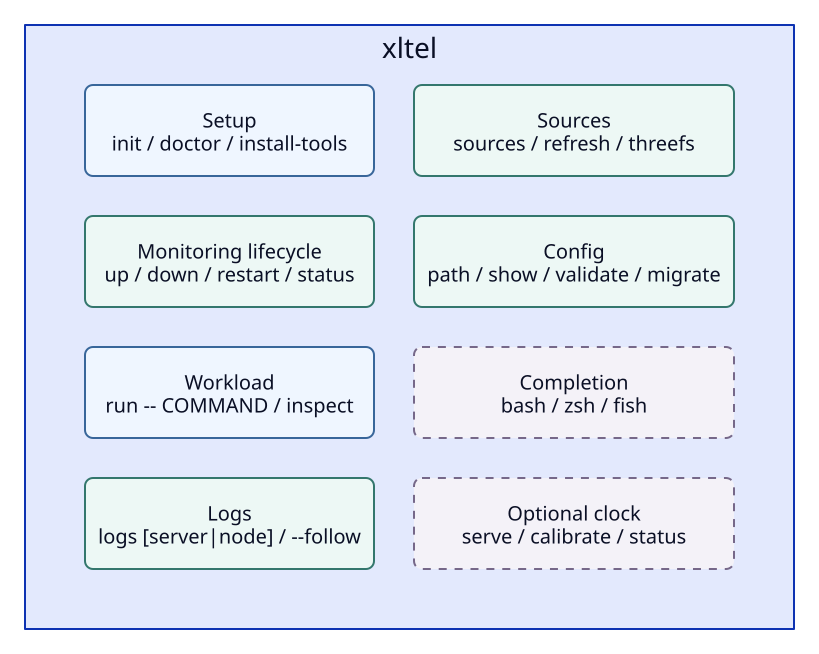
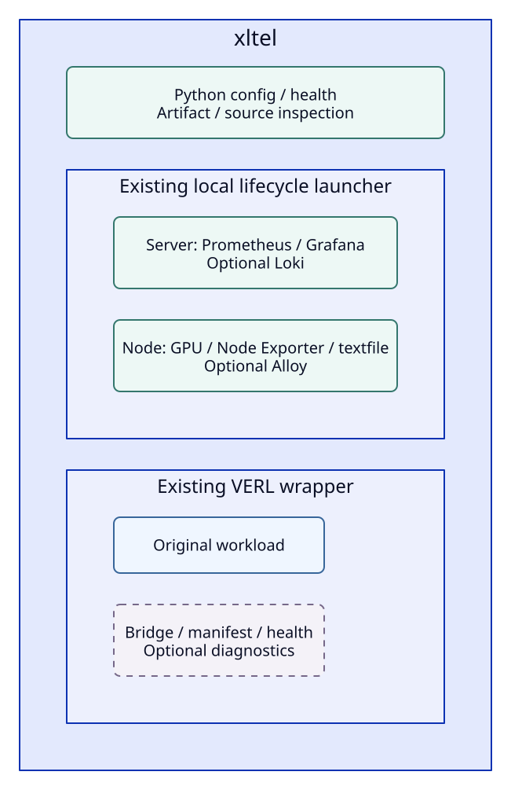

# xltel CLI

`xltel`은 monitoring lifecycle, workload wrapper와 결과 조회를 위한 공식 CLI입니다.
`up`은 server·node collector를 시작하고, `run`은 기존 VERL 명령에 telemetry를 붙입니다.
`down`은 이 config로 시작한 monitoring process만 종료하며 VERL·Ray·vLLM workload를 종료하지 않습니다.

## Basic Workflow

Telemetry Python 환경에 package를 설치하면 console command가 생깁니다.
VERL은 기존 training 환경의 Python이나 launcher로 실행합니다.

```bash
python -m pip install -e .
xltel init
xltel doctor
xltel install-tools
xltel up
xltel status
xltel run -- /path/to/verl-env/bin/python -m verl.trainer.main_ppo ...
xltel inspect
xltel down
```

`doctor`는 설치 전 누락된 binary와 해결 명령을 표시합니다.
`install-tools`는 최초 한 번 필요하며 NVIDIA driver·VERL·3FS는 설치하지 않습니다.
재실행은 요청한 release URL과 기존 manifest의 SHA256이 모두 일치하는 archive를 재사용하며 architecture·version이 다르거나 손상되거나 검증 기록이 없는 archive는 다운로드합니다.
이는 local cache의 integrity 검사이며 publisher signature 검증은 아닙니다.
`xltel`만 실행하면 command 목록과 시작 순서를 보여 줍니다.

## Commands



| Command | 주요 option / 하위 command |
| --- | --- |
| `init` | 기존 config를 보존하며 초기 설정 생성 |
| `doctor`, `status` | `--json`, `--role all\|server\|node` |
| `install-tools`, `up`, `down`, `restart` | `--role all\|server\|node` |
| `run` | `--mode auto\|sync\|async`, `--run-id ID`, `--output DIR`, `--node NAME`, `-- COMMAND` |
| `inspect` | `[RUN_ID \| RUN_DIR]` |
| `logs` | `[server\|node]`, `--follow`, `--lines N` |
| `sources` | `--json`, `refresh`, `threefs --window-seconds N` |
| `config` | `path`, `show`, `validate`, `migrate --output FILE.toml` |
| `completion` | `bash\|zsh\|fish` |
| `clock serve` | `--reference-id ID`, `--bind ADDRESS`, `--port PORT` |
| `clock calibrate` | `--url URL`, `--reference-id ID`, `--node NODE`, `--file FILE` |
| `clock status` | `--node NODE`, `--file FILE` |

`status`는 현재 system, `inspect`는 저장된 run 결과를 확인합니다.
`status`의 Start Here 링크는 cluster·node를, `run/inspect`의 Run Overview 링크는 Run을 선택한 상태로 Grafana를 엽니다.
`inspect`는 최근 CLI run 경로를 기억하므로 custom `--output` 결과도 찾을 수 있습니다.
새 CLI run의 링크는 manifest에 저장한 cluster·observer node를 사용하므로 현재 config를 바꿔도 실행 당시 문맥을 유지합니다.
이 문맥이 없는 기존 manifest는 현재 cluster 설정을 사용합니다.
`sources`는 run 없이 native endpoint를 조사하고 `sources threefs`는 설정한 ClickHouse의 shared-service window를 조회합니다.
Backend error나 source down은 nonzero, source 미설정은 정상적인 optional 상태입니다.

## Configuration

새 설치의 기본 config는 `~/.config/xlayer/config.toml`이며 `init`은 기존 파일을 덮어쓰지 않습니다.
기본 경로에 기존 `config.conf`가 있으면 그 파일을 계속 선택하므로 기존 설치가 자동으로 전환되지 않습니다.
`--config`나 `XLAYER_CONFIG`로 어느 형식이든 지정할 수 있습니다.

```bash
xltel config path
xltel config show
xltel config validate
xltel --config /absolute/path/verl-local.conf status
XLAYER_CONFIG=/absolute/path/verl-local.conf xltel status
```

Config 선택은 `--config` > `XLAYER_CONFIG` > 기본 경로 순서입니다.
알려진 설정 값은 command option > 같은 이름의 environment variable > config > 기본값 순서입니다.
Bash config 안에서 계산한 경로는 그 계산 결과를 명시한 설정으로 취급합니다.
`config show`는 resolved setting을 JSON으로 보여 주며 workload argument는 공개하지 않습니다.
Config가 export한 CUDA 설정·backend credential은 child environment로 전달하며 config 출력과 저장된 lifecycle snapshot에는 포함하지 않습니다.

### TOML Configuration

TOML은 command를 실행하지 않는 declarative 설정입니다.
`[telemetry]`는 기존 uppercase 설정 이름, `[workload]`는 argument 배열, `[environment]`는 child process에 전달할 추가 환경 변수를 받습니다.
알려지지 않은 설정과 잘못된 type은 시작 전에 거부합니다.

```toml
[telemetry]
TELEMETRY_HOME = "~/telemetry"
RUN_ID = "auto"
ENABLE_LOGS = true
# ENABLE_GPU_METRICS = false
# EXECUTION_MODE = "async"
# TELEMETRY_SOURCES_FILE = "~/telemetry/config/native-sources.json"
# DIAGNOSTICS_CONFIG = "~/telemetry/config/diagnostics.json"
# PROMETHEUS_RETENTION = "7d"

[workload]
# command = ["/path/to/verl-env/bin/python", "-m", "verl.trainer.main_ppo"]

[environment]
# CUDA_VISIBLE_DEVICES = "0,1"
```

Path 설정의 `~`만 확장하며 `$HOME`, `$VARIABLE`, command substitution은 해석하지 않습니다.
Boolean은 `true`/`false` 또는 기존 `"0"`/`"1"` 문자열, age 설정은 양의 number 또는 문자열을 사용합니다.
추가 environment 값은 문자열이며 같은 이름의 현재 terminal 환경 변수가 우선합니다.
Python 3.11 이상은 `tomllib`, Python 3.10은 package 설치 시 포함되는 `tomli`로 읽습니다.

기존 Bash config는 **trusted executable 파일**입니다.
자신이 관리하는 assignment와 `VERL_COMMAND=(...)` 배열을 사용하고 service 시작이나 오래 걸리는 command를 넣지 않습니다.
다음 명령은 현재 resolved 설정과 command를 private TOML로 저장하고 원본을 유지합니다.

```bash
xltel --config ~/.config/xlayer/config.conf config migrate \
  --output ~/.config/xlayer/config.toml
xltel --config ~/.config/xlayer/config.toml config validate
export XLAYER_CONFIG="$HOME/.config/xlayer/config.toml"
```

Migration에는 현재 environment override와 계산된 absolute path가 반영됩니다.
원본의 `export` 값은 복사하지 않으므로 필요한 값은 terminal 환경 또는 `[environment]`에 옮깁니다.
Command argument도 저장되므로 생성된 파일의 `0600` 권한을 유지합니다.
이동할 host에서 경로를 재검토하고, 기존 `.conf`는 확인 후 직접 보관하거나 `XLAYER_CONFIG`로 TOML을 선택합니다.

새 config의 도구·state·run parent는 `$HOME/telemetry/` 아래입니다.
`RUN_ID=auto`이면 실행마다 고유 ID를 만들며 collector가 같은 run parent를 계속 읽습니다.
기존 config에 명시한 `RUN_ID`·`RUN_ROOT`는 유지하고, 고정 ID를 사용하면 새 run마다 변경해야 합니다.
기존 Bash config의 named run 기본 경로인 `$HOME/telemetry-runs/<RUN_ID>`도 유지합니다.

```bash
xltel run --mode async --run-id exp-001 -- /path/to/verl-env/bin/python ...
xltel inspect exp-001
```

`--output`이 `TELEMETRY_RUNS_ROOT` 밖이면 artifact는 저장되지만 현재 collector가 자동으로 읽지는 않습니다.
Collector의 run parent를 바꾸면 `restart`가 필요합니다.
`ENABLE_LOGS=1`·`TELEMETRY_SOURCES_FILE`·`DIAGNOSTICS_CONFIG`의 연결 조건은 [VERL Quickstart](verl-quickstart.md#add-sources-when-needed)에 있습니다.

## Health and Ownership

`status`는 PID·시작 시각·boot ID, backend HTTP 응답, Prometheus의 해당 cluster/node target과 sample age를 구분합니다.
GPU freshness는 collector textfile의 producer timestamp, `VERL saved snapshot`은 저장된 run의 trainer snapshot을 확인합니다.
Snapshot은 manifest의 run·observer와 내용의 identity가 일치하는 값 중 producer timestamp가 최신인 것을 사용합니다.
JSON의 `metrics.verl.scope=stored_artifact`와 `latest_run.workload.recorded_at`은 현재 process 상태와 구분하기 위한 정보입니다.
이는 Prometheus에 모든 sample이 도착했다는 보증이나 workload correctness 판정이 아닙니다.
종료된 run의 stale sample은 workload failure로 취급하지 않습니다.

`endpoint_only`는 endpoint를 조회했지만 process ownership은 확인하지 않았다는 뜻입니다.
Docker·systemd로 따로 시작한 server가 응답하더라도 `xltel down`은 이를 종료하지 않습니다.
`status`의 전체 healthy 상태에는 이 config의 managed server·node, 필수 endpoint·target, 활성 GPU의 fresh sample과 등록된 native source의 scrape 성공이 필요합니다.
`status --role node`는 node scrape·GPU 및 활성화된 Loki endpoint 상태를 확인하며 원격 Grafana UI나 다른 native engine의 상태로 collector를 unhealthy로 만들지 않습니다.
Collector와 native source는 한 번의 target 조회를 공유합니다.
Optional source 파일이 잘못되면 `invalid_config`와 수정 명령을 표시하면서 core 상태 조회 결과를 유지하고, `config validate`는 해당 설정을 거부합니다.
3FS는 `sources threefs`로 직접 조회하며 `status`는 ClickHouse query를 자동 실행하지 않습니다.

```bash
xltel status --json
xltel doctor --json
xltel logs server --follow
```

JSON은 stdout, 오류 안내는 stderr로 나갑니다.
일반 명령은 성공·healthy일 때 0, unhealthy/runtime failure일 때 1, 사용법·config error일 때 2를 반환합니다.
`run`은 이 구분보다 실제 workload exit code를 우선하며 SIGINT/SIGTERM cleanup도 기존 wrapper를 사용합니다.

## Runtime Boundary



Lifecycle 변경은 기존 `flock`과 PID ownership 검사를 사용합니다.
Resolved config snapshot은 background child가 읽을 수 있도록 private `state/cli-configs/`에 보존합니다.
`up`이 이미 실행 중이면 새 stack을 만들지 않으며 부분 실행 상태에서는 없는 role만 추가합니다.
실패하면 이번 호출이 시작한 role만 정리하고 이전부터 실행 중인 role은 보존합니다.

### Host Roles for Multi-node Deployment

각 host에서 `--role server` 또는 `--role node`로 필요한 process만 관리할 수 있습니다.
생략한 `all`은 기존 단일 host 경로입니다.
같은 host의 두 role은 lifecycle lock과 PID ownership 검사를 공유하지만 한 role의 종료·재시작은 다른 role을 건드리지 않습니다.

Monitoring host의 `[telemetry]` 설정 예시입니다.

```toml
CLUSTER_NAME = "training-cluster"
TELEMETRY_TARGETS = "gpu-a=10.0.0.10,sandbox-a=10.0.1.10"
# Remote node가 log를 보내는 경우에만 private interface에 노출합니다.
# ENABLE_LOGS = true
# LOKI_LISTEN_ADDR = "10.0.0.20"
```

각 collector host는 같은 cluster 이름과 고유 `NODE_NAME`, local interface의 `NODE_ADDR`를 설정합니다.
Log 수집을 켠 remote node는 `LOKI_URL = "http://10.0.0.20:13100"`으로 monitoring host를 지정합니다.
GPU 없는 sandbox·storage node는 `ENABLE_GPU_METRICS = false`를 사용합니다.

```bash
# Monitoring host
xltel doctor --role server
xltel install-tools --role server
xltel up --role server
xltel status --role server

# Each collector host
xltel doctor --role node
xltel install-tools --role node
xltel up --role node
xltel status --role node
xltel down --role node
```

`status --role server`는 local collector/GPU를 요구하지 않고 등록된 전체 collector target을 확인합니다.
`status --role node`는 local collector ownership·freshness와 configured monitoring endpoint 및 해당 node의 scrape 상태를 확인합니다.
Backend에 닿지 않거나 target이 등록되지 않으면 process가 실행 중이어도 degraded로 표시합니다.
Server의 Prometheus·Grafana는 계속 loopback에 bind하며 조회용 URL 설정이 listen address를 바꾸지는 않습니다.
같은 host에서 검증 stack을 함께 실행하려면 `PROMETHEUS_PORT`, `GRAFANA_PORT`, `LOKI_PORT`를 각각 지정합니다.
Log collector도 함께 실행한다면 `ALLOY_PORT`(기본 `12345`)를 분리합니다.
기본 port는 `19090`·`13000`·`13100`이며 URL을 별도로 설정하지 않으면 선택한 local port에 맞춰 조회 주소도 변경됩니다.
Grafana datasource, startup health check와 Loki 설정도 같은 port를 사용합니다.
Remote node에서 health query가 필요하면 private SSH tunnel 등으로 monitoring endpoint에 접근할 경로를 준비합니다.
Collector `:19100`과 remote Loki `:13100`은 신뢰 가능한 private network에서만 노출합니다.
CLI stack은 native dashboard에 불필요한 Grafana plugin의 자동 다운로드를 기본으로 끕니다.
추가 plugin이 필요하면 `GF_PLUGINS_PREINSTALL_DISABLED=false`를 environment에 설정하며 설치·종료 시간이 늘어날 수 있습니다.
Plugin 파일은 공유 tool directory 대신 각 stack의 `state/server/grafana-plugins/`에 저장합니다.

이 CLI는 현재 host만 제어하며 SSH 일괄 배포·remote process 종료·systemd 관리·OS clock 변경을 수행하지 않습니다.
`clock`은 권한 없이 Step·Span의 조사 시각을 맞추는 [optional userspace calibration](time-alignment.md)이며 기본 `up/down`과 독립적으로 실행합니다.
Workload context 전달과 clock alignment는 [Multi-node Monitoring](monitoring.md#monitor-gpu-and-storage-nodes-together)을 따릅니다.
기존 Bash script는 계속 동작하고 [Scripts](https://github.com/daegyu94/xlayer-telemetry/blob/main/scripts/README.md)에 advanced interface를 정리했습니다.
일반 wheel 설치에도 CLI가 사용하는 launcher·dashboard를 포함하며 synthetic demo와 profiling 예제는 checkout에서 사용합니다.

## Shell Completion

Completion은 command tree에서 생성하며 config·backend를 조회하지 않습니다.
명령을 출력할 뿐 shell 설정 파일은 자동 수정하지 않습니다.

```bash
# Bash, current session
source <(xltel completion bash)

# Zsh, after initializing completion
autoload -Uz compinit
compinit
source <(xltel completion zsh)
```

Fish에서는 `xltel completion fish | source`로 현재 session에 적용하거나 출력물을 `~/.config/fish/completions/xltel.fish`에 저장합니다.
Command·subcommand·option·enum 값과 config/output 경로를 완성하며 `run --` 이후 workload command의 completion은 제공하지 않습니다.

## Stopping and Preserved Data

`xltel down`은 이 config가 소유한 background service를 종료하고 PID record를 제거합니다.
Service는 CLI와 별도 session에서 실행되며 PID·start time·boot ID 검증과 lifecycle lock을 유지합니다.
Config, run 결과, diagnosis, backend 데이터와 log는 다음 조회와 재시작을 위해 보존합니다.
`lifecycle.lock`과 resolved config snapshot은 작은 운영 파일이며 `down`이 user 데이터를 삭제하지는 않습니다.
