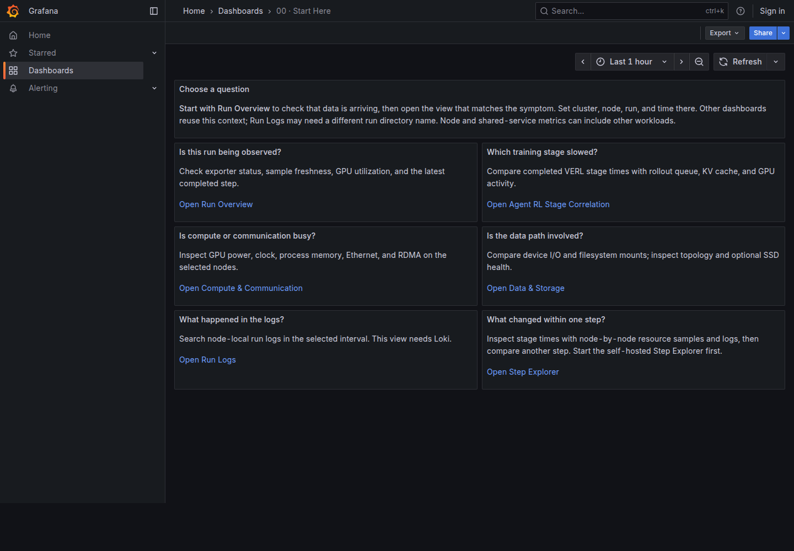

# Dashboard Guide

이 문서는 Grafana의 시작 화면과 기본 dashboard를 읽고, 완료 step을 확대해 느린 구간을 조사하는 순서를 설명합니다.
대시보드를 띄우는 절차는 [Monitoring Guide](monitoring.md#open-the-dashboards)에, 실제 값이 채워진 화면은 [VERL·vLLM·3FS·Loki 데모](real-verl-demo.md)에 있습니다.
수집 process와 파일이 어떻게 이어지는지는 [구현 구조](architecture.md)를 먼저 읽으면 이해하기 쉽습니다.

## Start Here

`00 · Start Here`는 조사할 질문에 맞는 화면을 고르는 진입점입니다.
`01`부터 `05`까지의 제목은 일반적인 조사 순서이며, 각 화면의 상단 `Start Here` 링크로 돌아올 수 있습니다.
Step Explorer와 Step Detail은 Loki를 활성화했을 때 Grafana에 추가됩니다.
완료 step을 클릭해 상세 구간을 여는 방법은 [Step Explorer](dashboards.md#open-in-grafana)에 있습니다.
화면을 처음 열었다면 [필터와 시간 범위](#select-the-context)부터 확인하고, 느린 step을 찾은 뒤 [Step Explorer](#step-explorer)와 [Run Analysis](#run-analysis)로 이어갑니다.



## Select the Context

먼저 Run Overview에서 `Cluster`, `Node`, `Run`과 시간 범위를 선택합니다.
다른 대시보드로 이동하는 링크는 공통 필터와 시간 범위를 전달하지만, 각 화면의 추가 필터는 따로 확인해야 합니다.
`All`을 선택하면 여러 node나 run의 시계열이 함께 표시될 수 있습니다.

| 신호 | 주요 범위 | 읽을 때 주의할 점 |
| --- | --- | --- |
| VERL 학습 지표 | `run_id`, `node`, `role`, `worker` | 선택한 run의 완료 step에서 갱신되며 진행 중인 phase를 실시간으로 뜻하지 않습니다. |
| GPU·host·NIC·device 지표 | node, GPU 또는 device | 해당 node의 전체 사용량이므로 선택한 run만의 값으로 귀속하지 않습니다. |
| Native vLLM 지표 | 등록한 vLLM endpoint와 node | Engine이 여러 run을 처리하면 값이 섞일 수 있으며 `Run` 필터로 분리되지 않습니다. |
| SMART 지표 | storage system label, storage node, SSD | Exporter를 별도로 연결해야 하며 `storage_system=3fs`만 지정해도 3FS 서비스 지표가 생기지는 않습니다. |
| Loki log | cluster, node, workload, log directory | `Run`은 log 경로의 run directory 이름으로 추출되며 telemetry의 `run_id`와 다를 수 있습니다. |

`N/A`는 source가 연결되지 않았거나 선택한 범위에 표본이 없다는 뜻이며 측정값 0과 다릅니다.
Run Overview와 Compute & Communication의 GPU 표는 30초보다 오래된 표본을 숨기고, 학습 패널은 `Training sample max age (s)`로 신선도 기준을 조정합니다.
긴 step에서는 sample age와 원본 log를 함께 확인합니다.
`Run` 선택은 application metric처럼 `run_id`가 있는 시계열에 적용됩니다.
GPU·host, native vLLM·Ray, 3FS 같은 공유 source는 같은 시간·node에서 비교하는 자료이며 이 필터가 run별 사용량으로 나누지 않습니다.

## Run Overview

이 화면은 수집이 살아 있는지와 학습·GPU의 최근 상태를 함께 확인하는 출발점입니다.
`Exporter targets up`은 `telemetry` job의 target 수를 세므로 native vLLM이나 SMART target의 상태까지 나타내지는 않습니다.
`Training sample age by worker`와 `GPU sample age by node`를 먼저 보면 다른 숫자가 최신 표본인지 판단할 수 있습니다.
두 age는 마지막으로 보고된 시각과 현재 시각의 차이이며, 숫자가 계속 커지면 exporter target이 up이어도 생산자가 새 값을 쓰지 않는 상태일 수 있습니다.

`GPU utilization matrix`는 node와 GPU index별 최신 사용률을 보여 줍니다.
0%는 측정된 idle 상태이고 빈 칸은 사용 가능하다는 증거가 아닙니다.
아래의 training throughput·step time·loss는 application이 해당 metric을 낼 때만 채워지며, swap 패널은 node 전체의 상태를 보여 줍니다.

## Agent RL Stage Correlation

이 화면은 완료된 VERL step의 단계 시간과 rollout engine 상태를 같은 시간대에 비교합니다.
`Latest completed RL step`이 증가하는지 확인하고, `Worker sample age`로 값의 신선도를 함께 판단합니다.
`Completed RL stage duration`은 step 경계에서 기록된 phase별 소요 시간이며 현재 실행 중인 phase의 경과 시간이 아닙니다.
Reward mean 역시 마지막으로 보고된 값으로, 값 하나만으로 모델 품질 변화를 판단하지 않습니다.

처리량·response length·GPU 사용률을 단계 시간과 비교한 뒤, rollout이 느린 구간에서는 `Live rollout engine signals`의 waiting 요청·KV 사용률·preemption을 봅니다.
이 native vLLM 패널은 [endpoint를 등록](agent-rl.md#register-native-endpoints)했을 때만 채워집니다.
`vLLM KV offload store and load`는 GPU→CPU와 CPU→GPU 전송률을 보여 주며 CPU tier와 filesystem tier를 분리하거나 3FS에 쓴 바이트만 집계하지 않습니다.
Weight sync, policy lag, tool 시간은 해당 source가 기록된 경우에만 나타납니다.
Ray endpoint를 등록했더라도 전용 panel은 제공하지 않으므로 Ray task 지표는 Prometheus Explore나 [선택적 진단](agent-rl.md#add-diagnostics)에서 확인합니다.

## Compute & Communication

이 화면은 느린 단계가 GPU·process·network 상태와 함께 변했는지 살펴보는 곳입니다.
GPU matrix와 utilization을 본 뒤 power·temperature·SM clock으로 부하와 throttling 가능성을 비교합니다.
Compute-process GPU memory는 PID별 관측값이고 `GPU allocation matrix`는 별도로 기록한 worker 배치에 의존하므로, process를 run에 자동으로 귀속시키지 않습니다.

TCP/Ethernet과 RDMA 패널은 interface 또는 port의 전송량입니다.
이 값만으로 어느 두 endpoint 사이의 traffic인지 알 수 없으며, compute topology matrix에는 별도로 제공한 edge 정보가 있어야 합니다.
`Worker-local application timers`는 application이 보고한 run별 timer가 있을 때만 표시됩니다.

## Data & Storage

`Device`는 host block device 그래프를, `Mount`는 filesystem 그래프를 선택합니다.
3FS FUSE 경로를 `Mount`로 골라도 disk throughput·IOPS·busy time은 선택한 `Device`의 node 전체 지표입니다.
Filesystem used·free space는 선택한 마운트의 용량 상태이고, disk busy time은 지연 시간의 p99가 아닙니다.
같은 시간대의 변화는 조사 단서지만 이번 run의 KV offload I/O 양을 직접 증명하지는 않습니다.

Storage topology 표는 component·edge 정보를 공급했을 때, SSD health 패널은 SMART exporter를 연결했을 때 채워집니다.
3FS 서비스 latency는 이 Grafana 화면에 포함되지 않으며 [ClickHouse 진단](agent-rl.md#add-diagnostics)에서 별도로 확인합니다.

## Run Logs

Loki를 활성화하면 Alloy가 `<log-root>/<run-directory>/logs/**/*.log` 파일을 수집해 이 화면에 표시합니다.
`Cluster`, `Node`, `Workload`, `Run`과 시간 범위를 맞추고, metric이 늦게 갱신된 구간의 메시지를 살펴봅니다.
`Run`에는 telemetry `run_id` 대신 log directory 이름이 들어갈 수 있으므로 결과가 비면 경로와 [Loki 설정](monitoring.md#add-run-logs-with-loki)을 확인합니다.
한 줄의 error나 warning만으로 전체 실행의 성공·실패를 단정하지 말고 종료 코드와 run 산출물을 함께 확인합니다.

## Follow a Slow Interval

Run Overview에서 target 상태와 sample age를 확인하고, Agent RL에서 느려진 완료 stage와 시각을 고릅니다.
같은 node·시간 범위의 Compute & Communication, Data & Storage, Run Logs를 순서대로 비교합니다.
두 신호가 동시에 변해도 인과관계가 확정되지는 않으며, 공유 자원에는 다른 workload의 영향도 포함될 수 있습니다.
완료된 step 하나를 확대하려면 Grafana의 [Step Explorer](dashboards.md#open-in-grafana)를 엽니다.
두 step의 자원 평균 차이를 계산하려면 기존 [로컬 UI](dashboards.md#legacy-standalone-explorer)를 사용합니다.
증상별 다음 조사 항목과 trace 연결은 [Run Analysis](dashboards.md#run-analysis)에서 다룹니다.

## Step Explorer

Step Explorer는 Grafana에서 완료된 VERL step을 고르고 해당 구간의 stage, node 자원 지표와 Loki log를 확인하는 화면입니다.
[Agent RL Stage Correlation](dashboards.md#agent-rl-stage-correlation)에서 느린 구간을 찾은 뒤 사용합니다.
Grafana 화면은 Loki에 step event가 수집된 run에서 동작합니다.
Wrapper는 step event를 로컬 JSONL에 남기고, Alloy가 이를 Loki에 전송해야 Grafana가 완료 step 목록을 조회할 수 있습니다.
자원 그래프는 별도로 Prometheus를 조회하므로 목록과 그래프가 각각 다른 이유로 비어 있을 수 있습니다.

### Open in Grafana

Monitoring server에 `ENABLE_LOGS=1`을 설정하고, step 기록 파일에 접근할 수 있는 node collector에 `LOKI_PUSH_URL`과 `TELEMETRY_LOG_ROOTS`를 설정합니다.
설정 방법은 [Loki 연결](monitoring.md#add-run-logs-with-loki)을 따릅니다.
Alloy는 각 root 아래 `<run>/telemetry-events/verl-steps*.jsonl`과 `<run>/telemetry/telemetry-events/verl-steps*.jsonl`을 수집합니다.
Step event의 `run_id`는 JSON 내용에서 읽으며, Loki stream의 `cluster`·`node`·`workload`는 collector 설정에서 가져옵니다.
Shared storage의 같은 파일을 여러 collector가 중복 수집하지 않도록 한 node에서만 읽습니다.

Grafana의 `06 · Step Explorer`에서 Cluster, Observer node, Run을 선택한 뒤 표의 step 번호를 누릅니다.
`07 · Step Detail`은 기록된 시작·종료 시각으로 시간 범위를 맞추고, stage 요약과 node별 GPU·CPU·memory·network·disk·vLLM 지표 및 같은 구간의 log를 표시합니다.
Resource node는 기본적으로 모든 node이므로 run에 속한 node를 골라 보며, `Log directory`가 telemetry `run_id`와 다르면 실제 결과 디렉터리 이름으로 바꿉니다.
Loki와 Prometheus가 해당 node를 수집하고 있어야 값이 채워집니다.
목록이 비면 먼저 `telemetry-events/verl-steps.jsonl`의 생성 여부와 Alloy의 파일 경로·Loki push 상태를 확인합니다.
목록은 있지만 자원 그래프가 비면 Prometheus target과 선택한 `Resource node`, 두 저장소의 보존 기간을 확인합니다.

Step 기록은 완료 시각에 수집되며 Loki의 보존 기간이 지나면 Grafana 목록에서 사라집니다.
기존 JSONL 파일은 run directory에 남습니다.
기존 실행의 step 파일에 Grafana용 시간 필드가 없다면 다음 명령으로 별도 backfill 파일을 만듭니다.
원본 `verl-steps.jsonl`은 수정하지 않으며, Loki가 해당 시각의 event를 받아들일 수 있는 보존 기간 안에서 사용합니다.

```bash
python -m xlayer_telemetry.step_backfill "$RUN_ROOT"
```

수집기가 이미 실행 중이면 새 `verl-steps-backfill.jsonl`을 자동으로 읽습니다.
Prometheus의 기본 보존 기간은 1일이므로 오래된 step은 Loki 목록에 있어도 자원 그래프가 비어 있을 수 있습니다.
Stage 시간과 step 경계는 아래 [Read a Step](#read-a-step)의 해석 범위를 따릅니다.

### Legacy Standalone Explorer

기존 로컬 UI는 두 step의 stage 시간과 자원 표본 평균 차이를 비교할 때 계속 사용할 수 있습니다.
Grafana 상세 화면은 현재 한 step의 관측 구간을 다루며 두 step의 자원 평균 차이 계산은 제공하지 않습니다.


#### Start the Local Explorer

VERL wrapper가 만든 run의 `telemetry-events/verl-steps.jsonl`이 필요합니다.
Run 파일에 접근할 수 있고 Prometheus와 Loki에도 연결되는 host에서 아래처럼 시작합니다.
`--cluster`는 Prometheus target에 붙인 실제 `cluster` label로 지정하고, `--log-run-id`는 Alloy가 log 경로에서 추출한 결과 디렉터리 이름을 사용합니다.

```bash
. .venv/bin/activate
export RESULTS_DIR='/path/to/your-run-directory'
python -m xlayer_telemetry.step_explorer \
  --run-root "$RESULTS_DIR/telemetry" \
  --cluster real-verl-3fs \
  --prometheus-url http://127.0.0.1:19090 \
  --loki-url http://127.0.0.1:13100 \
  --log-run-id "$(basename "$RESULTS_DIR")"
```

브라우저에서 `http://127.0.0.1:8765/`를 엽니다.
서버는 기본적으로 localhost에만 바인딩하며, 원격 host에서 실행한다면 `ssh -L 8765:127.0.0.1:8765 user@explorer-host`처럼 포트를 전달합니다.
Prometheus 없이 step과 stage 기록만 확인하려면 `--prometheus-url`, `--loki-url`, `--log-run-id`를 생략할 수 있습니다.

#### Include Multiple Nodes

Step Explorer는 `topology-manifest.json`이 있으면 그 파일을, 없으면 wrapper의 `telemetry-manifest.json`을 읽어 run에 참여한 node와 역할을 찾습니다.
Wrapper의 기본 manifest는 trainer와 rollout을 모두 driver node로 기록하므로, 실제 배치가 다르면 다음처럼 별도의 topology manifest를 만듭니다.
`RUN_ID`는 step 이력의 `run_id`와 같아야 하며, 같은 역할의 node가 여러 대라면 `--role`을 반복합니다.

```bash
export RUN_ID='your-telemetry-run-id'
python -m xlayer_telemetry.manifest \
  --output "$RESULTS_DIR/telemetry/topology-manifest.json" \
  --run-id "$RUN_ID" \
  --role trainer=trainer-0 \
  --role rollout=rollout-0 \
  --role rollout=rollout-1
```

이미 다른 위치에 manifest가 있다면 시작 명령에 `--topology-manifest /path/to/topology-manifest.json`을 추가합니다.
Step 기록은 driver의 run directory에만 있어도 되며, Explorer가 각 node의 Prometheus·Loki endpoint에 직접 접속할 필요는 없습니다.
Prometheus와 Loki가 해당 node의 지표·log를 수집하고 있어야 하고, manifest의 node 이름은 Prometheus의 `instance`, native vLLM의 `node`, Loki의 `node` label과 일치해야 합니다.
Loki를 여러 node에서 조회할 때는 `--log-run-id`의 결과 디렉터리 이름이 각 node의 log 경로에서 같아야 합니다.

화면은 선택한 driver step의 공통 시간 범위에 trainer·rollout node의 resource와 log를 각각 표시합니다.
Rollout 역할의 node에서만 vLLM native 지표를 조회하며, 역할 정보가 없으면 모든 발견된 node에서 조회합니다.
다른 node의 값이 `N/A`라면 manifest 배치와 exporter target·label을 먼저 확인합니다.
Node 사이의 시계가 맞지 않으면 같은 시간 범위의 비교도 어긋날 수 있습니다.

### Read a Step

상단의 `Step`에서 완료된 step을 고릅니다.
시작·종료 시각과 `Boundary accuracy`를 먼저 확인한 뒤 stage 소요 시간, 자원 그래프, 같은 시간 범위의 log를 읽습니다.
`Compare with`에서 다른 step을 고르면 선택한 step에서 비교 step을 뺀 stage 시간과 자원 표본 평균을 볼 수 있습니다.
선택 상태는 주소의 `step`과 `compare` 매개변수에 남아 같은 run을 연 화면으로 다시 이동할 수 있습니다.

현재 VERL file logger에는 원래 step 경계 시각이 없으므로 `approximate`는 bridge가 관측한 완료 시각에서 보고된 step 시간을 빼서 만든 구간입니다.
File logger 기록이 늦게 쓰이거나 bridge가 늦게 읽으면 추정 구간도 뒤로 밀릴 수 있습니다.
Stage 값은 완료된 step의 소요 시간이며 stage의 실제 시작·종료 순서를 나타내지 않습니다.
`testing` 같은 추가 timing은 보고된 step duration에 포함되지 않을 수 있으므로 별도로 표시하며, 시간 범위 안에 있었다고 가정하지 않습니다.
Async 실행에서는 이 구간이 `trainer_update` 경계이고 vLLM rollout이나 3FS I/O가 같은 step에 일대일로 속한다고 보장하지 않습니다.

GPU·host·network·disk는 각 node 전체 또는 그 node의 process 합계이며, vLLM은 공유 engine 신호입니다.
CPU·network·disk·offload rate는 1분 lookback으로 계산하므로 짧은 step의 값에 직전 활동이 포함될 수 있습니다.
그래프의 query point는 Prometheus 평가 시각이며 독립된 원본 scrape 횟수를 뜻하지 않습니다.
`N/A`는 해당 시간 범위에 표본이 없다는 뜻으로 0과 구분합니다.
따라서 이 화면의 자원 평균·최댓값은 **해당 step 동안 관측된 값**이지 그 step이 사용한 자원의 정확한 귀속량이 아닙니다.

더 세밀한 CPU·CUDA 실행 흐름이 필요하면 [짧은 trace 수집](dashboards.md#capture-a-short-trace)으로 좁힌 rank와 구간을 확인합니다.

## Run Analysis

이 절은 VERL 실행이 느려졌을 때 원인 후보를 좁히는 순서를 설명합니다.
먼저 [VERL 연결 가이드](verl-quickstart.md)로 application과 GPU·host 지표를 연결합니다.
Trace와 통신 baseline은 상시 지표만으로 답하기 어려울 때 추가합니다.
신호가 어느 process에서 나오는지 모르면 [구현 구조](architecture.md#add-one-source-at-a-time)를 먼저 확인합니다.

### Start with One Slow Interval

Grafana의 Agent RL Stage Correlation에서 조사할 run과 시간 범위를 선택합니다.
어느 완료 stage의 시간이 증가했는지 찾고 같은 시간·node의 resource 지표를 비교합니다.
예를 들어 rollout 시간이 늘어났다면 vLLM queue, GPU 사용률, tool 대기를 차례로 살펴봅니다.

| 관찰한 변화 | 함께 확인할 신호 | 다음에 조사할 후보 |
| --- | --- | --- |
| Rollout 시간 증가 | vLLM waiting·KV cache·GPU 사용률 | Queue, concurrency, 긴 response |
| Rollout 지연과 낮은 engine queue | Tool span·외부 호출 log | Tool 또는 environment 대기 |
| Actor update 지연과 낮은 GPU 사용률 | CPU·memory·network·input 지표 | Host staging 또는 collective 대기 |
| Weight sync 지연 | NIC/RDMA traffic·error | 전송 경로와 replica 준비 상태 |
| Checkpoint 지연 | Storage latency·device write·queue | Client부터 SSD까지의 I/O 경로 |
| Throughput 감소와 높은 GPU 사용률 | Clock·power·temperature, worker 차이 | Throttling 또는 straggler |

이 표의 신호는 해당 source가 연결되어 있을 때만 보입니다.
`N/A`는 0이 아니며, 먼저 target 상태와 sample age를 확인합니다.
VERL file logger의 stage 값은 step 완료 시 갱신되므로 진행 중인 phase와 혼동하지 않습니다.
[Step Explorer](dashboards.md#step-explorer)는 Grafana에서 완료된 step 하나의 근사 시간 범위를 확대해 같은 시간대의 자원 표본과 log를 보여 줍니다.

예를 들어 `rollout` stage가 길어진 step을 찾았다면 먼저 `Worker sample age`로 최신 완료 기록인지 확인합니다.
그 시간대에 vLLM waiting 요청이 늘고 GPU 사용률이 낮아졌다면 rollout engine의 대기 또는 다른 병목을 의심할 수 있습니다.
같은 창의 Run Logs·tool span을 읽어 요청 지연이나 오류가 있었는지 확인하고, 필요하면 좁힌 구간에 trace를 수집합니다.
vLLM endpoint가 연결되지 않았다면 waiting 값이 없다는 사실을 낮은 queue로 해석하지 않습니다.

### Check the Run Context

같은 시간에 값이 변했다는 사실은 원인 후보를 좁히는 근거입니다.
Host나 shared storage의 metric에는 다른 workload도 포함될 수 있으므로 node·role·device 배치와 run 조건을 함께 확인합니다.
여러 machine의 clock가 맞지 않으면 시간상 비교도 틀어질 수 있습니다.

`show_run`은 monitoring server 없이 run directory의 최신 기록을 보여 줍니다.
Checkout의 Python 환경을 활성화한 뒤 실행합니다.

```bash
PYTHONPATH=. python -m xlayer_telemetry.show_run \
  "$HOME/telemetry-runs/grpo-001"
```

| 읽는 파일 | 확인하는 내용 |
| --- | --- |
| `telemetry-manifest.json` | Run 식별자, 배치와 기록된 실행 조건 |
| `telemetry-metrics/*.json` | Worker의 최신 step과 metric |
| `telemetry-events/*.jsonl` | 최근 event·span |
| `diagnostics/latest.json` | 선택적인 최신 진단 결과 |
| `run-metadata-*.json`, `summary-*.json` | Application이 별도로 제공한 stage 요약 |

마지막 두 종류의 stage 요약 파일은 특정 framework가 자동으로 만든다고 가정하지 않습니다.
파일이 없으면 해당 요약이 생략되며, 이것만으로 실행 실패를 의미하지 않습니다.
Node-local directory라면 파일이 있는 node에서 명령을 실행합니다.

최신 snapshot만으로 과거 모든 step을 재구성할 수는 없습니다.
VERL의 원본 이력은 `logs/verl-metrics.jsonl`을 확인하고 다른 application은 자체 log를 사용합니다.
[자동 진단](agent-rl.md#add-diagnostics)을 켰다면 `missing_sources`와 판단 근거도 읽습니다.
`show_run`은 로컬 증거 확인 도구이며 Prometheus·Loki에 저장된 과거 시계열 전체를 대신하지 않습니다.

### Follow the Storage Path

Checkpoint 지연을 조사한다면 application의 지연 시각을 먼저 정합니다.
그 시간대의 3FS 서비스 latency, storage node의 device 상태, client network를 비교합니다.
3FS ClickHouse의 `max_observed_p99`는 관측된 p99 중 최댓값이며 전체 요청의 global p99가 아닙니다.

SSD SMART 지표는 장치 건강 상태를 설명하고 application의 write latency를 직접 측정하지 않습니다.
Device write bytes 역시 해당 run의 checkpoint bytes와 같다고 가정하지 않습니다.
여러 run이 shared storage를 사용한다면 같은 창에 경쟁한 작업도 확인합니다.

### Capture a Short Trace

원인 후보가 특정 stage나 rank로 좁혀지면 짧은 trace로 CPU 작업, GPU kernel, copy, collective가 겹치는 모습을 확인합니다.
Trace는 수집 비용과 파일 크기가 있으므로 필요한 rank와 구간만 선택합니다.
실제 VERL profiler 연결 참고는 [설정 예제](../examples/verl/torch-profiler.yaml)에 있으며 사용하는 VERL 환경에 맞춰 적용합니다.
Profiler trace는 kernel·CPU 실행 순서를 자세히 보여 주지만 이 프로젝트의 Grafana 패널에 자동으로 표시되지는 않습니다.

직접 작성한 PyTorch loop에는 [selected-rank helper](../examples/pytorch/selected_rank_profiler.py)를 넣을 수 있습니다.
아래 `train_loader`와 `train_step`은 기존 application의 객체와 함수입니다.

```python
from pathlib import Path
from examples.pytorch.selected_rank_profiler import selected_rank_profile

with selected_rank_profile(
    Path("artifacts/traces/run-001"),
    ranks={0},
    skip_first=4,
    wait=1,
    warmup=1,
    active=2,
) as profiler:
    for batch in train_loader:
        train_step(batch)
        profiler.step()
```

모든 iteration에서 `profiler.step()`을 호출해야 schedule이 진행됩니다.
선택하지 않은 rank는 no-op profiler를 사용합니다.
결과 경로와 수집 조건을 run manifest에도 기록하면 나중에 비교하기 쉽습니다.

### Practice with a Synthetic Profile

`run_profile.sh`는 실제 VERL run을 profile하는 명령이 아니라 작은 GPU workload로 수집 절차와 overhead를 확인하는 도구입니다.
CUDA PyTorch 환경과 사용 가능한 GPU가 필요합니다.
다음은 node 한 대에서 연습하는 예이며 Python 경로를 실제 CUDA 환경으로 바꿉니다.

```bash
PROFILE_RUN_ID=profile-001 \
NNODES=1 NODE_RANK=0 MASTER_ADDR=127.0.0.1 \
PYTHON='/path/to/cuda-env/bin/python' \
  bash scripts/run_profile.sh baseline

PROFILE_RUN_ID=profile-001 \
NNODES=1 NODE_RANK=0 MASTER_ADDR=127.0.0.1 \
PYTHON='/path/to/cuda-env/bin/python' \
  bash scripts/run_profile.sh capture
```

| Mode | 실행 내용 |
| --- | --- |
| `baseline` | Profiler 없이 synthetic DDP 실행 |
| `capture` | 같은 workload에서 선택한 rank의 trace 수집 |
| `collective` | Synthetic collective 실행 |

기본 step 수는 `STEPS=24`, 제한 시간은 `RUN_TIMEOUT=300`초입니다.
결과는 `artifacts/telemetry/<run-id>/<mode>/`에 log·manifest·JSON으로 남고 capture에는 trace가 추가됩니다.
이 제한 시간은 상시 GPU sampler의 기본 무제한 실행과 별개입니다.

Script는 기존 GPU process와 최소 가용 memory를 검사합니다.
다른 GPU 작업이 있으면 기다리지 않고 종료하므로 사용 가능한 할당에서 실행합니다.
여러 node에서는 각 node에 같은 `PROFILE_RUN_ID`·`NNODES`·rank 0의 `MASTER_ADDR`를 지정하고 `NODE_RANK`만 다르게 실행합니다.

### Measure a Communication Baseline

통신 병목이 의심될 때 NCCL baseline으로 같은 hardware 경로의 collective 성능을 확인할 수 있습니다.
MPI 지원 `all_reduce_perf`, `mpirun`과 참여 node에 할당된 GPU가 필요합니다.
이 명령은 지정한 node에 실제 GPU·network 부하를 발생시킵니다.

```bash
NCCL_TEST_BINARY='/path/to/all_reduce_perf' \
HOSTS='gpu-0,gpu-1' GPUS_PER_NODE=1 \
  bash scripts/run_nccl_baseline.sh
```

`artifacts/nccl-baseline/manifest.env`에서 측정 조건을, `all-reduce.log`에서 correctness 오류와 bandwidth를 확인합니다.
Baseline은 학습 throughput이 아니므로 같은 node·GPU·network 조건의 비교 기준으로만 사용합니다.

### Compare After a Change

Model, batch, sequence length, concurrency, cache 상태와 topology를 기록하고 비교 run에서 동일하게 유지합니다.
원인 후보를 하나씩 변경한 뒤 profiler를 끈 실제 VERL 실행에서 개선이 유지되는지 확인합니다.
Throughput뿐 아니라 loss·reward와 correctness도 함께 확인하고, synthetic 결과와 실제 workload 결과는 구분해 남깁니다.
