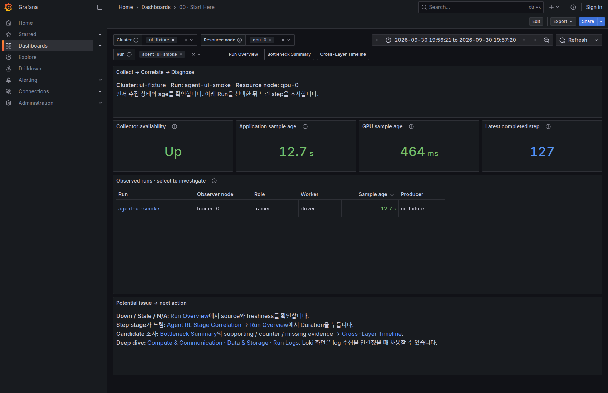
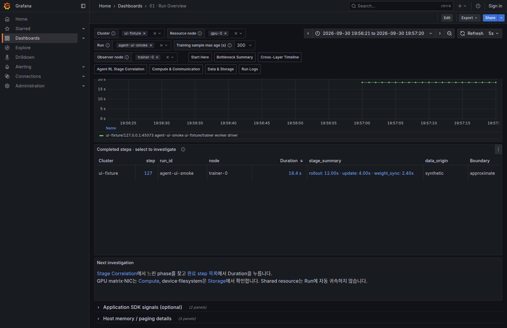
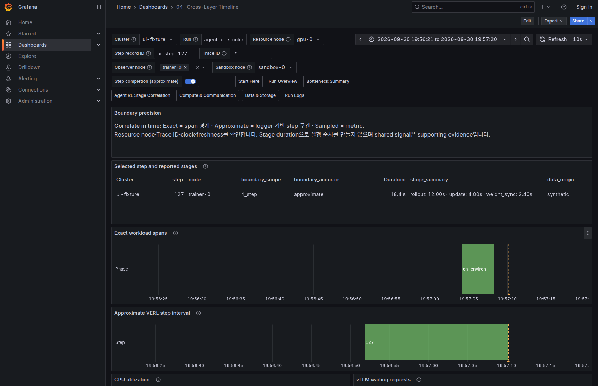
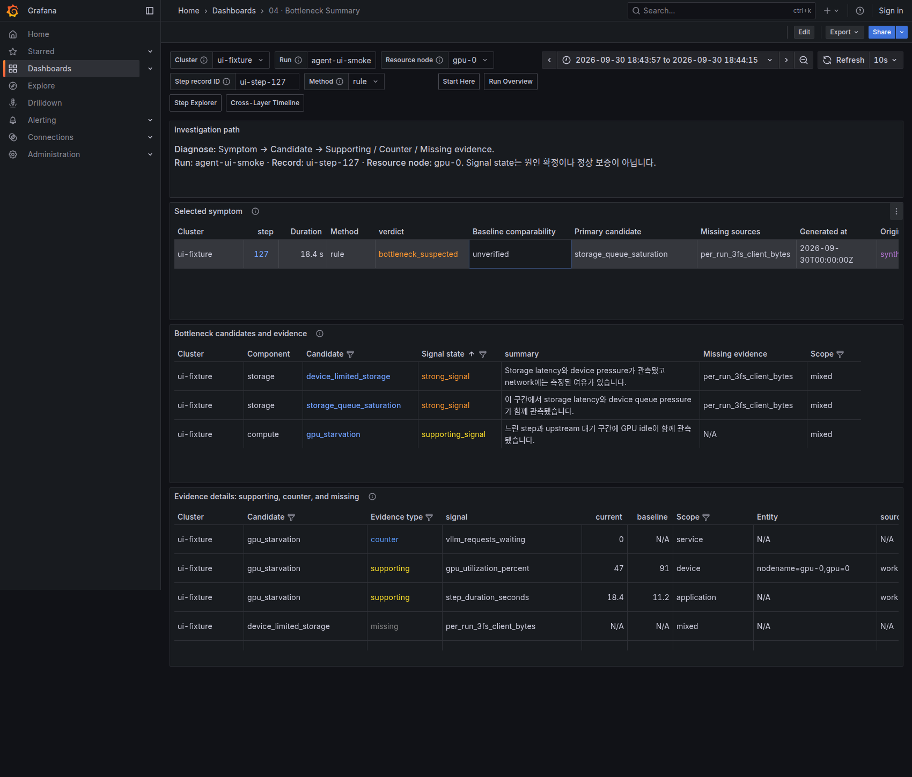
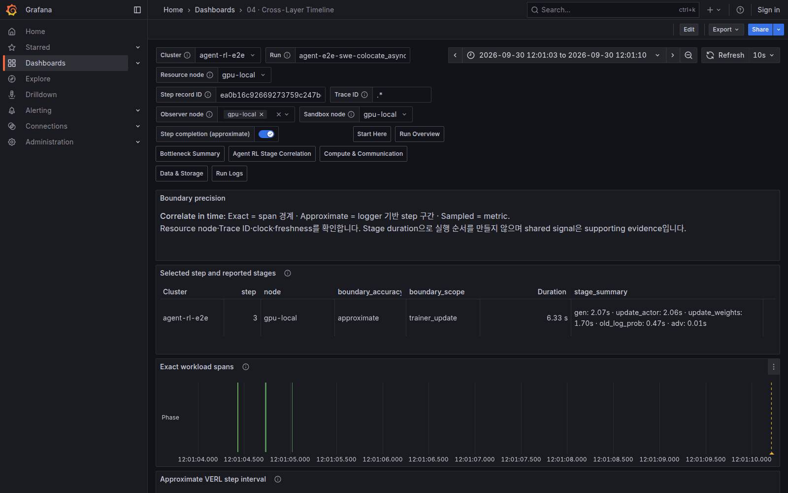

# Dashboard Guide

Start Here에서 수집 상태를 확인하고 완료 step → candidate → evidence → detail로 조사합니다.
실행은 [Monitoring](monitoring.md#open-the-dashboards), 실제 화면은 [Real VERL Demo](real-verl-demo.md), 데이터 경로는 [Architecture](architecture.md)를 참고합니다.

제목·metric·filter·status는 영어, 안내·tooltip은 한국어로 제공합니다.
Panel의 info 아이콘에서 scope·optional source를 확인하고 긴 table cell은 inspect로 읽습니다.
완료 step 목록은 Duration 내림차순이며 Duration → Bottleneck Summary, Step·Stage → Timeline으로 이동합니다.
Run·record·observer·시간을 유지하고 Resource node는 실제 배치로 선택합니다.
Bottleneck Summary는 Current · Baseline · Change (%)를 기본 화면에 표시합니다.
Signal 링크에서 각 interval을 열며 Baseline 이동은 현재 step의 Trace ID를 초기화합니다.
Sample quality와 comparability는 비교 표의 오른쪽 필드에서 확인합니다.
Rule summary는 한국어, ID·state·원본 데이터는 유지하며 사용자 summary는 원문으로 표시됩니다.

## Choose a View

Timeline은 node clock의 `exact` span과 공통 시각으로 보정한 `calibrated` span을 구분합니다.
Calibrated lane의 `± uncertainty`와 table의 Time uncertainty를 확인하며, 보정된 VERL step도 `calibrated_approximate`입니다.
설정과 적용 범위는 [Userspace Time Alignment](time-alignment.md)에 있습니다.

화면 상단의 **View: Guided / Overview / Focus** 버튼으로 UI 구성을 즉시 전환합니다.
색상 테마와 독립적인 선택이며, 동일한 telemetry를 다른 배치와 탐색 방식으로 보여 줍니다.

| View | 화면 구성 | 사용 시점 |
| --- | --- | --- |
| Guided | 기존 Run → Step → Candidate → Evidence 흐름 | 느린 step의 원인을 순서대로 조사할 때 |
| Overview | VERL·vLLM·Ray·Compute·local storage·sandbox의 3열 요약 | 여러 subsystem의 상태를 한눈에 비교할 때 |
| Focus | Subsystem별 펼침 row와 전체 폭 graph | 원하는 subsystem을 큰 화면으로 읽을 때 |

전환은 Grafana 안에서 바로 이루어지며 서버 재시작이나 수집 설정 변경이 필요 없습니다.
Cluster·Run·observer/resource node·step record·시간 범위를 URL로 전달합니다.
Logs의 directory와 telemetry Run은 별도로 전달하며, 각 화면에서 사용하는 추가 filter만 적용합니다.
View 선택은 공유 설정을 바꾸지 않으므로 사용자끼리 영향을 주지 않습니다.
Query 결과를 바꾸는 filter는 화면에 표시하며, 화면 이동으로 전달된 Phase·Worker·Observer node도 확인하고 바꿀 수 있습니다.
`Reset filters`는 Cluster·Run·log directory·시간을 유지하고 Step·Trace·node·engine·device 등 나머지 선택을 초기화합니다.
현재 선택한 step을 유지하려면 필요한 filter만 개별적으로 바꿉니다.
선호하는 View를 bookmark하거나 Grafana Home dashboard로 지정할 수 있습니다.

Overview와 Focus의 **Open details**는 기존 subsystem dashboard로 연결합니다.
두 화면은 provisioning 시 기존 panel에서 생성하므로 query·unit·scope 정의를 중복 관리하지 않습니다.
3FS ClickHouse 통계와 log는 기존 조회 경로를 사용하며, 새 화면이 없는 telemetry를 생성하지는 않습니다.
기존 설치에는 업데이트된 provisioning을 한 번 적용해야 View 버튼이 나타납니다.

## Dashboard Inventory

기본 monitoring server는 metrics-only 구성에서 7개, Loki 구성에서 10개의 dashboard를 설치합니다.
완료 step 선택은 Run Overview에, 이전 Step Detail의 구간 요약과 자원 비교는 Timeline에 통합했습니다.
상세 GPU memory·KV offload·log는 각각 Compute·Stage Correlation·Run Logs로 이동하므로 같은 내용을 별도 step 화면에 반복하지 않습니다.

| Dashboard | 역할 | Loki 필요 |
| --- | --- | --- |
| 00 · Start Here | Collector와 sample freshness 확인, Run 선택 | 아니요 |
| 01 · Run Overview | Step 시간 추이와 완료 step 선택 | 목록만 필요 |
| 02 · Agent RL Stage Correlation | Stage·rollout engine·sandbox 상세 | 아니요 |
| 03 · Bottleneck Summary | Candidate와 supporting/counter/missing evidence | 예 |
| 04 · Cross-Layer Timeline | 선택한 step·span·자원을 같은 시간 구간에서 비교 | 예 |
| 05 · Compute & Communication | GPU·process·network·allocation 상세 | 아니요 |
| 06 · Data & Storage | Local device·filesystem·SMART 상세 | 아니요 |
| 07 · Run Logs | Workload log 검색 | 예 |
| Workspace · Overview | Subsystem 비교형 UI | 아니요 |
| Workspace · Focus | Subsystem 집중형 UI | 아니요 |

Server를 같은 output directory로 재실행하면 `step-explorer.json`과 `step-detail.json`을 제거하고 통합 화면을 설치합니다.
다른 이름의 사용자 dashboard는 유지합니다.
기존 bookmark의 `/d/xlayer-step-explorer`는 `/d/telemetry-overview`로, `/d/xlayer-step-detail`은 `/d/xlayer-cross-layer-timeline`으로 바꾸고 query string의 run·node·record·시간은 그대로 유지합니다.
이전 두 UID는 redirect dashboard로 남기지 않으므로 bookmark를 갱신해야 합니다.

`targets/*.json`은 Prometheus의 scrape target 목록이며 dashboard 개수에 포함되지 않습니다.
[Docker Compose 예제](https://github.com/daegyu94/xlayer-telemetry/blob/main/examples/dashboards/README.md)도 같은 공통 template에서 metrics-only 화면 7개를 생성합니다.
별도 legacy resource dashboard는 설치하지 않습니다.

### Readability

안내 본문은 16px와 넉넉한 줄 간격으로 표시하고, Stat의 label은 18px, 값은 36px로 표시합니다.
표는 큰 행 간격과 pagination을 사용합니다.
완료 Step과 Current/Baseline 표는 핵심 열만 표시하고, 내부 timestamp·sampling metadata는 panel Inspect에서 확인합니다.
숨긴 field도 frame에 유지하므로 Run·record·시간 범위의 data link는 동작합니다.
상단 안내는 다음 행동과 scope를 짧게 표시하고, 상세 조건은 panel info 아이콘과 접힌 행에 둡니다.
Panel 제목·축·legend·표 본문의 font는 Grafana 기본 UI를 따릅니다.
이 글자도 작게 느껴진다면 브라우저 확대를 110–125%로 설정하고, 좁아진 화면에서는 sidebar를 접거나 panel 메뉴의 View로 확대합니다.

Cross-Layer Timeline은 단일 표본도 point로 표시합니다.
기본 monitoring server의 Prometheus datasource query 간격은 실제 scrape 간격인 2초로 설정합니다.
외부 Prometheus를 연결했다면 datasource의 Scrape interval을 실제 수집 주기에 맞춥니다.
Query 간격을 줄여도 원본 표본이 더 생기거나, 1분 rate lookback이 정밀한 step trace로 바뀌지는 않습니다.

## Subsystem-only Inspection

Step 선택이나 diagnosis 없이 node·engine·device를 조사할 수 있습니다.
Start Here의 `Subsystem only` 링크와 Stage Correlation의 vLLM native panel을 사용합니다.
Stage Correlation의 접힌 vLLM·Ray row에서 subsystem별 상세 지표를 확인합니다.
그 밖의 native metric은 `sources` 명령의 endpoint별 Explore 링크로 조회합니다.
3FS ClickHouse 단독 조회와 subsystem log 연결은 [Subsystem inspection](agent-rl.md#inspect-one-subsystem)에 있습니다.

## Start Here

기본 monitoring server의 Grafana Home은 Start Here입니다.
`00 · Start Here`에서 Cluster · Node · Run을 고르고 collector 연결과 application/GPU sample age를 먼저 확인합니다.
`Observed runs`는 exporter가 제공하는 worker snapshot 목록이며, 현재 실행 중인 run 목록이나 정상 판정이 아닙니다.
Run과 Sample age를 누르면 해당 run의 Run Overview로 이동합니다.
`Potential issue → next action`은 수집 누락과 느린 workload를 구분해 다음 화면을 안내합니다.

| 상태 | 의미 | 다음 행동 |
| --- | --- | --- |
| Collector `Up` / `Down` | 선택한 collector가 모두 scrape 성공 / 하나 이상 실패 | Down이면 target 주소와 collector process를 확인합니다. Up만으로 bridge·native source의 completeness를 판단하지 않습니다. |
| Application sample age | 선택한 worker 중 가장 오래된 snapshot | 300초부터 orange, 900초부터 red입니다. 긴 step·종료된 run·clock 차이도 확인합니다. |
| GPU sample age | 선택한 node 중 가장 오래된 GPU sample | 30초부터 orange, 120초부터 red입니다. CPU-only node나 sampler 미설정은 N/A입니다. |
| `N/A` / 빈 표 | 해당 source나 표본이 없음 | 0이나 healthy로 해석하지 않고 필터·source 설정을 확인합니다. |

Age의 green은 fresh sample을 뜻하며 workload가 healthy하다는 뜻이 아닙니다.
느린 step을 찾으면 다음 순서로 조사합니다.


`00`부터 `07`까지의 제목은 탐색 위치를 구분하며, 각 화면의 상단 `Start Here` 링크로 돌아올 수 있습니다.
완료 step 목록은 Loki를 활성화했을 때 Run Overview에 추가됩니다.
Loki를 끈 server에는 metrics 화면만 provision하고, 설치하지 않은 investigation 화면의 링크는 `requires Loki` 안내로 바꿉니다.
같은 output directory에서 Loki를 끄고 재실행하면 repository가 제공한 optional dashboard만 제거하며 사용자 dashboard 파일은 유지합니다.
완료 step 선택은 Run Overview, 상세 구간 조사는 Cross-Layer Timeline에서 수행합니다.
Loki 없이 저장된 run을 읽을 때는 `python -m xlayer_telemetry.show_run "$RUN_ROOT"`으로 step event와 진단 결과를 확인합니다.
완료 step을 클릭해 상세 구간을 여는 방법은 [완료 step 선택](#open-in-grafana)에 있습니다.
화면을 처음 열었다면 [필터와 시간 범위](#select-the-context)부터 확인하고, 느린 step을 찾은 뒤 [완료 step 목록](#step-explorer)와 [Run Analysis](#run-analysis)로 이어갑니다.

아래 화면은 synthetic UI fixture를 실제 Grafana에서 조회한 예입니다.
Stale run의 age와 fresh GPU sample을 구분하며 실제 학습 성능의 측정 결과는 아닙니다.



Dashboard JSON은 monitoring server를 같은 설정으로 재실행할 때 갱신됩니다.
기존 server·collector 시작/종료 방법은 [VERL Quickstart](verl-quickstart.md#2-start-server-node-and-verl)를 따릅니다.
Browser를 새로고침하고 이전 URL bookmark의 추가 필터도 확인합니다.
이번 UI의 [검증 기록](validation/dashboards/investigation-20260930.json)은 실제 Grafana·Prometheus·Loki에서 synthetic fixture의 클릭·filter 왕복을 확인한 결과이며 물리 multi-node 학습 검증과 구분합니다.

## Select the Context

Start Here/Run Overview에서 Cluster·Node·Run·시간을 고릅니다.
공통 navigation은 record·trace·method와 resource/observer·GPU·engine·sandbox context를 유지합니다.

행 링크는 Loki stream의 Cluster·observer로 좁힙니다.
`Observer node`는 step/diagnosis의 수집 출처, `Resource node`는 조사할 GPU·host·service의 위치입니다.
두 node는 같을 필요가 없습니다.
Application step·stage·age는 observer로, GPU·NIC·disk·native vLLM은 resource로 조회하므로 다른 node의 detail을 봐도 step 문맥이 유지됩니다.
Device·Mount·SSD 등 추가 filter는 별도로 확인하며 `All`은 여러 대상의 값을 함께 표시합니다.

| 신호 | 주요 범위 | 읽을 때 주의할 점 |
| --- | --- | --- |
| VERL 학습 지표 | `run_id`, `node`, `role`, `worker` | 선택한 run의 완료 step에서 갱신되며 진행 중인 phase를 실시간으로 뜻하지 않습니다. |
| GPU·host·NIC·device 지표 | node, GPU 또는 device | 해당 node의 전체 사용량이므로 선택한 run만의 값으로 귀속하지 않습니다. |
| Native vLLM 지표 | 등록한 vLLM endpoint와 node | Engine이 여러 run을 처리하면 값이 섞일 수 있으며 `Run` 필터로 분리되지 않습니다. |
| SMART 지표 | storage system label, storage node, SSD | Exporter를 별도로 연결해야 하며 `storage_system=3fs`만 지정해도 3FS 서비스 지표가 생기지는 않습니다. |
| Loki log | cluster, node, workload, log directory | `Run`은 log 경로의 run directory 이름으로 추출되며 telemetry의 `run_id`와 다를 수 있습니다. |

`N/A`는 source가 연결되지 않았거나 선택한 범위에 표본이 없다는 뜻이며 측정값 0과 다릅니다.
Compute & Communication의 GPU 표는 30초보다 오래된 표본을 숨기며, 같은 화면의 GPU sample age로 stale과 source 누락을 구분할 수 있습니다.
Run Overview의 접힌 application SDK panel은 `Training sample max age (s)`로 신선도 기준을 조정합니다.
긴 step에서는 sample age와 원본 log를 함께 확인합니다.
`Run` 선택은 application metric처럼 `run_id`가 있는 시계열에 적용됩니다.
GPU·host, native vLLM·Ray, 3FS 같은 공유 source는 같은 시간·node에서 비교하는 자료이며 이 필터가 run별 사용량으로 나누지 않습니다.

## Run Overview

Run Overview는 수집 상태와 마지막 완료 step을 보여 줍니다.
`Collector availability`는 `telemetry` job만 검사하며 native·SMART는 포함하지 않습니다.
`Application sample age`·`GPU sample age`는 마지막 보고 시각부터의 경과 시간입니다.
계속 늘면 target이 Up이어도 producer가 새 값을 쓰지 않을 수 있습니다.

기본 화면은 마지막 완료 step과 step duration 추이에 집중합니다.
느린 시간대를 확대하고 같은 화면의 `Completed steps · select to investigate` 목록에서 Duration을 누릅니다.
GPU matrix는 Compute & Communication에서, stage·reward·VERL tokens/s/GPU는 Agent RL Stage Correlation에서 확인합니다.
Generic application throughput·loss와 host memory·swap은 접힌 행에 남아 있으며 해당 metric을 생산할 때만 채워집니다.

아래는 synthetic fixture의 완료 step 목록을 실제 Grafana에서 조회한 화면입니다.
Cluster·observer·record가 같은 이름을 사용해도 행의 Cluster를 전달하므로 선택한 실행의 evidence로 이동합니다.



## Agent RL Stage Correlation

Stage Correlation은 완료 step의 phase duration과 rollout engine을 비교합니다.
`Latest completed RL step`·`Worker sample age`부터 확인합니다.
`Completed RL stage duration`은 완료 시 보고한 phase 시간이며 진행 중 phase의 경과 시간이 아닙니다.
Reward mean 하나도 모델 품질 추이를 증명하지 않습니다.

처리량·response length·GPU 사용률을 단계 시간과 비교한 뒤, rollout이 느린 구간에서는 `Live rollout engine signals`의 waiting 요청·KV 사용률·preemption을 봅니다.
이 native vLLM 패널은 [endpoint를 등록](agent-rl.md#register-native-endpoints)했을 때만 채워집니다.
`vLLM engine`으로 endpoint의 instance를 선택하고 legend에서 engine을 구분합니다.
Service/engine signal을 함께 보되 서로 다른 engine의 queue·KV·preemption을 하나의 engine 상태로 읽지 않습니다.
`vLLM KV offload store and load`는 GPU→CPU와 CPU→GPU 전송률을 보여 주며 CPU tier와 filesystem tier를 분리하거나 3FS에 쓴 바이트만 집계하지 않습니다.
Weight sync, policy lag, tool 시간은 해당 source가 기록된 경우에만 나타납니다.
Policy lag는 초가 아닌 policy version 차이이며 `Weight sync and policy lag`의 오른쪽 축에서 `versions`로 표시합니다.
`vLLM throughput & latency`는 prompt/generation tokens/s와 TTFT·queue·E2E latency p95를 engine·model별로 보여 줍니다.
`Ray orchestration`은 task·actor state, logical CPU/GPU 자원, object store 위치별 bytes와 OOM eviction rate를 보여 줍니다.
`Mooncake / KV storage`는 Store 배포의 기본 subsystem row이며 connector RPC·bytes, master RAM·lookup hit, client DFS bytes·successful keys·batch p95·errors를 보여 줍니다.
초기에는 접혀 있고 별도의 feature 활성화 옵션은 없습니다.
[Endpoint 연결](agent-rl.md#observe-mooncake-kv-storage) 후 Resource node를 선택하며, 지원하지 않거나 비활성인 client DFS 신호는 `N/A`로 남습니다.
Connector bytes와 DFS bytes는 다른 단계의 값이며 합산하지 않습니다.
Ray state는 분산 delta를 합산하므로 cluster 전체를 보려면 Resource node를 `All`로 둡니다.
Logical resource는 물리 utilization이 아니며 native metric을 제공하지 않는 version·설정에서는 N/A가 정상입니다.
Histogram p95와 counter rate는 `$__rate_interval` 구간의 값이며 step 단위 측정이 아닙니다.
Sandbox worker sampler를 켰다면 아래의 pool occupancy, I/O pressure, throughput·operations, CPU·memory·OOM panel에서 sandbox node의 상태를 봅니다.
`Sandbox sample age`가 증가하면 해당 cgroup 그래프는 오래된 textfile 값이므로 현재 상태로 해석하지 않습니다.
Pool occupancy는 외부 runtime adapter가 `sandbox_active`·`sandbox_queued`를 낼 때만 채워집니다.
Sandbox panel은 기본적으로 접힌 `Sandbox signals (optional)` 행에 모아 두었습니다.
Sampler/runtime을 연결했다면 행을 펼치고 `Sandbox node`를 해당 node로 선택합니다.
`Node`는 rollout/GPU context를 유지하며 `Sandbox node`는 colocated와 dedicated 배치 모두에서 독립적으로 동작합니다.
`Sandbox worker and device pressure`의 CPU PSI는 cgroup 전체의 CPU 대기 비율이며, I/O PSI와 별도 원인 후보입니다.
`Sandbox worker memory`의 peak는 cgroup 생성 이후의 high-water mark이므로 선택한 시간 구간의 peak가 아닙니다.
`Sandbox CPU and memory events`는 CPU 사용·quota throttling과 memory high/max·OOM·OOM kill을 구분합니다.
오른쪽 축의 memory event rate는 OOM kill과 같지 않으며 source가 없으면 해당 series를 표시하지 않습니다.
이 panel의 cgroup I/O와 local device busy는 서로 다른 scope입니다.
Lifecycle latency는 Prometheus 집계가 아니라 정확한 `sandbox.*` EventRecorder span으로 [Cross-Layer Timeline](#bottleneck-summary-and-cross-layer-timeline)에서 확인합니다.

## Compute & Communication

이 화면은 느린 단계가 GPU·process·network 상태와 함께 변했는지 살펴보는 곳입니다.
GPU sample age와 GPU matrix를 본 뒤 `GPU` filter로 device를 좁혀 power·temperature·SM clock을 비교합니다.
GPU utilization graph의 data link로 선택한 Node/GPU를 확대할 수 있습니다.
0%는 측정된 idle 상태이고 빈 matrix cell은 사용 가능하다는 증거가 아닙니다.
`GPU_PROCESS_METRICS=1`로 수집한 compute-process GPU memory는 PID별 관측값이고 `GPU allocation matrix`는 별도로 기록한 worker 배치에 의존하므로, process를 run에 자동으로 귀속시키지 않습니다.

TCP/Ethernet과 RDMA 패널은 interface 또는 port의 전송량입니다.
이 값만으로 어느 두 endpoint 사이의 traffic인지 알 수 없으며, compute topology matrix에는 별도로 제공한 edge 정보가 있어야 합니다.
`Worker-local application timers`는 application이 보고한 run별 timer가 있을 때만 표시됩니다.

## Data & Storage

`Device`는 host block device 그래프를, `Mount`는 filesystem 그래프를 선택합니다.
3FS FUSE 경로를 `Mount`로 골라도 disk throughput·IOPS·busy time은 선택한 `Device`의 node 전체 지표입니다.
Filesystem used·free space는 선택한 마운트의 용량 상태이고, disk busy time은 지연 시간의 p99가 아닙니다.
같은 시간대의 변화는 조사 단서지만 이번 run의 KV offload I/O 양을 직접 증명하지는 않습니다.

Storage topology 표는 component·edge 정보를 공급했을 때, SSD health 패널은 SMART exporter를 연결했을 때 채워집니다.
SMART panel은 기본적으로 접힌 `SSD health / SMART (optional)` 행을 펼쳐 확인합니다.
상단 `Storage node`·`SSD` 필터는 local disk의 `Node`·`Device` 필터와 별도로 적용됩니다.
3FS 서비스 latency는 이 상세 그래프에 포함되지 않습니다.
진단을 켜면 Bottleneck Summary에서 ClickHouse 비교 결과와 측정 범위를 확인하고, 원본 수치는 [ClickHouse 진단](agent-rl.md#add-diagnostics)에서 확인합니다.

## Run Logs

Loki를 활성화하면 Alloy가 `<log-root>/<run-directory>/logs/**/*.log` 파일을 수집해 이 화면에 표시합니다.
`Cluster`, `Node`, `Workload`, `Log directory`와 시간 범위를 맞추고, metric이 늦게 갱신된 구간의 메시지를 살펴봅니다.
`Log directory`는 telemetry `run_id`와 다를 수 있으므로 결과가 비면 경로와 [Loki 설정](monitoring.md#add-run-logs-with-loki)을 확인합니다.
`Run context`는 조사 중인 application의 Run이며 상세 화면으로 돌아갈 때 유지됩니다.
기존 Run Logs의 `var-run_id` URL은 계속 log directory를 필터하고, 공통 navigation은 application Run을 `var-telemetry_run_id`로 별도 전달합니다.
다른 화면에서 `Log directory`를 선택하지 않았다면 전체 directory가 표시되므로 조사 중인 실행의 directory를 맞춥니다.
Step·diagnosis·EventRecorder stream은 이 log panel에서 제외하고 각각의 전용 investigation 화면에서 봅니다.
한 줄의 error나 warning만으로 전체 실행의 성공·실패를 단정하지 말고 종료 코드와 run 산출물을 함께 확인합니다.

## Follow a Slow Interval

Run Overview에서 freshness·느린 step을 찾고 Duration 링크로 [Bottleneck Summary](#bottleneck-summary-and-cross-layer-timeline)를 엽니다.
같은 구간의 Timeline·Compute·Storage·Logs로 후보를 확인하며 공유 자원의 동시 변화는 인과 증명이 아닙니다.
증상별 다음 조사는 [Run Analysis](#run-analysis)를 참고합니다.

## Bottleneck Summary and Cross-Layer Timeline

Bottleneck Summary의 후보 표는 진단 sidecar의 결과를 Loki로 보낸 run에서 채워집니다.
Cross-Layer Timeline은 Loki의 step event·EventRecorder span과 Prometheus metric을 표시하므로 진단 sidecar 없이도 기록된 실행을 탐색할 수 있습니다.
Run Overview의 완료 step 목록에서 느린 step을 선택해 Bottleneck Summary로 이동하면 같은 run의 baseline, 후보 상태, 근거, 반대 근거와 누락된 근거를 볼 수 있습니다.
각 행의 scope가 `shared-service`나 `node`라면 해당 수치는 그 run에 귀속된 사용량이 아닙니다.

Cross-Layer Timeline은 EventRecorder의 실제 start/end span, VERL file logger에서 추정한 step band, Prometheus의 sampled resource line을 같은 시간축에 놓습니다.
Sandbox adapter의 `sandbox.queue`·`acquire`·`prepare`·`exec`·`reset`·`release` span은 같은 trace에 기록되면 exact span 행에 나타나고, sandbox I/O pressure는 sampled line으로 나타납니다.
`exact`, `approximate`, `sampled` 구분을 확인하고, stage duration을 시간 순서가 있는 phase bar로 읽지 않습니다.
Loki가 없으면 `diagnostics/latest.json`과 `show_run`에서 후보를 읽을 수 있습니다.
사용 순서와 rule 조건은 [Cross-Layer Diagnosis](diagnosis.md)를 따릅니다.

### Read the Investigation Results

Bottleneck Summary에서는 symptom → candidate → supporting/counter/missing evidence 순서로 읽습니다.
`Measured changes versus same-run baseline`은 symptom 다음에 기본으로 표시됩니다.
Evidence table은 candidate 바로 아래에서 supporting·counter·missing을 구분합니다.
Candidate ID와 Evidence type의 column filter로 supporting·counter·missing evidence를 좁힙니다.
Comparison의 Signal 메뉴는 current와 baseline의 각 시간 구간을 Timeline으로 열어 같은 context에서 비교하도록 돕습니다.
Evidence의 Signal 메뉴는 선택한 Resource node와 해당 record의 시간 구간을 유지해 Timeline·Compute·Storage로 이동합니다.
Evidence의 Entity와 Scope를 먼저 보고 실제 node·device에 맞게 필터를 선택합니다.
Diagnosis의 observer node를 resource node라고 추정하거나 shared resource를 Run에 자동 귀속하지 않습니다.

State는 원본 진단 용어를 유지합니다.
`strong_signal`은 rule 조건이 관측된 후보이고, `no_anomaly_observed`는 관측한 근거에서 후보를 찾지 못했다는 뜻입니다.
`insufficient_data`·빈 panel·N/A는 정상이나 0을 뜻하지 않으며, synthetic 결과는 Origin으로 구분합니다.
색상은 이 구분을 보조하며 인과관계나 정상 상태를 보증하지 않습니다.

Timeline의 Trace ID는 exact span과 related event에 함께 적용합니다.
Step record는 approximate trainer step을 선택하며 Trace ID와 자동으로 같아지는 개념이 아닙니다.
같은 Trace ID도 clock synchronization을 보장하지 않으므로 exact·approximate·sampled 경계와 node clock 상태를 따로 확인합니다.
Exact span의 diagnosis 링크는 선택한 step의 시간 범위·record·observer를 유지합니다.
짧은 span 구간으로 diagnosis 조회 범위를 바꿔 step completion에 기록된 결과를 숨기지 않습니다.
Clock·timestamp provenance 같은 metadata는 state lane으로 그리지 않고 table·clock panel에서 확인합니다.

아래는 같은 synthetic step의 요약과 exact/approximate lane을 통합한 Timeline입니다.
자원 상세와 원본 기록은 아래의 접힌 행에서 확인합니다.



아래 화면은 synthetic fixture를 실제 Grafana 12.1.0에서 렌더링한 예입니다.
Origin의 `synthetic`, candidate state와 missing evidence를 함께 확인합니다.



Bottleneck Summary의 `Method`는 기본 `rule`이고, 선택한 record에 대한 수동 LLM 실행 결과가 있을 때 `llm`을 선택합니다.
실행 방법은 [선택한 step 진단](local-llm.md#diagnose-a-selected-grafana-step)을 참고합니다.
Comparison과 evidence의 `workload_comparability`, `range_window_seconds`, `evaluation_count`, `source_age_seconds`, `quality_warnings`를 함께 확인합니다.
Evaluation count는 scrape 횟수가 아니며 source age가 비어 있으면 freshness가 확인되지 않은 것입니다.

## Step Explorer

Step Explorer는 Run Overview의 완료 step 목록이며 별도 UI/server가 없습니다.
선택한 step의 Bottleneck Summary·Timeline으로 이동합니다.
목록은 Alloy가 Loki로 보낸 step event, 자원 그래프는 Prometheus를 사용하므로 두 경로를 각각 확인합니다.

### Open in Grafana

Monitoring server에 `ENABLE_LOGS=1`을 설정하고, step 기록 파일에 접근할 수 있는 node collector에 `LOKI_PUSH_URL`과 `TELEMETRY_LOG_ROOTS`를 설정합니다.
설정 방법은 [Loki 연결](monitoring.md#add-run-logs-with-loki)을 따릅니다.
Alloy는 각 root 아래 `<run>/telemetry-events/verl-steps*.jsonl`과 `<run>/telemetry/telemetry-events/verl-steps*.jsonl`을 수집합니다.
Step event의 `run_id`는 JSON 내용에서 읽으며, Loki stream의 `cluster`·`node`·`workload`는 collector 설정에서 가져옵니다.
Shared storage의 같은 파일을 여러 collector가 중복 수집하지 않도록 한 node에서만 읽습니다.

Grafana의 `01 · Run Overview`에서 Cluster, Observer node, Run을 선택한 뒤 완료 step 목록의 Duration을 누르면 Bottleneck Summary, Step 번호나 Stage 요약을 누르면 Timeline이 열립니다.
`04 · Cross-Layer Timeline`은 기록된 시작·종료 시각으로 시간 범위를 맞추고 step 요약·exact span·approximate step·sampled resource를 함께 표시합니다.
이전에 선택한 Resource node는 유지하고, 행의 observer node는 별도 context로 전달합니다.
Run Overview를 직접 열었다면 Resource node는 All이므로 실제 trainer·rollout·sandbox 배치에 맞게 바꿉니다.
`Log directory`가 telemetry `run_id`와 다르면 실제 결과 디렉터리 이름으로 바꿉니다.
Loki와 Prometheus가 해당 node를 수집하고 있어야 값이 채워집니다.
목록이 비면 먼저 `telemetry-events/verl-steps.jsonl`의 생성 여부와 Alloy의 파일 경로·Loki push 상태를 확인합니다.
목록은 있지만 자원 그래프가 비면 Prometheus target과 선택한 `Resource node`, 두 저장소의 보존 기간을 확인합니다.

Step 기록은 완료 시각에 수집되며 Loki의 보존 기간이 지나면 Grafana 목록에서 사라집니다.
기존 JSONL 파일은 run directory에 남습니다.
기존 실행의 step 파일에 Grafana용 시간 필드가 없다면 다음 명령으로 별도 backfill 파일을 만듭니다.
원본 `verl-steps.jsonl`은 수정하지 않으며, Loki가 해당 시각의 event를 받아들일 수 있는 보존 기간 안에서 사용합니다.

```bash
python -m xlayer_telemetry.step_backfill "$RUN_ROOT"
```

수집기가 이미 실행 중이면 새 `verl-steps-backfill.jsonl`을 자동으로 읽습니다.
Prometheus의 기본 보존 기간은 1일이므로 오래된 step은 Loki 목록에 있어도 자원 그래프가 비어 있을 수 있습니다.
[Backend retention](monitoring.md#retain-data-for-completed-runs)을 조사 기간에 맞춰 설정합니다.
Stage 시간과 step 경계는 아래 [Read a Step](#read-a-step)의 해석 범위를 따릅니다.

Timeline의 기본 화면은 선택한 step 요약·exact/approximate lane·GPU·vLLM·RDMA·device busy입니다.
Host·Ethernet·local disk, span/event 원본, sandbox PSI와 clock quality는 해당 행을 펼쳐 확인합니다.
GPU memory는 Compute, KV offload는 Stage Correlation, log는 Run Logs 링크로 같은 시간 구간에서 확인합니다.
Timeline의 `Step completion (approximate)` annotation은 Loki에 기록된 file-logger completion 시각을 표시합니다.
이는 logger 관측 marker이며 stage의 정확한 start/end나 실제 실행 순서를 의미하지 않습니다.
Stage마다 exact span이 있으면 Timeline의 별도 exact lane에서 읽습니다.
Annotation control로 marker를 끌 수 있으며, metrics-only dashboard에는 Loki annotation을 추가하지 않습니다.

아래 이미지는 2026-10-01에 실제 SWE-Bench `colocate_async` 기록의 trainer update 3을 Timeline에서 연 화면입니다.
선택한 step과 reported stage, exact span을 구분하며, 펼친 상세 행까지 포함한 흐름은 [기록된 GIF](real-verl-demo.md#watch-the-recording)에서 확인할 수 있습니다.



### Read a Step

Run Overview의 완료 step 목록에서 조사할 행을 선택합니다.
Timeline의 선택 record·step·시작/종료 시각과 경계 정확도를 먼저 확인한 뒤 reported stage, exact span, resource graph를 읽습니다.
같은 구간의 log는 Run Logs 링크로 확인합니다.
Current-vs-baseline 비교는 Bottleneck Summary의 `Measured changes versus same-run baseline`에서 확인하며, Signal 메뉴로 각 interval의 Timeline을 열 수 있습니다.
Dashboard link는 `record_id`와 run·node·시간 범위를 전달하므로 선택한 context를 유지하며 조사합니다.

VERL logger의 `approximate` step은 bridge 관측 완료 시각에서 reported duration을 뺀 구간입니다.
Backlog·종료 후 replay는 원래 시각을 복원할 수 없어 `unknown`이며 시간 기반 목록에서 제외합니다.
JSONL의 step·stage 값은 읽을 수 있지만 외부 resource와 연결하지 않습니다.

Live logging 지연도 구간을 밀 수 있으므로 log가 비면 앞뒤 창을 넓혀 확인합니다.
Stage duration은 실제 실행 순서를 뜻하지 않고 `testing` 같은 추가 timing은 step 밖일 수 있습니다.
Async에서는 `trainer_update` 경계이며 rollout·3FS I/O와 일대일 대응하지 않습니다.

GPU·host·network·disk는 각 node 전체 또는 그 node의 process 합계이며, vLLM은 공유 engine 신호입니다.
CPU·network·disk·offload rate는 1분 lookback으로 계산하므로 짧은 step의 값에 직전 활동이 포함될 수 있습니다.
그래프의 query point는 Prometheus 평가 시각이며 독립된 원본 scrape 횟수를 뜻하지 않습니다.
`N/A`는 해당 시간 범위에 표본이 없다는 뜻으로 0과 구분합니다.
따라서 이 화면의 자원 평균·최댓값은 **해당 step 동안 관측된 값**이지 그 step이 사용한 자원의 정확한 귀속량이 아닙니다.

더 세밀한 CPU·CUDA 실행 흐름이 필요하면 [짧은 trace 수집](dashboards.md#capture-a-short-trace)으로 좁힌 rank와 구간을 확인합니다.

## Run Analysis

느린 run의 후보를 좁힌 뒤 상시 지표로 부족한 구간에 trace·NCCL baseline을 추가합니다.
기본 연결은 [VERL Quickstart](verl-quickstart.md), source 경로는 [Architecture](architecture.md#add-one-source-at-a-time)를 따릅니다.

### Start with One Slow Interval

Grafana의 Agent RL Stage Correlation에서 조사할 run과 시간 범위를 선택합니다.
어느 완료 stage의 시간이 증가했는지 찾고 같은 시간·node의 resource 지표를 비교합니다.
예를 들어 rollout 시간이 늘어났다면 vLLM queue, GPU 사용률, tool 대기를 차례로 살펴봅니다.

| 관찰한 변화 | 함께 확인할 신호 | 다음에 조사할 후보 |
| --- | --- | --- |
| Rollout 시간 증가 | vLLM waiting·KV cache·GPU 사용률 | Queue, concurrency, 긴 response |
| Rollout 지연과 낮은 engine queue | Tool span·외부 호출 log | Tool 또는 environment 대기 |
| Actor update 지연과 낮은 GPU 사용률 | CPU·memory·network·input 지표 | Host staging 또는 collective 대기 |
| Weight sync 지연 | NIC/RDMA traffic·error | 전송 경로와 replica 준비 상태 |
| Checkpoint 지연 | Storage latency·device write·queue | Client부터 SSD까지의 I/O 경로 |
| Throughput 감소와 높은 GPU 사용률 | Clock·power·temperature, worker 차이 | Throttling 또는 straggler |

이 표의 신호는 해당 source가 연결되어 있을 때만 보입니다.
`N/A`는 0이 아니며, 먼저 target 상태와 sample age를 확인합니다.
VERL file logger의 stage 값은 step 완료 시 갱신되므로 진행 중인 phase와 혼동하지 않습니다.
[Step Explorer](dashboards.md#step-explorer)는 Grafana에서 완료된 step 하나의 근사 시간 범위를 확대해 같은 시간대의 자원 표본과 log를 보여 줍니다.

예를 들어 `rollout` stage가 길어진 step을 찾았다면 먼저 `Worker sample age`로 최신 완료 기록인지 확인합니다.
그 시간대에 vLLM waiting 요청이 늘고 GPU 사용률이 낮아졌다면 rollout engine의 대기 또는 다른 병목을 의심할 수 있습니다.
같은 창의 Run Logs·tool span을 읽어 요청 지연이나 오류가 있었는지 확인하고, 필요하면 좁힌 구간에 trace를 수집합니다.
vLLM endpoint가 연결되지 않았다면 waiting 값이 없다는 사실을 낮은 queue로 해석하지 않습니다.

### Check the Run Context

같은 시간에 값이 변했다는 사실은 원인 후보를 좁히는 근거입니다.
Host나 shared storage의 metric에는 다른 workload도 포함될 수 있으므로 node·role·device 배치와 run 조건을 함께 확인합니다.
여러 machine의 clock가 맞지 않으면 시간상 비교도 틀어질 수 있습니다.

`show_run`은 monitoring server 없이 run directory의 최신 기록을 보여 줍니다.

```bash
PYTHONPATH=. python -m xlayer_telemetry.show_run \
  "$HOME/telemetry-runs/grpo-001"
```

| 읽는 파일 | 확인하는 내용 |
| --- | --- |
| `telemetry-manifest.json` | Run 식별자, 배치와 기록된 실행 조건 |
| `telemetry-metrics/*.json` | Worker의 최신 step과 metric |
| `telemetry-events/*.jsonl` | 최근 event·span |
| `diagnostics/latest.json` | 선택적인 최신 진단 결과 |
| `run-metadata-*.json`, `summary-*.json` | Application이 별도로 제공한 stage 요약 |

마지막 두 종류의 stage 요약 파일은 특정 framework가 자동으로 만든다고 가정하지 않습니다.
파일이 없으면 해당 요약이 생략되며, 이것만으로 실행 실패를 의미하지 않습니다.
Node-local directory라면 파일이 있는 node에서 명령을 실행합니다.

전체 step 이력은 VERL 원본 `logs/verl-metrics.jsonl`이나 application log를 확인합니다.
자동 진단의 `missing_sources`·evidence도 함께 읽습니다.
`show_run`은 로컬 증거 도구이며 Prometheus·Loki의 전체 시계열을 대신하지 않습니다.

### Follow the Storage Path

Checkpoint 지연을 조사한다면 application의 지연 시각을 먼저 정합니다.
그 시간대의 3FS 서비스 latency, storage node의 device 상태, client network를 비교합니다.
3FS ClickHouse의 `max_observed_p99`는 관측된 p99 중 최댓값이며 전체 요청의 global p99가 아닙니다.

SSD SMART 지표는 장치 건강 상태를 설명하고 application의 write latency를 직접 측정하지 않습니다.
Device write bytes 역시 해당 run의 checkpoint bytes와 같다고 가정하지 않습니다.
여러 run이 shared storage를 사용한다면 같은 창에 경쟁한 작업도 확인합니다.

### Capture a Short Trace

Stage·rank를 좁힌 뒤 짧은 trace로 CPU·GPU kernel·copy·collective의 관계를 확인합니다.
수집 비용·파일 크기를 줄이도록 rank·구간을 선택하고 [VERL profiler 예제](https://github.com/daegyu94/xlayer-telemetry/blob/main/examples/verl/torch-profiler.yaml)를 실제 환경에 맞춥니다.
Trace는 전문 profiler에서 열며 Grafana에 자동 표시되지는 않습니다.

직접 작성한 PyTorch loop에는 [selected-rank helper](https://github.com/daegyu94/xlayer-telemetry/blob/main/examples/pytorch/selected_rank_profiler.py)를 넣을 수 있습니다.
아래 `train_loader`와 `train_step`은 기존 application의 객체와 함수입니다.

```python
from pathlib import Path
from examples.pytorch.selected_rank_profiler import selected_rank_profile

with selected_rank_profile(
    Path("artifacts/traces/run-001"),
    ranks={0},
    skip_first=4,
    wait=1,
    warmup=1,
    active=2,
) as profiler:
    for batch in train_loader:
        train_step(batch)
        profiler.step()
```

모든 iteration에서 `profiler.step()`을 호출해야 schedule이 진행됩니다.
선택하지 않은 rank는 no-op profiler를 사용합니다.
결과 경로와 수집 조건을 run manifest에도 기록하면 나중에 비교하기 쉽습니다.

### Practice with a Synthetic Profile

`run_profile.sh`는 실제 VERL run을 profile하는 명령이 아니라 작은 GPU workload로 수집 절차와 overhead를 확인하는 도구입니다.
CUDA PyTorch 환경과 사용 가능한 GPU가 필요합니다.
아래 예제는 단일 node용입니다.

```bash
PROFILE_RUN_ID=profile-001 \
NNODES=1 NODE_RANK=0 MASTER_ADDR=127.0.0.1 \
PYTHON='/path/to/cuda-env/bin/python' \
  bash scripts/run_profile.sh baseline

PROFILE_RUN_ID=profile-001 \
NNODES=1 NODE_RANK=0 MASTER_ADDR=127.0.0.1 \
PYTHON='/path/to/cuda-env/bin/python' \
  bash scripts/run_profile.sh capture
```

| Mode | 실행 내용 |
| --- | --- |
| `baseline` | Profiler 없이 synthetic DDP 실행 |
| `capture` | 같은 workload에서 선택한 rank의 trace 수집 |
| `collective` | Synthetic collective 실행 |

기본 step 수는 `STEPS=24`, 제한 시간은 `RUN_TIMEOUT=300`초입니다.
결과는 `artifacts/telemetry/<run-id>/<mode>/`에 log·manifest·JSON으로 남고 capture에는 trace가 추가됩니다.
이 제한 시간은 상시 GPU sampler의 기본 무제한 실행과 별개입니다.

Script는 기존 GPU process와 최소 가용 memory를 검사합니다.
다른 GPU 작업이 있으면 기다리지 않고 종료하므로 사용 가능한 할당에서 실행합니다.
여러 node에서는 각 node에 같은 `PROFILE_RUN_ID`·`NNODES`·rank 0의 `MASTER_ADDR`를 지정하고 `NODE_RANK`만 다르게 실행합니다.

### Measure a Communication Baseline

통신 병목이 의심될 때 NCCL baseline으로 같은 hardware 경로의 collective 성능을 확인할 수 있습니다.
MPI 지원 `all_reduce_perf`, `mpirun`과 참여 node에 할당된 GPU가 필요합니다.
이 명령은 지정한 node에 실제 GPU·network 부하를 발생시킵니다.

```bash
NCCL_TEST_BINARY='/path/to/all_reduce_perf' \
HOSTS='gpu-0,gpu-1' GPUS_PER_NODE=1 \
  bash scripts/run_nccl_baseline.sh
```

`artifacts/nccl-baseline/manifest.env`에서 측정 조건을, `all-reduce.log`에서 correctness 오류와 bandwidth를 확인합니다.
Baseline은 학습 throughput이 아니므로 같은 node·GPU·network 조건의 비교 기준으로만 사용합니다.

### Compare After a Change

Model, batch, sequence length, concurrency, cache 상태와 topology를 기록하고 비교 run에서 동일하게 유지합니다.
원인 후보를 하나씩 변경한 뒤 profiler를 끈 실제 VERL 실행에서 개선이 유지되는지 확인합니다.
Throughput뿐 아니라 loss·reward와 correctness도 함께 확인하고, synthetic 결과와 실제 workload 결과는 구분해 남깁니다.

### Read Clock Evidence in the Timeline

Cross-Layer Timeline의 `Node clock offset from scrape time`과 `Node clock synchronization status`는 선택한 cluster/node별 clock evidence를 보여줍니다.
Offset에는 scrape/transport delay가 포함되며 kernel sync status는 `1`이면 synchronized, `0`이면 unsynchronized, N/A이면 unknown입니다.
이 패널만으로 sample freshness나 정밀 event 정렬을 입증할 수는 없습니다.
Current와 baseline 모두 [clock check](monitoring.md#check-clock-alignment-before-diagnosing)를 수행합니다.

Diagnosis의 clock guard가 current 또는 baseline을 unsafe·unknown으로 판정하면 resource delta를 비교 결과에서 제외합니다.
불확실한 clock은 missing evidence로 남기며 Timeline의 raw metric/log는 조사용으로 확인할 수 있습니다.
Grafana의 수동 timeline은 자동으로 시간축을 이동시키지 않으므로 clock 상태를 확인한 후 overlap을 해석합니다.

UI 변경 당시의 비교 화면은 [검증 기록](validation/README.md)에 보존했습니다.

## Theme Selection

UI 구성은 **View**, 색상은 상단 안내의 **Color: Dark / Sapphire / Desert** 링크로 따로 선택합니다.
Color 링크는 로그인 없이 현재 화면을 다시 열어 배색을 적용하며 Run·Node·시간 범위를 유지합니다.
Grafana 12.1은 URL theme를 페이지를 열 때 적용하므로 색상 전환 시에만 같은 탭에서 자동 reload합니다.
View 전환과 상세 dashboard 이동에도 선택을 전달하며, 사용자나 조직의 preference를 변경하지 않습니다.

| 빠른 선택 | Grafana theme ID | 배색 |
| --- | --- | --- |
| Dark | `dark` | 기본 어두운 중성 배경 |
| Sapphire | `sapphiredusk` | 푸른 배경의 Dark 대안 |
| Desert | `desertbloom` | 따뜻한 배경의 Light 대안 |

아직 Color를 선택하지 않았다면 Grafana의 기존 theme preference를 따릅니다.
선택은 URL에 저장되므로 원하는 View와 Color를 함께 bookmark할 수 있습니다.
주소 없이 새로 접속할 때도 같은 테마를 쓰려면 로그인 후 Profile의 **Change theme**에서 개인 preference로 저장합니다.
그 메뉴의 Tron·Gilded grove·Gloom 등 다른 Grafana 테마도 계속 사용할 수 있습니다.
Color 링크를 선택한 URL에서는 URL의 색상이 개인 preference보다 우선합니다.

Monitoring server와 Compose 설정은 `extraThemes`를 활성화하며 기본 화면은 기존 Dark를 유지합니다.
추가 테마는 Grafana 12.1의 experimental 기능으로, 별도 plugin이나 CSS를 설치하지 않습니다.
Server 기본값을 바꾸려면 config에 지정합니다.

기존 TOML의 `[telemetry]`에서 설정합니다.

```toml
GF_USERS_DEFAULT_THEME = "sapphiredusk"
GF_FEATURE_TOGGLES_ENABLE = "extraThemes"
```

Server를 재시작하면 적용되며 기존 user·team·organization preference가 server default보다 우선합니다.
Profile 메뉴의 추가 테마 목록을 숨기려면 toggle 목록에서 `extraThemes`만 제거합니다.
이는 XLayer의 Color 바로가기와는 별개이며, 다른 toggle이 없다면 빈 문자열을 사용합니다.
테마는 화면 배색만 바꾸며 metric, query, diagnosis 의미는 변경하지 않습니다.

참고: [Grafana 12 themes](https://grafana.com/docs/grafana/latest/whatsnew/whats-new-in-v12-0/), [preference 우선순위](https://grafana.com/docs/grafana/latest/administration/organization-preferences/), [Ray metric 의미](https://docs.ray.io/en/latest/ray-observability/reference/system-metrics.html), [vLLM native metrics](https://docs.vllm.ai/en/latest/usage/metrics/).


## Bottleneck Signals Beyond Utilization

추가 상세 row는 기본적으로 접혀 있습니다. 필요한 subsystem만 펼쳐 query 비용을 제한하고
`Cluster`·`Resource node`·GPU/device/mount/engine 선택으로 범위를 좁힙니다.
새 collector나 per-request label을 추가하지 않고 기존 exporter의 counter/gauge를 읽습니다.
N/A는 미등록·미지원·표본 부족일 수 있으며 `0`으로 보정하지 않습니다.

| Dashboard / row | 확인할 신호 | 해석 범위 |
| --- | --- | --- |
| Compute / Host pressure and collection health | CPU busy/iowait/steal, PSI some/full, major faults, OOM kills, runnable/blocked processes, collector success | Node 전체. PSI는 stalled wall-time 비율이며 CPU utilization과 다릅니다. |
| Compute / Network and RDMA backpressure | NIC errors/drops, TCP retransmits, RDMA discards/link recovery, symbol/link-integrity errors | Interface/port 전체. RDMA transmit wait는 hardware ticks/s로 표시하며 seconds로 추정하지 않습니다. |
| Compute / DCGM device health and profiling | GPU/tensor/DRAM activity, PCIe bytes/s/retries, XID, framebuffer, power/thermal violation | 기존 native `kind=dcgm` endpoint. GPU sampler와 합산하지 않습니다. |
| Data / Local I/O latency and filesystem pressure | 완료 I/O 평균 latency, outstanding/weighted queue, inode 여유, readonly/stat errors, dirty/writeback | Device 또는 mount 전체. NVMe busy=100%만으로 saturation을 확정하지 않습니다. |
| Agent RL / vLLM throughput & latency | Per-engine TTFT/queue/e2e 및 prefill/decode/inter-token p95, prefix-token hit ratio, finish reason, offload mean transfer time/allocation failures/lookup p95 | Shared engine. Run의 정확한 latency나 p95 합으로 해석하지 않습니다. |
| Agent RL / Ray orchestration | Retried task state, placement-group state, 기존 object-store/OOM signals | Session 내 분산 state gauge. `Node=All`로 전체 합을 확인하며 retry gauge에 rate를 적용하지 않습니다. |
| Agent RL / Native endpoint collection health | `up`, scrape seconds, scrape/retained sample 수 | Prometheus 수집 상태·비용. Up이 workload 정상 또는 모든 metric 지원을 의미하지 않습니다. |

필요한 상세 row:

- Host 6 panels: GPU가 idle인 동안 CPU queue·memory reclaim·I/O stalls 또는 수집 실패인지 구분합니다.
- Network/RDMA 6 panels: Weight sync·collective 지연 시 throughput 부족과 packet loss·link 오류를 비교합니다.
- DCGM 7 panels: Compute/DRAM/PCIe activity와 GPU fault·throttling을 함께 조사합니다.
- Local storage 5 panels: Checkpoint·KV file offload 지연을 device queue·평균 latency·inode·writeback과 비교합니다.
- vLLM 6 panels: Generation 지연을 prefill/decode·cache miss·offload transfer/lookup/allocation 구간으로 좁힙니다.
- Ray 2 panels: Worker가 일을 받지 못할 때 retried task와 placement-group pending state를 확인합니다.
- Native health 3 panels: Workload idle과 endpoint scrape 실패·sample limit·collector 비용 문제를 구분합니다.

접힌 row는 펼칠 때 조회합니다.
실제 비용은 선택한 시간·series 수와 source의 수집 주기에 따라 달라집니다.

Disk latency는 `rate(read/write time) / rate(completed operations)`의 평균입니다.
분모가 0이면 N/A로 남기며 p95/p99를 생성하지 않습니다. Filesystem inode total=0과
prefix-cache queries=0도 동일하게 처리합니다. Dirty/writeback이나 SMART lifetime 값은
특정 Run의 physical writes·write amplification·checkpoint bytes로 귀속하지 않습니다.

DCGM profiling PCIe RX/TX 값은 이미 bytes/s인 gauge이고 XID는 마지막 error code입니다.
두 값에 rate를 적용하지 않습니다. Framebuffer MiB는 bytes로, violation nanoseconds는
초당 비율로 변환합니다. 지원되지 않는 sentinel 값은 제외합니다. Profiling과
power/thermal violation field는 GPU/driver/exporter의 선택적 지원과 field 설정이 필요합니다.
기존 DCGM endpoint를 등록하고 GPU sampler를 비활성화한 경우 이 optional row를 사용합니다.
Native-only DCGM node와 GPU index도 selector에서 선택할 수 있습니다.

vLLM offload throughput은 새 `kv_offload_store_bytes_total` / `kv_offload_load_bytes_total`을
우선합니다. 같은 cluster/node/endpoint/model/engine의 구형
`kv_offload_total_bytes_total{transfer_type=...}`는 fallback으로만 사용해 중복 집계하지 않습니다.
Transfer duration·lookup·allocation metric은 connector/version별 지원이 다르며 무조건
활성화되지 않습니다. Local/external prefix hit ratio는 request 수가 아니라 token 수 기준입니다.
Current/legacy metric을 함께 내보내는 배포와 engine별 histogram 경계를 regression test로 검증합니다.

3FS/pNFS 서비스·RPC·metadata latency, FUSE operation latency, 파일별 retry, per-request
NCCL communication time은 위 node/device 신호로 대체하지 않습니다. 관련 native exporter나
ClickHouse evidence, application span 또는 선택적 profiler가 필요합니다. Ray spill은 기존
`ray_object_store_memory{Location="SPILLED"}`의 현재 bytes로 보며 이를 disk throughput으로
바꾸지 않습니다. 상세 metric은 upstream과 실제 `/metrics`의 이름·단위를 확인합니다.

Exporter의 version별 이름·지원 범위는 [Source contracts](diagnosis.md#source-contracts-and-remaining-gaps)를 확인합니다.
설치한 endpoint의 실제 `/metrics`가 기준이며 optional metric이 없으면 N/A로 남깁니다.

## Browser Journey Validation

[Diagnosis practice](diagnosis.md#practice-with-a-synthetic-candidate)의 synthetic Run을 실제 browser로 확인할 때 사용합니다.
Optional Playwright와 Chromium이 필요하며 기존 stack을 읽기만 합니다.
`python -m pip install playwright`와 `python -m playwright install chromium`으로 준비하거나 `--chromium`으로 기존 executable을 지정합니다.
Custom config에서는 `--cluster`·`--node`·URL을 실제 설정에 맞춥니다.
`--output`은 새 directory를 지정하고 검증 이후 screenshot/report를 보존하거나 직접 정리합니다.

```bash
python examples/investigation/validate_user_journey.py \
  --grafana-url http://127.0.0.1:13000 \
  --cluster training-cluster --run-id diagnosis-demo-001 --node gpu-local \
  --width 900 --output /tmp/xlayer-browser-check
```

전체 panel의 readability와 실제 검증 범위는 [Fresh User Experience 기록](validation/e2e-user-experience.md)에 있습니다.
