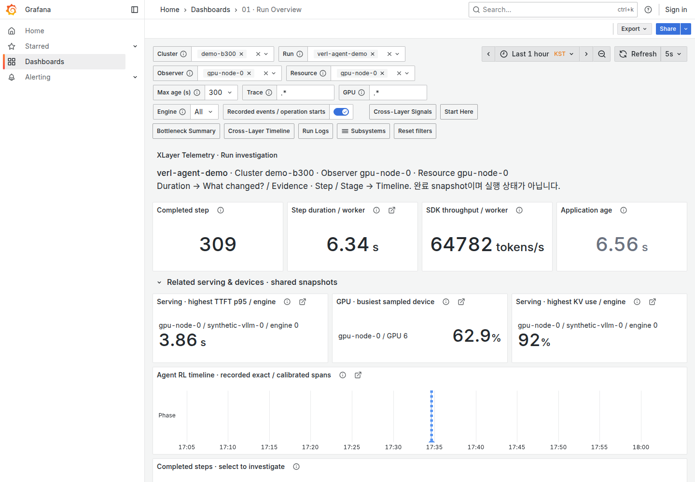
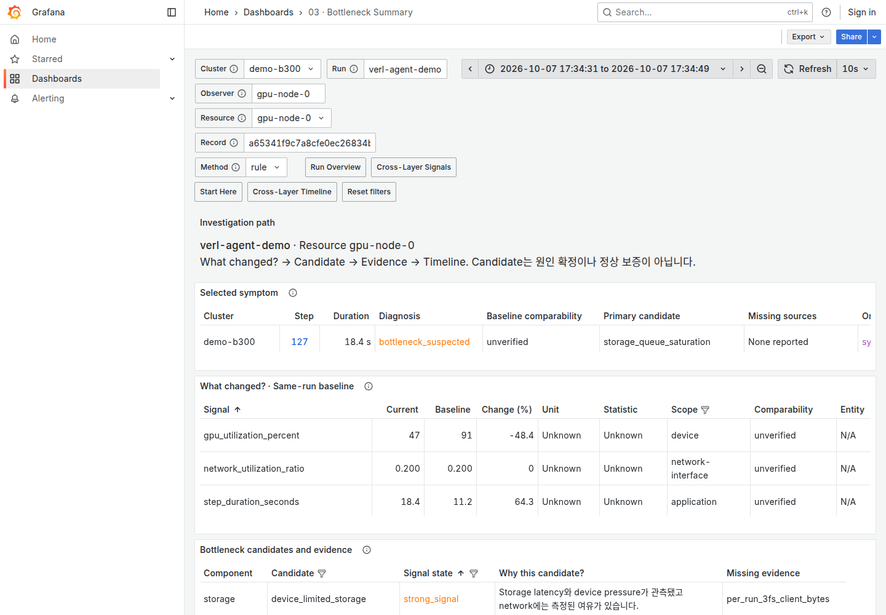

# Slow Step Investigation

**목표:** 느린 완료 step을 고르고 baseline·candidate·evidence에서 다음 조사 지점을 정합니다.

## 준비 조건

- [Demo](demo.md) 또는 실제 [VERL](verl-quickstart.md)의 completed step.
- Grafana 접근과 조사할 Run·Cluster·observer identity.
- 완료 step 목록·Timeline에는 [Loki](logs-events.md), 후보에는 [Diagnostics](diagnosis.md#1-진단-연결).

```{admonition} Scope / Precision
:class: important

Exact span, approximate step, sampled metric을 구분합니다. GPU·native engine·storage의 shared signal은 Run 사용량이나 인과관계가 아닙니다.
```

## 증상으로 시작하기

| 증상 | 시작할 곳 | 함께 확인 |
| --- | --- | --- |
| 어느 step인지 모름 | Run Overview | Snapshot age·완료 step 목록 |
| Rollout이 느림 | Agent RL Stage Correlation | Stage duration·queue·TTFT·tool span |
| GPU가 idle | Compute & Communication | Device·worker allocation·host/communication |
| KV latency 증가 | Policy & KV / Mooncake | 같은 engine의 usage·preemption·offload |
| Checkpoint가 느림 | Data & Storage | Local vs shared scope·write/queue·service evidence |
| Sandbox 대기 | Sandbox signals / Timeline | Runtime span·cgroup PSI·sample age |
| 원인 후보를 읽고 싶음 | Bottleneck Summary | Current/baseline·supporting/counter/missing |

## 1. Run과 시간 선택

1. **Run Overview**에서 Cluster·Run·Observer를 선택합니다.
2. Resource는 실제 GPU/engine/storage node로 고릅니다.
3. Snapshot age와 기록 시각을 확인합니다.

**정상 결과:** KPI는 완료 snapshot이며 shared card는 engine/device identity를 표시합니다. `Running`이나 전체 workload 정상 여부를 뜻하지 않습니다.



## 2. 느린 Step 선택

| 클릭 | 열리는 화면 | 확인할 것 |
| --- | --- | --- |
| 완료 목록의 **Duration** | Bottleneck Summary | What changed? / baseline / candidate |
| **Step / Stage** | Cross-Layer Timeline | 같은 interval의 경계와 자원 |
| Graph의 data link | 관련 subsystem | Entity·시간·filter |

**정상 결과:** row의 `record_id`, cluster, observer와 시간 구간이 전달됩니다. Synthetic demo에서는 Step 127의 **18.4 s**로 연습합니다.

## 3. What changed? → Candidate → Evidence

1. **Current / Baseline / Change (%)**와 Unit·Scope·Comparability를 읽습니다.
2. Candidate의 signal state·설명·missing evidence를 확인합니다.
3. **Review supporting / counter / missing evidence**로 evidence 표를 전체 화면에서 엽니다.
4. Source·entity·sample quality를 확인하고 반대 근거도 읽습니다.

```{admonition} 정상 판정과 비교
:class: note

Unknown unit, missing baseline, unverified comparability를 확인합니다. 큰 delta나 strong signal도 원인 확정이 아니며 no_anomaly_observed도 정상 보증이 아닙니다.
```



## 4. Agent RL Timeline과 Related Metrics

**Cross-Layer Timeline**에서 순서대로 확인합니다.

| 읽을 것 | 해석 |
| --- | --- |
| Selected step / reported stages | Approximate boundary와 완료 duration |
| Exact / calibrated span lane | 직접 기록한 start/end와 uncertainty |
| Step completion marker | Logger 관측 시각; phase 실행 순서가 아님 |
| Recorded event / operation start | 실제 기록만 표시; absent event를 미발생으로 단정하지 않음 |
| Related Metrics | 같은 시간의 GPU·vLLM·network·device 표본 |
| Clock / span records | 원본 시각·reference·trace/parent·uncertainty |

**정상 결과:** 정확도와 scope가 분리됩니다. GPU·host·offload rate의 lookback은 짧은 step 앞의 활동을 포함할 수 있습니다.

## 5. Subsystem → Log / Span / Deep Dive

- **Subsystems**에서 Compute·Stage Correlation·Data & Storage로 이동합니다.
- **Run Logs**에서 Log directory와 Run context를 각각 확인합니다.
- **Cross-Layer Signals**에서 workload/serving과 shared resource를 비교합니다.
- 계측만으로 부족하면 [Deep Dive](deep-dive.md)에서 짧은 profiler·통제 실험으로 후보를 검증합니다.

## Context를 잃었을 때

| 상황 | 행동 |
| --- | --- |
| 다른 node detail에서 step이 사라짐 | Observer와 Resource가 서로 다른 selector인지 확인 |
| 다른 step의 span이 숨음 | Trace filter 확인; 새 step 링크는 이전 trace를 초기화 |
| 모든 graph가 비어 있음 | 시간·entity·source·retention 확인 |
| 전체 제한을 해제하고 싶음 | `Reset filters`; Run/Cluster/시간은 유지, record·trace 제한은 초기화 |

## 다음

[Baseline / Evidence 해석](diagnosis.md) · [Subsystem Deep Dive](deep-dive.md) · [Dashboard 상세 Reference](dashboard-reference.md) · [실제 기록과 현재 검증](real-verl-demo.md)

:::{container} xlayer-legacy-links

<a id="dashboard-guide" class="xlayer-legacy-anchor"></a>

[Dashboard Guide](dashboard-reference.md#dashboard-guide)

<a id="choose-a-view" class="xlayer-legacy-anchor"></a>

[Choose a View](dashboard-reference.md#choose-a-view)

<a id="dashboard-inventory" class="xlayer-legacy-anchor"></a>

[Dashboard Inventory](dashboard-reference.md#dashboard-inventory)

<a id="readability" class="xlayer-legacy-anchor"></a>

[Readability](dashboard-reference.md#readability)

<a id="subsystem-only-inspection" class="xlayer-legacy-anchor"></a>

[Subsystem-only Inspection](dashboard-reference.md#subsystem-only-inspection)

<a id="start-here" class="xlayer-legacy-anchor"></a>

[Start Here](dashboard-reference.md#start-here)

<a id="select-the-context" class="xlayer-legacy-anchor"></a>

[Select the Context](dashboard-reference.md#select-the-context)

<a id="run-overview" class="xlayer-legacy-anchor"></a>

[Run Overview](dashboard-reference.md#run-overview)

<a id="agent-rl-stage-correlation" class="xlayer-legacy-anchor"></a>

[Agent RL Stage Correlation](dashboard-reference.md#agent-rl-stage-correlation)

<a id="compute--communication" class="xlayer-legacy-anchor"></a>

[Compute & Communication](dashboard-reference.md#compute--communication)

<a id="data--storage" class="xlayer-legacy-anchor"></a>

[Data & Storage](dashboard-reference.md#data--storage)

<a id="run-logs" class="xlayer-legacy-anchor"></a>

[Run Logs](dashboard-reference.md#run-logs)

<a id="follow-a-slow-interval" class="xlayer-legacy-anchor"></a>

[Follow a Slow Interval](dashboard-reference.md#follow-a-slow-interval)

<a id="bottleneck-summary-and-cross-layer-timeline" class="xlayer-legacy-anchor"></a>

[Bottleneck Summary and Cross-Layer Timeline](dashboard-reference.md#bottleneck-summary-and-cross-layer-timeline)

<a id="read-the-investigation-results" class="xlayer-legacy-anchor"></a>

[Read the Investigation Results](dashboard-reference.md#read-the-investigation-results)

<a id="step-explorer" class="xlayer-legacy-anchor"></a>

[Step Explorer](dashboard-reference.md#step-explorer)

<a id="open-in-grafana" class="xlayer-legacy-anchor"></a>

[Open in Grafana](dashboard-reference.md#open-in-grafana)

<a id="read-a-step" class="xlayer-legacy-anchor"></a>

[Read a Step](dashboard-reference.md#read-a-step)

<a id="run-analysis" class="xlayer-legacy-anchor"></a>

[Run Analysis](deep-dive.md)

<a id="start-with-one-slow-interval" class="xlayer-legacy-anchor"></a>

[Start with One Slow Interval](dashboard-reference.md#start-with-one-slow-interval)

<a id="check-the-run-context" class="xlayer-legacy-anchor"></a>

[Check the Run Context](dashboard-reference.md#check-the-run-context)

<a id="follow-the-storage-path" class="xlayer-legacy-anchor"></a>

[Follow the Storage Path](dashboard-reference.md#follow-the-storage-path)

<a id="capture-a-short-trace" class="xlayer-legacy-anchor"></a>

[Capture a Short Trace](deep-dive.md#짧은-trace-수집)

<a id="practice-with-a-synthetic-profile" class="xlayer-legacy-anchor"></a>

[Practice with a Synthetic Profile](dashboard-reference.md#practice-with-a-synthetic-profile)

<a id="measure-a-communication-baseline" class="xlayer-legacy-anchor"></a>

[Measure a Communication Baseline](dashboard-reference.md#measure-a-communication-baseline)

<a id="compare-after-a-change" class="xlayer-legacy-anchor"></a>

[Compare After a Change](dashboard-reference.md#compare-after-a-change)

<a id="read-clock-evidence-in-the-timeline" class="xlayer-legacy-anchor"></a>

[Read Clock Evidence in the Timeline](dashboard-reference.md#read-clock-evidence-in-the-timeline)

<a id="theme-selection" class="xlayer-legacy-anchor"></a>

[Theme Selection](dashboard-reference.md#theme-selection)

<a id="bottleneck-signals-beyond-utilization" class="xlayer-legacy-anchor"></a>

[Bottleneck Signals Beyond Utilization](dashboard-reference.md#bottleneck-signals-beyond-utilization)

<a id="browser-journey-validation" class="xlayer-legacy-anchor"></a>

[Browser Journey Validation](maintainers.md#문서와-ui-검증)

:::
