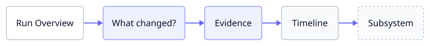
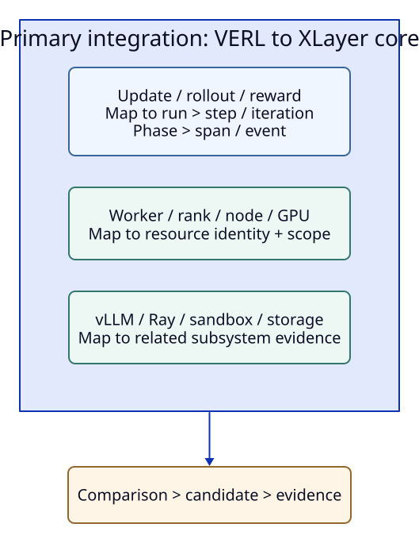
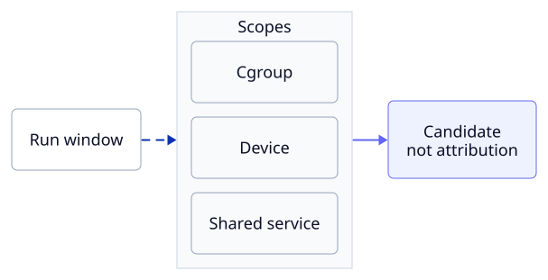
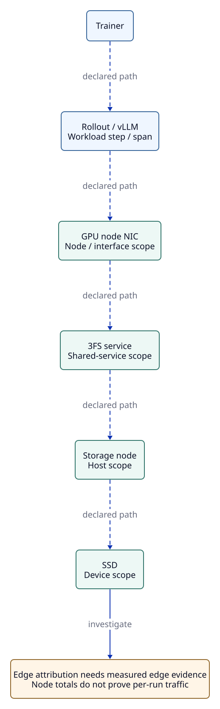

# Cross-Layer Diagnosis

> **Reference** · 기본 작업은 [diagnosis guide](diagnosis.md)에서 시작합니다. 아래에는 기존 운영·구현·해석 세부 정보와 기록을 보존합니다.

Diagnosis는 XLayer의 **Collect → Correlate → Diagnose** 흐름에서 VERL 실행의 느린 구간을 조사하는 단계입니다.
Trainer·vLLM·Ray·sandbox·GPU·host·storage 등 연결한 source의 관측치를 run·step·phase 문맥과 측정 범위로 해석해 검토 가능한 bottleneck candidate를 만듭니다.
수집 경로와 correlation 원리는 [구현 구조](concepts.md)에 설명합니다.

이 문서는 기본 rule diagnosis를 설명합니다.
수집된 메트릭을 local open-weight 모델이 직접 읽고 진단하도록 하려면 [Optional Local LLM Diagnosis](local-llm.md)를 사용합니다.
LLM 경로는 rule catalog와 기존 판정을 입력에 넣지 않는 별도 선택 기능입니다.

## Investigation Workflow



`ENABLE_LOGS=1`인 monitoring server에 `03 · Bottleneck Summary`와 `04 · Cross-Layer Timeline`이 provision됩니다.
Node collector의 Alloy가 run root의 `diagnostics/investigation/*.jsonl`과 `telemetry-events/*.jsonl`을 Loki에 보내야 후보와 span 행이 채워집니다.
Loki 없이도 완전한 진단은 `diagnostics/latest.json`과 `python -m xlayer_telemetry.show_run "$RUN_ROOT"`에서 읽을 수 있습니다.
[진단 설정](diagnosis.md#1-진단-연결)을 붙이지 않았다면 새 화면의 후보 표는 비어 있습니다.

### Practice with a Synthetic Candidate

기본 CLI 설정에서 `ENABLE_LOGS = true`를 지정하고 `xltel restart`로 Loki·Alloy를 연결합니다.
GPU 없는 host는 `ENABLE_GPU_METRICS = false`도 지정합니다.
이미 `xltel up`으로 시작한 stack을 사용하므로 별도 demo server를 띄우지 않습니다.

```bash
python -m xlayer_telemetry.demos.diagnosis \
  --output "$HOME/telemetry/runs/diagnosis-demo-001" \
  --run-id diagnosis-demo-001 --node gpu-local
xltel inspect diagnosis-demo-001
```

Custom config에서는 output을 `TELEMETRY_RUNS_ROOT` 아래, node를 collector의 `NODE_NAME`과 동일하게 지정합니다.
Collector와 Alloy가 파일을 읽은 뒤 Start Here의 해당 Run → Run Overview의 Step 127 Duration → Bottleneck Summary로 이동합니다.
Snapshot은 기본 300초 후 live 목록에서 제외되지만 step·diagnosis artifact는 보존됩니다.
이 예제의 `data_origin=synthetic`과 `producer=synthetic`은 설명용 수치이며 host·GPU·3FS 실측값이 아닙니다.
Timeline의 실제 host metric과 예제의 storage evidence를 같은 실험 결과로 해석하지 않습니다.
실제 run에는 [진단 설정](diagnosis.md#1-진단-연결)을 연결하고 필요한 source를 등록합니다.

1. Run Overview에서 target과 sample freshness를 확인하고 느린 step의 시간을 찾습니다.
2. Run Overview의 완료 step 목록에서 step을 선택해 `record_id`와 추정 시간 범위를 확인합니다.
3. Bottleneck Summary의 candidate 상태와 scope, missing evidence를 함께 읽습니다.
   Evidence details 표에서 supporting·counter·missing 행의 수치, source, entity를 확인합니다.
4. Cross-Layer Timeline에서 exact span, approximate step band, sampled metric의 시간 관계를 봅니다.
5. 관련된 기존 dashboard나 profiler artifact를 열어 후보를 반증하거나 뒷받침합니다.

## What the Signals Mean

| 개념 | 의미 | 예 |
| --- | --- | --- |
| Metric | 반복 측정한 수치 | GPU utilization, 3FS p99 latency |
| Event | 특정 시점에 발생한 일 | checkpoint start, tool call |
| Span | 실제 시작과 끝을 기록한 작업 | EventRecorder의 rollout span |
| Trace | 관련 span을 묶는 ID와 관계 | `trace_id`, `span_id` |
| Profile | 짧은 구간의 상세 실행 자료 | PyTorch Profiler trace, Nsight report |
| Topology | 구성 요소와 연결 정보 | trainer node, NIC, storage service |
| Correlation | 같은 시간·문맥에서 함께 변한 신호 | step time 증가와 3FS latency 증가 |
| Attribution | 특정 run이 자원을 실제로 사용했다는 증거 | client별 byte counter가 있을 때만 가능 |
| Diagnosis candidate | 조건을 만족한 조사 가설 | `storage_queue_saturation` |

`Correlation is not attribution.`
Trainer duration은 application/run 범위이고 GPU utilization은 device 범위, node disk I/O는 node/device 범위, 3FS service latency는 shared-service 범위입니다.
GPU·host·disk 지표를 특정 run의 병목 근거로 해석하는 실험은 해당 run이 자원을 단독 사용하거나 다른 workload의 부하를 통제한 환경에서 가장 신뢰할 수 있습니다.
같은 시간에 관측됐다는 이유만으로 3FS 전체 latency나 NIC traffic을 특정 run에 귀속하지 않습니다.
Candidate의 각 evidence는 `source`, `observation_scope`, `window`, `boundary_accuracy`, current/baseline 값을 보존합니다.
Prometheus evidence의 `query`는 context 변수를 치환한 실제 실행식이며 canonical signal 이름에 연결됩니다.
Tool event를 대신 사용하는 evidence는 trace/span과 span 경계를 보존하고 Prometheus sampling 품질을 이어받지 않습니다.

Baseline은 같은 run·node·worker·boundary scope의 이전 유효 구간에서 고릅니다(세부 조건은 아래).
Phase alias는 canonical을 우선해 중복 사용하지 않고, vLLM은 같은 engine의 signal끼리 비교합니다.

## Semantic Model and Adapter Boundary



현재 자동 step adapter는 VERL file logger bridge입니다.
`diagnosis_analysis.py`는 framework 이름을 모르는 signal과 participant map을 입력으로 받으므로 다른 framework에도 adapter로 이식할 수 있습니다.
새 adapter는 원래의 step/iteration와 phase 이름을 보존하면서 이 공통 모델에 대응시키며, 모든 framework의 integration을 제공한다는 뜻은 아닙니다.
`EventRecorder`의 기존 `trace_id`·`span_id`를 재사용하며 OpenTelemetry Collector는 필수 요소가 아닙니다.

## Optional Exporter Metric Profiles

기본 진단의 12개 query는 유지합니다. 추가 evidence는 기존 exporter를 재사용하는
`prometheus.metric_profiles`에서 필요한 profile만 선택합니다. 별도 collector나
기본 scrape 주기를 추가하지 않습니다. `examples/verl/diagnostics.json`은
`["host", "disk", "vllm"]`을 선택한 예입니다.

```json
{
  "prometheus": {
    "url": "http://monitor.internal:19090",
    "metric_profiles": ["host", "disk", "vllm"]
  }
}
```

위 코드는 기존 diagnostics config의 `prometheus` 설정에 합칠 부분입니다.
전체 config의 `schema_version` 및 기존 source/clock 설정은 유지합니다.

| Profile | 추가 query 수 | 관측 항목 |
| --- | ---: | --- |
| `host` | 6 | CPU busy, CPU/memory/I/O PSI stall fraction, major faults/s, runnable processes |
| `disk` | 7 | read/write/flush mean latency, average queue depth, read/write IOPS, write bytes/s |
| `filesystem` | 4 | available bytes/inodes ratio, read-only, device error |
| `network` | 7 | RX/TX bytes/s, RX/TX error/drop rates, TCP retransmits/s |
| `rdma` | 3 | receive errors, transmit discards, transmit-wait ticks/s |
| `vllm` | 6 | per-entity TTFT/TPOT/queue/E2E p95, prompt/generated tokens/s |
| `kv_offload` | 5 | load/store bytes/s, allocation failures/s, sync/async lookup p95 |
| `ray` | 5 | spilled bytes, disk-backed mmap bytes, pending spill/restore bytes, worker eviction rate |
| `dcgm` | 7 | GPU utilization, tensor/DRAM activity, PCIe RX/TX bytes/s, PCIe replays/s, last XID code |

`host`/`disk`/`filesystem`/`network`/`rdma`는 Node Exporter의 `instance={node}`를
조회합니다. Native profile은 `job="native"`, 등록된 `telemetry_source`와
`node={rollout_node}`(vLLM/Ray), `node={compute_node}`(DCGM)를 요구합니다.
노드·cluster labels를 실제 discovery와 맞춥니다. Storage service node의 독립적인
장치/네트워크 관측에는 기존 `storage_node`/`storage_device` 및 명시적
`prometheus.queries` override를 사용합니다. 이 profile들이 trainer node를 모든
3FS/pNFS storage node로 간주하지는 않습니다.

- `prometheus.queries`의 동일 signal override가 profile보다 우선합니다.
- Unknown/중복 profile은 오류로 거절합니다. 전체 profile도 고정 50개 추가 query입니다.
  예제의 3개 profile은 총 31개이며 baseline이 있으면 최대 62개 metric request가
  필요합니다. Clock/freshness query는 별도입니다. 전체 profile을 무조건 켜지 말고
  `query_execution`/`missing_sources`를 확인합니다. 기존 30초 query budget과
  60초 worker deadline을 늘리지 않습니다.
- `comparison.signals`에 단위, 실행 query, window statistic 및 선택한 entity labels를
  보존합니다. 현재 window에서 선택한 entity와 **동일한 labels**의 baseline만
  비교합니다. 장치/endpoint 교체나 label 불일치는 baseline을 누락으로 기록합니다.
  서로 다른 signal의 최대값이 같은 entity라는 의미는 아닙니다.
- Rate는 reset-aware `rate(...[1m])`입니다. 짧은 step에서는 앞선 구간이 포함될 수
  있으며 per-step byte total이 아닙니다. Idle/zero denominator의 latency/capacity
  ratio는 0으로 꾸미지 않고 제외합니다. Device busy fraction은 NVMe의 실제 포화나
  NAND writes/WAF를 증명하지 않습니다.
- vLLM p95는 각 endpoint/model/engine의 histogram으로 계산한 추정치입니다.
  TPOT는 `request_time_per_output_token_seconds`이며 inter-output latency와 다릅니다.
  KV offload byte query는 새 `kv_offload_{load,store}_bytes_total`을 우선하고
  legacy `kv_offload_total_bytes_total{transfer_type=...}`를 fallback으로 사용해
  둘 다 노출될 때 중복 합산하지 않습니다. Lookup/allocation metrics는 최신 connector
  구현에만 있을 수 있습니다. Connector가 어떤 offload medium을 쓰는지는 배포 설정으로
  확인해야 하며 byte metric만으로 NVMe/3FS 사용을 판단하지 않습니다.
- Ray `SPILLED`/`MMAP_DISK`는 현재 gauge 값으로 throughput이 아닙니다.
  Pending spill/restore는 raylet 구현의 version-dependent gauge입니다.
  Ray의 lifetime active-transfer throughput을 step-window throughput으로 사용하지 않습니다.
- DCGM 미지원 sentinel/range 밖 값은 query에서 제외합니다. PCIe profiling metric은
  이미 bytes/s인 gauge이고 XID는 마지막 error code라 `rate()`하지 않습니다.
  XID 발생 시점은 GPU log로 확인해야 합니다. DCGM은 기존 NVML series와 device identity를
  임의로 합치거나 대체하지 않고 독립적인 evidence로 남습니다.
- PSI와 step/actor update/critic update/checkpoint slowdown이 겹치거나 rollout slowdown과
  queue p95 증가가 겹치면 최대 `supporting_signal` 후보를 만듭니다. Resource window는
  전체 step이므로 특정 stage의 정확한 I/O attribution을 주장하지 않습니다.
  높은 busy percentage만으로 새로운 stall 후보를 만들지 않습니다.

### Source contracts and remaining gaps

Node Exporter는 bundled **v1.9.1**의
[PSI](https://github.com/prometheus/node_exporter/blob/v1.9.1/collector/pressure_linux.go),
[diskstats](https://github.com/prometheus/node_exporter/blob/v1.9.1/collector/diskstats_linux.go),
[InfiniBand](https://github.com/prometheus/node_exporter/blob/v1.9.1/collector/infiniband_linux.go)
계약을 확인했습니다. Newer mlx5 hardware ACK/ECN/retry counters, NVMe SMART physical
writes/endurance, filesystem operation latency/errors, per-process/cgroup ownership,
NCCL per-collective stall 시간은 이 profile에 없습니다. 필요하면 별도 검증된 exporter,
profiler 또는 application spans를 연결합니다. SMART 값은 shared-device context이며
정확한 run별 WAF나 physical writes로 환산하지 않습니다.

vLLM은 commit `5f30fc7031cae49bf51073fc953d419b08f8887c`의
[request metrics](https://github.com/vllm-project/vllm/blob/5f30fc7031cae49bf51073fc953d419b08f8887c/vllm/v1/metrics/loggers.py)와
[offload metrics](https://github.com/vllm-project/vllm/blob/5f30fc7031cae49bf51073fc953d419b08f8887c/vllm/distributed/kv_transfer/kv_connector/v1/offloading/metrics.py),
DCGM은 commit `fafd151148052628061a80450b4ee037a5fa0c3c`의
[default counters](https://github.com/NVIDIA/dcgm-exporter/blob/fafd151148052628061a80450b4ee037a5fa0c3c/etc/default-counters.csv)를
기준으로 합니다. 설치 버전의 실제 `/metrics`에서 이름·labels·지원 여부를 확인합니다.
Ray의 documented object-store/eviction 계약은
[Ray 2.58 system metrics](https://docs.ray.io/en/latest/ray-observability/reference/system-metrics.html)를
확인했습니다. Pending spill/restore는 Ray commit `43b706d733c590cf497cc322c57b9fd610bf214f`의
[metric definitions](https://github.com/ray-project/ray/blob/43b706d733c590cf497cc322c57b9fd610bf214f/src/ray/raylet/metrics.h)와
[emission semantics](https://github.com/ray-project/ray/blob/43b706d733c590cf497cc322c57b9fd610bf214f/src/ray/raylet/local_object_manager.cc)를
확인했습니다. Source semantics/CPU fixture 검증이며 실제 GPU, RDMA, Ray, vLLM 및
3FS workload에서의 수집 또는 학습 성능 검증을 뜻하지 않습니다.

3FS distributions 조회도 byte cap 8 MiB 외에 최대 1,000 metric을 허용합니다.
`LIMIT 1001`로 초과를 확인해 누락으로 보고하며 부분 결과를 정상으로 내보내지 않습니다.
3FS의 raw counter table은 producer별 reset/gauge 의미를 모르므로 자동 rate를 만들지 않습니다.

## Backend Query Budget

`query_budget_seconds`는 한 번의 rule analysis가 backend 요청에 사용할 budget이며 기본 30초입니다.
Prometheus의 current·baseline·clock·freshness query와 3FS 조회가 budget을 공유합니다.
남은 시간보다 긴 HTTP timeout은 줄이고 budget이 소진되면 추가 요청을 생략합니다.

연결 오류·timeout·HTTP 429/5xx가 발생한 backend에는 같은 analysis에서 재요청하지 않습니다.
다른 backend 조회는 남은 budget으로 진행하며, 다음 analysis에서 다시 연결합니다.
빈 결과·잘못된 query·malformed JSON은 backend 전체의 연결 장애로 취급하지 않습니다.

`query_execution`에 backend별 `attempted`·`failed`·`skipped`와 `unavailable`, 소요 시간을 기록하고 `show_run`에도 표시합니다.
생략된 query는 `missing_sources`로 남아 기존 bounded retry 대상이 됩니다.
이 budget은 새 요청의 admission과 socket timeout을 제한하며 DNS·느리게 이어지는 응답·로컬 파일 I/O를 강제로 중단하는 hard deadline은 아닙니다.

CLI와 VERL wrapper는 별도로 `analysis_deadline_seconds`(기본 60초)를 적용합니다.
History/report를 읽는 scheduling 요청과 각 interval의 rule analysis는 재사용 가능한 별도 worker process에서 실행합니다.
제한 시간을 넘으면 worker를 TERM 후 필요시 KILL로 중단하고, 다음 요청에서 새 worker를 시작합니다.
`analysis_execution`에 상태·소요 시간·deadline을 기록하며 중단 결과는 후보 없이 `insufficient_data`, `missing_sources=["analysis:deadline_exceeded"]`로 남습니다.
Step 결과는 기존 bounded retry를 따르고 report·Loki projection 저장은 부모 process가 담당합니다.

설정은 scheduling 요청과 개별 analysis의 제한이며 run 전체나 batch 합계의 제한은 아닙니다.
Worker 정리에는 별도로 최대 0.5초의 grace를 사용하고, 부모의 report 저장 경로는 node-local filesystem을 권장합니다.
Kernel의 uninterruptible I/O는 즉시 종료를 보장할 수 없으며, 종료되지 않은 worker가 있으면 추가 worker 생성을 억제합니다.
`analysis_deadline_seconds=0`은 process 격리를 끄는 선택적 설정입니다.
Python에서 `DiagnosticEngine.analyze()`를 직접 호출하면 in-process로 실행되므로 이 deadline은 적용되지 않습니다.

History/report·tool/sandbox event는 process-local incremental cache로 새 newline까지 추가된 부분만 파싱합니다.
기본 `jsonl_cache` 한도는 100,000 record·원본 64 MiB·128 file이며 한 worker 내 파일들이 한도를 공유합니다.
File 교체·축소·감지된 rewrite는 다시 읽고, 한도를 넘는 파일은 전체 scan으로 처리해 evidence를 잘라내지 않습니다.
Producer는 append-only JSONL을 쓰거나 파일을 atomic replace해야 하며, 기존 파일 중간을 제자리에서 수정하는 방식은 지원하지 않습니다.
Cache는 재시작 후 원본에서 복원하고 `jsonl_cache` report field에 처리량을 표시합니다.
`jsonl_cache.enabled=false`로 끌 수 있으며, 이 cache는 시간 구간을 직접 찾는 persistent index가 아니므로 기존 record의 필터링 비용은 남습니다.

CPU fixture로 cold/warm parse 비용을 확인하려면 다음을 실행합니다.

```bash
python -m examples.investigation.validate_runtime --output artifacts/runtime-validation
```

같은 명령은 1,000-worker snapshot fixture의 cache 미사용·첫 poll·반복 poll 비용과 실제 파일 읽기 횟수도 비교합니다.
Local filesystem 측정이며 전체 collector latency나 학습 throughput 개선을 뜻하지 않습니다.

## Baseline and Rule State

Retry 기간은 batch 시작이 아닌 각 step의 첫 분석 시작 시각부터 계산합니다.
다음 시도는 해당 분석이 끝난 뒤 `retry_interval_seconds`를 두되, 원래 retry deadline을 넘기지 않습니다.
분석 자체가 retry 기간을 모두 사용하면 결과를 final로 남겨 즉시 재시도가 반복되지 않게 합니다.

기본 baseline은 같은 run·node·worker·boundary scope·execution mode의 이전 유효 step 중 최근 다섯 개를 고르고, duration median에 가장 가까운 구간을 비교합니다. 명시된 cluster·producer·role·rank·local rank·GPU도 같아야 하며, 한쪽의 identity 누락을 다른 쪽의 실제 값으로 대신하지 않습니다.
파일 기록 순서가 아닌 관측 시각을 사용합니다. Future·unknown·clock-discontinuity 이력은 제외하며, stage slowdown도 같은 유효 이력 5개를 사용합니다. 전체 history를 별도의 comparable list로 복사하지 않습니다.

3FS는 ingest 지연을 고려해 기본 30초(`threefs.settle_seconds`) 후 조회하며 wrapper도 마지막 step을 기다립니다.
표본 부재·backend 오류는 `analysis_status=provisional`로 남기고 기본 10초 간격·최대 60초 재시도합니다(`retry_interval_seconds`, `retry_seconds`).
일부 source만 먼저 도착하거나 baseline 표본이 없을 때도 누락된 query 결과를 같은 제한 시간 안에서 재조회합니다.
Baseline 조회 실패로 이미 수집한 current evidence를 버리지는 않습니다.
영구적으로 비어 있는 optional source도 deadline까지 기다리므로 `provisional` 자체가 backend 장애를 뜻하지는 않습니다.
종료 시 wrapper는 한 번 더 조회해 `final`로 확정합니다.
`diagnostics.jsonl`은 같은 `trigger_record_id`의 revision을 보존하고 Loki projection은 final 결과만 생성합니다.
Report 저장 후 `latest.json`이나 investigation 파일 쓰기가 실패하면, 다음 분석 실행에서 저장된 report로 해당 파일을 복구합니다.
Backend를 다시 조회하거나 revision을 추가하지 않으며, 이미 존재하는 immutable investigation 파일도 다시 쓰지 않습니다.
빈 후보 표는 `diagnostics/latest.json`의 `analysis_status`·`missing_sources`부터 확인합니다.
영구 누락도 제한 시간에 끝나며 `step_event_time` 없는 replay는 재시도하지 않습니다.

Baseline 창의 Prometheus·3FS를 조회해 `comparison.signals`에 current·baseline·delta·delta percent를 기록합니다.
3FS는 같은 `metricName`과 전체 producer identity, GPU는 같은 device, vLLM은 같은 engine으로 비교합니다. 3FS의 `host`·`tag`·`mount_name`·`instance`·`io`·`uid`·`method`·`pod`·`thread`·`statusCode`를 evidence의 `labels`와 comparison의 entity에 보존합니다.
3FS `max_observed_p99`는 한 entity의 유효 표본이 있는 보고 구간별 p99 중 최대값입니다. 여러 client/node/operation의 p99를 합친 global p99가 아니며, `count=0` 행은 extrema·weighted mean·freshness에 기여하지 않습니다. Query 결과는 기존 8 MiB·1,000 entity 상한을 유지하므로 필요하면 source filter를 좁힙니다.
Legacy metric-only artifact는 다른 legacy artifact와만 비교합니다. 명시된 identity와 섞거나 partial/duplicate identity에서 첫 행·마지막 행을 임의 선택하지 않습니다. Latency와 request-size를 함께 사용할 때도 metric 이름을 제외한 producer identity가 같아야 합니다.
GPU 짝이 없으면 node aggregate로 scope를 낮추고, 비교 표는 utilization 감소가 가장 큰 GPU를 선택합니다.
이는 run별 장치 귀속이나 node 평균이 아닙니다.

여러 engine의 공통 identity가 없으면 `vllm:shared_engine_identity`를 missing evidence로 남기고 강한 후보로 합치지 않습니다.
표본·baseline은 만들어내지 않으며 큰 delta도 원인 증명이 아닙니다.

`weak_signal`은 rule의 주요 증상만 관측한 상태, `supporting_signal`은 둘 이상의 독립 조건을 관측했지만 필수 조건이 없거나 반대 근거가 있는 상태, `strong_signal`은 모든 필수 조건이 실제 측정으로 충족된 상태입니다.
Storage rule의 필수 조건이 모두 있어도 run별 3FS client bytes가 없으면 attribution에 필요한 자료를 별도 `missing_evidence`로 남깁니다.
수치 confidence를 계산하지 않습니다.
강한 상태도 시간적 상관을 뜻하며 실행별 사용량이나 인과관계를 뜻하지 않습니다.

| Rule | 주요 evidence | 판정 범위·주의 |
| --- | --- | --- |
| `storage_queue_saturation` | 같은 3FS metric의 latency 증가, storage device busy 증가, storage throughput 정체 | Storage device와 throughput은 명시적으로 설정한 source여야 합니다. |
| `device_limited_storage` | 3FS latency 증가, storage device busy, 측정된 network headroom | GPU node의 local disk busy로 대체하지 않습니다. |
| `network_limited_storage` | 3FS latency 증가, network utilization, 측정된 storage device headroom | Link capacity 없는 RDMA bytes/s만으로 saturation을 판단하지 않습니다. |
| `small_io_pressure` | 신뢰할 수 있는 request size와 3FS latency 증가 | IOPS만으로 request size를 추론하지 않습니다. |
| `gpu_starvation` | step slowdown, GPU utilization 하락, vLLM waiting | Device 수치에 다른 workload가 섞일 수 있습니다. |
| `gpu_memory_pressure` | GPU memory ratio와 실제 eviction delta | GPU memory 사용률만으로 allocator 압력을 단정하지 않습니다. |
| `rollout_queue_backlog` | rollout duration 증가, vLLM waiting | vLLM은 shared service일 수 있습니다. |
| `kv_cache_pressure` | KV cache 사용률, preemption, waiting | 세 signal이 모두 필요합니다. |
| `communication_bound` | collective/weight sync duration 증가, RDMA activity 증가, GPU utilization 하락 | NIC 전체 수치는 run별 traffic이 아닙니다. |
| `host_memory_pressure` | available memory 부족과 swap/paging activity | Memory 부족만으로 강한 결론을 내리지 않습니다. |
| `host_cpu_stalls`, `host_memory_stalls`, `host_io_stalls` | Step slowdown과 해당 resource의 host PSI 증가 | Node 전체 대기와의 동시 관측이며 최대 `supporting_signal`입니다. |
| `actor_update_cpu_stalls`, `critic_update_cpu_stalls`, `checkpoint_io_stalls` | 해당 stage slowdown과 CPU 또는 I/O PSI 증가 | Resource window는 전체 step이며 최대 `supporting_signal`입니다. |
| `ray_object_store_disk_pressure` | Step slowdown과 Ray disk-backed mmap bytes | 현재 gauge이며 spill throughput이 아닙니다. 최대 `supporting_signal`입니다. |
| `rollout_queue_latency` | Rollout slowdown과 동일 entity의 queue p95 증가 | Histogram 추정치와의 상관이며 최대 `supporting_signal`입니다. |
| `straggler` | 세 명 이상 participant의 duration, 한 participant만 peer median보다 1.5배 이상 느림, peer spread 20% 이하 | Cluster 평균만으로 판단하지 않습니다. |
| `sandbox_local_storage_pressure` | Tool duration이 baseline보다 1.5배 증가하고 sandbox cgroup I/O PSI가 0.2 이상이며 지정한 local device busy가 0.9 이상 | Cgroup·device의 동시 관측이므로 최대 `supporting_signal`입니다. Tool duration만 있으면 나머지는 `missing_evidence`로 남깁니다. |

`gpu_memory_usage_ratio`는 GPU sampler의 device used/total bytes로 계산하며 capacity가 없거나 0이면 만들지 않습니다.
Memory 사용률만 높고 eviction evidence가 없다면 `gpu_memory_pressure`의 필수 조건을 충족하지 않습니다.
Custom eviction query는 memory와 같은 cluster·node 및 `gpu`/`gpu_uuid` 식별 field를 유지해야 합니다.
Identity가 다르거나 aggregate만 있거나 한 GPU에 여러 process series가 있어 결합이 모호하면 eviction 근거를 제외하고 `gpu_memory_entity_match`를 missing evidence로 남깁니다.
`storage_device_busy_ratio`, `network_utilization_ratio`, `threefs_throughput_bytes_per_second`, `storage_request_bytes`, `gpu_evictions_delta`는 기본 query에 없습니다.
Prometheus에서 가져오는 값은 실제 source와 해당 scope를 확인한 뒤 `prometheus.queries`에 명시적으로 넣습니다.
3FS distributions에 신뢰할 수 있는 request size metric이 있다면 `threefs.request_size_metric`에 그 **정확한** `metricName`을 지정해 `storage_request_bytes`를 만들 수도 있습니다.
특히 storage device metric이 어떤 storage node/device를 보는지, network utilization의 분모가 어떤 link capacity인지 확인해야 합니다.
기본 Node Exporter의 `disk_busy_ratio`는 trainer node의 local device이고 3FS storage SSD를 뜻하지 않습니다.

Ray pending task는 실행 node가 정해지기 전 owner가 기록할 수 있으므로 기본 query는 rollout node로 제한하지 않습니다.
`cluster`·`SessionName`별 `PENDING.*` 합계를 비교하며 `scheduling_backlog`는 cluster/session 범위의 supporting signal입니다.
여러 Ray cluster의 session 구분이 없는 exporter는 `prometheus.queries.ray_pending_tasks`로 배포에 맞는 query를 지정합니다.

Sandbox rule은 설정의 `sandbox.enabled=true`일 때만 sandbox node와 명시한 backing `device`를 조회합니다.
`sandbox_io_pressure_ratio`는 sandbox cgroup 안의 여러 block device를 합친 대기이며, `device` busy는 선택한 host block device 전체의 값입니다.
실제 Docker container가 sampler cgroup 아래에 있는지, `io.stat`의 major:minor가 선택한 backing device와 맞는지 확인하지 않았다면 두 값의 일치를 근거로 귀속을 주장하지 않습니다.
`sandbox.node`는 dedicated 배치의 node로 지정하고, colocated 배치에서는 생략해 trainer node를 사용합니다.
`sandbox.events_dir`에 유효한 `tool.call` span이 있으면 이를 우선 사용하고 baseline도 같은 tool 이름으로 비교합니다.
진단 process가 이 directory를 읽을 수 있어야 합니다.
파일명과 producer에 관계없이 같은 run의 정상 종료 `tool.call` 중 `attributes.tool`이 있고 분석 구간 안에서 시작·종료한 span을 사용합니다.
그 span이 없거나 directory를 설정하지 않았다면 `agent_tool_call_duration_seconds`의 해당 run 표본을 사용합니다.
Prometheus tool query는 `run_id`로 표본을 고르므로 trainer·rollout node가 달라도 사용할 수 있지만, 여러 rollout worker의 표본이 같은 구간에 섞일 수 있습니다.
두 scope가 겹쳐도 특정 trajectory의 SSD 사용량이라는 인과 주장은 하지 않습니다.

### Select a Comparable Workload

기존 baseline 선택은 유지하지만 기본 `workload_comparability`는 `unverified`입니다.
Token 수·evaluation·checkpoint 차이를 제외하려면 diagnostics config에 비교 조건을 추가합니다.

```json
"baseline": {
  "match_fields": ["perf/total_num_tokens", "has_evaluation", "has_checkpoint"],
  "relative_tolerance": 0.1,
  "normalize_by": "perf/total_num_tokens"
}
```

Bridge는 logger에 존재하는 `perf/total_num_tokens`, `prompt_length/mean`, `response_length/mean`, `data/train_batch_size`, `train_batch_size`, `policy_version`을 history의 `workload`에 보존합니다.
`has_evaluation`·`has_checkpoint`는 보고된 stage timing에서 계산합니다.
Logger가 batch나 policy 값을 제공하지 않으면 만들어내지 않으며, 선택한 field가 어느 쪽에든 없으면 해당 baseline은 제외합니다.
Numeric field는 이전 값 기준 tolerance로 비교하고 boolean field는 정확하게 일치해야 합니다. `policy_version`과 `fully_async/count/current_param_version`을 `match_fields`에 넣으면 tolerance와 관계없이 같은 version만 비교합니다. 이 두 값은 연속적인 workload 크기가 아니라 식별자입니다.
조건을 만족하는 이전 step이 없으면 `baseline:comparable_workload`를 missing evidence로 남깁니다.

Normalization은 양쪽에 유효한 양수 token 수가 있을 때만 `step_seconds_per_token`을 추가합니다.
단위는 `seconds/token`이고 총 step duration의 기존 rule threshold를 대체하지 않습니다.
Token 수가 같아도 tool mix·sequence 분포·cache 상태까지 동일하다는 보장은 없으므로 `matched_configured_fields`도 비교 조건의 충족만 의미합니다.

### Read Sampling Quality

Source freshness는 단일 source가 명확한 query에서만 확인합니다.
Custom query에 `offset`·`@`·subquery나 추가 bare metric이 있으면 원래 시점을 생략한 timestamp query를 만들지 않고 freshness를 `unknown`으로 남깁니다.
허용한 단순 aggregation·rate 이외의 복잡한 식도 자동 해석하지 않습니다.
Source timestamp가 분석 구간 종료보다 미래이면 `source_timestamp_in_future`를 표시하고 age를 0으로 보정하지 않습니다.

Evidence와 comparison은 `sampling_quality.current`·`baseline`에 interval 길이, query step, range window와 evaluation count를 보존합니다.
예를 들어 6초 step의 `[1m]` rate에는 `range_window_exceeds_interval`이 표시됩니다.
이 값은 step 전후 활동을 포함할 수 있으므로 해당 step의 정밀한 resource 사용량으로 해석하지 않습니다.

`query_result`는 해당 query 전체의 backend warning·info 수와 버린 sample·series 수를 보존하며 개별 engine의 품질로 해석하지 않습니다.
Warning·info 수는 각각 1,000에서 제한하고 backend 원문은 저장하거나 LLM에 전달하지 않습니다.
Info만으로 entity 누락을 단정하지 않으며, 버린 series 수는 응답에 있었지만 유효한 finite sample이 없어 제외한 series만 셉니다.
이 품질 제한은 `missing_sources`·candidate의 `missing_evidence`에도 구간별 안전한 code와 수로 남고, 관련 candidate는 최대 `supporting_signal`로 표시합니다.
유효한 값과 labels는 유지하며 NaN·Inf·잘못된 sample을 0으로 바꾸지 않습니다.

Source freshness를 확인하려면 diagnostics 또는 LLM source config에 다음 설정을 추가합니다.

```json
"sampling": {"check_source_freshness": true}
```

Freshness 검사는 단일 source query에 원본 `timestamp(metric{...})` 조회를 추가합니다.
Computed rate의 timestamp나 application event 시각과는 다릅니다.
반복 노출한 snapshot의 진행 여부는 `training_sample_timestamp_seconds`·telemetry health도 확인합니다.
`source_age_seconds`와 조회에서 발견한 고유 timestamp 수를 기록하지만 전체 scrape 횟수는 아닙니다.
복합 query·오류·비활성 검사는 `unknown`; `observed`도 age·clock·missing source와 함께 해석합니다.
Current/baseline마다 query당 최대 한 번 비용이 추가되므로 기본은 비활성화입니다.

## Clock and Node Selection

Multi-node diagnosis에서는 [설정 예제](https://github.com/daegyu94/xlayer-telemetry/blob/main/examples/multinode/diagnostics.json)를 복사하여 실제 cluster·node·storage device를 지정합니다.
`compute_node`는 GPU source, `rollout_node`는 native vLLM/Ray source, `storage_node`와 `storage_device`는 storage host의 특정 block device를 선택합니다.
생략한 node는 현재 step observer의 node를 사용합니다.
한 설정이 cluster의 모든 GPU를 자동 집계하는 것은 아니며, 다른 compute/rollout node 조합을 조사하려면 해당 node를 선택한 설정을 사용합니다.
Grafana Timeline의 `Resource node`로 조사할 node를 바꿉니다.
Manifest만으로 target이나 metric을 등록하지는 않습니다.

`cluster`를 지정하면 기본 query는 cluster/job으로 제한되고 clock check도 기본 활성화됩니다.
사용자가 제공한 `prometheus.queries`는 그대로 사용하므로 각 selector에 `cluster="{cluster}"`와 source·node/device 조건을 명시해야 합니다.
지원 placeholder는 `{node}`, `{run_id}`, `{cluster}`, `{compute_node}`, `{rollout_node}`, `{storage_node}`, `{storage_device}`, `{sandbox_node}`, `{sandbox_device}`입니다.
Host 전체 disk busy와 별도 storage node의 `storage_device_busy_ratio`는 다른 signal이며 shared 3FS latency와 동일한 사용량으로 합치지 않습니다.

`clock_quality`는 current 구간의 node별 offset·sample age·kernel sync status를 보존하며 baseline이 있으면 그 구간도 검사합니다.
`aligned`는 설정한 screening 조건을 만족했다는 뜻이고, `unsafe`는 skew·staleness·unsynchronized 상태, `unknown`은 필요한 clock source 부족, `unchecked`는 기존 설정에서 검사하지 않았다는 뜻입니다.
Current 또는 baseline이 `unsafe`/`unknown`이면 `verdict=insufficient_data`, 빈 `candidates`와 빈 resource comparison을 기록하고 `missing_sources`에 clock 상태를 남깁니다.
Raw `evidence`와 workload duration은 inspect할 수 있으며 기존 bounded retry를 적용합니다.
Clock 상태를 나중에 고쳤다고 이미 끝난 step의 과거 timestamp가 복원되지는 않습니다.
선택적으로 [userspace calibration](time-alignment.md)을 설정하면 생성 시점에 보존한 reference window와 uncertainty로 판단합니다.
`clock.calibration_reference`가 맞고 uncertainty가 `min(max_skew_seconds, interval / 10)` 이내여야 하며 current·baseline 어느 쪽이든 부족하면 보류합니다.

기본 `clock.require_sync=true`, `max_skew_seconds=1`, `max_sample_age_seconds=30`입니다.
`clock.require_sync=false`는 offset/freshness만 확인하는 제한된 조사 모드이고 `clock.enabled=false`는 검사 자체를 제외합니다.
두 경우 모두 물리 node 동기화의 증거로 사용하지 않습니다.
기존 cluster 없는 config는 호환을 위해 `unchecked`로 실행되므로 multi-node 운영 전 cluster를 추가해야 합니다.

ClickHouse endpoint의 server clock만 확인해서 3FS distribution timestamp를 검증할 수는 없습니다.
`threefs.clock_nodes`에 timestamp를 만드는 실제 3FS producer node 목록을 넣고 해당 node의 host collector를 `TELEMETRY_TARGETS`에 등록합니다.
목록이 없으면 3FS candidate에 `threefs_producer_clock_alignment`가 missing evidence로 남고 `strong_signal`을 `supporting_signal`로 제한합니다.
이 clock 검사는 step별 3FS 사용량의 attribution을 제공하지 않습니다.

## Data and UI Boundaries

`diagnostics/latest.json`의 `schema_version=1`, `findings`, `evidence`, `missing_sources`는 기존 소비자를 위해 유지합니다.
새 `diagnosis_schema_version=1`, `symptom`, `comparison`, `candidates`는 추가 필드입니다.
필드 계약은 [Diagnosis JSON Schema](https://github.com/daegyu94/xlayer-telemetry/blob/main/config/diagnosis.schema.json)에 있습니다.
`candidates[].evidence`와 `counter_evidence`, `missing_evidence`가 판단 근거이고 `related_nodes`, `related_devices`, `related_spans`는 확인된 연결만 담습니다.
Loki용 `diagnostics/investigation/*.jsonl`은 이 결과의 평면 projection이며 원본보다 정보가 적습니다.

VERL file logger에 event timestamp가 없어서 bridge가 이미 존재하는 로그를 처음 읽거나 종료 후 남은 record를 replay하면, 해당 record의 `analysis_window`는 `unknown`으로 남습니다.
이 경우 step duration과 stage 이름은 보존하지만 현재 시각의 GPU·network·storage 수치를 과거 step에 연결하지 않습니다.
Bridge가 파일 끝을 따라가며 새 record를 읽은 경우에만 관측 시각에서 reported duration을 뺀 approximate window를 사용합니다.

VERL file logger는 stage duration만 주고 stage별 실제 시작·끝은 주지 않습니다.
Timeline은 file logger에서 추정한 전체 step band만 `approximate`로 표시하며 rollout·reward·update 순서를 추정해 그리지 않습니다.
`EventRecorder`가 만든 span은 producer node의 start/end timestamp로 `exact` bar에 표시하고, Prometheus 선은 sampling 간격의 관측치입니다.
Wall clock jump가 감지된 `clock_discontinuity` span은 exact bar에서 제외되며 duration 자체는 monotonic clock 값으로 보존합니다.
Timeline의 `Span and event records` 행을 펼쳐 span 표를 확인합니다.
`span_id`에서 같은 시간 창의 Timeline·Logs·Diagnosis로 이동하고, `trace_id`로 기록한 관련 event를 필터링할 수 있습니다.
Clock skew, scrape 간격, shared resource의 다른 사용자 때문에 눈으로 겹친 구간도 추가 확인이 필요합니다.



### Follow the Data Path



Bottleneck Summary의 `Inspect declared topology and storage path` 링크는 기존 Data & Storage 화면의 component·edge 표로 이동합니다.
그 edge는 사용자가 제공한 topology 관계이며 throughput·latency·error·queue가 실제로 측정된 edge만 해당 값을 붙일 수 있습니다.
Node 전체 network byte를 특정 trainer-to-storage edge의 traffic이라고 표시하지 않습니다.

## Targeted Deep Dive

GPU 또는 communication candidate가 있으면 [profiler 실행 예제](deep-dive.md#짧은-trace-수집)로 짧은 rank 구간을 기록합니다.
Communication candidate는 [NCCL baseline](dashboard-reference.md#measure-a-communication-baseline)과 같은 hardware 경로에서 비교합니다.
Profile 파일은 native PyTorch Profiler/Nsight 도구로 열며, XLayer는 profiler 자체를 구현하거나 상시 full profiling을 켜지 않습니다.
`show_run`은 run 아래의 확인된 profiler/NCCL artifact 경로를 출력합니다.

## Reproduce the Integration Checks

실제 local Prometheus에서 SDK fixture를 수집하여 새 run 발견·node 필터·종료/age 제외·source timestamp를 검증할 수 있습니다.
`--output`은 새 directory여야 하며 시작한 Prometheus와 HTTP exporter는 종료 시 정리합니다.

```bash
python -m examples.investigation.validate \
  --prometheus "$TOOLS_DIR/prometheus-3.5.0.linux-amd64/prometheus" \
  --output /path/to/new-validation-directory
```

Optional Ollama가 이미 실행 중이면 `--ollama`를 추가해 선택한 record의 실제 모델 응답·review·projection까지 확인합니다.
이 예제는 SDK fixture이며 실제 VERL 학습이나 물리 multi-node, storage 병목 검증을 대신하지 않습니다.
[검증 기록](validation/investigation/validation-20260930.json)은 별도 실제 VERL 두-step 실행과 model·Grafana·Loki 확인 범위를 구분합니다.
