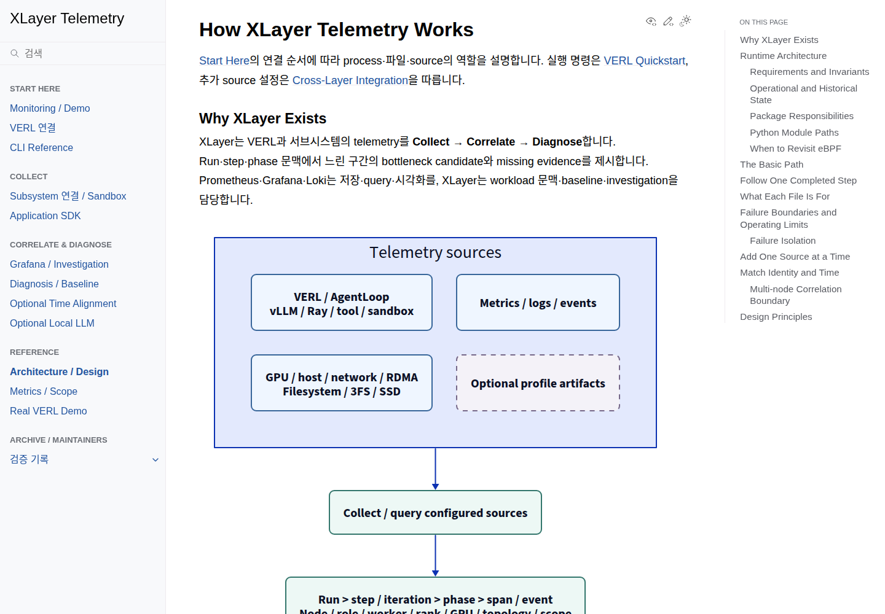
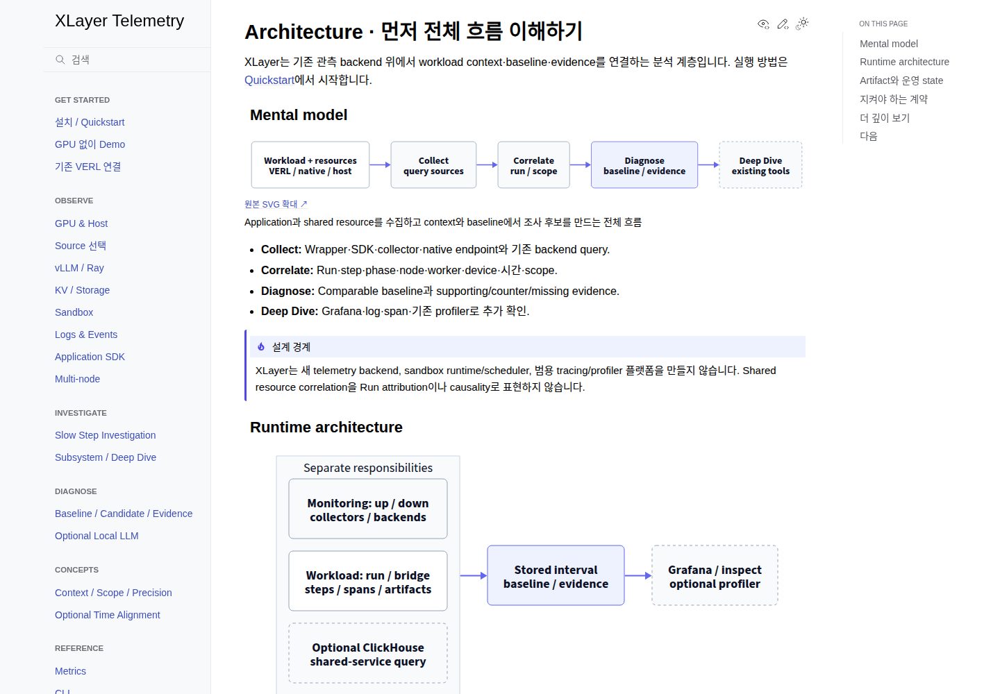
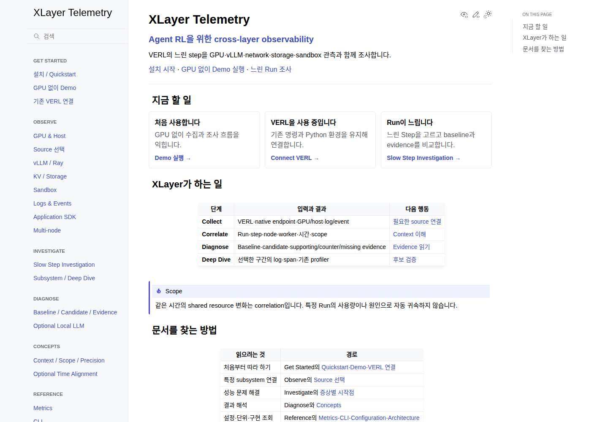

# Documentation UX Review

2026-10-07 기준 `docs/*`, 루트 README와 실제 GitHub Pages 홈을 확인했습니다. 기존 dashboard 개선 commit을 보존하고 문서·D2·검증 도구만 변경합니다.

## 참고한 패턴

| 참고 | 적용 | 제외 |
| --- | --- | --- |
| [토스페이먼츠 시작하기](https://docs.tosspayments.com/guides/v2/get-started) | 작업별 진입점·짧은 행동 안내 | Branding·문구·결제 전용 모델 |
| [Kubernetes 한국어 문서](https://kubernetes.io/ko/docs/home/) | Tutorial·Task·Concept·Reference 역할 분리 | 기계적으로 모든 topic을 별도 파일로 나누기 |
| [NAVER Cloud guide](https://guide.ncloud-docs.com/docs/server-start-vpc) | 목적별 hierarchy·다음 단계 | 운영 detail을 초보자 첫 페이지에 전부 노출 |
| [Microsoft Learn](https://learn.microsoft.com/ko-kr/training/modules/intro-to-kubernetes/) | 준비 조건·절차·정상 결과·다음 guide | 학습 계정·평가·무거운 frontend |

## 바뀐 구조

| 영역 | 독자가 할 일 |
| --- | --- |
| Get Started | 설치 → Demo 또는 기존 VERL 연결 |
| Observe | 질문에 필요한 source를 연결하고 실제 값을 확인 |
| Investigate | 느린 step → What changed? → Evidence → Timeline |
| Diagnose | Comparable baseline·candidate·supporting/counter/missing 해석 |
| Concepts | Context·scope·precision·missing과 zero 구분 |
| Reference | Metric·CLI·configuration·architecture 계약 조회 |
| Maintainers | 운영·구현 detail, 검증·실측·디자인 기록 |

기존 긴 guide의 상세 내용은 `*-reference.md`에 보존했습니다. 기존 root URL의 section anchor는 새 guide나 해당 reference로 이어지며, SVG source·title·description·확대 동작도 유지합니다.

## Visual system

- Furo + MyST 유지; CSS card·표 scroll·기존 anchor 이동만 가벼운 JS로 보완.
- 본문 16px, sidebar/TOC 14px, table 14px, code 13px, H1/H2/H3 29/22/18px.
- Thin neutral border·white/light-gray background·blue/indigo accent.
- D2 node 18px, compact label·gap·padding; Small/Medium/Large preview와 클릭 가능한 그림.
- Scope·precision·missing 등 판단을 바꾸는 제약은 task 본문 가까이에 callout으로 유지.

## 검증 방법과 한계

변경 전/후 build를 실제 browser에서 1440px·1280px·narrow viewport로 비교합니다. Demo·VERL wrapper·Slow Step 조사 경로의 명령은 전용 config·port·state와 새 checkout에서 검증합니다.

실제 GPU/VERL 학습을 새로 실행하지 않은 결과는 synthetic 또는 VERL-compatible logger smoke로 구분합니다. 과거 실환경 기록과 제한 사항은 기존 [Validation](validation/README.md)와 [Real VERL Demo](real-verl-demo.md)에 보존합니다.

## 남은 작업

Version별 native metric 이름·private VERL lab recipe·대형 exporter catalogue는 배포별 확인이 필요합니다. Architecture detail과 운영 reference는 정보 보존을 위해 길게 남으며, 실제 운영 질문을 기준으로 후속 분리를 검토합니다.

## 실제 결과

- Fresh checkout의 CLI 설치·config·Demo → 실제 Grafana 확인.
- Public wrapper의 synthetic VERL-compatible logger → 완료 step 1/2/3·snapshot·complete 확인.
- Slow step → baseline·candidate·evidence → Timeline → storage의 context 왕복 확인.
- 문서/CLI/wrapper regression 83개, browser regression 9개 통과; 35개 문서를 6개 viewport에서 검사.
- Strict Sphinx build warning 0, pinned D2 25개 재생성 일치.
- 기존 7개 주요 guide의 code block 73개를 상세 Reference에 보존.

[전체 검증 기록](validation/documentation-ux-20261007.json)을 참고합니다. Root `REAMDE.md`는 없으며 기존 `README.md`와 그 공용 D2/SVG를 개선했습니다.

