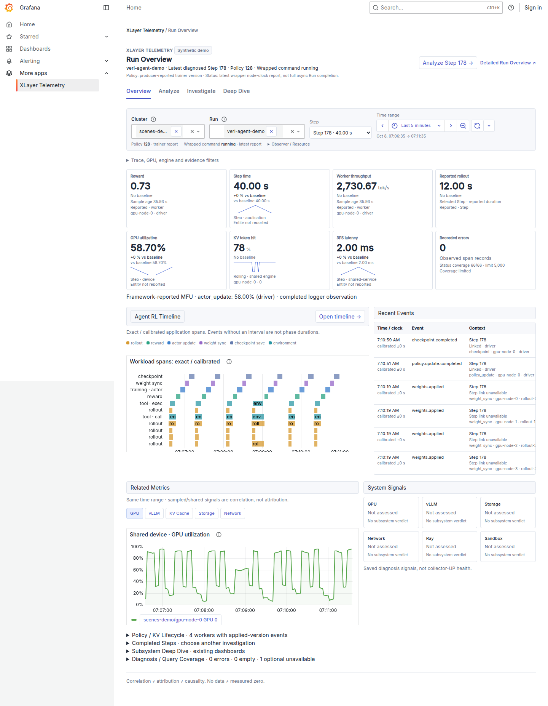
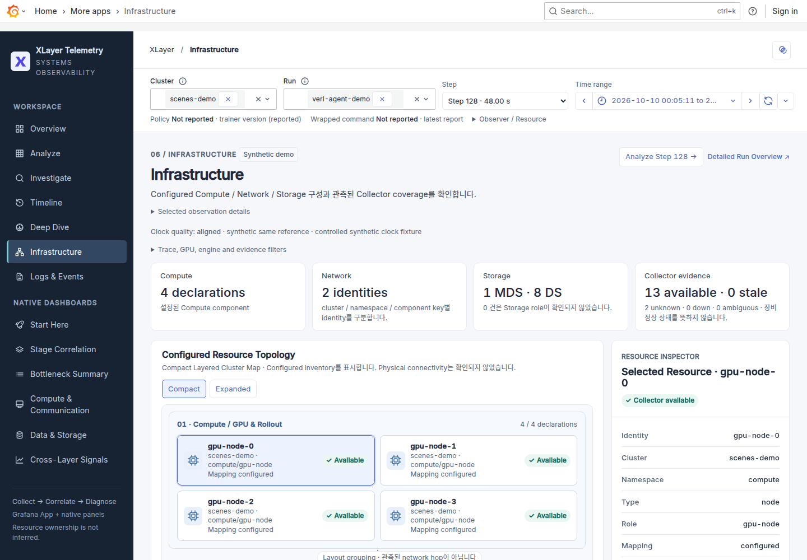

# XLayer Telemetry Dashboard

**목표:** XLayer App에서 Run을 선택하고 느린 Step의 baseline·candidate·evidence를 기존 dashboard까지 이어서 조사합니다.

## 얻는 것

| 화면 | 확인할 것 |
| --- | --- |
| Overview | Run context·핵심 KPI·Agent RL Timeline·최근 event |
| Analyze | Phase × Subsystem·System Pressure·worker 차이 |
| Investigate | Current / Baseline / Delta·candidate·supporting/counter/missing evidence |
| Timeline | Measured span·approximate Step·관련 resource metric |
| Deep Dive | 선택한 candidate의 상세 metric·기존 subsystem dashboard |
| Infrastructure | Configured GPU/Network/Storage topology·resource selection·collector evidence |
| Logs & Events | 기존 node-local log query·recorded events; application Run과 log filter 구분 |
| Runs | 현재 관측·저장 artifact 검색, comparison 조건과 공유 링크 |

공식 UI는 하나의 **XLayer Telemetry Dashboard**입니다. UI 버전 전환은 제공하지 않으며 기존 `/overview`, `/analyze`, `/investigate`, `/deep-dive`, `/timeline` URL과 canonical Grafana dashboard UID를 유지합니다. Package/API 버전과 Sandbox 지원 범위의 V1 표기는 UI 버전이 아닙니다.

```{admonition} 선택 사항
:class: note

App은 선택적 PoC입니다. 기존 dashboard를 유지하며 `xltel up`이 plugin을 자동 설치하지 않습니다. 검증한 조합은 Grafana OSS 12.1.0·Scenes 6.20.0입니다.
```

## 준비 조건

- [Monitoring server](monitoring.md)와 기존 XLayer dashboard.
- Prebuilt ZIP/SHA256 또는 checkout + Node 20 이상·npm. Python core runtime에는 npm이 필요하지 않습니다.
- Step·span·candidate를 보려면 [Loki](logs-events.md)와 [diagnosis](diagnosis.md). Metrics만 연결한 경우 이 영역은 unavailable로 표시됩니다.
- Plugin을 설치할 Grafana의 설정·plugin directory 접근 권한.

## Infrastructure에서 조사하기

1. **Infrastructure**에서 GPU node 또는 Storage DS/MDS를 선택합니다. Dashed edge는 Configured이며 실제 연결을 검증한 선이 아닙니다.
2. **Node / device**에서 GPU·NIC·SSD를 선택합니다. `resource_node`와 GPU/interface/device가 명시된 경우에만 resource filter를 설정합니다.
3. 기존 CPU/memory/GPU/network/RDMA/diskstats panel을 읽습니다. Node-wide 값과 device 값을 구분하며 Run 사용량으로 해석하지 않습니다.
4. **Full resource metrics**로 기존 Compute/Storage dashboard에 이동하거나 **Deep Dive**로 조사합니다. Run·Step·observer·worker·time은 유지합니다.
5. **Investigate selected Step**으로 baseline/evidence에 돌아갑니다. Resource 선택은 특정 Step의 실제 사용 자원을 증명하지 않습니다.

| 표시 | 의미 |
| --- | --- |
| Configured | Operator가 제공한 component·relationship·resource mapping |
| Collector available | 한 target의 UP와 Node Exporter sample age를 반환받음; node health·GPU 존재·연결 증명 아님 |
| Down / Stale | 선택 interval에서 반환된 scrape/age evidence |
| Unknown / Ambiguous | Mapping 누락·상충·no data·여러 target. Publisher 이름으로 owner를 추정하지 않음 |

기존 topology JSON의 component에 `resource_node`·`gpu`·`interface`·`device`·`storage_system`을 실제 배치에 맞게 명시합니다. Compute/Storage 모두 같은 collector가 gauge로 변환하며 새 exporter를 설치하지 않습니다. 문자열 mapping만 보존하고 상충한 mapping은 Unknown입니다. NIC 선택은 기존 network panel의 interface filter를 적용합니다. RDMA·CPU/memory 등 node scope panel은 별도 해석합니다.

Topology 그림은 compact node/fabric view이며 선택한 node의 GPU/NIC/SSD는 **declared resource map**과 inventory에서 탐색합니다. 관측 edge source가 없으므로 connectivity를 Observed/Healthy로 표시하지 않습니다. 3FS의 기존 심층 진단과 pNFS TBD는 유지하고 SMART는 추가하지 않습니다.

## Logs로 이어서 조사하기

**Logs & Events**는 기존 Run Logs·Timeline의 datasource/query를 재사용합니다. Application `Run`은 조사 문맥이며 `Log Run/directory` regex와는 별도입니다. 저장된 log payload의 identity를 확인한 뒤 filter를 좁힙니다. Node를 Storage resource로 선택하면 그 node의 log를 조사하며 다른 node의 application log를 자동 대체하지 않습니다.

Loki가 미설정이면 unavailable을 표시합니다. Empty response, query failure, missing source와 실제 측정값 0을 같은 상태로 취급하지 않습니다. 자세한 log source 설정은 [Logs & Events](logs-events.md)를 따릅니다.

## 1. Configure

기존 `xltel` config를 선택합니다. 격리 개발 Grafana의 unsigned PoC 설치를 한 명령으로 준비합니다.

```bash
xltel app install --allow-unsigned
xltel app status
```

**정상 결과:** 검증한 plugin과 provisioning이 기존 managed 경로에 설치됩니다. CI prebuilt를 우선 사용하며 접근할 수 없으면 private checkout copy에서 build/test합니다. 활성화가 필요하면 `restart_required`, API와 served bundle이 확인되면 `ready`입니다. [External Grafana·signed package·update·rollback](app-deployment-reference.md#설치--상태--update)은 별도 조건을 확인합니다.

## 2. Start

설정한 Grafana를 기존 배포 절차로 재시작하고 **More apps → XLayer Telemetry → Overview**를 엽니다.

Managed restart가 필요하면 `xltel restart --role server`를 사용합니다. 이미 Ready이면 불필요한 재시작 없이 페이지를 새로고침합니다.

**정상 결과:** `/a/xlayer-telemetry-app/overview`에서 상단 Run Context와 Workspace / Native Dashboards sidebar가 보입니다. 좁은 화면에서는 메뉴 버튼으로 navigation을 엽니다. 기존 datasource·auth·dashboard를 계속 사용합니다.

## 3. Verify

| 확인 | 정상 결과 |
| --- | --- |
| Cluster / Run 선택 | 선택한 source의 KPI 또는 명시적인 No data |
| 완료 Step 선택 | URL의 record·observer·시간 구간 변경 |
| Analyze cell 선택 | 값·scope·observation 상태와 evidence 표시 |
| 기존 Storage dashboard 열기 → Back | Run·Step·resource·시간 구간 유지 |
| Light / Dark 전환 | Panel과 card 배색 변경; 선택된 investigation 유지 |
| Infrastructure node / GPU / NIC / SSD 선택 | 선언된 resource identity와 cluster로 metric 조회; Run 소유권을 추정하지 않음 |
| Runs → 두 실험 선택 | Metric별 조건·scope·보류 이유, 원래 Run/record/time으로 이동 |

```{admonition} Scope / Precision
:class: important

Measured span 경계와 sampled resource 관측을 구분합니다. Shared resource의 동시 변화는 correlation이며 Run/phase 사용량이나 원인이 아닙니다. No data·missing evidence를 측정값 `0`으로 읽지 않습니다.
```

## 느린 Step 조사

여러 실험의 탐색·artifact 게시·retention 이후 비교는 [Run Explorer & Comparison](run-comparison.md)을 사용합니다.

1. **Overview:** KPI의 baseline 변화와 Timeline을 보고 완료 Step을 선택합니다.
2. **Analyze:** Phase × Subsystem에서 숫자·상태를 확인합니다. 여러 rollout worker가 겹치면 **Worker Comparison**에서 cohort를 확인하고 **Execution worker**를 선택합니다. 의심 cell에서 evidence를 엽니다.
3. **Investigate:** What changed와 supporting/counter/missing evidence를 비교합니다.
4. **Deep Dive →:** 선택한 candidate와 같은 context에서 상세 metric을 확인합니다.
5. **Full Storage / Timeline / Logs:** 기존 dashboard로 이동합니다. Browser Back으로 App에 돌아옵니다.

Gauge의 phase delta는 명시된 baseline span·workload fingerprint·동일 entity·query 관측 수가 맞을 때만 표시합니다. `Step evidence`의 delta는 선택한 전체 Step 구간의 비교이며 phase cell로 복사하지 않습니다. [Cell 상태 해석](grafana-scenes-reference.md#phase--subsystem)을 함께 확인합니다.

## GPU 없이 확인

기존 stack과 분리한 live demo를 사용할 수 있습니다. 프로젝트를 설치한 Python 환경과 다음 binary가 필요합니다.

- `--tools` directory: `grafana-v12.1.0/`·`prometheus-3.5.0.linux-amd64/`·`loki-linux-amd64`.
- 위 절차로 빌드한 App. 첫 baseline/current 비교는 실제 scrape를 기다려 약 90초 뒤에 보입니다.
- 비어 있는 output 경로와 사용하지 않는 loopback port.

```bash
python grafana/xlayer-app/scripts/live_demo.py \
  --tools /path/to/existing-demo-tools \
  --output artifacts/scenes-demo \
  --grafana-port 23400
```

**정상 결과:** `LIVE DEMO http://127.0.0.1:23400/a/xlayer-telemetry-app/overview?...`가 출력됩니다. `Cluster=scenes-demo`·`Run=verl-agent-demo`를 선택하면 **Synthetic demo** badge가 보이고 완료된 baseline/current pair가 차례로 추가됩니다. 실행 중인 Step을 완료된 값으로 표시하지 않습니다.

```{admonition} Synthetic data
:class: note

Live exporter와 저장된 Current/Baseline diagnosis는 별도 fixture입니다. 이 demo는 화면·query·context를 확인하는 경로이며 실제 VERL 성능이나 diagnosis 정확도 실험이 아닙니다.
```

`Ctrl-C`는 demo가 만든 process만 종료합니다. Fixture·log·state는 output에 남으며, process 종료를 확인한 뒤 이번 demo directory만 정리합니다.

멀티worker fixture가 필요하면 위 명령에 `--multi-worker`를 추가합니다. **정상 결과:** 네 worker의 명시 rollout span과 `weights.applied` event가 보입니다. Regression pair에는 같은 fingerprint의 느린 worker 하나가 있으며, 선택 전 phase는 ambiguous로 유지됩니다. GPU 값은 연결된 device의 sampled 관측입니다. 이 fixture는 명시적인 공통 injected clock/reference를 사용하며 물리 node의 calibration 검증이 아닙니다.

## Troubleshooting

| 상태 | 확인할 것 |
| --- | --- |
| App not found | Plugin directory·Grafana 로그·enabled provisioning |
| Dashboard not provisioned | 기존 XLayer dashboard 설치 여부 |
| Query failed | 원본 dashboard의 query·datasource health·권한 |
| No completed Step | Run/time filter·Loki step history |
| N/A / Rolling context | [Matrix의 observation 조건](grafana-scenes-reference.md#phase--subsystem) |
| MFU / Policy / Status 누락 | [Producer·freshness·identity](ui-telemetry-coverage.md) |
| Multiple entities / Freshness unknown | Worker를 명시적으로 선택하고 producer·age source 확인. 임의 평균이나 최신 entity로 대체하지 않음 |
| Sparkline 없음 | 같은 entity의 실제 history가 두 관측 이상인지 |
| Candidate workspace 비어 있음 | Investigate에서 candidate를 선택했는지 |

## 다음

[Baseline / Evidence](diagnosis.md) · [UI telemetry 연결](ui-telemetry-coverage.md) · [App Reference](grafana-scenes-reference.md) · [배포 / Browser CI](app-deployment-reference.md) · [실제 화면·검증 기록](validation/grafana-scenes-20261008.md)

:::{container} xlayer-legacy-links

<a id="먼저-확인한-현재-구조" class="xlayer-legacy-anchor"></a>

[먼저 확인한 현재 구조](grafana-scenes-reference.md)

<a id="architecture" class="xlayer-legacy-anchor"></a>

[Architecture](grafana-scenes-reference.md)

<a id="화면과-다음-행동" class="xlayer-legacy-anchor"></a>

[화면과 다음 행동](grafana-scenes-reference.md)

<a id="mockup-채택-기준" class="xlayer-legacy-anchor"></a>

[Mockup 채택 기준](validation/grafana-scenes-20261008.md#validation)

<a id="현재-가능한-것과-추가-계측이-필요한-것" class="xlayer-legacy-anchor"></a>

[현재 가능한 것과 추가 계측이 필요한 것](validation/grafana-scenes-20261008.md#validation)

<a id="mfu--policy--status의-실제-지원-범위" class="xlayer-legacy-anchor"></a>

[MFU / Policy / Status의 실제 지원 범위](ui-telemetry-coverage.md)

<a id="phase--subsystem의-해석" class="xlayer-legacy-anchor"></a>

[Phase × Subsystem의 해석](grafana-scenes-reference.md)

<a id="작게-구현한-순서" class="xlayer-legacy-anchor"></a>

[작게 구현한 순서](validation/grafana-scenes-20261008.md#validation)

<a id="validation" class="xlayer-legacy-anchor"></a>

[Validation](validation/grafana-scenes-20261008.md#validation)

<a id="실제-화면" class="xlayer-legacy-anchor"></a>

[실제 화면](validation/grafana-scenes-20261008.md#실제-화면)

<a id="dashboard와-scenes-비교" class="xlayer-legacy-anchor"></a>

[Dashboard와 Scenes 비교](grafana-scenes-reference.md)

<a id="남은-과제" class="xlayer-legacy-anchor"></a>

[남은 과제](grafana-scenes-reference.md)

<a id="references" class="xlayer-legacy-anchor"></a>

[References](grafana-scenes-reference.md)

<a id="mockup" class="xlayer-legacy-anchor"></a>

[Mockup 디자인 결정](validation/grafana-scenes-20261008.md#디자인-결정)

<a id="mfu-policy-status" class="xlayer-legacy-anchor"></a>

[MFU / Policy / Status](ui-telemetry-coverage.md)

<a id="phase-subsystem" class="xlayer-legacy-anchor"></a>

[Phase × Subsystem](grafana-scenes-reference.md#phase--subsystem)

<a id="dashboard-scenes" class="xlayer-legacy-anchor"></a>

[Dashboard와 Scenes 비교](grafana-scenes-reference.md#dashboard와-scenes-비교)

:::

## 공통 디자인과 상세 화면

Workspace에는 Overview·Analyze·Investigate·Timeline·Deep Dive·Infrastructure·Logs & Events가 있습니다. Native Dashboards에는 Start Here·Stage Correlation·Bottleneck Summary·Compute & Communication·Data & Storage·Cross-Layer Signals가 있으며 기존 canonical panel을 그대로 사용합니다.

- 상단 filter: Cluster·Run·완료 Step·Grafana time/refresh picker. Observer·resource와 상세 native filter는 펼쳐서 선택합니다.
- Light/Dark: 헤더의 theme 버튼. URL의 `theme`과 기존 context를 함께 유지하며 Grafana panel에도 같은 배색을 적용합니다.
- Infrastructure: B2 Compact Layered Cluster Map. Compute 2열·Network identity·Storage MDS/DS를 구분하고 Compact / Expanded에서 실제 inventory를 선택합니다. 계층 연결 표시는 배치용 구분이며 실제 선언 edge와 미확인 endpoint는 Relationship Ledger에서 확인합니다.
- 상세 native row: 필요한 그룹만 펼칩니다. 숨겨진 source를 조회하지 않은 상태를 정상 또는 측정값 `0`으로 해석하지 않습니다.





화면별 비교와 남은 차이는 [UX Review](grafana-ui-ux-review.md), source·window·scope 계약은 [App Reference](grafana-scenes-reference.md)에서 확인합니다.
