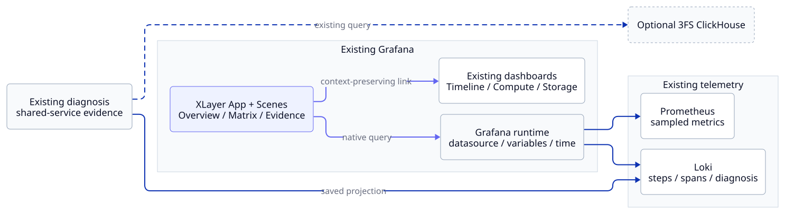

# Grafana App Reference

**찾아보는 목적:** App의 query 재사용·URL context·observation 조건과 운영 한계를 확인합니다. 설치·조사 절차는 [App guide](grafana-scenes-poc.md)를 따릅니다.

## Architecture



- `AppPlugin`이 sidebar에 XLayer 진입점 하나를 등록합니다. 화면 간 이동은 context를 유지하는 App navigation에서 제공합니다. Static sidebar 링크에 query state를 기대하지 않습니다.
- `SceneApp` / `SceneAppPage`가 routing과 URL state를 관리합니다.
- 왼쪽 Run Context에 `EmbeddedScene`의 native variable·time picker·refresh picker를 배치합니다. Step 선택은 저장된 완료 record와 실제 window를 선택하는 XLayer component입니다.
- `SceneQueryRunner`는 provisioned panel의 targets·datasource를 읽습니다. 별도 Prometheus/Loki client는 없습니다.
- `VizPanel` / `SceneDataTransformer`는 기존 timeline과 관련 graph를 렌더링합니다.
- XLayer component는 KPI·Matrix·comparison·candidate·evidence·navigation만 담당합니다.

Query contract는 dashboard에 한 번만 정의합니다. App에는 panel ID/ref ID를 선택하는 얇은 catalogue만 있으며, datasource remapping 이후의 JSON을 읽습니다.

## Query / Context

| 기존 자산 | 재사용 방식 |
| --- | --- |
| `examples/dashboards/*.json` | Query·단위·scope·transform의 수정 원본 |
| `provision_dashboards.py` / `dashboard_views.py` | 활성 datasource와 Loki 여부를 반영한 실제 dashboard를 API로 읽음 |
| Guided / Overview / Focus | 최신 구조는 **Run Overview + Cross-Layer Signals**. Retired Focus를 복구하지 않음 |
| Run / observer / resource | `run_id`·`source_node`·`node`를 구분. Step은 `record_id`와 실제 window로 선택 |
| Bottleneck Summary | Summary / comparison / candidate / evidence JSONL을 그대로 소비 |
| Cross-Layer Timeline | Exact/calibrated span lane와 approximate Step lane의 native panel·transform 재사용 |
| Stage / Compute / Storage / Logs | Deep Dive 링크. 상세 graph를 App 안에 전부 복제하지 않음 |
| 3FS / ClickHouse | 기존 diagnosis가 조회한 shared-service evidence. App의 직접 ClickHouse query는 없음 |

- Run은 `run_id`, 관측한 node는 `source_node`, resource node는 `node`로 구분합니다.
- 완료 Step은 `record_id`와 저장된 실제 window로 선택합니다.
- `candidate_id`는 Deep Dive workspace에 보존합니다. 다른 Step을 선택하면 기존 candidate 선택을 지웁니다.
- Static Grafana sidebar 링크보다 context를 전달하는 App navigation을 사용합니다.

### 명시 workload context

| Run Overview panel | Source |
| --- | --- |
| 40 · MFU | `training_model_flops_utilization_ratio` · framework-reported stage |
| 41 · Policy | 같은 Run의 단일 fresh `policy_version` source 또는 선택 record의 명시 version |
| 42 · Wrapped command | Fresh `telemetry_wrapped_workload_state`와 wrapper 보고 시각 |
| 44 · Worker Step | 집계하지 않은 worker별 completed Step identity |

## Phase × Subsystem

| Cell 상태 | 값의 근거 | 표시하지 않는 것 |
| --- | --- | --- |
| Sampled 숫자 | 같은 Run·Step의 유일한 exact/calibrated span, 같은 resource node, window 안의 query evaluation | Phase 사용량·causal attribution |
| Select entity | 같은 node에서 여러 GPU/engine을 관측 | 임의 average/max로 만든 phase 값 |
| Rolling context | Rate/histogram의 lookback이 짧은 phase 밖까지 포함 | Phase-specific p95/p99·hit ratio·bandwidth |
| N/A | Phase interval 없음 또는 불명확 | 보고된 stage duration으로 만든 가짜 boundary |
| Step evidence | 저장 diagnosis의 full-Step window | Phase delta / phase baseline |
| Ray context | Canonical task aggregation이 node identity를 보존하지 않음 | Session 값을 worker/phase에 귀속 |
| MFU 별도 관측 | Framework가 보고한 completed stage scalar | GPU utilization으로 추정하거나 sampled resource cell에 합친 MFU |

```{admonition} Precision / Scope
:class: important

Exact는 application span 경계의 속성입니다. Resource metric은 sampled이며 query evaluation 시각과 원본 scrape 시각이 같다고 보장하지 않습니다. Exact node-clock span의 cross-clock calibration은 미확인일 수 있습니다. Calibrated uncertainty가 없거나 phase보다 큰 경우 숫자를 연결하지 않습니다. Correlation ≠ attribution ≠ causality.
```

Phase baseline을 새로 계산하지 않습니다. Step Current/Baseline은 저장 projection의 entity·window·scope와 함께 표시하며 workload comparability가 `unverified`이면 그대로 드러냅니다. Baseline `0`에서 relative delta가 없다는 것은 baseline 자체가 없다는 뜻이 아닙니다.

## KPI / Evidence

| 표시 | 읽는 방법 |
| --- | --- |
| KPI sparkline | 같은 Run/scope/entity의 실제 history가 두 관측 이상일 때만 표시 |
| Current / Baseline / Delta | 기존 diagnosis projection의 unit·entity·window·comparability를 유지 |
| System Signals | 저장된 candidate 상태. Collector UP 기반 health 판정이 아님 |
| System Pressure | 선택 범위의 sampled signal. Candidate의 원인 판정과 구분 |
| Recorded errors | 조회한 span의 status coverage·count·5,000 record limit. 전체 workload error rate가 아님 |
| Detailed Metrics | Canonical native panel. Local I/O mean·KV RPC p95와 3FS service p99를 구분 |

MFU·policy version·wrapper 상태의 producer와 missing 조건은 [UI Telemetry Reference](ui-telemetry-coverage.md)에서 관리합니다. Trainer version을 rollout applied version으로, wrapper command 상태를 전체 async Run 완료로 바꾸지 않습니다.

## Dashboard와 Scenes 비교

| 기준 | 기존 Dashboard | Scenes PoC |
| --- | --- | --- |
| 상세 metric·Inspect·Explore | 이미 구현됨 | 재사용 |
| Query 유지보수 | Canonical JSON/provisioning | 같은 JSON을 runtime에서 읽음 |
| Run 조사 진입 | Dashboard별 링크 | App navigation 한곳 |
| Scope 조건부 표시 | Text/table 제한 | 숫자/NA/rolling/Step evidence를 조건부 표시 |
| Phase × System | 일반 panel/table 조합 | Entity/window gate가 있는 custom component |
| 운영 비용 | 기존 monitoring stack | 선택적 static plugin bundle + 개발용 npm toolchain |
| 호환성 비용 | Grafana JSON contract | Grafana/Scenes/React Router API·plugin signing 추가 |

**판단:** 네 개의 summary/investigation 화면과 custom Matrix·evidence workspace는 Scenes로 구현하고 검증했습니다. Phase별 comparable baseline·resource identity·raw scrape timestamp·clock coverage는 별도 telemetry 과제이며 standalone frontend 도입 근거는 확인되지 않았습니다.

## 운영 한계

- 실제 GPU/VERL·multi-worker span·3FS ClickHouse의 App journey는 추가 검증이 필요합니다.
- 운영 배포에는 plugin signing과 배포 artifact가 필요합니다. Dev unsigned allowlist는 격리 개발 환경에만 사용합니다.
- Panel ID/ref contract는 CI에서 확인합니다. Catalogue cache는 browser reload 시 갱신됩니다.
- Phase별 token histogram/baseline과 calibrated sample coverage는 추가 계측이 필요합니다.
- Exact node-clock sample matching은 correlation preview입니다. Raw timestamp·clock certainty를 추가 확인해야 합니다.
- 검증한 Grafana 버전 외의 호환성과 provisioning/auth 실패 경로는 추가 검증이 필요합니다.

Source 연결·N/A의 의미는 [UI Telemetry Coverage](ui-telemetry-coverage.md), behavior signature·triggered profiling과 논문 비교는 [Research PoC](behavior-signature-research.md)에서 관리합니다. Research API는 이 App의 기본 diagnosis 경로에 자동 연결하지 않습니다.

## 관련 문서

[App guide](grafana-scenes-poc.md) · [Metrics contract](metrics-reference.md) · [2026-10-08 검증 기록](validation/grafana-scenes-20261008.md)

## References

- [Grafana Scenes app / URL-state caching](https://grafana.com/developers/scenes/scene-app): native routing과 context 보존 패턴.
- [Custom scene objects](https://grafana.com/developers/scenes/advanced-custom-scene-objects): XLayer component를 Scene lifecycle에 연결.
- [Scene transformations](https://grafana.com/developers/scenes/transformations): 기존 panel transform 재사용.
- [Scenes 6 Router migration](https://github.com/grafana/scenes/releases/tag/v6.0.0): Router bundle과 host history 연결 근거.
- [Datadog dashboard UX 검토](grafana-ui-ux-review.md): Light hierarchy·절제한 색·context drill-down을 채택. Branding·가짜 service map·phase attribution은 채택하지 않음.
