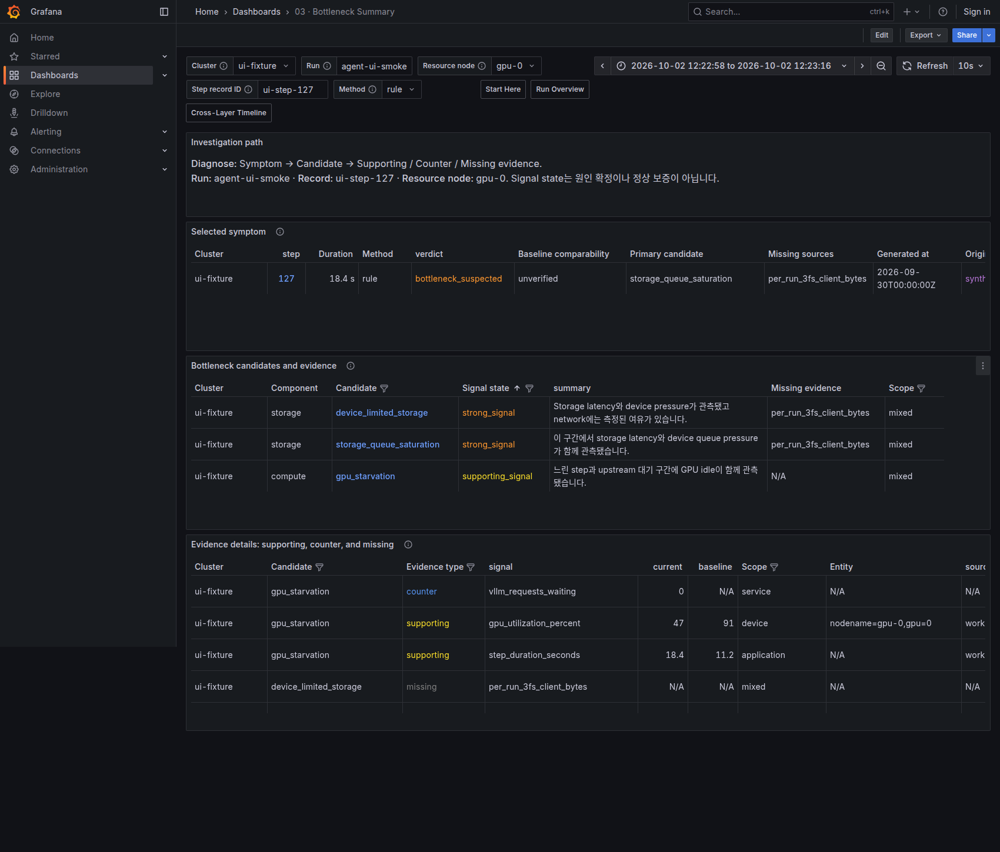
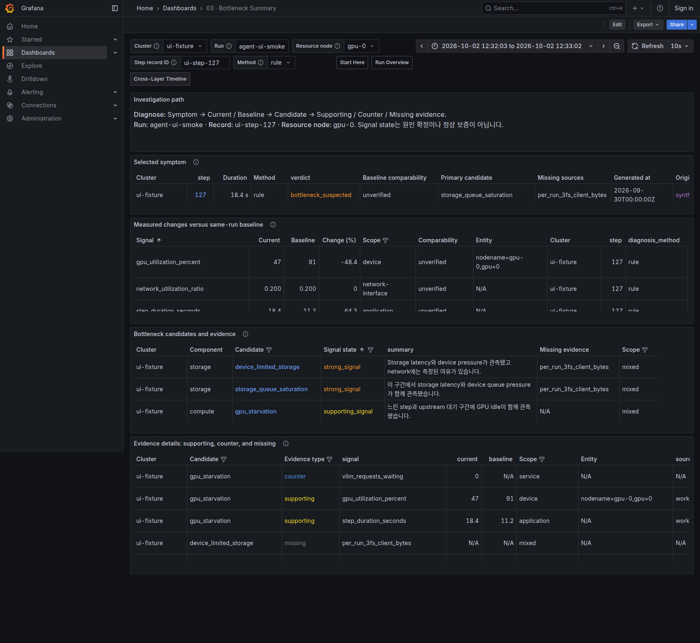

# Grafana Investigation UX Review

## Scope and decision

2026-10-02 기준 dashboard JSON, provisioning, Loki projection, links와 regression test를 검토했습니다.
기존 8개 dashboard와 UID를 유지하고, 선택한 step의 비교와 evidence를 찾는 경로를 개선합니다.
Metric producer·label·backend는 변경하지 않습니다.
Baseline table을 기본 노출하므로 Summary 진입 시 기존 comparison query 한 개가 추가로 실행됩니다.
선택한 run·record·time 범위와 기존 5,000행 limit은 유지합니다.

## Current dashboard audit

| Dashboard / primary question | Current panels and strengths | Gap / proposed improvement | Priority |
| --- | --- | --- | --- |
| Start Here / 수집되고 있는가? | Availability, sample age, observed runs. Missing을 healthy로 만들지 않음 | 다음 행동 안내와 context 유지. 실제 browser에서 강조와 링크가 정상 렌더링됨 | 유지 |
| Run Overview / 어떤 step이 느린가? | Duration trend, 완료 step 표, 단일 클릭 drill-down | Trend 높이를 줄여 step 목록을 먼저 발견하도록 조정 | P1 |
| Agent RL Stage Correlation / 어느 stage인가? | Stage·vLLM·sandbox, 별도 sandbox node selector | 기존 optional row와 engine 선택 유지. 추가 panel 불필요 | 유지 |
| Bottleneck Summary / 무엇을 비교하고 왜 의심하는가? | Symptom, candidates, supporting/counter/missing, baseline | Baseline이 마지막 접힌 row에 숨음. Current/Baseline/Delta를 기본 화면으로 이동 | P0 |
| Cross-Layer Timeline / 같은 구간에 무엇이 변했는가? | Selected step, exact spans, approximate step, sampled resources, clock quality | 기존 boundary와 completion annotation 유지. 새 정밀 phase trace를 만들지 않음 | 유지 |
| Compute & Communication / GPU와 통신 중 어디인가? | GPU matrix, utilization, power, memory, TCP/RDMA, allocation | Temperature/clock보다 memory와 communication을 먼저 배치 | P1 |
| Data & Storage / 어느 storage scope인가? | Local block device, filesystem, topology, optional SMART | Local device와 filesystem의 차이를 유지. 3FS service는 기존 diagnosis evidence에서 조사 | 유지 |
| Run Logs / 해당 구간에 어떤 기록이 있는가? | 실제 Loki schema에 맞는 workload/log-directory filter | Telemetry run과 log-directory 구분 유지. 존재하지 않는 level/stage/pattern 필터를 추가하지 않음 | 유지 |

Dashboard 간 context는 이미 explicit data link로 전달됩니다.
특히 observer node와 resource node를 분리하고, completed-step 행의 cluster·record·window를 사용하는 구조는 유지할 가치가 있습니다.
반면 baseline으로 이동하면서 current trace filter까지 전달하면 이전 step의 다른 trace가 숨겨질 수 있으므로 baseline link에서만 trace 선택을 초기화합니다.

## References and selected patterns

아래 공식 문서의 interaction을 조사했습니다.
Grafana Cloud의 전용 backend나 최신 preview 기능은 현재 Grafana 12.1.0 deployment에 추가하지 않습니다.

| Reference | Apply to XLayer | Not adopted |
| --- | --- | --- |
| [Application Observability Service Overview](https://grafana.com/docs/grafana-cloud/observe-and-act/monitor-applications/application-observability/manual/service/) | 같은 context에서 summary → related detail, 시간 비교를 기본 조사 경로로 배치 | Cloud service model이나 RED metric을 training metric으로 대체하지 않음 |
| [Metrics Drilldown](https://grafana.com/docs/grafana/latest/visualizations/simplified-exploration/metrics/drill-down-metrics/) | Summary에서 signal별 detail과 native Explore로 이동 | 별도 queryless app dependency |
| [Logs patterns](https://grafana.com/docs/grafana/latest/visualizations/simplified-exploration/logs/patterns/) / [Traces filtering](https://grafana.com/docs/grafana/latest/visualizations/simplified-exploration/traces/investigate/add-filters/) | 실제 제공되는 field만 filtering. Supporting/counter/missing을 표에서 구분 | Pattern ingester나 Tempo가 없는 상태에서 pattern/trace UI를 가장하지 않음 |
| [Kubernetes navigation](https://grafana.com/docs/grafana-cloud/observe-and-act/monitor-infrastructure/kubernetes-monitoring/navigate-k8s-monitoring/) | Run → step → resource로 scope를 좁히되 observer와 resource를 보존 | Kubernetes dependency, 고정 node topology |
| [Profiles views](https://grafana.com/docs/grafana/latest/visualizations/simplified-exploration/profiles/choose-a-view/) | Current와 baseline을 나란히 비교하고 각각의 interval로 이동 | Profile 없이 flame graph/diff 생성 |
| [Scenes App](https://grafana.com/developers/scenes/scene-app) / [URL sync](https://grafana.com/developers/scenes/url-sync) | Tabs·breadcrumb·URL state 관리의 설계 참고 | 이번에는 App Plugin/TypeScript build와 배포 추가 없음 |
| [Canvas](https://grafana.com/docs/grafana/latest/visualizations/panels-visualizations/visualizations/canvas/) | 실제 component/edge evidence와 연결되는 경우 향후 검토 | Static 장식 topology, 검증되지 않은 traffic attribution |

## Implementation proposal

1. **P0:** Baseline comparison을 기본 화면에 노출하고 Signal → Current/Baseline 시간 구간 이동을 유지합니다.
   Baseline pivot은 current trace filter를 초기화하고 나머지 workload/resource context를 보존합니다.
2. **P1:** Run Overview의 trend를 줄여 완료 step 선택까지의 scroll을 줄입니다.
   Compute에서는 utilization → memory/worker → communication → temperature/clock 순으로 조사합니다.
3. **유지:** Text panel은 실제 Grafana에서 강조와 링크가 정상 렌더링되어 변경하지 않습니다.
   Font 크기·native Grafana UI·Korean 설명을 유지합니다.
4. **P2 / deferred:** Dynamic tabs, conditional layouts, topology Canvas는 실제 탐색 문제가 남을 때 재검토합니다.
   현재 data link와 native table로 해결할 수 있어 Scenes prototype은 추가하지 않습니다.

## Remaining scope

Device·Mount·SSD와 Stage의 worker/role은 해당 detail 화면의 filter이며 모든 화면에 전달하지 않습니다.
좁은 화면의 evidence table은 내부 가로 scroll과 panel View가 필요합니다.
Log pattern grouping, duration heatmap, profile diff는 현재 signal schema와 backend가 제공할 때만 추가할 수 있습니다.

## Correctness and validation contract

Comparison은 동일 단위 signal끼리 읽으며 delta는 causal proof가 아닙니다.
Missing source·미검증 workload comparability·sample quality를 숨기거나 confidence 점수로 치환하지 않습니다.
정확한 span, approximate step boundary, sampled resource를 계속 구분합니다.

변경 전후 synthetic fixture를 실제 Grafana/Prometheus/Loki에서 실행해 provisioning·query·row click·context round trip을 확인합니다.
Loki 없는 provisioning, UID·grid·link regression은 기존 test로 검증하며 실제 browser에서 좁은 viewport와 no-data 상태도 확인합니다.
실제 Agent RL 성능이나 물리 multi-node 정확성을 이 UI 검증으로 주장하지 않습니다.

## Before and after

동일한 synthetic fixture를 변경 전후에 각각 수집한 화면입니다.
시간값은 각 실행 시각이며 실제 학습 성능 결과가 아닙니다.

Before: baseline은 접힌 영역에 있어 candidate와 evidence만 바로 보였습니다.

After: symptom 다음에 Current·Baseline·Change와 scope/comparability가 표시됩니다.
Signal 메뉴에서 두 구간을 따로 열 수 있고, evidence와 상세 resource 화면은 기존 링크를 사용합니다.

[검증 기록](validation/dashboards/ux-20261002.json)은 backend query, browser journey, Loki 미설정 상태와 viewport 검증 범위를 구분합니다.
