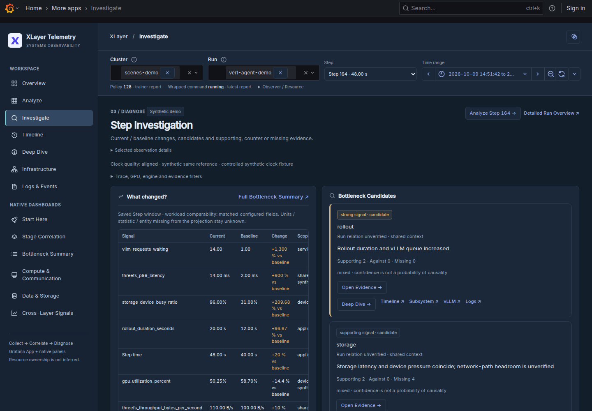

# Grafana Investigation UX Review

**현재 기준:** 하나의 XLayer Telemetry Dashboard에서 7개 Workspace와 6개 Native 화면을 탐색합니다. 기존 datasource·canonical query·진단 모델을 유지하면서 sidebar·Light/Dark·card·table·반응형을 공통 디자인으로 정리했습니다.

## References and design decisions

제공받은 `xlayer_dashboard_design_preview.html`을 주된 시각 기준으로 사용했습니다. 원본은 `grafana/xlayer-app/design/dashboard-preview.html`에 보존하며 plugin bundle과 demo 데이터에는 포함하지 않습니다.

| 적용 | 실제 구현 |
| --- | --- |
| 공통 sidebar | Workspace 7개 + Native Dashboards 6개; 작은 navigation 아이콘 |
| 상단 context | 기존 Grafana variable·time/refresh picker와 완료 Step 선택 |
| Light / Dark | White/light-gray 또는 slate 배경, 얇은 border, muted metadata, blue accent |
| KPI / chart / table | 4열 card, 큰 값, mini trend, compact table와 낮은 fill의 native chart |
| Investigation | Current/Baseline과 candidate card를 나란히 표시; evidence와 Timeline 유지 |
| Infrastructure | Compute / Fabric / Storage 3열 compact card와 곡선 연결; resource 선택과 상세 이동 |

Infrastructure는 최종 요청에 따라 원본 HTML의 compact card·3열 배치·곡선 연결 스타일을 사용합니다. 실제 inventory에 없는 switch·Prefill/Decode·DeepEP·전송 경로는 추가하지 않습니다.

## Problems in the previous UI

공통 navigation과 상세 native 화면의 스타일이 달랐고, filter·policy·status 설명이 여러 곳에서 반복되었습니다. 13개 화면을 비교하면서 native 제목 누락, 작은 콘텐츠 폭에서 time picker가 잘리는 문제, 모바일에서 닫힌 메뉴의 offscreen link가 접근 가능한 문제를 확인했습니다.

Native Dashboard에는 중요한 source panel이 이미 있으므로 별도 metric/query를 만드는 방식은 피했습니다. 원본 row를 펼치면 기존 패널을 읽고, 요약 card는 같은 data provider를 사용합니다.

## Implemented changes

- `SceneAppPage` custom body로 불필요한 제목·상단 여백을 줄였습니다. Grafana global menu·Inspect·Explore·기존 `/d/*` URL은 유지합니다.
- `DashboardChrome.tsx`·`style.css`가 공통 sidebar·간격·배색·반응형을 담당합니다. Theme은 URL에 보존하며 investigation identity를 변경하지 않습니다.
- Native 6개 화면은 provisioned JSON의 모든 non-row panel을 한 번씩 유지합니다. Optional group는 펼칠 때 query를 활성화하고 신규 canonical panel도 catalog에 남습니다.
- 여러 entity·field·query가 반환되는 요약은 **Multiple entities**로 표시합니다. Producer freshness를 별도로 검증하지 않은 경우 그 한계를 표시하고 대표값·총합을 만들지 않습니다.
- Infrastructure는 선언된 resource와 관계만 그립니다. 선언된 endpoint 사이를 곡선으로 연결하며, 미확인 endpoint·device 관계·표시 한도 초과 edge는 Relationship Ledger에 남깁니다.

## Browser validation

원본 HTML과 실제 Grafana를 1440×1000 / 390×844에서 Light/Dark로 비교했습니다. 세 차례 이상 수정·캡처했으며 첫 loop의 모바일 navigation 실패도 기록에 남습니다. 최종 결과는 [검증 기록](validation/dashboard-design-20261010.json)에 있습니다.

| 검증 | 범위 |
| --- | --- |
| 13개 화면 | App link·직접 URL·Back·context·theme·가로 넘침·browser/datasource 오류 |
| Multi-worker | 명시 worker 선택 → Compute → Back, clock·cohort·Run 격리 |
| Infrastructure | Node / GPU / NIC / SSD 선택 → 기존 Storage → Back → Investigate / Deep Dive / Logs |
| Fault injection | Browser datasource 경계의 error/delay·Logs dashboard unavailable; 실제 backend 장애 실험과 구분 |
| 실제 미검증 | 물리 GPU·RDMA·3FS cluster·멀티노드 VERL workload |

## Remaining candidates

| 목업과 남는 차이 | 이유 |
| --- | --- |
| Grafana global header·native picker | 기존 Grafana ecosystem과 접근 경로를 유지 |
| KPI의 값·상태·entity 안내 | 가상 수치 대신 실제 조회 결과; multi-entity·missing·clock 불확실성 보존 |
| Overview의 measured Timeline | 기존 workload span과 investigation 흐름을 유지; 임의 baseline graph를 생성하지 않음 |
| Native chart·legend·Inspect chrome | query/unit/transform/data link와 Grafana renderer를 재사용 |
| 모든 상세 panel을 첫 화면에 표시하지 않음 | 정보 밀도와 초기 query 비용을 제한하고 source row에서 접근 |
| Infrastructure의 node 수·길이 | 목업의 고정 6개 node 대신 실제 선언된 inventory를 표시; 미확인 연결·Run 소유권은 추정하지 않음 |

이전 native Dashboard UX 검증은 [2026-10-07 기록](validation/dashboards/product-ux-20261007.json)에 보존합니다. 현재 구현과 당시 테스트 결과를 같은 지원 범위로 해석하지 않습니다.
