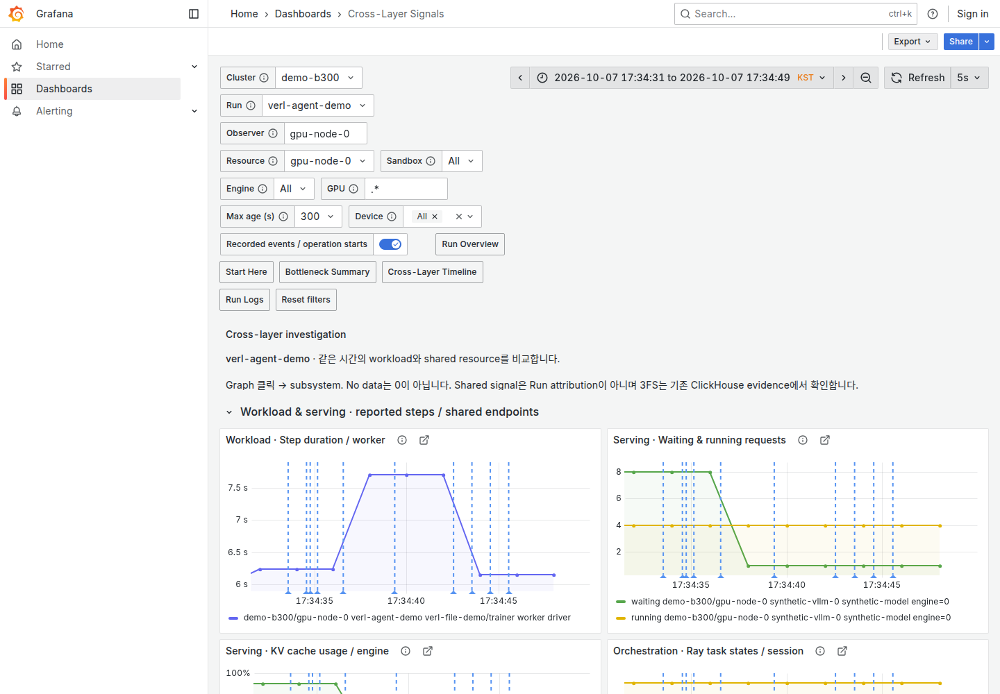

# Grafana Investigation UX Review

2026-10-07 기준 최신 `main` (`7b89986`)에서 격리된 Grafana 12.1.0·Prometheus 3.5.0·Loki·Alloy와 synthetic fixture를 실행해 검토했습니다. 현재 사용법은 [Dashboard Guide](dashboards.md)가 기준이며, 아래 검증은 실제 Agent RL 성능·GPU·3FS cluster의 검증과 구분합니다.

## References and design decisions

Datadog의 공식 문서와 공개 Dashboard·APM·Infrastructure·Service Map 화면을 직접 비교했습니다. 로그인한 Datadog 계정을 조작하지는 않았으며 제품 기능·metric·인과 모델을 XLayer의 데이터 계약으로 가져오지 않았습니다.

| Reference | Adopted in XLayer | Not adopted |
| --- | --- | --- |
| [Datadog Dashboards](https://docs.datadoghq.com/getting_started/dashboards/) | 질문 중심의 section, KPI → timeline → 정렬된 step 목록, Top-N과 context link | 모든 정보를 첫 화면에 넣는 과밀 grid, KPI를 정상 판정으로 치환 |
| [APM Service Page](https://docs.datadoghq.com/tracing/services/service_page/) | Light background·white card·얇은 border, 큰 값과 작은 label, summary에서 evidence·resource로 이동 | HTTP RED·SLO·service health를 학습 Run 상태처럼 표시 |
| [Infrastructure Host List](https://docs.datadoghq.com/infrastructure/list/) | 필요한 열만 먼저 표시하는 표와 entity를 유지한 detail, 기존 GPU matrix·allocation을 활용 | 근거 없는 worker/engine/GPU join이나 낮은 GPU utilization을 자동 anomaly로 표시 |
| [Service Map](https://docs.datadoghq.com/tracing/services/services_map/) | 같은 context에서 관련 subsystem으로 pivot | 설정 topology를 관측된 traffic·dependency로 표시, Trainer → vLLM → 3FS를 확정적으로 연결 |
| [Agent Monitoring](https://docs.datadoghq.com/llm_observability/guide/agent_monitoring/) | 실제 tool·sandbox span과 lifecycle event를 metric 시간축에서 조사 | 존재하지 않는 trace·cost·policy event, 완료 stage duration으로 phase 순서를 합성 |
| [Grafana Application Observability](https://grafana.com/docs/grafana-cloud/observe-and-act/monitor-applications/application-observability/manual/inventory/) | inventory·summary·detail의 역할 분리, 같은 시간과 resource context 유지 | Cloud 전용 backend·knowledge graph·preview 기능 |

Light는 안정된 native theme를 사용합니다. Canvas·Node Graph는 사용 가능한 기능이지만 현재 telemetry에는 Agent RL execution edge·traffic attribution과 phase별 자원 window가 충분하지 않아 이번 변경에 추가하지 않았습니다. 새 frontend·plugin·font dependency도 도입하지 않았습니다.

## Problems in the previous UI

Run 첫 화면의 주요 card는 collector health와 age였고, step 선택은 View·Color·navigation과 큰 설명 아래로 밀렸습니다. Guided·Overview·Focus의 역할이 겹쳤으며 Workspace의 3열 graph와 다중 단위 vLLM panel은 legend·축을 읽기 어려웠습니다.

Timeline과 evidence 표에는 새 내부 metadata가 그대로 노출될 수 있었고, 긴 selector와 반복 link가 특히 좁은 화면의 많은 공간을 차지했습니다. Normal age가 초록색으로 강조되는 반면 candidate·missing evidence의 우선순위는 약했습니다.

## Implemented changes

기본 Home을 **Run Overview**, 기본 배색을 **Light**로 바꿨습니다. Run·cluster·observer/resource context, 완료 snapshot KPI, engine/device scope를 표시한 TTFT·KV·GPU card, 실제 exact/calibrated span timeline과 느린 순서의 완료 step 목록을 배치합니다. GPU card는 가장 높은 fresh device 한 개의 identity를 보존하며 shared value를 Run 사용량으로 표시하지 않습니다.

기존 Overview UID는 **Cross-Layer Signals**가 유지하고 Focus는 펼침 section으로 통합했습니다. Workload/serving과 shared resource를 2열로 분리하고 queue·KV를 서로 다른 graph로 읽으며 local I/O Top 8은 기존 rate window와 node/device label을 유지합니다. 상세 dashboard는 native **Subsystems** 메뉴로 묶었습니다.

Bottleneck Summary는 **What changed?**와 candidate의 설명·missing evidence를 우선합니다. **Review supporting / counter / missing evidence**는 native 전체 화면 panel로 이동하고, Current/Baseline interval과 Timeline·resource 링크는 record·scope·시간을 유지합니다. Unknown unit은 `Unknown`으로 표시하며 원본 metadata·query·sample quality는 Inspect에 남깁니다.

Metric 위에는 EventRecorder가 기록한 event와 span 시작점만 overlay합니다. Unknown timestamp는 제외하고 calibrated uncertainty를 표시하며, span end는 실제 timeline 경계에서 읽습니다. Policy/KV section은 weight-sync duration·policy lag·prefix hit·offload를 같은 시간으로 비교하되 policy version이나 cache reset을 추론하지 않습니다.

흰 card와 native light-gray border, neutral 정상값, indigo·blue graph, stale·candidate의 amber·red를 사용합니다. 설명은 17px, 주요 KPI는 최대 40px로 조정했고 표의 열 제목·행 간격·metadata 노출·tooltip을 정리했습니다. Font family는 native Grafana UI를 유지합니다.

## Browser validation

변경 전 fresh 환경에서 Run → 완료 step → Summary → evidence → Timeline → storage 클릭 흐름을 확인했습니다. 이후 세 번의 개선 loop에서 배치·navigation·Light 대비·내부 metadata를 수정하고 실제 browser로 다시 확인했습니다.

1. **Loop 1:** 수집 중심 card를 workload KPI로 바꾸고 View·Color 중복을 제거했습니다. 실제 native menu와 provisioning 반영을 확인하고 Timeline 표의 내부 metadata를 숨겼습니다.
2. **Loop 2:** Light로 전환해 1440px·900px에서 조사 흐름과 context 왕복을 확인했습니다. Unit·normal-value 대비를 조정하고 사용자가 다음에 선택할 link를 정리했습니다.
3. **Loop 3:** Run에 shared KPI와 실제 span timeline을 통합하고 What changed·evidence 전체 화면·Policy/KV section을 확인했습니다. Step 목록이 아래로 밀린 문제를 고쳐 timeline 바로 뒤에 배치했습니다.

최종 결과와 검증 한계는 [검증 기록](validation/dashboards/product-ux-20261007.json)에 있습니다. Loki 없는 fresh Grafana와 missing Run/engine/device도 별도로 확인하며, No data를 0이나 정상으로 표시하지 않습니다.

## Remaining candidates

**Phase × Subsystem Matrix**는 실제 phase span과 clock uncertainty를 고려한 resource window·entity join이 준비되면 가장 먼저 검토합니다. 현재 완료 stage duration을 phase 구간으로 바꿔 GPU·storage 값을 채우지 않습니다.

**System Map**에는 observed/instrumented·configured·contextual relationship의 provenance가 필요합니다. 설정으로 선언한 GPU/storage topology와 시간 correlation을 실제 traffic edge나 causality로 표시하지 않으며, 기존 topology·allocation evidence에서 조사합니다.

**Policy/KV lifecycle**은 actual policy version과 KV reset/version event가 제공될 때 확장할 수 있습니다. **Evidence drawer**와 좁은 화면의 compact filter는 native fullscreen/Inspect를 넘어서는 필요가 확인되면 검토하며, 현재는 plugin·custom CSS를 추가하지 않습니다.
