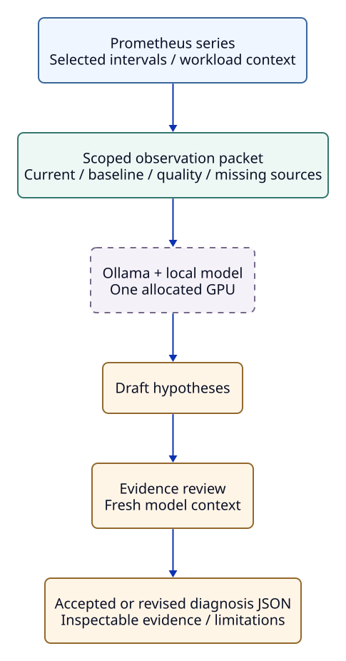

# Local LLM Reference

> **Reference** · 실행 절차는 [Local LLM 연결](local-llm.md)을 따릅니다. 모델 입력·검토·timeout·clock 계약과 검증 기록을 보존합니다.

Local open-weight 모델이 current/baseline·entity·scope를 읽고 bottleneck hypothesis를 만듭니다.
Rule catalog·threshold·기존 판정은 입력하지 않으며 명시적으로 실행하는 experimental 옵션입니다.
설명·검토 사유는 한국어, metric·ID·unit·technical term은 영어로 유지합니다.
후보 제목은 `Possible storage device saturation` 같은 English noun phrase입니다.
`attribution`도 영어로 쓰고 문장을 두 언어로 반복하지 않습니다.



CLI로 선택한 구간을 분석한 뒤 [structured JSON schema](https://docs.ollama.com/capabilities/structured-outputs)·evidence ID·관측 구간을 검사합니다.
없는 ID, 현재 값 없는 evidence, 같은 ID의 supporting/counter 중복과 label로 확인되는 engine·worker·rank 혼합을 거부합니다.
Entity는 cluster·node 및 role·producer까지 구분하되 누락된 label의 동일성은 입증하지 못합니다.

초안은 새 대화 문맥의 evidence review를 거쳐야 하며 실패한 검토를 최종 진단으로 채택하지 않습니다.
검증 통과도 설명의 사실성·인과관계를 보증하지 않습니다.
선택한 step의 검토된 결과는 Grafana에 표시할 수 있고 자동 호출·alert 변경·명령 실행은 하지 않습니다.

Ollama는 모델 다운로드·GPU 적재·structured JSON API를 관리하고 XLayer는 HTTP로 연결합니다.
모델은 전달된 관측값만 분석하며 agent tool을 실행하지 않습니다.

## Install and Start the Optional Model

Helper는 고정된 Ollama release를 `$HOME/telemetry/tools`에 설치하고 공식 release checksum을 대조합니다.
모델 weight는 `$HOME/telemetry/models/ollama`에 저장하며 system service나 VERL Python 환경을 변경하지 않습니다.
Linux, `curl`, `tar`, `zstd`, `sha256sum`, `setsid`, `flock`과 GPU에 맞는 NVIDIA driver가 필요합니다.

```bash
mkdir -p "$HOME/telemetry/config"
cp -n examples/local-llm.conf "$HOME/telemetry/config/local-llm.conf"
```

복사한 파일의 `LLM_GPU`를 진단용 GPU index 또는 UUID로 지정합니다.
`nvidia-smi -L`에서 UUID를 확인할 수 있습니다.
기본 모델 `qwen3.5:27b`는 약 17GB를 다운로드하는 Q4_K_M 모델이며 Apache 2.0 license를 사용합니다.
Weight 크기 외에 context와 실행 buffer도 VRAM을 사용하므로 실제 적재 결과를 확인해야 합니다.
기본 설정은 32K context, 동시 요청 한 개, thinking을 포함한 출력 최대 16,384 token입니다.
모델의 일반 thinking 권장 sampling 값을 사용하되, context와 출력 한도는 이 PoC에 맞게 제한합니다.
이는 긴 context를 사용한 공식 benchmark 조건과 같지 않습니다.
[모델 배포 정보](https://ollama.com/library/qwen3.5:27b), [모델 실행 권장값](https://huggingface.co/Qwen/Qwen3.5-27B), [GPU 지원](https://docs.ollama.com/gpu)을 참고합니다.

```bash
bash scripts/local_llm.sh --config "$HOME/telemetry/config/local-llm.conf" install
bash scripts/local_llm.sh --config "$HOME/telemetry/config/local-llm.conf" up
bash scripts/local_llm.sh --config "$HOME/telemetry/config/local-llm.conf" pull
```

`up`은 `http://127.0.0.1:11434`에 별도 inference server를 시작하고 `$HOME/telemetry/state/local-llm/`에 PID와 log를 보관합니다.
CUDA는 지정 GPU만 보도록 제한하고, Vulkan을 통한 다른 GPU 탐색과 Ollama cloud inference는 비활성화합니다.
`TELEMETRY_HOME`으로 설치·모델·상태의 공통 경로를 바꿀 수 있으며 이후에도 같은 config를 사용합니다.
`LLM_PORT`를 바꿨다면 진단·평가 명령의 `--endpoint`에도 해당 주소를 전달합니다.
`LLM_PORT`는 1–65535 범위이며, 같은 상태 directory의 install/up/down은 동시에 실행되지 않습니다.
`LLM_MODEL`을 바꿨다면 진단·평가 명령에도 `--model`로 같은 모델을 지정합니다.

```bash
bash scripts/local_llm.sh --config "$HOME/telemetry/config/local-llm.conf" status
bash scripts/local_llm.sh --config "$HOME/telemetry/config/local-llm.conf" down
```

Inference를 실행한 뒤 `status`에서 모델이 실제로 GPU에 적재됐는지 확인합니다.
모델은 5분 동안 사용하지 않으면 내려가며 server는 `down`까지 유지됩니다.
같은 GPU에서 학습한다면 저장된 결과를 학습 종료 후 분석하거나 진단 GPU를 분리합니다.
진단 inference도 GPU·CPU·memory 관측값에 영향을 주기 때문입니다.
`xltel up`은 이 서비스를 시작하지 않습니다.

## Diagnose Collected Metrics Directly

[Prometheus source 예제](https://github.com/daegyu94/xlayer-telemetry/blob/main/examples/local-llm/prometheus.json)를 복사하고 endpoint, node label과 device 이름을 실제 배포에 맞춥니다.
조사할 application·vLLM·network·storage query를 추가하면서 각 query의 unit과 scope를 명시합니다.
이 설정은 무엇을 측정하는지 설명하며 병목 판정 조건을 정의하지 않습니다.
Host metric만 있는 최소 예제로는 workload 정보가 필요한 학습 병목을 충분히 설명할 수 없습니다.

```bash
python -m xlayer_telemetry.analysis.llm_diagnosis \
  --source-config examples/local-llm/prometheus.json \
  --output "$HOME/telemetry/llm-diagnosis.json"
```

`lookback_seconds=60`이면 최근 1분을 current, 바로 전 1분을 baseline으로 사용합니다.
Baseline을 사용하지 않으려면 `baseline_interval: null`을 지정합니다.
명시한 baseline은 current 구간을 자동 생성해도 유지됩니다.
이전 구간이 정상 상태이거나 같은 양의 작업을 수행했다고 자동으로 가정하지 않습니다.
특정 slow step을 조사할 때에는 source config에 Unix `start`, `end`, `accuracy`를 가진 `current_interval`과 `baseline_interval`을 직접 지정하고 `context`에 run·step·phase 정보를 넣습니다.
확인된 data path는 `topology`로 전달할 수 있습니다.

Collector는 series의 전체 label을 보존하고 label이 같은 경우에만 baseline을 연결합니다.
입력은 raw timeline이 아닌 query 결과의 요약 통계이며, sample count는 원본 scrape 수가 아닌 query 평가 표본 수입니다.
`[1m]` PromQL은 선택 구간 밖의 표본을 포함할 수 있습니다.
`kind: "counter"`는 reset을 고려한 표본 간 증가량을 추가하며 Prometheus의 extrapolation을 적용하지 않습니다.
Source 누락, baseline 부재, query 실패는 명시적으로 남기고 rule evaluator는 호출하지 않습니다.

Source config의 `timeout_seconds`는 각 Prometheus 요청의 DNS·HTTP header·전체 body 수신을 제한하며, 시간 초과는 `missing_sources`에 남깁니다.
중단된 요청의 worker 정리에는 별도로 최대 0.4초를 사용합니다.
이는 packet 전체의 deadline은 아니며 query·baseline·clock·freshness 요청마다 적용됩니다.

모델이 읽을 입력을 먼저 확인하고 보존하려면 `--collect-only`를 사용합니다.

```bash
python -m xlayer_telemetry.analysis.llm_diagnosis \
  --source-config examples/local-llm/prometheus.json \
  --collect-only --output "$HOME/telemetry/observations.json"
python -m xlayer_telemetry.analysis.llm_diagnosis \
  --input "$HOME/telemetry/observations.json" \
  --output "$HOME/telemetry/llm-diagnosis.json"
```

결과에는 원본 observation과 model digest·Ollama version·inference 설정·input hash·prompt version을 보존합니다.
`diagnosis`는 검토된 결과, `draft_diagnosis`는 초안, `semantic_review`는 판정·사유·호출 metadata입니다.
`requested_language=ko`이며 schema key·assessment는 기존 식별자를 사용합니다.

`input_sha256`은 원본, `model_input_sha256`·`model_input_bytes`는 전송 payload를 가리킵니다.
`prompt_tokens`는 system prompt·schema까지 포함합니다.
최상위는 생성 호출, `semantic_review`는 검토 호출의 token 수입니다.
`latency_seconds`는 두 호출의 합입니다.

Candidate는 제목·설명·evidence·counter/missing evidence·scope·다음 조사를 담고 고정 catalog·numeric confidence는 사용하지 않습니다.
원본 observation·rule 결과는 덮어쓰지 않습니다.

## How Metrics Reach Ollama

원본 packet은 보존하고 모델에는 반복 필드를 줄인 표로 전달합니다.
`observation_columns`와 `observation_rows`는 같은 열 순서이며 공통 source·unit·scope는 한 번 기록합니다.
값·baseline·label·sample 통계·query를 보존하고 안정된 signal이나 counter evidence도 제거하지 않습니다.
Optional `window_statistic`은 scalar 요약값에 적용한 `max`·`mean` 등의 통계를 빈 문자열이 아닌 text로 전달하며, 없는 값은 추정하지 않습니다.
`current`·`baseline`은 유한한 숫자·`null` 또는 numeric statistics입니다(`min`, `mean`, `max`, `last`, `sample_count`, `sampled_increase`, `max_series_delta`).
빈 통계·값이 없는 통계·`sample_count=0`은 누락이며 측정값 `0`과 다릅니다.
숫자 문자열·boolean·NaN/무한대·허용하지 않은 field는 거부합니다.

```json
{
  "representation": "observation_table_v1",
  "common_observation_fields": {"source": "prometheus"},
  "observation_columns": ["id", "signal", "unit", "observation_scope", "labels", "baseline", "current"],
  "observation_rows": [
    ["m1", "step_duration_seconds", "seconds", "application", {"node": "gpu-0"}, 10, 20],
    ["m2", "gpu_utilization_percent", "percent", "device", {"node": "gpu-0", "gpu": "0"}, 90, 45]
  ]
}
```

표와 함께 interval·run·topology·missing source·관측 한계를 전달하며 rule 판정은 제외합니다.
원본은 최대 32KiB·64 series, 전송 observation은 8KiB, 초안을 포함한 review 입력은 16KiB입니다.
초과하면 잘라내거나 review를 생략하지 않고 selector를 좁히도록 오류를 반환합니다.
`prompt_tokens`·`generated_tokens`는 별도로 확인합니다.
과도한 추론 사례는 약 997 prompt token에서도 발생해 입력 길이만으로 설명되지 않습니다.

## Reuse an Existing Run

`diagnostics/latest.json`의 `comparison.signals`·문맥도 입력으로 쓸 수 있으며 `verdict`·`findings`·rule `candidates`·threshold는 제외합니다.
저장된 comparison의 unit·`window_statistic`은 보존하지만 긴 PromQL은 입력 크기를 늘리지 않도록 이 경로에서 제외합니다.
Comparison에 이미 집계·entity 선택이 적용됐을 수 있어 모든 engine/device가 필요하면 직접 수집합니다.
시간 구간이 없거나 `unknown`이면 candidate를 거부하고 관측 요약·증거 부족 결과만 허용합니다.

```bash
python -m xlayer_telemetry.analysis.llm_diagnosis \
  --input "$RUN_ROOT/diagnostics/latest.json" \
  --output "$RUN_ROOT/diagnostics/llm.json"
```

### Diagnose a Selected Grafana Step

Bottleneck Summary의 `Step record ID`를 복사하고 run 파일에 접근할 수 있는 host에서 명시적으로 실행합니다.
Ollama가 다른 monitoring host에 있다면 `--endpoint`로 주소를 지정합니다.

```bash
python -m xlayer_telemetry.analysis.llm_diagnosis \
  --run-root "$RUN_ROOT" --record-id RECORD_ID
```

선택한 step의 최신 final revision에서 관측값·baseline·sampling quality를 가져오고, rule candidate·threshold는 모델에 전달하지 않습니다.
기본 output은 run의 `diagnostics/llm-*.json`이며 `--output`으로 변경할 수 있습니다.
성공한 검토 결과만 기존 Alloy 경로인 `diagnostics/investigation/llm-*.jsonl`에 projection합니다.
Supporting/counter evidence에는 observation packet에 있는 unit·`window_statistic`·query를 보존하며, 없는 metadata는 `null`로 남깁니다.
Draft, rejected response와 실패는 Grafana candidate로 내보내지 않습니다.

Bottleneck Summary에서 `Method=llm`을 선택하면 model·생성 시각·hypothesis·evidence ID를 확인할 수 있습니다.
Rule 결과는 `Method=rule`로 계속 확인하고, LLM hypothesis에 rule의 `strong_signal`이나 numeric confidence를 부여하지 않습니다.
Alloy가 해당 run root를 읽고 있어야 Grafana에 표시되며 오래된 interval은 Loki retention과 과거 event 수용 설정의 영향을 받습니다.
CLI와 dashboard는 모델을 자동 호출하지 않습니다.
`--collect-only`는 선택한 step의 입력만 저장하고 projection하지 않습니다.

## Exercise Bottlenecks and Negative Cases

평가 명령은 synthetic 메트릭을 만들고 실제 로컬 모델을 호출한 뒤 각 입력과 출력을 저장합니다.
정상 구간, storage device pressure, network-limited storage, rollout queue, KV pressure, host memory pressure, communication, sandbox I/O, straggler, 부족한 증거, 서로 다른 engine, 불명확한 timestamp, workload 크기 증가를 다룹니다.
Case 이름과 기대 결과는 모델에 전달하지 않습니다.

```bash
PYTHONPATH=. python examples/local-llm/evaluate.py \
  --output "$HOME/telemetry/llm-evaluation"
```

결과를 보존하려면 새 output directory를 사용합니다.
기존 summary와 선택한 case의 결과를 의도적으로 교체할 때만 `--overwrite`를 추가합니다.

| 평가 항목 | 확인 |
| --- | --- |
| 입력만 생성 | `--generate-only`; 모델 호출 없음 |
| 사례 선택 / 반복 | `--case sandbox_io`, `--repeats 3`; seed를 바꿔 반복 |
| `summary.json` | 응답 형식·expected assessment·primary candidate evidence 참조 |
| Exit code `1` | Assessment 불일치·필수 evidence 누락·호출/검증 실패 |
| 증거 부족 기대값 | `insufficient_evidence`; 기대값 없으면 `assessment_match: null`, 수동 검토 |
| 재실행 | 선택한 case/repeat 기존 결과를 정리하고 새로 기록; 현재 범위는 summary 확인 |
| Evidence coverage | Counter도 포함; 수치를 올바르게 해석했는지는 별도 검토 |
| 수동 검토 | 다른 engine·missing timestamp·shared scope·workload 크기 변경 구분 |
| Synthetic | `data_origin=synthetic`; 실제 storage/GPU 부하 주입이 아님 |

## How Causal Claims Are Reviewed

관측된 변화와 원인 가설은 서로 다른 종류의 설명입니다.
Step duration 증가와 storage busy 증가가 동시에 측정돼도 storage가 step을 늦췄다는 원인 증명은 아닙니다.
또한 낮은 GPU utilization은 GPU stall time·idle time·dependency wait의 직접 측정값이 아닙니다.

검토 호출은 observation packet과 생성된 초안을 읽고 수치·entity 소속·scope·evidence 참조·원인 단정 여부를 점검합니다.
같은 local model을 별도 대화 문맥에서 사용하며 tool이나 외부 서비스에는 접근하지 않습니다.
초안이 근거 자료로 취급되지 않도록 관측값과 구분해 전달합니다.

| 초안의 문제 표현 | 필요한 수정 |
| --- | --- |
| `Storage I/O contention delaying training` | `Possible storage I/O contention`처럼 원인 가설을 이름으로 표시 |
| `GPU utilization fell, indicating compute stalls` | Utilization 감소를 관측 사실로 기록하고 stall time은 미측정으로 구분 |
| `Storage caused the slowdown` | 동시에 변한 근거를 제시하고 storage가 기여했을 가능성과 확인에 필요한 증거를 설명 |

Review의 `accept`는 초안 유지, `revise`는 사유·실제 수정이 필요하며 최종 evidence·interval·entity를 다시 검사합니다.
제목의 `Possible ` 접두사와 일부 English/Korean causal 표현을 보수적으로 검사합니다.
한국어 조사에 붙은 observation ID도 검증하고 설명·검토 사유는 한국어 문장을 요구합니다.
이 문자열 검사는 자연어 인과관계를 완전히 판별하지 못합니다.
검토 거부·미완료·최종 검증 실패는 진단 실패입니다.

Ollama metadata 조회·생성·검토는 기본 600초의 wall-clock deadline을 공유하며 검토를 건너뛰는 성공 경로는 없습니다.
Redirect body를 포함해 각 HTTP 응답은 8 MiB로 제한하며, deadline을 넘으면 로컬 HTTP worker만 종료하고 회수에 최대 0.4초의 별도 유예시간을 둡니다.
같은 모델의 두 번째 검토도 오류를 놓칠 수 있으므로 검토 통과를 사실성이나 causality의 증명으로 해석하지 않습니다.
최종 가설을 판단할 때는 `missing_evidence`와 참조된 실제 측정값을 확인합니다.

## Limits and Failure Handling

32K context에서 추론·출력 공간을 남기기 위해 모델 입력 크기를 제한합니다.
잘못된 응답, 존재하지 않는 evidence 참조, 출력 token 한도 초과, timeout은 선택적 진단 명령의 실패로 처리하며 정상 판정을 만들어 내지 않습니다.
Ollama의 `done=true`, `done_reason=stop`과 요청한 model 이름이 일치하는 assistant 응답만 받아들입니다.
Tag를 생략한 model 이름과 `:latest`는 같은 이름으로 처리합니다.
이 검사는 현재 [Ollama chat API](https://docs.ollama.com/api/chat)의 완료 응답 계약을 따릅니다.
현재 구간의 측정값이 전혀 없으면 `no_issue_observed` 판정을 거부하고, `insufficient_evidence` 응답에는 candidate를 허용하지 않습니다.
기존 rule 결과와 telemetry 수집에는 영향을 주지 않습니다.

CLI는 atomic replacement로 성공·실패 파일을 기록합니다.
실패 시 exit code 1과 `record_type=llm_diagnosis_failure`로 이전 성공 결과를 교체합니다.
실패 reason·model·입력과 거부된 final output은 보관하고 thinking text는 저장하지 않습니다.
Consumer는 `record_type=llm_diagnosis`를 확인해 읽으며 input/output 동일 경로는 거부합니다.

현재 validator는 일부 entity 혼합과 evidence ID 누락을 막지만 자유 서술의 scope·인과 해석·조사 명령의 정확성까지 검증하지 못하므로 모델의 결론과 참조된 측정값을 함께 읽어야 합니다.
모델에 tool 실행이나 자동 remediation 권한은 없습니다.
이 PoC는 Ollama API의 structured JSON output과 thinking을 사용하며, 다른 backend·자동 호출·추가 evidence 조회는 실측 유용성과 실패 유형을 평가한 뒤 확장할 수 있습니다.

## Multi-node Clock Evidence

여러 node의 metric을 비교할 때는 clock alignment를 별도 evidence로 전달합니다.
Saved diagnosis의 `clock_quality`는 rule 결과 없이 observation packet에 보존되고 compact table에도 포함됩니다.
Current 또는 baseline의 clock 상태가 `unsafe`/`unknown`이면 LLM response도 `insufficient_evidence`만 허용합니다.
Unchecked 입력은 동기화가 검증된 입력을 뜻하지 않습니다.

직접 수집하는 source config에는 `cluster`와 `clock.nodes`를 추가하여 workload boundary를 만든 node와 관련 GPU·rollout·sandbox·storage producer를 모두 지정합니다.
각 PromQL에도 같은 cluster와 실제 node/source 조건을 사용합니다.
Clock threshold와 검사 한계는 [Clock and Node Selection](diagnosis-reference.md#clock-and-node-selection)에 설명합니다.

```json
{
  "cluster": "training-cluster",
  "clock": {
    "nodes": ["gpu-a", "gpu-b", "storage-a"],
    "require_sync": true,
    "max_skew_seconds": 1,
    "max_sample_age_seconds": 30
  }
}
```

이 fragment를 기존 source config에 병합합니다.
Source config의 interval과 queries 설정은 그대로 필요합니다.
Clock 상태가 불명확하면 LLM이 임의로 timestamp를 보정하거나 시간 overlap을 추론하지 않습니다.
보정된 saved diagnosis는 [userspace calibration](time-alignment.md)의 reference·uncertainty를 같은 검사를 거쳐 전달합니다.
직접 수집에서는 persisted step의 `analysis_window`를 `current_interval`에 복사하고 `clock.calibration_reference`와 `context.node`를 설정합니다.
Baseline도 별도의 보정된 window여야 하며 새 calibration을 과거 구간에 소급 적용하지 않습니다.

## Recorded Validation

[과거 모델 검증](validation/local-llm/history-20260930.md)에 당시 prompt·latency·오판 사례와 원본 JSON을 보존했습니다.
현재 정확도나 새 workload의 검증 결과로 해석하지 않습니다.
