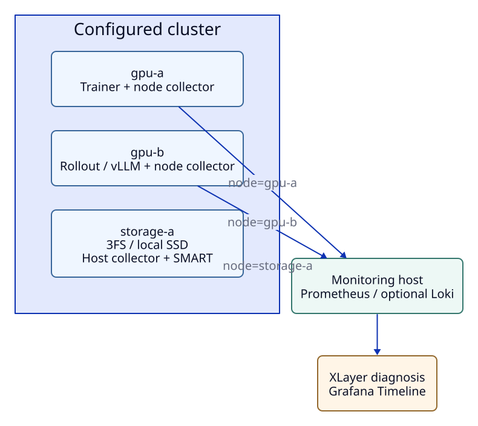
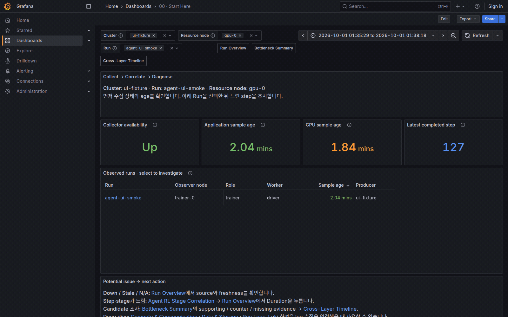
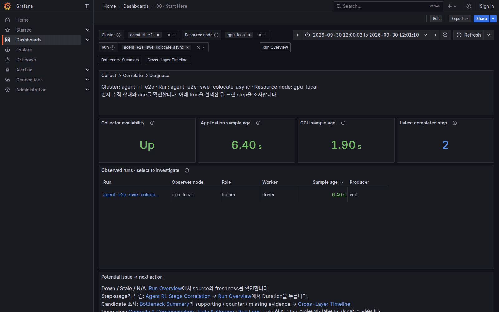

# Monitoring Guide

> **Reference** · 기본 작업은 [monitoring guide](monitoring.md)에서 시작합니다. 아래에는 기존 운영·구현·해석 세부 정보와 기록을 보존합니다.

Demo → 실제 node → multi-node·log·storage 순서로 자원 수집을 연결합니다.
Trainer는 [VERL Quickstart](verl-quickstart.md), 데이터 경로는 [Architecture](concepts.md#collect--correlate--diagnose)를 참고합니다.

## Know the Roles

| 구성 | 하는 일 | 실행 위치 |
| --- | --- | --- |
| `node` role | GPU sampler와 Node Exporter로 GPU·host 지표 노출 | 각 GPU·sandbox·storage host |
| `server` role | Prometheus로 metric을 수집하고 Grafana로 표시 | Monitoring host |
| `storage` shell role | GPU를 끈 node collector alias; host/I/O·clock 관측 | 전용 storage node. 공식 CLI는 `--role node` 사용 |
| Alloy / Loki | File log 전송 / 저장; 선택 기능 | Log를 읽는 node / monitoring host |

Monitoring host는 Prometheus·Grafana 등을 실행하는 machine이며 처음에는 GPU node와 같아도 됩니다.
Prometheus가 exporter를 주기적으로 조회하는 동작을 scrape라고 합니다.
Multi-node에서는 monitoring host에서 각 node의 `:19100`에 접근할 수 있어야 합니다.
Background lifecycle은 [CLI의 host role 설정](cli.md#host-roles-for-multi-node-deployment)으로 `xltel up --role server`와 `xltel up --role node`를 각 host에서 실행합니다.
아래의 role별 Bash 명령은 foreground 실행과 추가 collector 설정을 위한 advanced 경로입니다.

## Prepare the Host

Script는 ARM64·x86_64 Linux, Python 3.10 이상, Bash, `flock`·`setsid`(util-linux), `curl`, `tar`, `unzip`을 사용합니다.
기본 `node` role은 GPU도 수집하므로 NVIDIA driver와 동작하는 `nvidia-smi`가 필요합니다.
GPU 없는 sandbox·storage host는 `ENABLE_GPU_METRICS=0`으로 host metric만 수집할 수 있으며, 실제 자원 없이 화면을 익힐 때는 demo를 사용합니다.

설치 도구·상태·설정은 `$HOME/telemetry/{tools,state,config}`에 모읍니다.
설치와 실행에 같은 `TOOLS_DIR`을 사용하고, `OUTPUT_DIR`은 role·demo별로 나눕니다.
경로를 생략하면 `tools`와 `state/<role>-<hostname>`을 사용합니다.
`server.conf`는 monitoring host만 읽으며 node·storage 값은 각 machine의 환경 변수로 전달합니다.

## Try the Demo

GPU·VERL·vLLM·Ray 없이 현재 dashboard를 synthetic 데이터로 확인합니다.
[전용 config](https://github.com/daegyu94/xlayer-telemetry/blob/main/examples/synthetic-demo.toml)는 기존 stack과 다른 state·port를 사용하며 설치한 binary는 재사용합니다.
Config를 복사한 뒤 `TOOLS_DIR`을 실제 설치 위치에 맞춥니다.

```bash
mkdir -p "$HOME/.config/xlayer"
cp -n examples/synthetic-demo.toml "$HOME/.config/xlayer/demo.toml"
export XLAYER_CONFIG="$HOME/.config/xlayer/demo.toml"
xltel doctor
# 도구가 없을 때만 실행
xltel install-tools
DEMO_LIVE=1 DEMO_PORT=29110 xltel up
xltel status
```

[Start Here](http://127.0.0.1:23000/d/xlayer-start-here)에서 `cluster=demo-b300`, `Resource node=All`, `Run=verl-agent-demo`를 선택합니다.
Rate graph는 최소 두 번의 scrape 이후 채워집니다.
Step·candidate·span·log까지 보려면 metric 수집 시작 후 약 30초가 지난 뒤 아래 fixture를 한 번 생성합니다.
Output은 새 directory여야 하며 기존 run을 덮어쓰지 않습니다.

```bash
python -m xlayer_telemetry.demos.diagnosis \
  --output "$HOME/telemetry-demo/runs/verl-agent-demo" \
  --run-id verl-agent-demo --node gpu-node-0
xltel inspect verl-agent-demo
```

Alloy 수집 후 Run Overview의 Step 127 Duration → Bottleneck Summary → Evidence → Timeline으로 이동합니다.
Logs는 `Log directory=verl-agent-demo`, `Run context=verl-agent-demo`를 선택합니다.
다시 fixture를 만들려면 config의 `TELEMETRY_HOME`을 새 demo directory로 바꿔 기존 결과를 보존합니다.
Custom config에서는 output·node·cluster·backend URL을 설정에 맞춥니다.

| 화면 / 계층 | Synthetic coverage |
| --- | --- |
| Start Here / Run Overview | Collector health·freshness·step·throughput·loss·CPU·memory·swap |
| Stage Correlation / Cross-Layer Signals | VERL stages·vLLM queue/KV/preemption/offload/token/latency·Ray tasks/actors/resources/object store/evictions |
| Compute & Communication | GPU matrix·allocation·process memory·power·temperature·clock·worker timers·Ethernet·RDMA·topology |
| Data & Storage | Storage Cluster inventory·host/device I/O·filesystem |
| Sandbox row / Timeline | Pool·PSI·I/O·CPU·memory·OOM·clock status와 exact synthetic tool/sandbox span |
| Bottleneck Summary / Logs | Baseline/current·candidate·supporting/counter/missing evidence·관련 event·raw log |

모든 metric scrape에 `data_origin=synthetic` label을 붙입니다.
3FS ClickHouse 관련 내용은 **기존 diagnosis fixture의 synthetic evidence**이며 실제 DB query를 실행하지 않습니다.
Live resource curve와 precomputed Step 127의 evidence 수치는 독립적인 예제이며 일치하는 시뮬레이션이나 인과관계 검증이 아닙니다.
OOM=0은 정상값이고, 없는 topology edge나 per-run attribution 같은 missing evidence는 비워 둡니다.
Profile artifact는 실제 profiler 실행이 필요한 별도 deep dive이며 fake trace를 생성하지 않습니다.

### Check Dashboard Coverage

기존 stack에 dashboard query를 그대로 실행해 비어 있거나 nonfinite인 결과를 찾습니다.
새 JSON 파일을 지정하며 Loki를 생략한 query는 `not_validated`로 기록하고 전체 성공으로 처리하지 않습니다.

```bash
python examples/investigation/validate_demo_coverage.py \
  --dashboard-dir "$HOME/telemetry-demo/state/server/dashboards" \
  --prometheus-url http://127.0.0.1:29090 \
  --loki-url http://127.0.0.1:23100 \
  --output /tmp/xlayer-demo-coverage.json
```

검사는 한 Run·observer와 All resource filter를 사용합니다.
Metric은 현재값, Loki는 기본 최근 1시간을 조회하며 `--lookback-seconds`로 log 조회 범위를 바꿀 수 있습니다.
임의의 다른 Run·node·engine을 선택하면 데이터가 없는 것이 정상일 수 있습니다.
[실제 query 검증 기록](validation/dashboards/synthetic-coverage-20261003.json)과 [browser journey](maintainers.md#문서와-ui-검증)를 참고합니다.

```bash
xltel down
unset XLAYER_CONFIG
```

`down`은 demo process를 종료하고 config·run·log를 보존합니다.
상세한 가상 구성과 화면 예시는 [Demo Details](#demo-details)에 있습니다.

## Monitor One GPU Node

VERL을 같은 host에서 실행한다면 [config 기반 `up`](verl-reference.md#2-start-server-node-and-verl)으로 한 terminal에서 server·collector를 background로 시작하는 경로를 권장합니다.
아래는 VERL 없이 자원만 관측하거나 개별 process를 조사할 때 쓰는 수동 경로입니다.
각 명령은 foreground로 실행하므로 별도 terminal을 사용하고 `OUTPUT_DIR`도 분리합니다.

### 1. Install the Tools

```bash
export TOOLS_DIR="$HOME/telemetry/tools"
bash scripts/install_telemetry_tools.sh node
bash scripts/install_telemetry_tools.sh server
```

`node` 설치는 Node Exporter·Alloy를 준비합니다.
`server` 설치는 Node Exporter·Prometheus·Grafana·Loki를 준비합니다.
GPU driver와 training framework는 별도입니다.

### 2. Start the Collector

```bash
. .venv/bin/activate
TOOLS_DIR="$HOME/telemetry/tools" \
NODE_ADDR='127.0.0.1' \
NODE_NAME='gpu-local' \
OUTPUT_DIR="$HOME/telemetry/state/node" \
  bash scripts/run_telemetry.sh node
```

Node Exporter는 `127.0.0.1:19100/metrics`에 host와 GPU metric을 노출합니다.
기본 실행 시간 제한은 없으며, `Ctrl+C`나 종료 signal 또는 자식 service 종료 시 함께 시작한 process를 정리합니다.
일회성 수집에는 `DURATION=3600`처럼 양의 초 값을 추가합니다.
GPU snapshot JSONL은 계속 누적되므로 장기 운영에서는 출력 directory 용량을 관리합니다.

### 3. Start the Server

처음 한 번만 예제 설정을 개인 경로로 복사하고 `TELEMETRY_TARGETS`를 실제 collector 주소로 수정합니다.
이후 server를 재시작할 때도 같은 설정 파일을 사용합니다.

```bash
. .venv/bin/activate
mkdir -p "$HOME/telemetry/config"
if [[ ! -f "$HOME/telemetry/config/server.conf" ]]; then
  cp examples/monitoring-server.conf "$HOME/telemetry/config/server.conf"
fi
bash scripts/run_telemetry.sh server --config "$HOME/telemetry/config/server.conf"
```

`TELEMETRY_TARGETS`는 `logical-node-name=address` 형식입니다.
Loopback 예제는 같은 host에서만 유효하며 remote server는 `NODE_ADDR`·target에 도달 가능한 node 주소를 사용합니다.
시작 시 HTTP·query 검사 결과를 `OUTPUT_DIR/startup-summary.json`에 저장합니다.
Bash config는 `$HOME`을 지원하고 같은 이름의 terminal 환경 변수보다 우선합니다.

## Retain Data for Completed Runs

Managed Prometheus는 기본 1일, Loki는 기본 7일을 보관합니다.
장시간 run을 나중에 조사하려면 `xltel config path`의 TOML에서 Prometheus 보관 기간을 늘립니다.

```toml
[telemetry]
PROMETHEUS_RETENTION = "7d"
```

```bash
xltel config validate
xltel restart --role server
```

기존 `[telemetry]` 절에 값을 추가하며, Bash config와 환경 변수에서도 같은 이름을 사용합니다.
보관 기간을 늘리면 disk 사용량이 증가하고 이미 만료된 표본은 복구되지 않습니다.
Loki 설정은 [log 수집](#add-run-logs-with-loki)을 따르며, 외부 backend의 retention은 해당 배포에서 관리합니다.
Run의 JSONL·profile artifact는 별도로 남으므로 backend retention이나 `xltel down`이 이를 삭제하지 않습니다.

## Monitor GPU and Storage Nodes Together

Collector와 correlation은 분산 실행을 지원하지만, GPU 두 개가 있는 한 host는 독립된 clock을 가진 두 node가 아닙니다.
먼저 각 node의 논리 이름, monitoring host에서 접근할 주소, 실제 workload 역할을 정합니다.
GPU/rollout node와 storage node 모두 같은 cluster에 등록하고, 모든 application·native source·manifest·Loki 설정에서 같은 node 이름을 사용합니다.



각 GPU node에서 기존 `node` collector를 실행합니다.
Storage node에는 GPU가 없어도 다음처럼 host collector를 실행할 수 있습니다.
`TOOLS_DIR`은 그 node에서 도구를 설치한 경로이며 `NODE_ADDR`는 monitoring host에서 접근 가능한 local interface 주소로 바꿉니다.

```bash
TOOLS_DIR="$HOME/telemetry/tools" \
NODE_ADDR='10.0.1.10' NODE_NAME='storage-a' \
ENABLE_GPU_METRICS=0 \
OUTPUT_DIR="$HOME/telemetry/state/storage-host" \
  bash scripts/run_telemetry.sh node
```

이 경로는 CPU·memory·network·disk·filesystem·clock metric을 노출하며 NVIDIA driver가 필요하지 않습니다.
`storage` shell role도 같은 host/I/O 수집 경로이며 GPU sampling을 끕니다. 공식 `xltel` 경로에서는 `--role node`와 `ENABLE_GPU_METRICS=false`를 사용합니다.
GPU가 있는 collector에서 `ENABLE_GPU_METRICS=0`으로 바꾸면 이전 `gpu.prom`도 제거합니다.

Monitoring host의 `server.conf`에는 모든 host collector를 등록합니다.
`TELEMETRY_TARGETS`에 DS/MDS를 포함한 host/clock endpoint를 등록합니다.

```bash
CLUSTER_NAME='training-cluster'
TELEMETRY_TARGETS='gpu-a=10.0.0.10,gpu-b=10.0.0.11,storage-a=10.0.1.10'
```

VERL launcher에서 지정한 telemetry 환경 변수가 remote Ray worker에 자동 전달된다고 가정하지 않습니다.
Remote worker에도 동일한 `TELEMETRY_RUN_ID`와 각 host의 `TELEMETRY_NODE`, 실제 node-local metric/event directory를 설정하고 SDK를 설치해야 합니다.
Trainer file logger bridge 하나는 trainer boundary를 제공하며 모든 remote worker를 자동 instrument하지 않습니다.
Manifest에서는 같은 role을 여러 node에 반복해서 지정할 수 있습니다.

```bash
python -m xlayer_telemetry.manifest \
  --output "$RUN_ROOT/topology-manifest.json" --run-id 'grpo-001' \
  --role trainer=gpu-a --role rollout=gpu-b --role storage=storage-a
```

### Check Clock Alignment Before Diagnosing

Monitoring host, GPU node, sandbox node와 storage telemetry producer를 모두 같은 신뢰 가능한 NTP source에 동기화합니다.
Ubuntu에서는 운영 환경에 맞는 chrony 또는 systemd-timesyncd를 사용하고 `timedatectl show -p NTPSynchronized`와 해당 service의 tracking 상태를 확인합니다.
두 daemon을 동시에 새로 켜거나 실행 중인 training의 clock을 임의로 변경하지 않습니다.
Service가 enabled인 것만으로 실제 동기화가 완료된 것은 아닙니다.

실제 collector를 등록하고 scrape가 진행된 뒤 monitoring host에서 다음을 실행합니다.
Exit code `0`은 현재 검사 구간의 `aligned`, `1`은 `unsafe` 또는 `unknown`입니다.

```bash
python -m xlayer_telemetry.analysis.clock_quality \
  --prometheus-url 'http://127.0.0.1:19090' \
  --cluster 'training-cluster' \
  --node gpu-a --node gpu-b --node storage-a
```

기본 검사 창은 최근 60초, 허용 scrape-relative 차이는 1초, sample age는 30초입니다.
`node_time_seconds - timestamp(node_time_seconds)`에는 network/collection delay가 포함되므로 정밀 NTP offset이나 timestamp 보정값이 아닙니다.
Prometheus는 기본적으로 scrape 시각을, event·log·application은 producer clock을 사용합니다.
근거: [Prometheus 설정](https://prometheus.io/docs/prometheus/latest/configuration/configuration/), [time collector](https://github.com/prometheus/node_exporter/blob/master/collector/time.go), [timex collector](https://github.com/prometheus/node_exporter/blob/master/collector/timex.go).

`--allow-unsynchronized`는 kernel sync status 요구만 제외하는 조사 옵션입니다.
이 옵션으로 같은 host의 offset 검사가 통과해도 NTP나 물리 multi-node 동기화가 검증된 것은 아닙니다.
짧은 step은 허용 차이보다 짧을 수 있으므로 threshold를 실제 분석 해상도에 맞추고 sample 간격과 rate window도 함께 확인합니다.
자동 diagnosis 설정은 [Clock and Node Selection](diagnosis-reference.md#clock-and-node-selection)에 있습니다.
OS clock을 바꾸기 어려운 환경에서는 [Userspace Time Alignment](time-alignment.md)로 XLayer Step·Span을 monitoring host 기준으로 보정할 수 있습니다.
원본 timestamp와 uncertainty를 보존하며 3FS producer timestamp나 일반 application log를 자동 보정하지 않습니다.

### Reproduce the Local Validation

실제 GPU 두 개와 설치된 Prometheus/Node Exporter binary가 있다면 다음 검증을 실행할 수 있습니다.
새 output directory를 지정합니다.
기존 monitoring service는 건드리지 않고 별도 loopback port와 process를 사용한 뒤 정리합니다.

```bash
PYTHONPATH="$PWD" python examples/multinode/validate_local.py \
  --node-exporter "$TOOLS_DIR/node_exporter-1.9.1.linux-amd64/node_exporter" \
  --prometheus "$TOOLS_DIR/prometheus-3.5.0.linux-amd64/prometheus" \
  --output /tmp/xlayer-multinode-check
```

Architecture에 맞춰 binary directory의 `amd64` 또는 `arm64`를 선택합니다.
GPU UUID 두 개, logical node별 application snapshot, storage host metric, shared trace/parent와 세 node에 걸친 diagnosis query를 실제 backend에서 검사합니다.
Clock metric에 +12초 offset을 주입하고 storage source도 중단하여 clock screening을 확인합니다.
이 두 fault는 test proxy에서만 만들며 시스템 clock이나 storage를 변경하지 않습니다.

2026-09-30 검증은 RTX PRO 4000 Blackwell 두 개, Node Exporter 1.9.1, Prometheus 3.5.0에서 수행했습니다.
당시에는 standalone Step Explorer 조회를 검사했으며 현재 script는 같은 backend에서 diagnosis evidence를 검사합니다.
Host와 kernel이 NTP unsynchronized를 보고하여 strict check는 `unsafe`였고, sync status 요구를 제외한 scrape-relative 차이는 수십 ms 이내였습니다.
검증 조건과 항목별 결과는 [Validation record](validation/multinode/validation.json)에 보존합니다.
물리 host는 하나였으며 host counter도 공유합니다.
독립된 GPU/storage 서버, 실제 distributed VERL training, RDMA/NCCL, remote 3FS producer clock과 Loki 전송은 이 검증의 완료 항목이 아닙니다.

### Validate Separate VM Kernels

물리 node가 없으면 `examples/multinode/validate_vms.py`로 KVM guest 두 개를 실행할 수 있습니다.
각 VM에서 기존 node collector와 CPU SDK fixture를 실행하고 host의 임시 Prometheus가 수집합니다.
Trace parent 연결, guest clock skew에 따른 진단 보류·복구, VM 중단 감지를 확인하며 host clock은 변경하지 않습니다.

Linux KVM 접근 권한, `qemu-system-x86_64`, `qemu-img`, `cloud-localds`, OpenSSH가 필요합니다.
[Ubuntu cloud image](https://cloud-images.ubuntu.com/noble/current/)의 amd64 `.img`와 publisher의 SHA256을 준비합니다.
Guest는 각각 RAM 1GiB·vCPU 1개·6GiB sparse overlay를 사용하며 base image를 수정하지 않습니다.

```bash
python -m examples.multinode.validate_vms \
  --image /path/to/ubuntu-cloud.img \
  --image-sha256 PUBLISHER_SHA256 \
  --node-exporter "$TOOLS_DIR/node_exporter-1.9.1.linux-amd64/node_exporter" \
  --prometheus "$TOOLS_DIR/prometheus-3.5.0.linux-amd64/prometheus" \
  --output artifacts/vm-validation
```

SSH·metrics는 임시 loopback port로 전달하며 검사 종료 시 생성한 VM과 Prometheus를 종료합니다.
Output에는 log·overlay·임시 SSH key가 남으므로 결과를 보존한 뒤 해당 검증 디렉터리를 정리합니다.
이 검증은 독립 guest kernel과 clock을 사용하지만 물리 NIC·SSD 분리, GPU passthrough, distributed VERL·RDMA·3FS 성능을 검증하지 않습니다.
[2026-10-01 검증](validation/multinode/vm-validation-20261001.json)은 Ubuntu 24.04.5 guest 두 개에서 통과했습니다.
NTP를 끈 guest에 의도적으로 clock skew를 넣었으므로 `require_sync=false`·허용 offset 3초로 검사했으며 운영 기본값의 NTP 검증을 대신하지 않습니다.

최신 CLI lifecycle과 log 전달까지 검사하려면 같은 명령에 `--cli-tools-dir "$TOOLS_DIR"`를 추가합니다.
이 directory에는 Prometheus·Grafana·Loki·Alloy가 모두 있어야 합니다.
Host의 `xltel up --role server`와 VM의 `xltel up --role node`를 public CLI의 module entrypoint로 실행하며, 전체 stack은 검증용 port와 state를 사용합니다.
VM metric은 `127.0.0.2:19100`·`127.0.0.3:19100`으로 전달하므로 해당 주소·port가 비어 있어야 합니다.
Host/guest health, Loki event 수집, collector 재시작, VM 중단의 degraded 표시와 중복 `up/down`을 함께 확인합니다.
기존 monitoring service는 종료하지 않으며 출력에는 검증 결과와 실패 시 `failure.json`을 남깁니다.
[2026-10-02 CLI 검증](validation/multinode/xltel-vm-validation-20261002.json)은 이 경로에서 Grafana datasource의 metric·trace log 조회와 종료 cleanup까지 통과했습니다.
Application은 CPU SDK fixture이며 실제 VERL·vLLM 학습이나 3FS workload를 VM에서 실행한 결과는 아닙니다.

## Open the Dashboards

같은 host의 browser에서 `http://127.0.0.1:13000`을 엽니다.
원격 host를 사용하면 자신의 PC에서 다음 SSH tunnel을 열고 `http://localhost:13000`으로 접속합니다.

```bash
ssh -NT -L 13000:127.0.0.1:13000 user@monitoring-host
```

먼저 [Start Here](http://127.0.0.1:13000/d/xlayer-start-here)에서 조사할 질문에 맞는 화면을 고릅니다.
Run Overview에서 cluster와 node를 선택하고 target 상태와 최근 GPU sample을 확인합니다.
아직 workload를 연결하지 않았다면 run 목록과 application panel이 비어 있는 것이 정상입니다.
Target이 up인데 run이 보이지 않는다면 [VERL 연결 가이드](verl-reference.md#3-check-the-first-completed-step)에서 wrapper·snapshot·collector 경로를 확인합니다.

| Dashboard | 확인할 내용 |
| --- | --- |
| Start Here | 목적별 화면 선택과 조사 순서 |
| Run Overview | Target 상태·sample freshness, step 시간 추이와 선택적 완료 step 목록 |
| Agent RL Stage Correlation | VERL 완료 stage와 등록한 rollout engine 지표 |
| Compute & Communication | GPU·host·NIC/RDMA와 topology |
| Data & Storage | Storage Cluster inventory·node/device 성능·filesystem |
| Bottleneck Summary | 진단 sidecar와 Loki를 연결한 run의 candidate·baseline·evidence |
| Cross-Layer Timeline | 선택한 step 요약·span·step band와 Prometheus resource를 같은 시간축에서 확인 |
| Run Logs | Loki를 활성화했을 때만 제공되는 log 검색 |

각 화면의 필터·패널·측정 범위는 [Dashboard Guide](dashboards.md)에서 설명하고, [실제 실행 GIF](real-verl-demo.md)에서 값이 채워진 예를 볼 수 있습니다.

GPU sample은 기본 30초, 학습 지표는 `Training sample max age (s)` 기본 300초 기준으로 오래된 값을 숨길 수 있습니다.
긴 step에서는 sample age와 filter를 함께 확인하며, N/A를 사용량 0으로 읽지 않습니다.
Prometheus는 `127.0.0.1:19090`에서 실행되고 Grafana 기본 접근 권한은 anonymous Viewer입니다.
관리자 비밀번호는 `GRAFANA_ADMIN_PASSWORD`로 지정합니다.

## Enable Grafana Alerts

Monitoring Guide의 수동 경로에서는 server 설정 파일의 `ENABLE_ALERTS=1`로 Grafana Alerting에 세 가지 운영 규칙을 설치합니다.
단일 host [VERL config 경로](verl-reference.md#1-prepare-one-config-file)를 사용한다면 `xltel config path`가 가리키는 config의 `ENABLE_ALERTS=1`을 설정하고 `xltel restart`을 실행합니다.
Node collector 연결 끊김, GPU 표본이 60초 넘게 갱신되지 않거나 사라짐, 지정한 filesystem의 여유 공간 부족을 node별로 평가합니다.
`ENABLE_GPU_METRICS=0`인 collector는 `telemetry_gpu_collection_enabled=0`을 내보내 GPU 누락 경고에서 제외합니다.
이 marker가 없는 구형 collector는 기존 GPU 감시 동작을 유지하므로, GPU 없는 node는 collector와 server를 함께 갱신하고 재시작합니다.
기본 filesystem 대상은 `/`이며, 3FS FUSE 등의 다른 경로를 감시하려면 실제 `mountpoint`를 `ALERT_MOUNTPOINT`에 지정합니다.
기존 server terminal에서 `Ctrl+C`로 종료한 뒤 같은 설정 파일로 다시 시작합니다.

```bash
bash scripts/run_telemetry.sh server --config "$HOME/telemetry/config/server.conf"
```

서버를 다시 시작한 뒤 Grafana의 `Alerting > Alert rules`에서 `XLayer Telemetry` 폴더를 확인합니다.
Node collector와 GPU 규칙은 30초마다 평가하고 조건이 1분 지속되면 발화하며, 용량 규칙은 5분 지속되면 발화합니다.
Prometheus 조회 오류는 `Error` 상태로 표시하고, 해당 지표가 아직 없는 `No Data`는 정상 상태로 처리합니다.
따라서 설정에서 target 자체를 제거하거나 감시할 filesystem이 없으면 이 세 규칙만으로는 누락을 감지하지 못합니다.

외부 알림은 관리자 계정의 `Alerting > Contact points`와 notification policy에 수신처를 설정합니다.
`service=xlayer-telemetry`로 분리할 수 있으며 비밀번호·webhook URL은 저장소에 넣지 않습니다.
파일 관리 규칙은 `OUTPUT_DIR/provisioning/alerting/operations.json`에서 재시작 시 적용되며 UI에서는 직접 편집할 수 없습니다.
`ENABLE_ALERTS=0`으로 재시작하면 세 규칙을 삭제합니다.

이 규칙은 운영 중인 수집 경로만 검사합니다.
완료된 step의 metric은 학습 종료 후에도 마지막 값이 남을 수 있으므로 학습 정지 알림은 활성 run 상태를 따로 계측하기 전까지 포함하지 않습니다.

## Application Metrics

VERL은 [wrapper](verl-quickstart.md), 다른 workload는 [SDK](application-metrics.md)로 JSON snapshot을 생성합니다.
같은 node의 collector를 다시 시작할 때 다음 설정을 추가합니다.

```bash
TOOLS_DIR="$HOME/telemetry/tools" \
NODE_ADDR='127.0.0.1' \
NODE_NAME='gpu-local' \
OUTPUT_DIR="$HOME/telemetry/state/node" \
TELEMETRY_METRICS_DIR='/path/to/run/telemetry-metrics' \
  bash scripts/run_telemetry.sh node
```

Snapshot이 제공하는 loss·step·timer만 변환되며 collector가 학습 값을 만들어 내지는 않습니다.
기본 2초 주기는 `TELEMETRY_METRICS_INTERVAL`로 조정합니다.
Application의 `TELEMETRY_NODE`와 server target 이름을 맞춰 같은 node의 자원 지표를 함께 봅니다.

### Keep the Collector Across Runs

같은 node에서 run을 순차 실행하거나 동시에 실행할 때는 `TELEMETRY_RUNS_ROOT`를 run directory들의 부모로 지정합니다.
Collector는 매 poll마다 바로 아래의 `*/telemetry-metrics`를 발견하고 기존 node·producer identity로 구분합니다.
임의의 하위 directory를 재귀 탐색하지 않습니다.

```bash
TELEMETRY_RUNS_ROOT="$HOME/telemetry-runs" \
  bash scripts/verl_local.sh --config "$HOME/telemetry/config/verl-local.conf" node
```

`verl_local.sh`는 기본적으로 설정한 `RUN_ROOT`의 부모를 사용하므로 보통 이 override도 필요 없습니다.
Run-root 모드의 기본 `TELEMETRY_METRICS_MAX_AGE_SECONDS`는 300초이며, 긴 step은 정상 갱신 간격보다 충분히 큰 값으로 설정합니다.
오래되었거나 미래 시각의 snapshot, 종료 상태가 기록된 run은 현재 application export에서 제외하지만 JSONL·snapshot과 기존 Prometheus 이력은 보존합니다.
다른 node의 시각이 어긋난 snapshot도 제외될 수 있으므로 clock 상태를 먼저 확인합니다.

기존 `--metrics-dir`는 유지하며 CLI에서 반복 지정할 수 있습니다.
직접 지정한 directory만 사용하는 CLI는 `--max-age-seconds`를 생략하면 기존처럼 age 제한 없이 읽습니다.

```bash
python -m xlayer_telemetry.metrics.textfile \
  --metrics-dir /path/to/run-a/telemetry-metrics \
  --metrics-dir /path/to/run-b/telemetry-metrics \
  --node gpu-0 --max-age-seconds 300 --textfile-dir /path/to/collector/textfile
```

## Expand to Multiple Nodes

각 GPU node에는 node 도구와 collector를, monitoring host에는 server 도구를 설치합니다.
Node의 `NODE_ADDR`는 loopback 대신 monitoring host에서 접근할 수 있는 주소로 바꿉니다.
Server 설정 파일의 `TELEMETRY_TARGETS`에 모든 관측 node를 쉼표로 나열하고 기존 server를 종료한 뒤 다시 시작합니다.
예: `TELEMETRY_TARGETS='trainer-0=10.0.0.10,rollout-0=10.0.0.11'`.

```bash
bash scripts/run_telemetry.sh server --config "$HOME/telemetry/config/server.conf"
```

Clock를 동기화해야 다른 machine의 같은 시간 구간을 비교할 수 있습니다.
Run directory는 node별로 두고 shared storage의 동일 snapshot을 여러 collector가 읽지 않도록 합니다.

| 연결 방향 | 기본 port | 용도 |
| --- | --- | --- |
| Monitoring host → GPU node | `19100` | Host·GPU·application metric |
| Monitoring host → DS/MDS node | `19100` | Node Exporter host/I/O·clock |
| Log collector → monitoring host | `13100` | 선택적 Loki 전송 |
| Browser → monitoring host | SSH tunnel | Loopback Grafana 접근 |

vLLM·Ray 등 추가 endpoint는 해당 port도 접근 가능해야 합니다.
등록 절차는 [Native Metric Endpoints](native-sources.md)에 있습니다.
서로 다른 node 이름을 임의로 혼용하면 dashboard filter가 데이터를 연결하지 못합니다.

## Add Run Logs with Loki

각 run의 `<log-root>/<run-directory>/logs/**/*.log`, VERL의 `telemetry-events/verl-steps*.jsonl`, EventRecorder JSONL, diagnostics projection을 Alloy가 읽어 Loki에 전송합니다.
Wrapper의 `telemetry-bridge.log`는 이 패턴에 들어가지만 VERL의 metric JSONL이나 terminal의 stdout 전체가 자동으로 Run Logs에 나타나지는 않습니다.
학습 log를 보려면 workload가 같은 `logs/` 아래 `.log` 파일을 쓰도록 설정합니다.
Shared storage를 사용하면 같은 file이 중복 전송되지 않도록 수집 담당 collector를 하나로 정합니다.

Monitoring Guide의 수동 단일 host 예제에서는 monitoring server를 종료하고 `server.conf`의 `ENABLE_LOGS=1`만 바꿔 다시 시작합니다.
기본 `LOKI_LISTEN_ADDR='127.0.0.1'`은 같은 host에서 실행하는 collector가 접근할 수 있습니다.
단일 host [VERL config 경로](verl-reference.md#1-prepare-one-config-file)를 사용한다면 기존 TOML의 `[telemetry]`에 `ENABLE_LOGS = true`를 설정하고 `xltel restart`를 실행합니다.
기존 Bash config에서는 `ENABLE_LOGS=1`을 사용합니다.
이 경로는 log root와 metric snapshot 경로를 같은 `RUN_ID`에서 자동으로 계산하므로 아래의 수동 환경 변수 예제를 입력할 필요가 없습니다.

```bash
bash scripts/run_telemetry.sh server --config "$HOME/telemetry/config/server.conf"
```

다른 node에서 Loki로 전송하려면 `LOKI_LISTEN_ADDR`을 monitoring host의 관리망 주소로 바꾸고, 아래 `LOKI_PUSH_URL`도 그 주소로 바꿉니다.
생성되는 Loki 설정에는 인증이 없으므로 관리망에서만 접근하도록 배치합니다.
기본 보존 기간은 7일이며 `LOKI_RETENTION`으로 바꿀 수 있습니다.

앞의 `grpo-001` 단일 node 예제를 이어간다면 같은 node에서 기존 collector를 종료하고 다음 설정으로 다시 시작합니다.
`TELEMETRY_LOG_ROOTS`는 run directory 자체가 아니라 그 부모 directory이고, `TELEMETRY_METRICS_DIR`은 계속 같은 run의 snapshot directory를 가리킵니다.

```bash
TOOLS_DIR="$HOME/telemetry/tools" \
NODE_ADDR='127.0.0.1' \
NODE_NAME='gpu-local' \
OUTPUT_DIR="$HOME/telemetry/state/node" \
CLUSTER_NAME='training-cluster' \
TELEMETRY_METRICS_DIR="$HOME/telemetry-runs/grpo-001/telemetry-metrics" \
LOKI_PUSH_URL='http://127.0.0.1:13100/loki/api/v1/push' \
TELEMETRY_LOG_ROOTS="verl=$HOME/telemetry-runs" \
  bash scripts/run_telemetry.sh node
```

Log root는 존재하는 절대 경로여야 합니다.
따라서 위 예제에서는 `$HOME/telemetry-runs/grpo-001/logs/`, `telemetry-events/`, `diagnostics/investigation/`을 찾습니다.
여러 root는 `verl=/path/a,custom=/path/b`처럼 구분하고 workload 이름을 중복하지 않습니다.
Alloy의 읽기 offset은 `OUTPUT_DIR/alloy-data`에 저장되며 기본적으로 24시간보다 오래된 file을 제외합니다.
`ALLOY_IGNORE_OLDER_THAN`으로 이 기준을 바꾸고 Alloy state와 Loki data는 각각 host-local 경로에 둡니다.

Run Logs에서 cluster·node·workload·run을 선택합니다.
`cluster`·`node`·`workload`는 index label이고 `run_id`·file 경로는 record에 저장합니다.
Log의 `run_id`는 directory 이름이므로 wrapper의 ID와 다를 수 있습니다.
Run Overview·Timeline은 event의 ID·시간을 Prometheus 자원 그래프와 연결하므로 두 저장소의 보존 기간을 확인합니다.
Alloy는 `<run>/telemetry-events/`와 `<run>/telemetry/telemetry-events/`의 step·backfill 파일을 수집합니다.
`03 · Bottleneck Summary`는 diagnosis projection, `04 · Cross-Layer Timeline`은 span·step·sample을 사용합니다.
연결하지 않은 source의 panel은 비어 있으며 [진단 설정](diagnosis.md)에서 추가합니다.


## Topology and Native Sources

`TOPOLOGY_DIR`에 `compute-topology.json`과 `storage-topology.json`을 둔 뒤 node collector에 전달하면 component·edge를 표시합니다.
연결 관계는 사용자가 제공해야 하며 topology 그림만으로 link bandwidth나 서비스 latency를 측정하지 않습니다.
Native service 연결은 [상세 가이드](native-sources.md)를 따릅니다.

## Storage Cluster Inventory

**목적:** 선언된 DS/MDS node와 실제 exporter의 host/device 성능을 같은 cluster에서 조사합니다. Topology publisher의 node를 resource owner로 사용하지 않습니다.

1. DS/MDS host에서 Node Exporter 기반 collector를 실행합니다. GPU가 없으면 `ENABLE_GPU_METRICS=false`를 지정합니다.
2. Monitoring host의 `TELEMETRY_TARGETS`에 각각의 `node=address`를 등록합니다.
3. Collector의 `TOPOLOGY_DIR`에 `storage-topology.json`을 둡니다. `resource_node`는 해당 target의 `nodename`과 정확히 일치해야 합니다.

```toml
[telemetry]
NODE_NAME = "storage-a"
ENABLE_GPU_METRICS = false
TOPOLOGY_DIR = "/path/to/declared-topology"
```

```json
{
  "components": [
    {"id":"mds-0","role":"metadata","resource_node":"metadata-a","storage_system":"3fs"},
    {"id":"ds-0","role":"data","resource_node":"storage-a","storage_system":"3fs"},
    {"id":"ds-0/nvme0n1","role":"ssd","resource_node":"storage-a","device":"nvme0n1","storage_system":"3fs"}
  ],
  "edges": [{"source":"ds-0","destination":"ds-0/nvme0n1","relation":"declared-local-device"}]
}
```

```bash
xltel config validate
xltel restart --role node
xltel status
```

**정상 결과:** `telemetry_topology_component_info{kind="storage"}`에 명시 mapping이 나타나며, **Data & Storage → Storage Cluster Overview**에서 inventory·exporter availability·CPU/memory·network/RDMA를 확인합니다. 같은 component의 mapping이 충돌하면 성능 집계에서 제외합니다. Source target이 없으면 unknown이며 scrape `up=0`은 node 자체의 장애 판정이 아닙니다.

| 관측 | 경계 |
| --- | --- |
| `data` / `ds`, `metadata` / `mds` | 사용자가 선언한 node 역할. 자동 backend discovery가 아님 |
| `resource_node` | 실제 exporter target identity. Topology를 게시한 node와 별개 |
| `device` | 해당 node의 block-device 이름. 동일 `nvme0n1`을 다른 node와 결합하지 않음 |
| `storage_system` | 선언한 배치 구분. 값이 `3fs`여도 service→SSD operation path를 증명하지 않음 |
| CPU/memory/network/device I/O | Node 또는 device 전체 값. 특정 Run·KV request 소유량 아님 |

SMART 수집·exporter·scrape job·health panel은 제거했습니다. 이전 설정의 `STORAGE_TARGETS`, `SMARTCTL_*`, `ENABLE_SSD_HEALTH`는 더 이상 사용하지 않습니다. 기존 사용자 binary/config를 자동 삭제하지 않으며 host 수집은 `TELEMETRY_TARGETS`의 `19100` endpoint로 등록합니다. `storage` shell role은 GPU를 끈 host collector alias이며 공식 CLI는 `--role node`를 사용합니다.

Mapping이 없으면 **Node / Device**를 명시 선택해 원본 I/O를 읽고 cluster 소속은 unknown으로 둡니다. 3FS service·Mooncake와의 실제 path 검증은 P1이며, [기존 Backend Deep Dive](storage-correlation.md)를 유지합니다. pNFS는 TBD입니다.

## Check and Stop

`Ctrl+C`로 role을 종료하면 함께 시작한 process를 정리하며, node 종료 시 GPU·application textfile도 제거합니다.
수집기 하나가 종료되어도 해당 role의 나머지 process가 종료되므로 예상치 못한 종료는 해당 terminal과 log를 확인합니다.
구성 변경 시 기존 process를 종료하고 같은 role을 다시 시작하며 다른 workload process를 종료할 필요는 없습니다.
Server는 앞서 복사한 `server.conf`로 다시 시작해 알림·로그·storage 설정을 함께 유지합니다.

| 증상 | 먼저 확인할 항목 |
| --- | --- |
| 도구를 찾지 못함 | 설치 때와 실행 때의 `TOOLS_DIR` |
| GPU 수집 즉시 종료 | `nvidia-smi` 동작, driver, sampler 오류 |
| Target down | Node process, 주소·port, network 접근 |
| GPU는 보이고 run은 없음 | Application metric 연결과 freshness |
| Loki log 없음 | File 경로, 최근 수정 시각, Alloy log와 push URL |
| Storage Cluster 값 없음 | 명시 node mapping·target 등록·충돌/중복 identity |

Monitoring host에서 준비된 Python 환경으로 상태를 검사할 수 있습니다.

```bash
PYTHONPATH=. python -m xlayer_telemetry.stack validate-stack \
  --prometheus-url http://127.0.0.1:19090 \
  --grafana-url http://127.0.0.1:13000 \
  --require-targets-up \
  --output /tmp/telemetry-validation.json
```

Loki를 활성화했다면 `--loki-url http://<monitoring-host-address>:13100`을 추가합니다.
`SERVER_CONFIG_ONLY=1`은 server 실행 없이 설정을 생성합니다.
별도 Docker Compose 배치는 [Compose 예제 안내](https://github.com/daegyu94/xlayer-telemetry/blob/main/examples/dashboards/README.md)를 따릅니다.
기존 node collector에 연결하며 현재 공통 metrics dashboard를 생성해서 사용합니다.

## Demo Details

Interactive demo는 GPU node 4개·node당 GPU 8개, storage node 8개·node당 SSD 4개의 가상 구성을 제공합니다.
정상 학습 → data wait → collective → checkpoint → recovery를 100초 주기로 반복합니다.
Agent RL 예시는 약 6초마다 완료 step 지표를 생성합니다.
Fixture는 `examples/live-demo/`에 있으며 `DEMO_TOPOLOGY_DIR`·`DEMO_ADDR`·`DEMO_PORT`로 설정할 수 있습니다.

Synthetic GIF는 step 127의 18.4 s와 baseline 11.2 s에서 candidate → evidence → Timeline → detail로 이동합니다.
Trainer·GPU·sandbox 세 node 문맥과 GPU 두 개를 표현하는 UI fixture이며 실제 성능 측정값이 아닙니다.



아래 실제 GIF는 2026-09-30에 완료한 VERL·vLLM·Docker sandbox 실행의 저장 데이터를 2026-10-01 UI에서 재생합니다.
3 trainer update와 baseline, tool/sandbox span, local disk와 workload log를 보여 줍니다.
이 실행의 verdict는 `no_anomaly_observed`로, synthetic 예제와 달리 storage bottleneck을 만든 실행이 아닙니다.
두 GIF 모두 약 95초이며 화면마다 5–7초 유지합니다.
[Real VERL Agent RL Demo](real-verl-demo.md)에 수집 시각·실행 조건·scope와 이전 3FS POSIX 실험 기록을 정리했습니다.



첫 연결이 끝나면 [VERL 연결 가이드](verl-quickstart.md)에서 기존 workload를 연결합니다.
