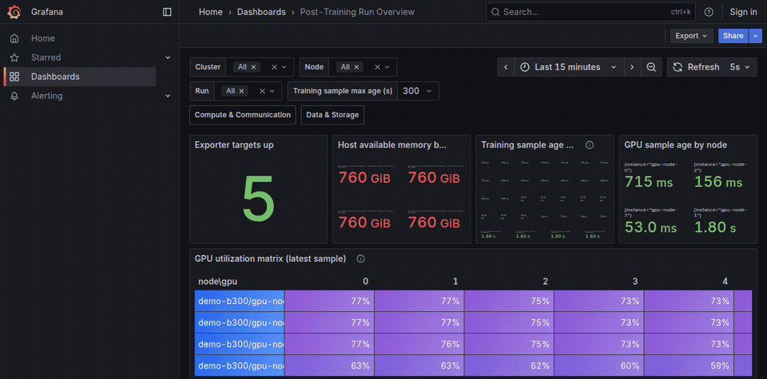

# Monitoring Guide

이 문서는 VERL 같은 workload가 실행되는 GPU node의 자원을 관측하고 Grafana에서 확인하는 방법을 설명합니다.
먼저 demo 화면을 확인하고, 실제 node 하나를 연결한 뒤 여러 node·log·storage 관측으로 확장합니다.
VERL trainer metric 연결은 [VERL Quick Start](verl-quickstart.md)에서 이어집니다.

## Know the Roles

| 구성 | 하는 일 | 실행 위치 |
| --- | --- | --- |
| `node` role | GPU sampler와 Node Exporter로 GPU·host 지표 노출 | 각 GPU node |
| `server` role | Prometheus로 metric을 수집하고 Grafana로 표시 | Monitoring host |
| `storage` role | SMART exporter로 SSD 건강 상태 노출 | 전용 storage node |
| Alloy / Loki | File log 전송 / 저장; 선택 기능 | Log를 읽는 node / monitoring host |

Monitoring host는 monitoring process를 실행하는 machine을 뜻합니다.
처음에는 GPU node와 같은 machine을 사용해도 되며 별도 cluster 제어기는 필요하지 않습니다.
Prometheus가 exporter를 주기적으로 조회하는 것을 scrape라고 부릅니다.

## Prepare the Host

[Checkout 준비](../README.md#prepare-a-checkout)를 마치고 저장소 루트에서 실행합니다.
Script는 ARM64·x86_64 Linux, Python 3.10 이상, Bash, `curl`, `tar`, `unzip`을 사용합니다.
실제 `node` role에는 NVIDIA driver와 동작하는 `nvidia-smi`가 필요하며, GPU가 없으면 demo를 사용합니다.

아래 예제는 `$HOME/telemetry` 아래에 설치 도구(`tools`)와 실행 상태(`state`)를 나누어 저장합니다.
`state` 아래에서는 역할과 demo별로 `OUTPUT_DIR`을 분리합니다.
`run_telemetry.sh`에서 경로를 생략하면 `tools`와 `state/<role>-<hostname>`을 기본값으로 사용합니다.
자신의 경로로 바꿔도 되지만 설치 때와 실행 때 같은 `TOOLS_DIR`을 전달해야 합니다.
새 terminal에서도 저장소 루트로 이동하고 Python 환경을 활성화합니다.

## Try the Demo

GPU나 VERL 없이 synthetic metric으로 화면을 확인합니다.
Monitoring host에서 다음 명령을 실행합니다.

```bash
export TOOLS_DIR="$HOME/telemetry/tools"
bash scripts/install_telemetry_tools.sh server
OUTPUT_DIR="$HOME/telemetry/state/demo" \
DEMO_LIVE=1 \
  bash scripts/run_telemetry.sh server
```

이 명령은 foreground에서 계속 실행되므로 terminal을 열어 둡니다.
[Dashboard 접속](#open-the-dashboards) 후 Run Overview에서는 `cluster=demo-b300`, `node=All`, `run_id=live-demo`를 선택합니다.
Agent RL Stage Correlation에서는 `run_id=verl-agent-demo`, `node=gpu-node-0`을 선택합니다.
실제 학습 성능이 아닌 화면·수집 경로 확인용 값입니다.

실제 node를 연결하기 전 `Ctrl+C`로 demo를 종료해 동일한 service port를 비웁니다.
상세한 가상 구성과 화면 예시는 [Demo Details](#demo-details)에 있습니다.

## Monitor One GPU Node

먼저 같은 host에서 collector와 server를 실행합니다.
각 명령은 서로 다른 terminal에서 실행하고 `OUTPUT_DIR`도 분리합니다.

### 1. Install the Tools

```bash
export TOOLS_DIR="$HOME/telemetry/tools"
bash scripts/install_telemetry_tools.sh node
bash scripts/install_telemetry_tools.sh server
```

`node` 설치는 Node Exporter·SMART exporter·Alloy를 준비합니다.
`server` 설치는 Node Exporter·SMART exporter·Prometheus·Grafana·Loki를 준비합니다.
Driver, `smartmontools`, training framework는 별도입니다.

### 2. Start the Collector

첫 terminal에서 실행합니다.

```bash
TOOLS_DIR="$HOME/telemetry/tools" \
NODE_ADDR='127.0.0.1' \
NODE_NAME='gpu-local' \
OUTPUT_DIR="$HOME/telemetry/state/node" \
  bash scripts/run_telemetry.sh node
```

Node Exporter는 `127.0.0.1:19100/metrics`에 host와 GPU metric을 노출합니다.
기본 실행 시간 제한은 없으며, `Ctrl+C`나 종료 signal 또는 자식 service 종료 시 함께 시작한 process를 정리합니다.
일회성 수집에는 `DURATION=3600`처럼 양의 초 값을 추가합니다.
GPU snapshot JSONL은 계속 누적되므로 장기 운영에서는 출력 directory 용량을 관리합니다.

### 3. Start the Server

두 번째 terminal에서 실행합니다.

```bash
TOOLS_DIR="$HOME/telemetry/tools" \
OUTPUT_DIR="$HOME/telemetry/state/server" \
CLUSTER_NAME='training-cluster' \
TELEMETRY_TARGETS='gpu-local=127.0.0.1' \
  bash scripts/run_telemetry.sh server
```

`TELEMETRY_TARGETS`는 `logical-node-name=address` 형식입니다.
이름은 dashboard에서 사용하고 주소는 exporter 접속에 사용합니다.
시작 시 HTTP 상태와 query를 검사하고 `OUTPUT_DIR/startup-summary.json`을 기록합니다.

## Open the Dashboards

같은 host의 browser에서 `http://127.0.0.1:13000`을 엽니다.
원격 host를 사용하면 자신의 PC에서 다음 SSH tunnel을 열고 `http://localhost:13000`으로 접속합니다.
`user@monitoring-host`는 실제 SSH 접속 대상으로 바꿉니다.

```bash
ssh -NT -L 13000:127.0.0.1:13000 user@monitoring-host
```

먼저 Run Overview에서 cluster와 node를 선택하고 target 상태와 최근 GPU sample을 확인합니다.
아직 workload를 연결하지 않았다면 run 목록과 application panel이 비어 있는 것이 정상입니다.

| Dashboard | 확인할 내용 |
| --- | --- |
| Run Overview | Target 상태, GPU 사용률, run별 학습 지표 |
| Agent RL Stage Correlation | VERL 완료 stage와 등록한 rollout engine 지표 |
| Compute & Communication | GPU·host·NIC/RDMA와 topology |
| Data & Storage | Local device·filesystem, storage topology, 선택적 SMART |
| Run Logs | Loki를 활성화했을 때만 제공되는 log 검색 |

GPU sample은 기본 30초, 학습 지표는 `Training sample max age (s)` 기본 300초 기준으로 오래된 값을 숨길 수 있습니다.
긴 step에서는 sample age와 filter를 함께 확인하며, N/A를 사용량 0으로 읽지 않습니다.
Prometheus는 `127.0.0.1:19090`에서 실행되고 Grafana 기본 접근 권한은 anonymous Viewer입니다.
관리자 비밀번호는 `GRAFANA_ADMIN_PASSWORD`로 지정합니다.

## Application Metrics

VERL은 [wrapper](verl-quickstart.md), 다른 workload는 [SDK](application-metrics.md)로 JSON snapshot을 생성합니다.
같은 node의 collector를 다시 시작할 때 다음 설정을 추가합니다.

```bash
TOOLS_DIR="$HOME/telemetry/tools" \
NODE_ADDR='127.0.0.1' \
NODE_NAME='gpu-local' \
OUTPUT_DIR="$HOME/telemetry/state/node" \
TELEMETRY_METRICS_DIR='/path/to/run/telemetry-metrics' \
  bash scripts/run_telemetry.sh node
```

Snapshot이 제공하는 loss·step·timer만 변환되며 collector가 학습 값을 만들어 내지는 않습니다.
기본 2초 주기는 `TELEMETRY_METRICS_INTERVAL`로 조정합니다.
Application의 `TELEMETRY_NODE`와 server target 이름을 맞춰 같은 node의 자원 지표를 함께 봅니다.

## Expand to Multiple Nodes

각 GPU node에는 node 도구와 collector를, monitoring host에는 server 도구를 설치합니다.
Node의 `NODE_ADDR`는 loopback 대신 monitoring host에서 접근할 수 있는 주소로 바꿉니다.
Server에는 모든 관측 node를 쉼표로 나열합니다.

```bash
TOOLS_DIR="$HOME/telemetry/tools" \
OUTPUT_DIR="$HOME/telemetry/state/server" \
CLUSTER_NAME='training-cluster' \
TELEMETRY_TARGETS='trainer-0=10.0.0.10,rollout-0=10.0.0.11' \
  bash scripts/run_telemetry.sh server
```

주소는 예시이며 실제 배치에 맞게 바꿉니다.
Clock를 동기화해야 다른 machine의 같은 시간 구간을 비교할 수 있습니다.
Run directory는 node별로 두고 shared storage의 동일 snapshot을 여러 collector가 읽지 않도록 합니다.

| 연결 방향 | 기본 port | 용도 |
| --- | --- | --- |
| Monitoring host → GPU node | `19100` | Host·GPU·application metric |
| Monitoring host → storage node | `19633` | 선택적 SMART |
| Log collector → monitoring host | `13100` | 선택적 Loki 전송 |
| Browser → monitoring host | SSH tunnel | Loopback Grafana 접근 |

vLLM·Ray 등 추가 endpoint는 해당 port도 접근 가능해야 합니다.
등록 절차는 [Native Metric Endpoints](agent-rl.md#register-native-endpoints)에 있습니다.
서로 다른 node 이름을 임의로 혼용하면 dashboard filter가 데이터를 연결하지 못합니다.

## Add Run Logs with Loki

각 run의 `<log-root>/<run-id>/logs/**/*.log`를 Alloy가 읽어 Loki에 전송합니다.
Workload가 이 경로에 log를 쓰도록 설정해야 하며 자동으로 stdout 전체가 수집되지는 않습니다.
Shared storage를 사용하면 같은 file이 중복 전송되지 않도록 수집 담당 collector를 하나로 정합니다.

Monitoring server를 종료한 뒤 기존 설정에 `ENABLE_LOGS=1`과 Loki 주소를 추가해 다시 시작합니다.

```bash
TOOLS_DIR="$HOME/telemetry/tools" \
OUTPUT_DIR="$HOME/telemetry/state/server" \
CLUSTER_NAME='training-cluster' \
TELEMETRY_TARGETS='trainer-0=10.0.0.10,rollout-0=10.0.0.11' \
ENABLE_LOGS=1 \
LOKI_LISTEN_ADDR='10.0.0.20' \
  bash scripts/run_telemetry.sh server
```

`10.0.0.20`은 monitoring host의 예시 주소입니다.
생성되는 Loki 설정에는 인증이 없으므로 collector가 접근하는 관리망 주소를 사용합니다.
기본 보존 기간은 7일이며 `LOKI_RETENTION`으로 바꿀 수 있습니다.

각 log 수집 node에서 기존 collector를 종료하고 다음 설정으로 다시 시작합니다.
Application metric도 수집 중이었다면 기존 `TELEMETRY_METRICS_DIR`을 함께 전달합니다.

```bash
TOOLS_DIR="$HOME/telemetry/tools" \
NODE_ADDR='10.0.0.10' \
NODE_NAME='trainer-0' \
OUTPUT_DIR="$HOME/telemetry/state/node" \
CLUSTER_NAME='training-cluster' \
LOKI_PUSH_URL='http://10.0.0.20:13100/loki/api/v1/push' \
TELEMETRY_LOG_ROOTS='verl=/path/to/runs' \
  bash scripts/run_telemetry.sh node
```

Log root는 존재하는 절대 경로여야 합니다.
여러 root는 `verl=/path/a,custom=/path/b`처럼 구분하고 workload 이름을 중복하지 않습니다.
Alloy의 읽기 offset은 `OUTPUT_DIR/alloy-data`에 저장되며 기본적으로 24시간보다 오래된 file을 제외합니다.
`ALLOY_IGNORE_OLDER_THAN`으로 이 기준을 바꾸고 Alloy state와 Loki data는 각각 host-local 경로에 둡니다.

Run Logs에서 cluster·node·workload·run을 선택합니다.
`run_id`와 file 경로는 log record에 저장되고 `cluster`·`node`·`workload`가 index label로 사용됩니다.
Run Overview의 Run Logs 링크는 시간과 run 선택을 전달합니다.

## SSD Health

`storage` role은 전용 storage node의 SSD 건강 상태를 수집합니다.
3FS operation latency 수집과는 별도이며 [3FS 연결](agent-rl.md#add-diagnostics)에서 서비스 지표를 추가합니다.
Storage node에 node 도구와 system package `smartmontools`를 설치한 뒤 실행합니다.

```bash
TOOLS_DIR="$HOME/telemetry/tools" \
NODE_ADDR='10.0.0.30' \
OUTPUT_DIR="$HOME/telemetry/state/storage" \
  bash scripts/run_telemetry.sh storage
```

SMART exporter 기본 port는 `19633`, 장치 조회 주기는 60초입니다.
`SMARTCTL_PORT`·`SMARTCTL_INTERVAL`로 조정하고, 실행 파일은 `SMARTCTL_EXPORTER`·`SMARTCTL`로 지정할 수 있습니다.
NVMe SMART 접근에는 추가 권한이 필요할 수 있으며 자동 모드는 필요할 때 `smartctl`만 passwordless sudo로 실행합니다.
`SMARTCTL_SUDO=0` 또는 `1`로 명시할 수 있고 sudo preflight가 실패하면 수집을 시작하지 않습니다.

Monitoring host의 기존 server 설정에 다음 항목을 추가해 재시작합니다.

```bash
TOOLS_DIR="$HOME/telemetry/tools" \
OUTPUT_DIR="$HOME/telemetry/state/server" \
CLUSTER_NAME='training-cluster' \
TELEMETRY_TARGETS='trainer-0=10.0.0.10,rollout-0=10.0.0.11' \
STORAGE_SYSTEM='3fs' \
STORAGE_TARGETS='storage-0=10.0.0.30' \
  bash scripts/run_telemetry.sh server
```

`STORAGE_SYSTEM`은 배치 식별 label이며 값을 `3fs`로 설정해도 3FS 서비스를 자동 계측하지 않습니다.
Compute node의 SSD를 수집할 때는 `node` role에 `ENABLE_SSD_HEALTH=1`을 추가하고 해당 SMART endpoint도 server에 등록합니다.

Data & Storage에서 온도·critical warning·media error·endurance를 확인합니다.
`smartctl_device_bytes_written`은 host write 누계이며 SSD 내부 NAND write나 write amplification을 뜻하지 않습니다.
장치 지표에는 다른 workload와 replication 영향도 포함되므로 특정 run의 I/O 양으로 귀속하지 않습니다.

## Topology and Native Sources

`TOPOLOGY_DIR`에 `compute-topology.json`과 `storage-topology.json`을 둔 뒤 node collector에 전달하면 component·edge를 표시합니다.
연결 관계는 사용자가 제공해야 하며 topology 그림만으로 link bandwidth나 서비스 latency를 측정하지 않습니다.
Native service 연결은 [상세 가이드](agent-rl.md#register-native-endpoints)를 따릅니다.

## Check and Stop

`Ctrl+C`로 role을 종료하면 함께 시작한 process를 정리하며, node 종료 시 GPU·application textfile도 제거합니다.
수집기 하나가 종료되어도 해당 role의 나머지 process가 종료되므로 예상치 못한 종료는 해당 terminal과 log를 확인합니다.
구성 변경 시 기존 process를 종료하고 같은 role을 다시 시작하며 다른 workload process를 종료할 필요는 없습니다.

| 증상 | 먼저 확인할 항목 |
| --- | --- |
| 도구를 찾지 못함 | 설치 때와 실행 때의 `TOOLS_DIR` |
| GPU 수집 즉시 종료 | `nvidia-smi` 동작, driver, sampler 오류 |
| Target down | Node process, 주소·port, network 접근 |
| GPU는 보이고 run은 없음 | Application metric 연결과 freshness |
| Loki log 없음 | File 경로, 최근 수정 시각, Alloy log와 push URL |
| SMART 값 N/A | `smartctl` 권한, 실제 장치 지원 항목 |

Monitoring host에서 준비된 Python 환경으로 상태를 검사할 수 있습니다.

```bash
PYTHONPATH=. python -m xlayer_telemetry.stack validate-stack \
  --prometheus-url http://127.0.0.1:19090 \
  --grafana-url http://127.0.0.1:13000 \
  --require-targets-up \
  --output /tmp/telemetry-validation.json
```

Loki를 활성화했다면 `--loki-url http://<monitoring-host-address>:13100`을 추가합니다.
`SERVER_CONFIG_ONLY=1`은 server 실행 없이 설정을 생성합니다.
별도 Docker Compose 배치는 `examples/dashboards/compose.yaml`과 그 provisioning·target 파일을 사용합니다.

## Demo Details

Demo는 GPU node 4개·node당 GPU 8개, storage node 8개·node당 SSD 4개의 가상 구성을 제공합니다.
정상 학습 → data wait → collective → checkpoint → recovery를 100초 주기로 반복합니다.
Agent RL 예시는 약 6초마다 완료 step 지표를 생성합니다.



Fixture는 `examples/live-demo/`에 있으며 `DEMO_TOPOLOGY_DIR`·`DEMO_ADDR`·`DEMO_PORT`로 설정할 수 있습니다.
위 화면의 값은 실제 hardware나 VERL 성능 측정 결과가 아닙니다.

아래 화면은 [실제 VERL·vLLM·3FS·Loki 실행](real-verl-demo.md)의 step 1–8, 완료 stage 시간, 처리량, GPU 사용률, 3FS FUSE에 둔 filesystem KV offload, host disk I/O와 VERL log를 보여 줍니다.
GIF는 다섯 대시보드를 스크롤합니다.
3FS 서비스 latency와 SMART exporter는 이 GIF의 Grafana 패널에 연결하지 않았습니다.


첫 연결이 끝나면 [VERL Quick Start](verl-quickstart.md)에서 실제 workload를 연결합니다.
