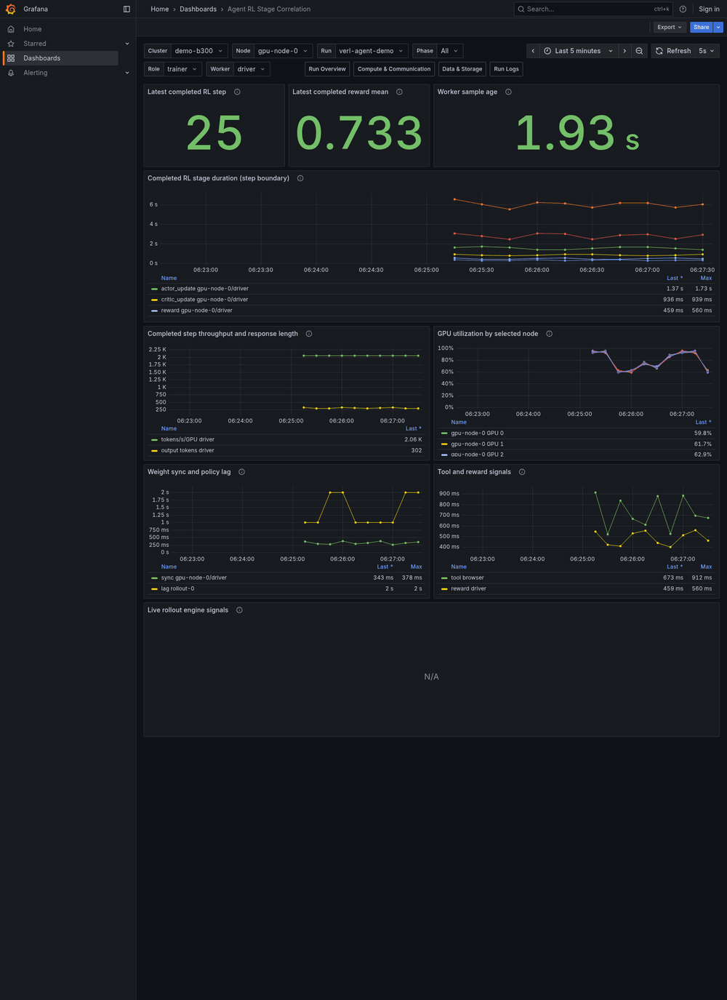

# Distributed Run Monitoring

System resource metric과 선택적인 application metric을 수집해 Prometheus와 Grafana에서 함께 확인하는 방법을 설명합니다.
helper script는 ARM64와 x86_64 Linux를 지원하며 특정 workload launcher나 cluster setup을 가정하지 않습니다.
관측 대상은 `이름=주소` 형식으로 지정하므로 node 구성에 맞게 확장할 수 있습니다.

## Monitoring Flow

Monitoring은 서로 독립적으로 생산된 두 metric 경로를 Prometheus에서 결합합니다.

| 경로 | Node에서 하는 일 | 활성화 조건 |
| --- | --- | --- |
| System Resource Metrics | host·GPU·network·storage exporter가 자원 상태를 노출 | `node` 또는 `storage` role을 실행하면 기본 활성화 |
| Application Metrics | worker JSON을 Node Exporter textfile 형식으로 변환 | workload가 metric을 기록하고 `TELEMETRY_METRICS_DIR`를 지정할 때 활성화 |

1. 각 node에서 collector를 실행합니다.
2. 필요하면 같은 node에서 application metric과 topology 수집을 추가합니다.
3. controller의 local storage에서 Prometheus와 Grafana를 시작합니다.
4. Grafana에서 application run·worker와 같은 시간 범위·node의 system resource metric을 함께 봅니다.

Application 계측 코드를 연결하는 방법은 [Application Metrics Guide](application-metrics.md)를 따릅니다.
이 문서는 이미 생성된 두 metric 경로를 수집하고 표시하는 운영 절차에 집중합니다.

## Start Monitoring

### 1. Prepare Tools

`install_telemetry_tools.sh`는 host architecture에 맞는 userspace 도구를 내려받습니다.
driver와 system package는 설치하지 않습니다.

관측할 node에서는 기본 도구를, controller에서는 server 도구를 설치합니다.
`TOOLS_DIR`은 node 또는 controller의 local 경로로 반드시 지정합니다.

```bash
TOOLS_DIR='<node-local-tools>' \
  bash scripts/install_telemetry_tools.sh
```

```bash
TOOLS_DIR='<controller-local-tools>' \
  bash scripts/install_telemetry_tools.sh server
```

### 2. Start Collectors on Each Node

#### System Resource Metrics

`node` role은 다음 process를 시작합니다.

- node exporter: host 지표를 19100 포트에 노출
- GPU sampler: GPU 지표를 수집하고 textfile metric과 JSONL을 생성
- 선택 기능: application metrics, topology, local SSD health, node-local log 전송

GPU sampler의 기본 실행 시간은 15분입니다.
시간이 지나면 sampler가 종료되고 script가 함께 시작한 exporter와 선택적 collector를 정리한 뒤 `node` role도 종료됩니다.
`DURATION`은 초 단위로 변경할 수 있습니다.

```bash
NODE_ADDR='<node-management-address>' \
OUTPUT_DIR='<node-local-monitoring-state>' \
DURATION=3600 \
  bash scripts/run_telemetry.sh node
```

`TOPOLOGY_DIR`를 지정하면 `compute-topology.json`과 `storage-topology.json`의 component·edge를 Grafana에 표시합니다.
이 정보는 연결 관계일 뿐 bandwidth나 latency 측정값은 아닙니다.

#### Application Metrics

학습 loss·처리량·step time을 dashboard에 표시하려면 launcher가 쓰는 application metrics 디렉터리를 같은 node의 collector에 전달합니다.

```bash
NODE_ADDR='<node-management-address>' \
OUTPUT_DIR='<node-local-monitoring-state>' \
TELEMETRY_METRICS_DIR='<launcher-output>/telemetry-metrics' \
DURATION=3600 \
  bash scripts/run_telemetry.sh node
```

[`post_training_telemetry.metrics.textfile`](../post_training_telemetry/metrics/textfile.py)은 worker JSON을 읽어 다음 metric을 node exporter의 textfile collector로 전달합니다.

- 공통: `training_loss`, `training_tokens_per_second`, `training_step_time_seconds`, `training_step`
- Megatron: `training_timer_seconds{timer="..."}`

`TELEMETRY_METRICS_DIR`를 생략하면 application metrics만 수집하지 않으며 host·GPU monitoring은 계속됩니다.
각 node에는 node-local 경로를 지정해야 합니다.
여러 node가 같은 NFS 디렉터리를 읽으면 동일한 worker가 여러 `instance`에 중복됩니다.

Dashboard의 freshness 처리는 다음과 같습니다.

| 대상 | 기본 유효 시간 | 시간이 지난 뒤 |
| --- | --- | --- |
| GPU metric | 30초 | panel에서 숨김 |
| 학습 metric·GPU allocation | `Training sample max age (s)` 300초 | panel에서 숨김 |
| worker별 sample age | 제한 없이 표시 | 갱신이 중단된 worker 확인에 사용 |

긴 step에서는 `Training sample max age (s)`를 늘립니다.
오래되거나 없는 allocation 정보를 GPU가 비어 있다는 뜻으로 해석하지 않습니다.

### 3. Start the Monitoring Server

Monitoring server는 GPU workload와 자원 경합이 없도록 controller에서 실행합니다.
`OUTPUT_DIR`과 `TOOLS_DIR`에는 NFS checkout 밖의 controller-local 경로를 지정합니다.
Controller가 각 node의 management address와 exporter port에 접근할 수 있어야 합니다.

`TELEMETRY_TARGETS`에 `이름=주소` 항목을 쉼표로 연결합니다.
node 수와 역할은 고정하지 않습니다.

```bash
TOOLS_DIR='<controller-local-tools>' \
OUTPUT_DIR='<controller-local-monitoring-state>' \
CLUSTER_NAME='<cluster-name>' \
TELEMETRY_TARGETS='trainer-0=<first-node-address>,rollout-0=<second-node-address>' \
  bash scripts/run_telemetry.sh server
```

| 항목 | 동작 |
| --- | --- |
| Prometheus | controller의 `127.0.0.1:19090`에서 실행 |
| Grafana | controller의 `127.0.0.1:13000`에서 실행 |
| 시작 확인 | 두 HTTP endpoint와 Prometheus query를 확인한 뒤 URL과 `startup-summary.json`을 출력 |
| 기본 접근 권한 | anonymous Viewer |
| 관리자 비밀번호 | 필요할 때만 `GRAFANA_ADMIN_PASSWORD`로 지정 |
| 설정만 생성 | `SERVER_CONFIG_ONLY=1`이면 service를 시작하지 않고 provisioning 파일만 생성 |
| 종료 | server를 실행한 terminal에서 세션을 종료하면 함께 시작한 service를 정리 |

`TELEMETRY_SOURCES_FILE`에 [Agent RL native source 목록](../examples/verl/native-sources.json)을 지정하면 server role이 vLLM, Ray, 3FS exporter endpoint를 검증하고 `native` scrape job에 추가합니다.
동적 rollout endpoint는 VERL 또는 RL-Insight의 자체 등록을 우선하며 자세한 구성은 [Agent RL Telemetry Guide](agent-rl.md)를 따릅니다.

#### Move an Existing Server to the Controller

기존 Spark node에서 monitoring server를 실행 중이면 먼저 해당 server를 유지한 채 controller server를 병행 실행합니다.
두 Prometheus가 같은 exporter를 scrape해도 서로 다른 local TSDB에 저장하므로 이전 검증 동안 함께 실행할 수 있습니다.

Controller에서 Prometheus target, Grafana health와 실제 run metric을 확인한 뒤 Spark node의 server를 종료합니다.
Spark node의 기존 server data는 즉시 삭제하지 않고 rollback 기간 동안 보존합니다.
문제가 생기면 controller server를 종료하고 기존 Spark node server를 다시 시작하며 workload와 node collector는 중단하지 않습니다.

### 4. Enable Run Logs

Loki는 controller에서 실행하고 각 Spark node의 Alloy가 그 node의 local log file을 전송합니다.
공유 NFS는 code 배포에만 사용하며 log 원본, Alloy position과 Loki data에는 사용하지 않습니다.

먼저 controller의 management address에 Loki를 bind합니다.
이 구성은 인증을 사용하지 않으므로 public interface가 아니라 Spark node만 접근할 수 있는 관리망 주소를 지정합니다.
기본 보존 기간은 7일이며 `LOKI_RETENTION`으로 바꿀 수 있습니다.

```bash
TOOLS_DIR='<controller-local-tools>' \
OUTPUT_DIR='<controller-local-monitoring-state>' \
CLUSTER_NAME='<cluster-name>' \
TELEMETRY_TARGETS='trainer-0=<first-node-address>,rollout-0=<second-node-address>' \
ENABLE_LOGS=1 \
LOKI_LISTEN_ADDR='<controller-management-address>' \
  bash scripts/run_telemetry.sh server
```

각 Spark node에서 workload 이름과 node-local output root를 `TELEMETRY_LOG_ROOTS`에 전달합니다.
Alloy는 각 root의 `<run-id>/logs/**/*.log`를 찾으므로 launcher 종류와 무관하게 같은 규칙을 사용할 수 있습니다.
TRL, Megatron과 Verl launcher가 이 규칙을 사용하며 이후 agentic RL workload도 `logs` 아래에 file을 기록하면 별도 Loki 연동 코드가 필요 없습니다.

```bash
NODE_ADDR='<node-management-address>' \
NODE_NAME='<node-name>' \
OUTPUT_DIR='<node-local-monitoring-state>' \
CLUSTER_NAME='<cluster-name>' \
LOKI_PUSH_URL='http://<controller-management-address>:13100/loki/api/v1/push' \
TELEMETRY_LOG_ROOTS='trl=<node-local-trl-output-root>,megatron=<node-local-megatron-output-root>,verl=<node-local-verl-output-root>' \
DURATION=3600 \
  bash scripts/run_telemetry.sh node
```

`run_telemetry.sh`는 log root의 filesystem을 확인하고 NFS/NFS4이면 시작을 거부합니다.
Alloy는 읽은 offset을 node-local `OUTPUT_DIR/alloy-data`에 저장하므로 재시작 뒤 이미 전송한 구간부터 이어서 처리합니다.
처음 연결할 때는 과거 file 전체를 한꺼번에 적재하지 않도록 기본 24시간보다 오래된 file을 제외하며 `ALLOY_IGNORE_OLDER_THAN`으로 조정할 수 있습니다.
Alloy는 `cluster`, `node`, `workload`만 직접 index label로 설정하고 `run_id`, 상대 log file과 원본 경로는 log record 안에 넣어 stream cardinality 증가를 막습니다.

`Post-Training Run Logs` dashboard에서 cluster, node, workload와 run을 선택합니다.
Run Overview의 `Run Logs` 링크는 현재 시간 범위와 run 선택을 유지합니다.

```bash
PYTHONPATH=. python -m post_training_telemetry.stack validate-stack \
  --prometheus-url http://127.0.0.1:19090 \
  --grafana-url http://127.0.0.1:13000 \
  --loki-url http://<controller-management-address>:13100 \
  --output '<validation-summary.json>'
```

### 5. Open the Dashboards

Controller에는 GUI browser가 없으므로 browser가 있는 client에서 SSH port forwarding을 사용합니다.
다음 명령은 controller의 Grafana port를 client의 `localhost:13000`으로 전달합니다.

```bash
ssh -NT -L 13000:127.0.0.1:13000 <user>@<controller-ssh-alias>
```

client browser에서 `http://localhost:13000`을 엽니다.

| Dashboard | 확인할 내용 |
| --- | --- |
| Run Overview (`run-overview.json`, uid `telemetry-overview`) | target 상태·sample age, GPU utilization matrix, worker별 throughput·step time·loss |
| Agent RL Stage Correlation | run → stage → worker/node/device → reward·tool·sync evidence |
| Run Logs | node-local run log 검색과 시간순 history |
| Compute & Communication | GPU health·memory, worker timer, interface throughput, GPU allocation·compute topology |
| Data & Storage | node-local device·filesystem 성능, storage topology, 선택적 SSD SMART |

화면 링크는 시간·cluster·node·run 선택을 유지합니다.
`server` role은 `examples/dashboards/`의 metric dashboard 네 개를 provisioning 경로로 복사하고 `ENABLE_LOGS=1`이면 Run Logs도 추가합니다.
같은 경로의 `grafana/`와 `compose.yaml`은 별도 Docker Compose 예시입니다.

## Synthetic Live Demo

실제 GPU나 storage 없이 dashboard 동작을 확인하려면 controller에서 실행합니다.

```bash
TOOLS_DIR='<controller-local-tools>' \
OUTPUT_DIR='<controller-local-monitoring-state>' \
DEMO_LIVE=1 \
  bash scripts/run_telemetry.sh server
```

| 구성 | Demo 값 |
| --- | --- |
| Cluster | `demo-b300` |
| Compute | GPU node 4개, node당 B300 GPU 8개 |
| Storage | storage node 8개, node당 SSD 4개 |
| Network | node당 synthetic traffic 최대 800Gbps RoCE |
| 반복 주기 | 정상 학습 → data wait → collective → checkpoint → recovery, 100초 |
| Dummy Agent run | `verl-agent-demo`, 완료 step 6초 간격과 live tool/policy signal |

Dashboard에서는 `cluster=demo-b300`, `node=All`, `run_id=live-demo`를 선택합니다.
Agent RL 동작만 확인할 때는 `Agent RL Stage Correlation`에서 `run_id=verl-agent-demo`, `node=gpu-node-0`을 선택합니다.

| 관찰 구간 | 기대 변화 |
| --- | --- |
| 정상 학습 | GPU utilization과 학습 지표 갱신 |
| `data_wait` | storage read·busy time 상승 |
| `collective` | communication timer·RoCE traffic 상승 |
| `checkpoint` | storage write 상승 |

GPU 내부 NVLINK와 node-to-fabric RoCE 관계는 topology matrix에서 확인합니다.
Topology는 전달된 연결 관계이며 link bandwidth나 endpoint별 traffic 측정값은 아닙니다.

### Run Overview Example

아래 GIF는 30초 동안 exporter 상태, sample age, GPU utilization matrix가 갱신되는 모습을 보여 줍니다.
Synthetic demo이므로 실제 LLM 학습 결과로 해석하지 않습니다.


### VERL Agent RL Example

아래 GIF는 같은 simulator가 만든 dummy VERL Agent run을 30초 동안 기록한 화면입니다.
6초마다 completed step, stage duration, reward, throughput이 바뀌고 tool latency와 policy lag는 scrape마다 갱신됩니다.
이는 실제 VERL 학습이나 성능 측정이 아니라, dashboard 연결과 시간 경계를 확인하는 재현 가능한 입력입니다.



해석할 때 주의할 점:

- unavailable/null인 NVML 값을 사용량 0으로 읽지 않습니다.
- system memory와 학습 process의 CUDA allocated/reserved peak를 구분합니다.
- GPU utilization matrix의 index는 sampler가 보고한 device index이며 allocation이 아닙니다.
- interface·RDMA counter는 endpoint별 traffic matrix가 아닙니다.
- device·filesystem 지표는 특정 run의 단독 사용량이 아닙니다.

Simulator는 Prometheus의 `telemetry`와 `storage-smart` job에 metric을 제공합니다.
fixture는 `examples/live-demo/`에 있으며 `DEMO_TOPOLOGY_DIR`, `DEMO_ADDR`, `DEMO_PORT`로 경로와 listen address를 바꿀 수 있습니다.

## SSD Health

SSD health는 특정 run의 write 양이 아니라 장치 이상과 장기 열화를 확인하는 선택 기능입니다.

### Prerequisites and Permissions

| 항목 | 확인할 내용 |
| --- | --- |
| Exporter | `smartctl_exporter`는 telemetry 도구 설치에 포함 |
| System package | `smartctl`을 제공하는 `smartmontools`는 별도 설치 |
| NVMe 권한 | `/dev/nvmeN`의 admin-passthrough ioctl 접근 필요 |
| 자동 권한 처리 | 필요하면 exporter가 아닌 `smartctl`만 passwordless sudo로 실행 |
| 권한 강제 설정 | `SMARTCTL_SUDO=1` 또는 `SMARTCTL_SUDO=0` |

sudo를 사용할 때는 시작 전에 `sudo -n smartctl --scan`을 실행하며 실패하면 collector를 시작하지 않습니다.
이 검사가 성공해도 exporter log와 실제 SMART metric을 함께 확인합니다.

### Collect a Local SSD

compute node의 local SSD는 기존 `node` role에서 활성화합니다.

```bash
NODE_ADDR='<node-management-address>' \
OUTPUT_DIR='<node-local-monitoring-state>' \
ENABLE_SSD_HEALTH=1 \
  bash scripts/run_telemetry.sh node
```

### Collect Dedicated Storage Nodes

별도 storage node에서는 GPU sampler 없이 `storage` role만 실행합니다.
helper script를 사용할 수 없는 host에서는 `smartctl_exporter`를 따로 설치하고 실행 파일 경로를 지정합니다.

```bash
NODE_ADDR='<storage-node-management-address>' \
OUTPUT_DIR='<storage-node-local-monitoring-state>' \
SMARTCTL_EXPORTER='<smartctl-exporter-path>' \
  bash scripts/run_telemetry.sh storage
```

| 설정 | 기본값 |
| --- | --- |
| Exporter port | `SMARTCTL_PORT=19633` |
| SMART 조회 주기 | `SMARTCTL_INTERVAL=60s` |
| Exporter 경로 | `SMARTCTL_EXPORTER`로 재정의 |
| smartctl 경로 | `SMARTCTL`로 재정의 |

짧은 scrape 주기를 사용해도 SSD firmware가 SMART 값을 같은 주기로 갱신한다는 보장은 없습니다.

### Add Storage Targets

Controller의 monitoring server에는 compute target과 storage target을 함께 전달합니다.

```bash
TOOLS_DIR='<controller-local-tools>' \
OUTPUT_DIR='<controller-local-monitoring-state>' \
CLUSTER_NAME='<cluster-name>' \
TELEMETRY_TARGETS='trainer-0=<trainer-address>,trainer-1=<trainer-address>' \
STORAGE_SYSTEM='3fs' \
STORAGE_TARGETS='storage-0=<storage-address>,storage-1=<storage-address>' \
  bash scripts/run_telemetry.sh server
```

`STORAGE_SYSTEM`에는 `local`, `3fs`, `pnfs`처럼 배치를 식별하는 값을 사용합니다.
Data & Storage dashboard는 `cluster → storage system → storage node → SSD` 순서로 필터링합니다.

### Read SSD Metrics

| Metric | 의미 |
| --- | --- |
| Critical warning | 0이면 정상 metric, N/A이면 metric 없음 |
| Temperature | 현재 장치 온도 |
| Percentage used | vendor가 추정한 endurance 사용률 |
| Available spare | 남은 spare 비율 |
| Media errors | 복구되지 않은 media error 누계 |
| Lifetime host bytes written | host가 controller에 기록한 누계 |

`smartctl_device_bytes_written`에는 garbage collection과 wear leveling의 내부 NAND write가 포함되지 않습니다.
따라서 SSD write amplification으로 해석하지 않습니다.
`percentage_used`는 짧은 실행에서 변하지 않을 수 있으므로 장기 추세에 사용합니다.

분산 filesystem에서는 replication과 data-server layout 때문에 client write와 개별 SSD write가 일대일로 대응하지 않습니다.
SSD metric을 특정 run이나 client에 귀속하지 않습니다.
Storage topology component·edge와 SMART 시계열의 `instance` label에는 같은 storage node 이름을 사용합니다.

Docker Compose 예시는 `targets/storage.json`을 읽습니다.

```json
[
  {
    "targets": ["storage-0.example:19633"],
    "labels": {
      "cluster": "<cluster-name>",
      "storage_system": "pnfs",
      "instance": "storage-0"
    }
  }
]
```

dashboard나 collector 구성을 변경한 뒤에는 해당 `server` 또는 `node` role을 다시 시작합니다.
