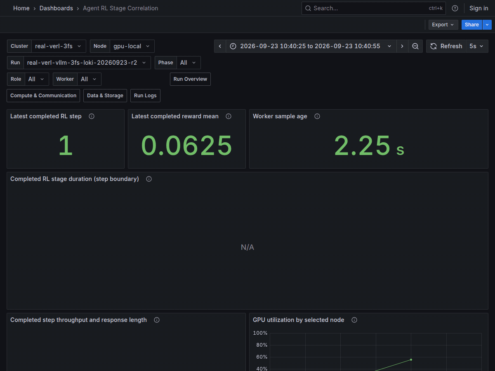

# Real VERL + vLLM + 3FS + Loki Demo

이 GIF는 `agentic-rl-lab`의 실제 VERL 학습에서 vLLM KV block을 3FS FUSE 마운트에 오프로드하고, 학습 로그를 Alloy와 Loki로 수집한 Grafana 화면입니다.
완료된 step 1–8을 시간순으로 재생한 뒤 Agent RL, Run Overview, Compute & Communication, Data & Storage, Run Logs 대시보드를 스크롤합니다.
Data & Storage의 `Mount`는 실제 3FS 마운트이며, Run Logs는 같은 실행의 VERL 로그를 보여 줍니다.



## Watch the Recording

GIF는 45초 동안 저장된 실제 시계열을 재생합니다.
그래프의 x축은 2026-09-23 10:40:25–10:43:20(KST)의 수집 시각이며, 처음 12초에는 시간 범위의 끝을 완료 step에 맞춰 이동해 step 1–8을 순서대로 보여 줍니다.
이후 다섯 대시보드를 스크롤하므로 화면 전환 시각은 학습 단계의 경계가 아닙니다.
각 화면의 목적과 패널 해석은 [Dashboard Guide](dashboards.md)에 정리했습니다.

## Recorded Run

| 항목 | 기록된 실행 |
| --- | --- |
| 실행일 | 2026-09-23 |
| Telemetry run ID | `real-verl-vllm-3fs-loki-20260923-r2` |
| Lab 결과 디렉터리 | `xlayer-verl-vllm-3fs-loki-20260923-r2` |
| Workload | GSM8K tool-agent loop, GRPO + LoRA + FSDP2, async vLLM rollout |
| 모델 | `Qwen/Qwen2.5-1.5B-Instruct` revision `989aa7980e4cf806f80c7fef2b1adb7bc71aa306` |
| Framework | VERL `896a9bba5c5ccd3f000d3d2f7c99d921cfd49236`, vLLM `0.24.0`, PyTorch `2.11.0+cu130` |
| 결과 | 8 training steps, 종료 코드 0, 3FS의 KV `.bin` 파일 682개(약 299 MiB) |
| Metrics | VERL file logger → xlayer bridge → node collector, vLLM `/metrics`, 3FS FUSE filesystem → Prometheus → Grafana |
| Logs | `<lab-results>/logs/training.log` → Alloy → Loki → Run Logs |

vLLM은 [filesystem KV tier](https://docs.vllm.ai/en/latest/features/kv_offloading_usage/#filesystem-fs)의 `root_dir`로 3FS FUSE 마운트를 사용했습니다.
3FS 마운트에서 KV 파일을 확인했고, 학습 중 수집한 vLLM `kv_offload_total_bytes_total`의 GPU→CPU 및 CPU→GPU 카운터가 증가했습니다.
3FS ClickHouse의 같은 시간대 `distributions`에는 `fuse.write.latency` 632회와 `storage.req_write.succ_latency` 682회가 기록됐습니다.
이 값은 공유 마운트의 관측치이며 이번 실행만의 I/O로 분리한 수치가 아닙니다.

이번 경로는 **POSIX/FUSE I/O**입니다.
USRBIO API를 직접 호출한 실행이나 USRBIO 성능 측정으로 해석하면 안 됩니다.
Data & Storage의 disk throughput·IOPS·busy time은 node 전체의 NVMe 지표이며, 3FS `Mount`의 filesystem 용량 지표와 별개입니다.
3FS 서비스의 ClickHouse latency와 SMART exporter는 이 GIF의 Grafana 패널에 연결하지 않았으므로 관련 패널은 비어 있습니다.
Reward mean은 0이었으므로 이 데모는 모델 품질 개선의 증거가 아닙니다.
Run Logs에는 일부 tool-call decode error도 보이지만 학습 프로세스는 종료 코드 0으로 완료됐습니다.

Run Logs의 `Run` 변수에는 telemetry run ID 대신 lab 결과 디렉터리 이름이 들어갑니다.
Alloy가 `<log-root>/<run-directory>/logs/**/*.log` 경로에서 이 값을 추출하기 때문입니다.

## Reproduce the Run

3FS가 POSIX FUSE 경로에 마운트돼 있고 KV 파일을 저장할 하위 디렉터리에 쓰기 권한이 있어야 합니다.
`agentic-rl-lab`의 dataset과 Docker sandbox image는 해당 저장소의 `README.md`에 따라 준비합니다.
[Monitoring Guide](monitoring.md#monitor-one-gpu-node)에 따라 node collector와 server를 시작하고, server에는 `ENABLE_LOGS=1`, node에는 `LOKI_PUSH_URL`과 `TELEMETRY_LOG_ROOTS`를 지정합니다.
Node collector의 `TELEMETRY_METRICS_DIR`는 아래 결과 디렉터리의 `telemetry/telemetry-metrics`로 설정합니다.

```bash
export LAB_ROOT=/path/to/agentic-rl-lab
export THREEFS_MOUNT=/path/to/3fs/poc-mount
export RESULTS_DIR="$LAB_ROOT/results/xlayer-verl-vllm-3fs-$(date -u +%Y%m%dT%H%M%SZ)"
export MODEL_ID=Qwen/Qwen2.5-1.5B-Instruct
export MODEL_REVISION=989aa7980e4cf806f80c7fef2b1adb7bc71aa306
export VERL_LOGGER='["console","file"]'
export VERL_TRAINING_STEPS=8
export VERL_SAVE_FREQ=-1 VERL_TEST_FREQ=2
export VLLM_KV_OFFLOAD_DIR="$THREEFS_MOUNT/vllm-poc/$(basename "$RESULTS_DIR")"
export VLLM_KV_OFFLOAD_CPU_BYTES=268435456
export NCCL_NET_PLUGIN=none NCCL_NET=Socket NCCL_IB_DISABLE=1

TELEMETRY_PYTHON="$PWD/.venv/bin/python" \
  bash scripts/run_verl_with_telemetry.sh \
    --output "$RESULTS_DIR/telemetry" \
    --run-id "$(basename "$RESULTS_DIR")" \
    --node gpu-local --execution-mode async \
    -- bash "$LAB_ROOT/scripts/run-qwen3-4b-agentic.sh"
```

명령은 xlayer-telemetry 저장소 루트에서 실행합니다.
이 host에서는 처음 실행 때의 `ncclNetInit()` 충돌을 피하려고 위 NCCL socket 설정을 사용했습니다.
동적으로 정해지는 vLLM `/metrics` 주소를 학습이 시작된 직후 [Native Endpoint 등록](agent-rl.md#register-native-endpoints) 절차로 Prometheus의 `native` job에 추가해야 offload·queue 패널을 기록할 수 있습니다.
`VERL_SAVE_FREQ=-1`로 checkpoint 저장을 끄고 validation은 두 step마다 실행했습니다.
실행 후 `python -m xlayer_telemetry.show_run "$RESULTS_DIR/telemetry"`로 step snapshot과 event를 확인할 수 있습니다.
