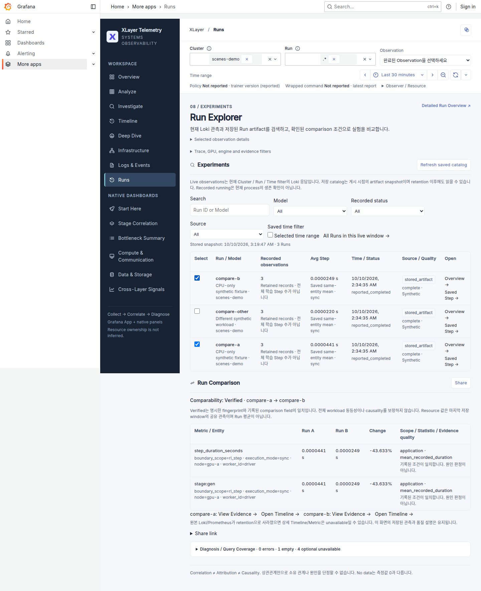
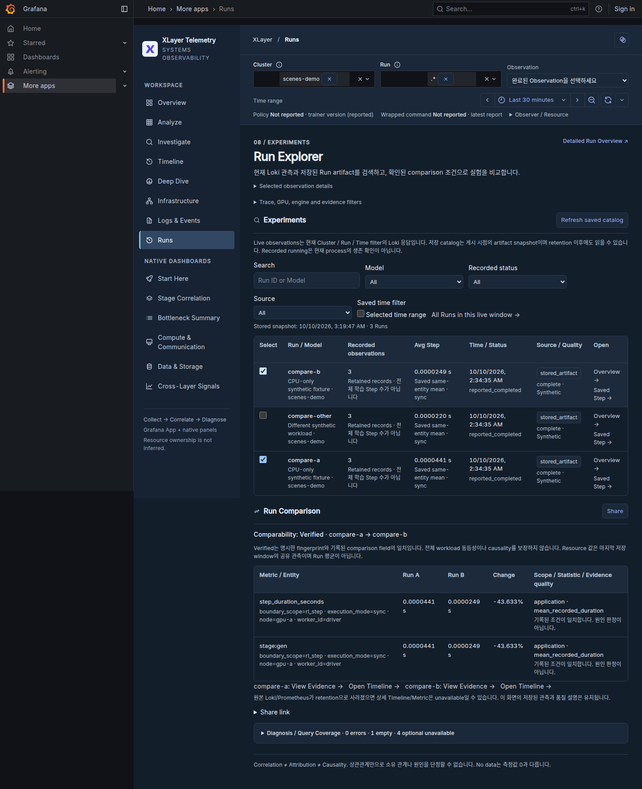

# Run Explorer & Comparison

:::{container} xlayer-page-meta
**Task** Run 검색 → 저장 catalog 게시 → 비교 조건 확인 → Evidence / Timeline
:::

**목표:** 현재 Loki 관측과 저장된 Run artifact를 구분해 실험을 찾고 비교합니다. Artifact 요약은 기존 Grafana dashboard provisioning으로 게시하며 새 DB나 서비스를 사용하지 않습니다.

## 준비 조건

- [Grafana App](grafana-scenes-poc.md)과 기존 canonical dashboard.
- 저장 Run의 `telemetry-manifest.json`·`telemetry-events/verl-steps.jsonl`; resource 비교에는 기존 `diagnostics/diagnostics.jsonl`.
- Monitoring host에서 읽을 수 있는 artifact root. Remote collector의 파일을 자동 복사하거나 임의 경로를 manifest에서 따라 읽지 않습니다.

## 1. Configure

Model과 비교 cohort는 Run metadata로 기록합니다. 다음 flag는 framework argv·weights 설정과 Prometheus label을 변경하지 않습니다.

```bash
xltel run --mode sync --model Qwen3 --workload-fingerprint batch64-context2k-v1 \
  -- /path/to/verl-env/bin/python -m verl.trainer.main_ppo ...
```

**정상 결과:** Manifest의 `configuration.model_identifier`·`workload_fingerprint`에 명시한 값이 저장됩니다. Token·tool mix·batch·concurrency·실행 방식이 바뀌면 cohort 이름도 바꿉니다. Fingerprint만 같아도 source field·entity·scope·계측 품질이 다르면 delta를 보류합니다.

## 2. Explore saved Runs

```bash
xltel runs list
xltel runs list --search grpo --model Qwen3 --json
xltel runs list --after 2026-10-10T00:00:00Z --json
xltel runs compare RUN_A RUN_B --json
```

**정상 결과:** Run ID·Model·retained observation 수·same-entity 평균 duration·기록된 status를 확인합니다. 같은 Run ID가 여러 cluster/observer에서 발견되면 JSON의 exact `key`로 선택합니다. `--root`는 별도 artifact parent 또는 한 Run을 지정합니다.

| 표시 | 해석 |
| --- | --- |
| Stored artifact | 마지막 게시 시점의 저장 요약. Live process health 아님 |
| Loki window | 현재 filter·retention 안의 반환 observation. 전체 Run 평균 아님 |
| Reported completed / failed / running | Wrapper가 기록한 마지막 command 상태. Async Run 전체 또는 현재 생존을 증명하지 않음 |
| N/A average | 여러 Node/Worker/boundary 또는 duration 부재. 임의 합산하지 않음 |
| Synthetic | Synthetic fixture. 실제 모델/GPU/storage 측정과 구분 |

## 3. Publish & Compare

```bash
xltel runs publish
xltel app status
```

**정상 결과:** 선택한 server의 dashboard provisioning directory에 `xlayer-run-catalog.json`이 생성됩니다. 기존 provider가 반영한 뒤 App의 **Runs → Refresh saved catalog**에서 검색·Model/Status/Source filter·두 Run 선택·Run Comparison을 사용합니다. 원본 artifact의 새 기록은 자동 재게시하지 않으므로 필요할 때 명령을 다시 실행합니다.

별도 server에는 `xltel runs publish --root /path/to/saved-runs --output /path/to/provisioned-dashboards`를 사용합니다. 현재 host의 artifact만 읽습니다. 실행 중인 Grafana가 실제로 watch하는 directory인지 확인하고 기존 datasource·auth·user DB는 변경하지 않습니다.

**Saved time filter**는 기존 Scene Time Range를 사용합니다. 기본으로 저장 Run은 전체 catalog에서 찾을 수 있으며, checkbox를 켜면 해당 시간 구간으로 좁힙니다. Live Loki는 항상 기존 Cluster/Run/Time filter를 사용합니다.

검색어·Model·Recorded status·Source·Saved time filter와 비교 A/B는 기존 context URL에 보존합니다. Evidence / Timeline 이동 후 Browser Back, reload, Share link 재진입에서 같은 선택을 복원합니다. 필터 편집은 history를 replace하므로 글자마다 Back 항목을 추가하지 않습니다.

Multi-job live demo는 완료된 producer artifact·실제 query/diagnosis 결과로 catalog를 게시합니다. `Synthetic`과 model metadata를 보존하며 weights를 실행한 결과로 표시하지 않습니다. 기존 최상위 `model.identifier`·`data_origin` artifact도 읽지만, 표준 `configuration`과 충돌하면 Model을 보류하거나 origin을 mixed로 표시하고 비교 delta를 제한합니다. 기록되지 않은 Cluster·mode는 추정하지 않습니다.

## 4. Verify comparison





| 판정 / 조건 | 동작 |
| --- | --- |
| Verified | 명시 Model·mode·fingerprint·origin과 기록된 workload 모집단·scope/entity·statistic/quality가 일치 |
| Partial | Missing fingerprint·source/coverage·metric 품질 등. 확인되지 않은 row의 delta 없음 |
| Incomparable | 확인된 Model·mode·origin·fingerprint 차이. Delta 없음 |
| Measured zero | `0` 유지. Run A가 0이면 relative delta 없음; percentage-point 변화는 별도 |
| Shared resource | 마지막 저장 diagnosis window의 값. Run 평균이나 소유량 아님 |
| GPU / 3FS quality 부족 | Raw 값과 이유 유지. Clock·sampling·unit/statistic/entity 확인 없이 delta 없음 |

```{admonition} Verified의 범위
:class: important

Verified는 명시한 comparison field와 기록된 모집단의 일치입니다. 관측하지 않은 tool mix·routing·resource ownership·전체 workload 동등성을 보증하지 않습니다. Correlation ≠ Attribution ≠ Causality를 유지합니다.
```

Run은 최대 100개, Run별 JSONL은 16 MiB·5,000 record, 표시 metric은 100개, catalog는 4 MiB로 제한합니다. Partial·truncated 상태를 숨기지 않으며 큰 이력에서는 `--root`를 좁힙니다. 평균 duration은 같은 entity에서 계산하고 p99를 여러 보고 구간의 pooled percentile로 만들지 않습니다.

1 MiB를 넘는 catalog도 같은 destination에 다시 게시할 수 있습니다. 게시 파일은 compact JSON을 사용하고, 이전 형식의 공백과 dashboard wrapper를 포함한 읽기는 별도 상한을 둡니다. 사용자 파일이나 소유권이 확인되지 않는 destination은 덮어쓰지 않습니다.

실제 health writer의 `finished`와 이전 artifact의 `exited`를 함께 읽습니다. 성공·실패·중단은 `reported_completed / reported_failed / reported_interrupted`, 수집 완전성은 별도 `telemetry_status`이며 workload 성공과 telemetry 실패를 혼합하지 않습니다. JSONL 읽기 중 삭제·교체·append가 확인되면 그 관측은 partial로 보류하고 평균을 `0`으로 채우지 않습니다. 한 Run의 읽기 오류는 `unavailable_runs`에 남기고 다른 Run의 탐색은 유지하며, 게시 쓰기가 실패하면 기존 catalog를 보존합니다.

## 5. Evidence / Share

- **Saved Step Evidence / Saved Step Timeline:** 마지막 완료 Step의 Run·record·observer·시간을 기존 화면으로 전달합니다.
- **Resource Evidence / Resource Timeline:** 자원 값 옆의 링크는 그 값을 생성한 diagnosis의 원래 시간 구간·trigger·observer와 확인된 resource label을 사용합니다. 이후 생성된 periodic diagnosis를 마지막 완료 Step으로 연결하지 않습니다. 구간이 없는 이전 artifact는 raw 값을 유지하고 이동 불가 안내를 표시합니다. Retention으로 원본이 사라졌으면 상세 query는 unavailable일 수 있습니다.
- **단위:** Run A와 Run B는 각각 기록된 단위를 표시합니다. 단위가 다르면 변환을 추정하지 않고 delta를 보류합니다.
- **Share:** 두 exact Run key와 Cluster/Node/Time/Theme을 URL에 보존합니다. 수신자도 같은 Grafana와 catalog 접근 권한이 필요합니다.
- **Browser Back / Theme:** 조사 context를 유지합니다. Datasource option에서 사라진 archived Run을 다른 Run으로 자동 교체하지 않습니다.

## 문제가 생겼다면

| 상태 | 행동 |
| --- | --- |
| Saved catalog unavailable | `xltel runs publish`; watch directory와 Grafana 권한 확인 |
| Query failure | Grafana API/datasource 권한과 backend 상태 확인. No data나 0으로 읽지 않음 |
| Shared link의 Run 없음 | 같은 catalog snapshot을 게시하거나 exact Run을 다시 선택 |
| Partial / delta N/A | 표시된 field·entity·coverage 이유를 확인. 없는 metadata를 추정해 채우지 않음 |
| 과거 Run만 없음 | `--root`·catalog 상한·등록한 artifact를 확인. Remote 파일은 자동 discover하지 않음 |

## 다음

[Slow Step Investigation](dashboards.md) · [Baseline 계약](diagnosis-reference.md) · [Correlation 한계](correlation-limitations.md)

[CPU/Synthetic 검증 기록](validation/app-run-explorer-20261010.json)은 실제 Grafana의 3회 Desktop/Mobile·Light/Dark journey와 설치/update/rollback 검사입니다. 실제 GPU·물리 multi-node·veRL/3FS workload 검증은 포함하지 않습니다.
