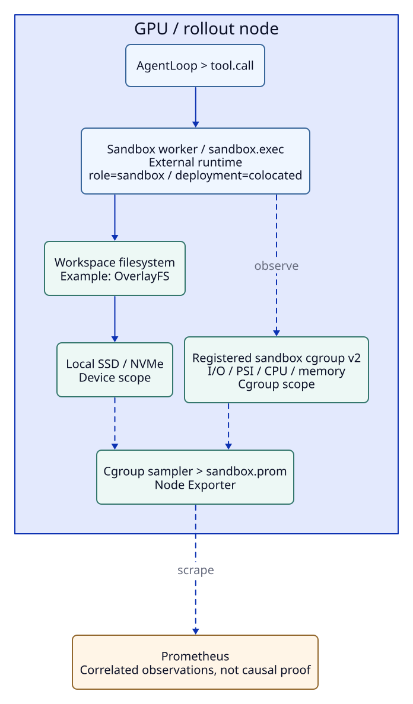

# Sandbox 관측

**목표:** 외부 sandbox lifecycle span과 안정적인 worker cgroup의 자원 관측을 연결합니다.

## 얻는 것

- 직접 계측한 acquire/exec/release 등 lifecycle span.
- Cgroup v2 CPU·memory·I/O·PSI와 지원되는 event counter.
- 같은 node/device의 local storage와 비교할 supporting evidence.

## 준비 조건

| 조건 | 확인 |
| --- | --- |
| 외부 runtime adapter | XLayer는 runtime·scheduler를 제공하지 않습니다. |
| 안정적인 worker cgroup v2 subtree | 실제 관측할 path와 권한 |
| Node identity | Colocated 또는 dedicated sandbox node 이름 |
| Logs/Timeline 필요 시 | [Loki와 EventRecorder](logs-events.md) 연결 |

```{admonition} Scope
:class: important

Docker CLI worker의 cgroup이 container resource를 포함한다고 가정하지 않습니다. Cgroup PSI와 node/device busy는 다른 scope이며 개별 trajectory의 SSD 사용량이 아닙니다.
```

## 1. Configure

1. [SandboxRecorder integration](integration-reference.md#record-lifecycle-spans)으로 실제 runtime lifecycle을 감쌉니다.
2. Dedicated 배치는 trace/parent context와 실제 sandbox node를 전달합니다.
3. [Sampler 설정](integration-reference.md#sample-the-sandbox-worker-cgroup)에서 실제 worker cgroup과 output path를 지정합니다.



## 2. Start

선택한 adapter·sampler를 workload/collector 배포에서 시작합니다. Existing runtime을 종료하거나 새 sandbox scheduler로 대체하지 않습니다.

```bash
xltel status
xltel inspect RUN_ID
```

**정상 결과:** 기록한 sandbox span과 활성화한 cgroup source만 나타납니다. Pool occupancy는 runtime producer가 `sandbox_active`·`sandbox_queued`를 기록할 때만 채워집니다.

## 3. Verify

| 확인할 것 | 정상 결과 |
| --- | --- |
| Span | Trace/parent와 실제 start/end·duration |
| Cgroup | 지정한 subtree의 CPU·memory·I/O/PSI |
| Age | `Sandbox sample age`가 갱신됨 |
| Device evidence | 실제 backing device major:minor / node가 확인됨 |

## 볼 화면

**Stage Correlation → Sandbox signals**에서 sandbox node를 선택합니다. **Cross-Layer Timeline**에서 exact span과 sampled cgroup/device metric을 분리해 읽습니다.

## Troubleshooting

| 상태 | 행동 |
| --- | --- |
| Span만 있고 resource 없음 | Sampler·cgroup path·읽기 권한 확인 |
| Resource가 stale | Sampler process·sample age·textfile 확인 |
| Device를 알 수 없음 | Unknown으로 남기고 [device evidence](integration-reference.md#preserve-device-evidence-in-events) 확인 |
| Pool occupancy N/A | 해당 runtime producer가 값을 제공하는지 확인 |

## 다음

[Candidate와 missing evidence](diagnosis.md) · [실환경 검증 범위](integration-reference.md#real-validation-coverage) · [Dedicated 배치](multi-node.md)
