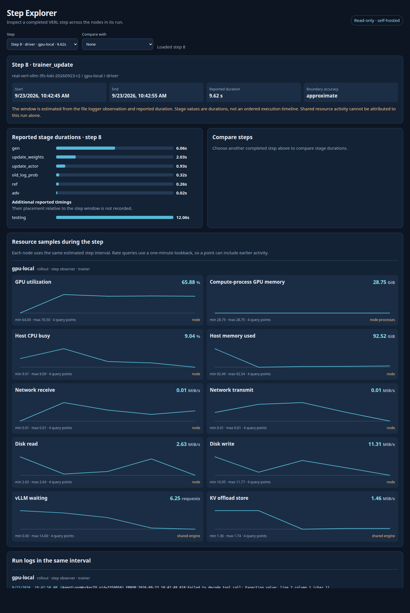

# Step Explorer

Step Explorer는 완료된 VERL step을 골라 stage 소요 시간, 참여 node별 자원 표본과 Loki log를 한 화면에서 비교하는 자체 호스팅 읽기 전용 UI입니다.
[Agent RL Stage Correlation](dashboards.md#agent-rl-stage-correlation)에서 느린 구간을 찾은 뒤 해당 step을 자세히 살펴볼 때 사용합니다.
두 step을 선택하면 stage 소요 시간과 자원 표본 평균의 차이도 보여 줍니다.



## Start the Explorer

VERL wrapper가 만든 run의 `telemetry-events/verl-steps.jsonl`이 필요합니다.
Run 파일에 접근할 수 있고 Prometheus와 Loki에도 연결되는 host에서 아래처럼 시작합니다.
`--cluster`는 Prometheus target에 붙인 실제 `cluster` label로 지정하고, `--log-run-id`는 Alloy가 log 경로에서 추출한 결과 디렉터리 이름을 사용합니다.

```bash
. .venv/bin/activate
export RESULTS_DIR='/path/to/your-run-directory'
python -m xlayer_telemetry.step_explorer \
  --run-root "$RESULTS_DIR/telemetry" \
  --cluster real-verl-3fs \
  --prometheus-url http://127.0.0.1:19090 \
  --loki-url http://127.0.0.1:13100 \
  --log-run-id "$(basename "$RESULTS_DIR")"
```

브라우저에서 `http://127.0.0.1:8765/`를 엽니다.
Agent RL 대시보드의 `Step Explorer` 링크도 같은 주소를 엽니다.
서버는 기본적으로 localhost에만 바인딩하며, 원격 host에서 실행한다면 `ssh -L 8765:127.0.0.1:8765 user@explorer-host`처럼 포트를 전달합니다.
Prometheus 없이 step과 stage 기록만 확인하려면 `--prometheus-url`, `--loki-url`, `--log-run-id`를 생략할 수 있습니다.

## Include Multiple Nodes

Step Explorer는 `topology-manifest.json`이 있으면 그 파일을, 없으면 wrapper의 `telemetry-manifest.json`을 읽어 run에 참여한 node와 역할을 찾습니다.
Wrapper의 기본 manifest는 trainer와 rollout을 모두 driver node로 기록하므로, 실제 배치가 다르면 다음처럼 별도의 topology manifest를 만듭니다.
`RUN_ID`는 step 이력의 `run_id`와 같아야 하며, 같은 역할의 node가 여러 대라면 `--role`을 반복합니다.

```bash
export RUN_ID='your-telemetry-run-id'
python -m xlayer_telemetry.manifest \
  --output "$RESULTS_DIR/telemetry/topology-manifest.json" \
  --run-id "$RUN_ID" \
  --role trainer=trainer-0 \
  --role rollout=rollout-0 \
  --role rollout=rollout-1
```

이미 다른 위치에 manifest가 있다면 시작 명령에 `--topology-manifest /path/to/topology-manifest.json`을 추가합니다.
Step 기록은 driver의 run directory에만 있어도 되며, Explorer가 각 node의 Prometheus·Loki endpoint에 직접 접속할 필요는 없습니다.
Prometheus와 Loki가 해당 node의 지표·log를 수집하고 있어야 하고, manifest의 node 이름은 Prometheus의 `instance`, native vLLM의 `node`, Loki의 `node` label과 일치해야 합니다.
Loki를 여러 node에서 조회할 때는 `--log-run-id`의 결과 디렉터리 이름이 각 node의 log 경로에서 같아야 합니다.

화면은 선택한 driver step의 공통 시간 범위에 trainer·rollout node의 resource와 log를 각각 표시합니다.
Rollout 역할의 node에서만 vLLM native 지표를 조회하며, 역할 정보가 없으면 모든 발견된 node에서 조회합니다.
다른 node의 값이 `N/A`라면 manifest 배치와 exporter target·label을 먼저 확인합니다.
Node 사이의 시계가 맞지 않으면 같은 시간 범위의 비교도 어긋날 수 있습니다.

## Read a Step

상단의 `Step`에서 완료된 step을 고릅니다.
시작·종료 시각과 `Boundary accuracy`를 먼저 확인한 뒤 stage 소요 시간, 자원 그래프, 같은 시간 범위의 log를 읽습니다.
`Compare with`에서 다른 step을 고르면 선택한 step에서 비교 step을 뺀 stage 시간과 자원 표본 평균을 볼 수 있습니다.
선택 상태는 주소의 `step`과 `compare` 매개변수에 남아 같은 run을 연 화면으로 다시 이동할 수 있습니다.

현재 VERL file logger에는 원래 step 경계 시각이 없으므로 `approximate`는 bridge가 관측한 완료 시각에서 보고된 step 시간을 빼서 만든 구간입니다.
Stage 값은 완료된 step의 소요 시간이며 stage의 실제 시작·종료 순서를 나타내지 않습니다.
`testing` 같은 추가 timing은 보고된 step duration에 포함되지 않을 수 있으므로 별도로 표시하며, 시간 범위 안에 있었다고 가정하지 않습니다.
Async 실행에서는 이 구간이 `trainer_update` 경계이고 vLLM rollout이나 3FS I/O가 같은 step에 일대일로 속한다고 보장하지 않습니다.

GPU·host·network·disk는 각 node 전체 또는 그 node의 process 합계이며, vLLM은 공유 engine 신호입니다.
CPU·network·disk·offload rate는 1분 lookback으로 계산하므로 짧은 step의 값에 직전 활동이 포함될 수 있습니다.
그래프의 query point는 Prometheus 평가 시각이며 독립된 원본 scrape 횟수를 뜻하지 않습니다.
`N/A`는 해당 시간 범위에 표본이 없다는 뜻으로 0과 구분합니다.
따라서 이 화면의 자원 평균·최댓값은 **해당 step 동안 관측된 값**이지 그 step이 사용한 자원의 정확한 귀속량이 아닙니다.

더 세밀한 CPU·CUDA 실행 흐름이 필요하면 [짧은 trace 수집](analysis.md#capture-a-short-trace)으로 좁힌 rank와 구간을 확인합니다.
