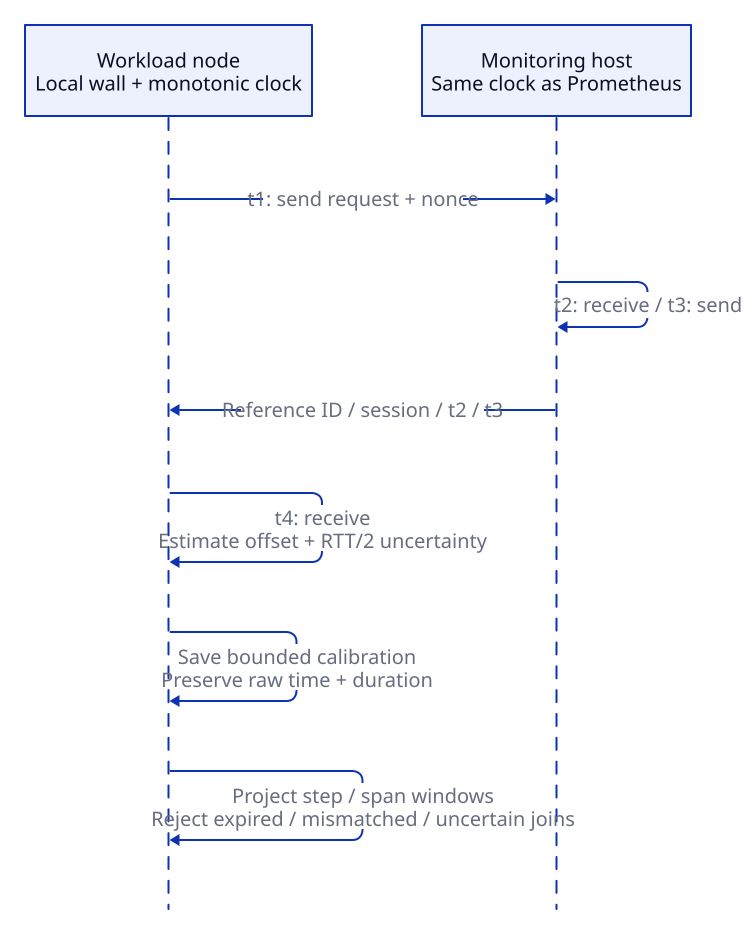

# Optional Userspace Time Alignment

OS clock을 바꿀 권한이 없어도 XLayer의 Step·Span을 monitoring host의 공통 시간축에 표시할 수 있습니다.
각 node가 monitoring host와 timestamp를 교환하여 offset과 uncertainty를 계산하며, `sudo`나 추가 package는 필요하지 않습니다.
이 기능은 선택 사항이고 기존 NTP/chrony 기반 clock check와 기본 실행 방식은 유지됩니다.

## Configure a Common Reference

1. **Prometheus와 같은 clock을 쓰는 monitoring host**에서 reference를 실행합니다.
   아래 listener는 foreground로 실행되며 `Ctrl+C`로 종료합니다.
   `--bind`에는 worker가 접근할 수 있는 private/VPN 주소를 지정합니다.

   ```bash
   xltel clock serve --bind 127.0.0.1 --port 19120 --reference-id monitor-1
   ```

2. 각 workload/sandbox node에서 자신의 calibration 파일을 만듭니다.
   `--node`는 collector·SDK의 node 이름과 일치해야 합니다.

   ```bash
   xltel clock calibrate \
     --url http://MONITOR_PRIVATE_IP:19120 --reference-id monitor-1 \
     --node gpu-a --file "$HOME/telemetry/state/clock.json" \
     --ttl 300 --interval 30
   ```

   `--interval`을 생략하면 한 번만 측정합니다.
   Continuous refresh는 foreground로 실행되며, 실패해도 기존 파일을 지우지 않습니다.
   파일이 만료되면 SDK는 보정을 중단하고 time alignment를 `unknown`으로 기록합니다.
   이 optional process는 `xltel up/down`의 관리 대상이 아니므로 사용자가 시작한 terminal/service에서 종료합니다.

3. 해당 node의 `xltel` TOML config에 파일 경로를 추가하고 workload/collector를 시작합니다.
   기존 실행 명령은 바뀌지 않습니다.

   ```toml
   [telemetry]
   NODE_NAME = "gpu-a"
   TELEMETRY_TIME_CALIBRATION_FILE = "~/telemetry/state/clock.json"
   ```

   SDK를 직접 사용하는 process에는 `TELEMETRY_TIME_CALIBRATION_FILE` 환경변수로 전달합니다.
   Remote Ray worker나 dedicated sandbox도 **자신의 node/boot에 해당하는 파일**을 사용해야 합니다.
   Launcher의 environment가 모든 remote process에 자동 전파된다고 가정하지 않습니다.

4. Diagnosis config에 reference를 명시합니다.
   이 설정은 해당 reference와 Prometheus scrape clock이 같다는 운영자의 확인입니다.

   ```json
   {
     "clock": {
       "calibration_reference": "monitor-1",
       "max_skew_seconds": 1,
       "require_sync": true
     }
   }
   ```

   기존 diagnosis config에 병합합니다.
   `clock.enabled=false`로 설정해도 이미 보정된 record의 reference 검증은 생략하지 않습니다.
   보정된 step 없이 이 설정만 켜면 `unknown`으로 보류합니다.

확인 명령:

```bash
xltel clock status --node gpu-a --file "$HOME/telemetry/state/clock.json"
xltel run -- <existing VERL command>
xltel inspect
```

## What Changes



| 데이터 | 원본 | Investigation에서 사용하는 시간 |
| --- | --- | --- |
| VERL step | `observed_at`, `ingested_at` 보존 | `analysis_window`, `window_start_ms/end_ms`, `correlation_observed_at` |
| SDK span/event | `start/end_time_unix_nano`, `timestamp_unix_nano` 보존 | `event_time_unix_nano`, `start/end_time_ms`, correlation fields |
| SDK/GPU/sandbox freshness | JSONL/snapshot의 local timestamp 보존 | freshness gauge를 reference time으로 변환; 보정 불가 시 gauge 생략 |
| Prometheus resource metric | 기존 scrape timestamp와 metric 값 | 변경 없음 |
| 3FS ClickHouse / 외부 profile·log | 기존 producer timestamp | 자동 보정하지 않음 |

Span duration은 기존 monotonic clock으로 계산합니다.
Trace/span ID, parent 연결, run·step·worker·node context와 Prometheus label은 바뀌지 않습니다.
Loki의 XLayer Step/Event stream은 보정된 조사 시각을 사용하지만, 일반 application stdout log의 timestamp는 다시 쓰지 않습니다.
원본 record와 `time_alignment.raw_window`는 offline 조사에 남습니다.

Grafana Timeline은 `exact`와 `calibrated`를 구분하고 calibrated lane에 `± uncertainty`를 표시합니다.
VERL file logger에서 추정한 step은 보정 후에도 `calibrated_approximate`이며 정밀한 phase trace가 되지 않습니다.
Timestamp 없는 replay/backlog도 여전히 `unknown`입니다.

## Quality and Failure Boundaries

Client send/receive를 `t1/t4`, reference receive/send를 `t2/t3`라고 하면 다음을 계산합니다.

```text
offset = ((t2 - t1) + (t3 - t4)) / 2
reference_time = node_time + offset
network_RTT = monotonic_elapsed - (t3 - t2)
uncertainty = network_RTT / 2 + assumed_drift
```

왕복 sample 중 RTT가 가장 작은 것을 선택합니다.
`RTT/2`는 nonnegative network delay와 안정적인 clock을 가정한 path asymmetry 범위이며, UTC 정확도를 보장하는 confidence score가 아닙니다.
`--drift-ppm` 기본값은 100이고, TTL 동안 허용할 clock drift의 운영상 가정입니다.
이 가정을 보장할 수 없으면 TTL을 줄이거나 시스템 동기화를 사용합니다.

Reference mismatch, node/boot mismatch, 만료, 파일 손상, 관측한 clock jump, coverage 부족이면 보정하지 않습니다.
Reference 재시작·감지된 clock jump는 session을 바꾸며 다른 session의 baseline 비교는 보류합니다.
Reference clock이 측정 사이에 바뀌는 것을 즉시 알아낼 수는 없으므로 짧은 TTL과 주기적 refresh가 필요합니다.

Diagnosis는 uncertainty가 **`min(max_skew_seconds, interval / 10)`**을 넘으면 candidate·resource baseline delta를 보류합니다.
Rule과 LLM 입력은 같은 검사를 사용하고 OS clock screening 결과도 별도로 보존합니다.
짧은 span·step은 calibration이 있어도 분석 해상도가 부족할 수 있습니다.

Refresh 파일에는 최근 최대 32개의 calibration만 보존합니다.
한 calibration의 유효 구간 안에 전체 step/span이 들어와야 하므로 TTL보다 긴 구간이나 계측 시작 전 구간은 보정할 수 없습니다.
SDK는 configured file을 process당 초당 최대 한 번 읽고 network request를 실행하지 않습니다.
파일은 node-local regular file이어야 하며 FIFO·잘못된 입력은 workload를 멈추지 않고 `unknown`으로 처리합니다.
느린 filesystem의 synchronous read 지연 자체까지 격리하지는 않습니다.

## Scope and Deployment Limits

`clock.calibration_reference`는 Prometheus **scrape-time** query에 적용합니다.
Exporter가 explicit sample timestamp를 내보내거나 remote-write가 별도의 producer timestamp를 보존한다면 이 가정을 사용할 수 없습니다.
3FS의 `TIMESTAMP`, 외부 profile, 일반 log까지 보정됐다고 해석하면 안 됩니다.
3FS는 기존 `threefs.clock_nodes` 검사와 producer clock 동기화가 계속 필요합니다.
Calibrated 조사에서 보정되지 않은 remote tool/sandbox event는 time join에서 제외합니다.

Listener는 TLS/authentication을 제공하지 않습니다.
Loopback·private network·Tailscale 등 신뢰하는 연결에서 사용하고 public internet에 직접 노출하지 않습니다.
Client request에는 timeout·sample 수·응답 크기 제한이 있으며, SDK가 reference outage를 기다리는 구조는 아닙니다.

이 보정은 resource attribution을 추가하지 않습니다.
같은 시간대의 GPU·NIC·NVMe·shared-service 변화는 여전히 supporting correlation입니다.
Logical clock은 이벤트 순서·parent 연결을 표현할 수 있지만 resource metric의 Unix time과 맞추는 기능을 대신하지 않습니다.
가능하면 NTP/chrony를 기본으로 사용하고, 이 기능은 시스템 clock을 바꾸기 어려운 환경에서 활용합니다.

계산의 기준은 [NTP four-timestamp model (RFC 5905)](https://www.rfc-editor.org/rfc/rfc5905.html#section-8)이며, NTP daemon이나 protocol 자체를 구현하는 것은 아닙니다.
