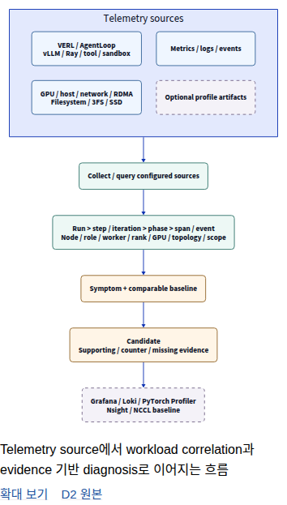
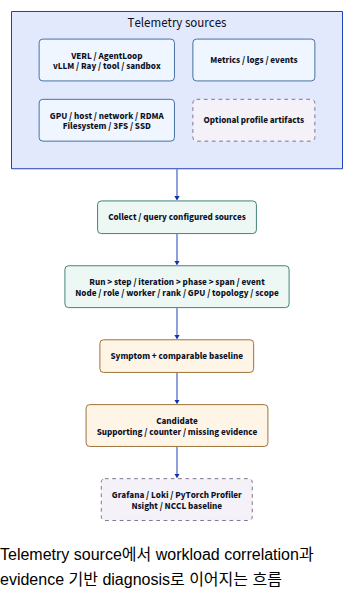

# Documentation Review — 2026-10-05

기준은 최신 `main`의 `537454fc5f53eb611b7f4f1ec5b140689046f661`입니다.
README·docs·examples의 README와 config/scripts 안내를 실제 CLI·SDK·collector·query·dashboard·테스트와 대조했습니다.
문서 내용과 도식/UI를 수정했으며 telemetry runtime·metric 이름·scope·dashboard UID는 변경하지 않았습니다.

## Scope and Inventory

기준 대상은 **153개 파일**입니다. Markdown 23개, D2 26개(공통 style 포함), SVG 25개, PNG 31개, GIF 2개, JSON 37개와 build/UI 보조 파일 9개를 포함합니다.
전체 경로·기준 SHA256·검토 방법과 모든 원문/수정문은 [검토 목록 JSON](documentation-review-20261005.json)에 있습니다.
Markdown은 본문 전체를 읽었으며 기록 JSON은 schema·version·scope·limitations를 확인했습니다.
PNG/GIF는 모두 열어 대표 frame과 캡처 근거를 확인했으며 과거 Grafana 실행을 재검증한 것으로 보지 않습니다.

## Priority and Document Ownership

P0에 해당하는 새 runtime 결함은 이번 문서 검토에서 확인하지 않았습니다.
우선 수정은 TOML 예제·clock listen 주소·private smoke prerequisite·GPU process 설정·tool event 검색 조건과 diagnosis 상태 설명입니다.

| 내용 | 기준 문서 | 다른 문서의 역할 |
| --- | --- | --- |
| 설치·최초 연결 | VERL Quickstart, Monitoring | README·Examples는 목적별 entry만 안내 |
| Config 형식·우선순위·lifecycle | CLI | Integration은 필요한 값과 restart 범위만 제시 |
| Source·metric·scope·cardinality | Metrics | Dashboard는 화면에서 읽는 단위·해석 설명 |
| Candidate·baseline·evidence·상태 | Diagnosis | Architecture는 boundary, Dashboard는 조사 순서 |
| Upstream exporter version | Diagnosis / Source contracts | Dashboard에서 링크 |
| D2 편집·build | scripts README | 사용자 figure에는 caption·한 개의 확대 동작 |
| 과거 결과·개발 판단 | Validation archive | 현재 사용 guide에 개발 test 수를 반복하지 않음 |

## Detailed Findings

아래 줄 번호는 변경 전 기준 commit의 위치입니다.
긴 삭제 절의 전체 원문은 검토 JSON과 고정 commit 링크에 보존하며 표·문장 단위의 수정은 아래에 제시합니다.

### D01 · P2 · 그림의 중복 조작

같은 SVG의 그림 링크·확대 링크와 D2 편집 링크가 매 그림마다 반복됩니다. 실제 Chrome으로 확인한 25개 그림에서 부가 링크 50개를 제거하고 그림 자체의 keyboard·accessible link를 유지했습니다. 편집 위치는 scripts README 한 곳에서 안내합니다.

분류: 문서 수정 및 figure UI 수정.
근거: [diagrams.js](https://github.com/daegyu94/xlayer-telemetry/blob/main/docs/_static/diagrams.js), [browser.test.mjs](https://github.com/daegyu94/xlayer-telemetry/blob/main/scripts/docs-browser/browser.test.mjs).

- 위치: [docs/index.md:24](https://github.com/daegyu94/xlayer-telemetry/blob/537454fc5f53eb611b7f4f1ec5b140689046f661/docs/index.md#L24).

원문:

````text
문서 그림은 D2 원본에서 생성한 SVG로 표시하며, 작은 화면에서는 **확대 보기**로 자세히 읽을 수 있습니다.
그림 아래의 짧은 설명과 **D2 원본** 링크로 의미와 편집 위치를 확인할 수 있습니다.
````

수정:

````text
그림을 누르면 원본 SVG를 새 탭에서 확대할 수 있습니다.
그림 편집 방법은 [문서 관리 안내](https://github.com/daegyu94/xlayer-telemetry/blob/main/scripts/README.md#documentation-diagrams)에 있습니다.
````

- 위치: [scripts/README.md:84](https://github.com/daegyu94/xlayer-telemetry/blob/537454fc5f53eb611b7f4f1ec5b140689046f661/scripts/README.md#L84).

원문:

````text
모바일에서는 전체 그림을 화면 폭에 맞추고 **확대 보기**로 원본 SVG를 엽니다.
그림 아래에는 alt text를 짧은 caption으로 표시하고 **D2 원본** 링크를 제공합니다.
````

수정:

````text
모바일에서는 전체 그림을 화면 폭에 맞추며 그림 자체를 눌러 원본 SVG를 엽니다.
Keyboard로 링크를 선택해 Enter로 열 수도 있습니다.
Alt text는 caption과 accessible link 이름에 사용하며, D2 편집 위치는 이 절에서만 안내합니다.
````

- 위치: [scripts/README.md:101](https://github.com/daegyu94/xlayer-telemetry/blob/537454fc5f53eb611b7f4f1ec5b140689046f661/scripts/README.md#L101).

원문:

````text
문서 사이트의 모바일 표시·caption·원본 링크·SVG geometry는 Playwright로 검사합니다.
````

수정:

````text
문서 사이트의 모바일 표시·caption·keyboard 확대·SVG geometry는 Playwright로 검사합니다.
````

### D02 · P2 · 사용 안내와 기록의 목차

이전 UX 제안이 현재 사용 가이드와 같은 Reference에 놓여 있습니다. 검증·변경 기록을 Archive / Maintainers로 분리하고 기본 읽기 흐름은 사용 가이드로 유지합니다.

분류: 문서 수정.
근거: [conf.py](https://github.com/daegyu94/xlayer-telemetry/blob/main/docs/conf.py), [index.md](https://github.com/daegyu94/xlayer-telemetry/blob/main/docs/index.md).

- 위치: [docs/index.md:79](https://github.com/daegyu94/xlayer-telemetry/blob/537454fc5f53eb611b7f4f1ec5b140689046f661/docs/index.md#L79).

원문:

````text
검증 기록 <validation/README>
Grafana UX Review <grafana-ui-ux-review>
````

수정:

````text
```

```{toctree}
:hidden:
:caption: Archive / Maintainers

검증 기록 <validation/README>
````

- 위치: [docs/validation/README.md:50](https://github.com/daegyu94/xlayer-telemetry/blob/537454fc5f53eb611b7f4f1ec5b140689046f661/docs/validation/README.md#L50).

원문:

````text
dashboards/live-ui-20261003
```
````

수정:

````text
dashboards/live-ui-20261003
../grafana-ui-ux-review
local-llm/history-20260930
documentation-review-20261005
```
````

- 위치: [docs/dashboards.md:542](https://github.com/daegyu94/xlayer-telemetry/blob/537454fc5f53eb611b7f4f1ec5b140689046f661/docs/dashboards.md#L542).

원문:

````text
UI 구조 검토와 적용 범위는 [Grafana Investigation UX Review](grafana-ui-ux-review.md)에 정리했습니다.
````

수정:

````text
UI 변경 당시의 비교 화면은 [검증 기록](validation/README.md)에 보존했습니다.
````

### D03 · P2 · LLM 안내의 검증 이력

사용법에 약 100줄의 prompt 개발 과정·이전 테스트 수·GPU 결과가 섞여 있습니다. 과거 모델 응답과 오판은 증거 가치가 있어 archive로 이동하고 현재 사용법·실패 처리·한계는 본문에 유지합니다.

분류: 문서 수정.
근거: [llm_diagnosis.py](https://github.com/daegyu94/xlayer-telemetry/blob/main/xlayer_telemetry/analysis/llm_diagnosis.py), [review-validation.json](https://github.com/daegyu94/xlayer-telemetry/blob/main/docs/validation/local-llm/review-validation.json).

- 위치: [docs/local-llm.md:270](https://github.com/daegyu94/xlayer-telemetry/blob/537454fc5f53eb611b7f4f1ec5b140689046f661/docs/local-llm.md#L270).

원문 절 시작(전체는 검토 JSON):

````text
## Recorded Validation

아래 기록은 당시 prompt·설정과 실행 범위의 관찰 결과입니다.
````

수정:

````text
## Recorded Validation

[과거 모델 검증](validation/local-llm/history-20260930.md)에 당시 prompt·latency·오판 사례와 원본 JSON을 보존했습니다.
현재 정확도나 새 workload의 검증 결과로 해석하지 않습니다.

````

### D04 · P2 · LLM lifecycle의 공식 CLI

공식 진입점은 xltel입니다. 별도 Ollama service를 기본 monitoring lifecycle이 시작하지 않는다는 설명을 유지하면서 command 이름을 통일합니다.

분류: 문서 수정.
근거: [cli.py](https://github.com/daegyu94/xlayer-telemetry/blob/main/xlayer_telemetry/cli.py), [local_llm.sh](https://github.com/daegyu94/xlayer-telemetry/blob/main/scripts/local_llm.sh).

- 위치: [docs/local-llm.md:64](https://github.com/daegyu94/xlayer-telemetry/blob/537454fc5f53eb611b7f4f1ec5b140689046f661/docs/local-llm.md#L64).

원문:

````text
일반 `verl_local.sh up`은 이 서비스를 시작하지 않습니다.
````

수정:

````text
`xltel up`은 이 서비스를 시작하지 않습니다.
````

### D05 · P1 · Subsystem log의 TOML 설정

init은 config.toml을 생성합니다. Bash 값과 $HOME을 그대로 넣으면 유효하지 않거나 잘못된 경로가 됩니다. TOML 문법, 실제 log 경로, node restart와 server Loki 조건을 명시합니다.

분류: 문서 수정.
근거: [config.py](https://github.com/daegyu94/xlayer-telemetry/blob/main/xlayer_telemetry/operations/config.py), [run_telemetry.sh](https://github.com/daegyu94/xlayer-telemetry/blob/main/scripts/run_telemetry.sh).

- 위치: [docs/agent-rl.md:86](https://github.com/daegyu94/xlayer-telemetry/blob/537454fc5f53eb611b7f4f1ec5b140689046f661/docs/agent-rl.md#L86).

원문:

````text
```bash
ENABLE_LOGS=1
TELEMETRY_LOG_ROOTS="verl=$HOME/telemetry-runs,ray=$HOME/ray-log-archives"
```
````

수정:

````text
기본 `xltel` config의 기존 `[telemetry]`에 다음 값을 추가하고 `xltel restart --role node`를 실행합니다.
Server의 Loki도 활성화되어 있어야 합니다.

```toml
ENABLE_LOGS = true
TELEMETRY_LOG_ROOTS = "verl=/absolute/path/to/verl-runs,ray=/absolute/path/to/ray-log-archives"
```
````

### D06 · P1 · Native endpoint 설정

Native endpoint는 monitoring server의 Prometheus가 직접 scrape합니다. Bash config 중심 안내를 TOML로 바꾸고, host metric용 node collector와 endpoint scrape의 요구사항을 구분합니다.

분류: 문서 수정.
근거: [config.py](https://github.com/daegyu94/xlayer-telemetry/blob/main/xlayer_telemetry/operations/config.py), [run_telemetry.sh](https://github.com/daegyu94/xlayer-telemetry/blob/main/scripts/run_telemetry.sh).

- 위치: [docs/agent-rl.md:130](https://github.com/daegyu94/xlayer-telemetry/blob/537454fc5f53eb611b7f4f1ec5b140689046f661/docs/agent-rl.md#L130).

원문:

````text
Source 파일 경로는 `$HOME/telemetry/config/native-sources.json`을 사용합니다.
Node collector도 실행되어 있어야 합니다.
`verl-local.conf`에 `TELEMETRY_SOURCES_FILE="$HOME/telemetry/config/native-sources.json"`을 지정한 뒤 `down` → `up`으로 재시작합니다.
````

수정:

````text
기존 `xltel` config의 `[telemetry]`에 source 파일 경로를 추가하고 `xltel restart --role server`를 실행합니다.
Endpoint 상태는 `xltel sources`로 확인하며, XLayer host metric도 보려면 해당 node의 collector를 실행합니다.

```toml
TELEMETRY_SOURCES_FILE = "~/telemetry/config/native-sources.json"
```

기존 Bash config에서는 `TELEMETRY_SOURCES_FILE="$HOME/telemetry/config/native-sources.json"`을 사용합니다.
````

### D07 · P1 · Diagnosis 설정 경로

기본 TOML에 diagnostics 경로를 추가하고 새 run에 적용하는 방법이 빠져 있습니다. Grafana 후보 조회에 필요한 Loki와 로컬 JSON 조회를 구분해 안내합니다.

분류: 문서 수정.
근거: [config.py](https://github.com/daegyu94/xlayer-telemetry/blob/main/xlayer_telemetry/operations/config.py), [run_verl_with_telemetry.sh](https://github.com/daegyu94/xlayer-telemetry/blob/main/scripts/run_verl_with_telemetry.sh).

- 위치: [docs/agent-rl.md:279](https://github.com/daegyu94/xlayer-telemetry/blob/537454fc5f53eb611b7f4f1ec5b140689046f661/docs/agent-rl.md#L279).

원문:

````text
`verl-local.conf`에 `DIAGNOSTICS_CONFIG="$HOME/telemetry/config/diagnostics.json"`을 지정하고 새 `RUN_ID`로 실행합니다.
`ENABLE_LOGS=1`과 Alloy·Loki를 연결하면 Bottleneck Summary와 Timeline에서도 결과를 확인할 수 있습니다.
````

수정:

````text
기존 `xltel` config의 `[telemetry]`에 아래 값을 추가하고 새 run을 시작합니다.
Grafana의 candidate·evidence 조회에는 [Loki 연결](logs-events.md)도 필요합니다.

```toml
DIAGNOSTICS_CONFIG = "~/telemetry/config/diagnostics.json"
```

기존 Bash config에서는 `DIAGNOSTICS_CONFIG="$HOME/telemetry/config/diagnostics.json"`을 사용합니다.
````

### D08 · P2 · 폐지된 화면·명령 이름

독립 Step Explorer/Detail은 제거됐습니다. Run Overview의 완료 step 선택과 Timeline 상세로 이름을 통일하며 기존 문서 anchor는 유지합니다. 3FS 명령도 xltel sources threefs로 표시합니다.

분류: 문서 수정.
근거: [provision_dashboards.py](https://github.com/daegyu94/xlayer-telemetry/blob/main/scripts/provision_dashboards.py), [cli.py](https://github.com/daegyu94/xlayer-telemetry/blob/main/xlayer_telemetry/cli.py).

- 위치: [docs/agent-rl.md:27](https://github.com/daegyu94/xlayer-telemetry/blob/537454fc5f53eb611b7f4f1ec5b140689046f661/docs/agent-rl.md#L27).

원문:

````text
단독 `threefs` 조회
````

수정:

````text
`xltel sources threefs` 조회
````

- 위치: [docs/agent-rl.md:51](https://github.com/daegyu94/xlayer-telemetry/blob/537454fc5f53eb611b7f4f1ec5b140689046f661/docs/agent-rl.md#L51).

원문:

````text
`threefs` 명령의 시간 구간별
````

수정:

````text
`xltel sources threefs`의 시간 구간별
````

- 위치: [docs/agent-rl.md:28](https://github.com/daegyu94/xlayer-telemetry/blob/537454fc5f53eb611b7f4f1ec5b140689046f661/docs/agent-rl.md#L28).

원문:

````text
Resource·SSD dashboard
````

수정:

````text
Data & Storage
````

- 위치: [docs/agent-rl.md:29](https://github.com/daegyu94/xlayer-telemetry/blob/537454fc5f53eb611b7f4f1ec5b140689046f661/docs/agent-rl.md#L29).

원문:

````text
선택적인 Logs dashboard
````

수정:

````text
Run Logs
````

- 위치: [docs/agent-rl.md:19](https://github.com/daegyu94/xlayer-telemetry/blob/537454fc5f53eb611b7f4f1ec5b140689046f661/docs/agent-rl.md#L19).

원문:

````text
Run Overview의 Step Explorer 목록
````

수정:

````text
Run Overview의 완료 step 목록
````

- 위치: [docs/verl-quickstart.md:164](https://github.com/daegyu94/xlayer-telemetry/blob/537454fc5f53eb611b7f4f1ec5b140689046f661/docs/verl-quickstart.md#L164).

원문:

````text
| Step Explorer만 비어 있음 |
````

수정:

````text
| Run Overview의 완료 step 목록만 비어 있음 |
````

- 위치: [docs/architecture.md:256](https://github.com/daegyu94/xlayer-telemetry/blob/537454fc5f53eb611b7f4f1ec5b140689046f661/docs/architecture.md#L256).

원문:

````text
Run Logs, Grafana Step Explorer
````

수정:

````text
Run Logs, Run Overview의 완료 step 목록
````

- 위치: [docs/architecture.md:279](https://github.com/daegyu94/xlayer-telemetry/blob/537454fc5f53eb611b7f4f1ec5b140689046f661/docs/architecture.md#L279).

원문:

````text
Step Explorer는 bridge가 관측한 완료 시각에서
````

수정:

````text
Bridge는 관측한 완료 시각에서
````

- 위치: [docs/architecture.md:283](https://github.com/daegyu94/xlayer-telemetry/blob/537454fc5f53eb611b7f4f1ec5b140689046f661/docs/architecture.md#L283).

원문:

````text
구간 해석은 [Step Explorer](dashboard-reference.md#read-a-step)에 자세히 설명합니다.
````

수정:

````text
구간 해석은 [완료 step 읽기](dashboard-reference.md#read-a-step)를 참고합니다.
````

- 위치: [docs/dashboards.md:118](https://github.com/daegyu94/xlayer-telemetry/blob/537454fc5f53eb611b7f4f1ec5b140689046f661/docs/dashboards.md#L118).

원문:

````text
Step Explorer는 Grafana의 Run Overview와 Cross-Layer Timeline에서 사용하며 별도 UI/server를 실행하지 않습니다.
````

수정:

````text
완료 step 선택은 Run Overview, 상세 구간 조사는 Cross-Layer Timeline에서 수행합니다.
````

### D09 · P1 · GPU process metric 조건

GPU process memory는 GPU_PROCESS_METRICS=1일 때만 수집하고 기본은 0입니다. 장치 memory와 선택적 process 관측의 조건을 명시합니다.

분류: 문서 수정.
근거: [gpu_sampler.py](https://github.com/daegyu94/xlayer-telemetry/blob/main/xlayer_telemetry/collectors/gpu_sampler.py), [config.py](https://github.com/daegyu94/xlayer-telemetry/blob/main/xlayer_telemetry/operations/config.py).

- 위치: [docs/agent-rl.md:55](https://github.com/daegyu94/xlayer-telemetry/blob/537454fc5f53eb611b7f4f1ec5b140689046f661/docs/agent-rl.md#L55).

원문:

````text
GPU를 선택하면 UUID가 해당 장치와 일치하는 process memory도 함께 볼 수 있으며,
````

수정:

````text
`GPU_PROCESS_METRICS=1`을 켠 collector에서 GPU를 선택하면 UUID가 해당 장치와 일치하는 process memory도 볼 수 있으며,
````

- 위치: [docs/dashboards.md:218](https://github.com/daegyu94/xlayer-telemetry/blob/537454fc5f53eb611b7f4f1ec5b140689046f661/docs/dashboards.md#L218).

원문:

````text
Compute-process GPU memory는 PID별 관측값이고
````

수정:

````text
`GPU_PROCESS_METRICS=1`로 수집한 compute-process GPU memory는 PID별 관측값이고
````

### D10 · P1 · Async launcher mode

공식 run option은 --mode auto/sync/async입니다. 숨겨진 launcher의 async 경계를 CLI 또는 TOML 설정으로 명확히 지정합니다.

분류: 문서 수정.
근거: [cli.py](https://github.com/daegyu94/xlayer-telemetry/blob/main/xlayer_telemetry/cli.py), [run_verl_with_telemetry.sh](https://github.com/daegyu94/xlayer-telemetry/blob/main/scripts/run_verl_with_telemetry.sh).

- 위치: [docs/verl-quickstart.md:50](https://github.com/daegyu94/xlayer-telemetry/blob/537454fc5f53eb611b7f4f1ec5b140689046f661/docs/verl-quickstart.md#L50).

원문:

````text
Trainer mode를 숨긴 launcher는 `EXECUTION_MODE=async`로 지정합니다.
````

수정:

````text
Trainer mode를 숨긴 launcher는 `xltel run --mode async -- <기존 명령>`을 사용하거나 TOML의 `[telemetry]`에 `EXECUTION_MODE = "async"`를 설정합니다.
````

### D11 · P2 · 첫 dashboard 진입

처음에는 Start Here에서 수집 상태·sample age를 확인하고 run 출력의 Run Overview 링크를 여는 흐름이 적절합니다. 상세 stage·engine은 이후 Stage Correlation에서 확인합니다.

분류: 문서 수정.
근거: [health.py](https://github.com/daegyu94/xlayer-telemetry/blob/main/xlayer_telemetry/operations/health.py), [cli.py](https://github.com/daegyu94/xlayer-telemetry/blob/main/xlayer_telemetry/cli.py).

- 위치: [docs/verl-quickstart.md:95](https://github.com/daegyu94/xlayer-telemetry/blob/537454fc5f53eb611b7f4f1ec5b140689046f661/docs/verl-quickstart.md#L95).

원문:

````text
Run Overview의 target을 확인한 뒤 Stage Correlation에서 config의 Cluster·Node·Run을 고릅니다(기본 Cluster·Node: `training-cluster`·`gpu-local`; Run ID는 실행 출력에 표시됩니다).
````

수정:

````text
Start Here에서 collector·sample age를 확인하고, 실행 출력의 Run Overview 링크를 엽니다.
Stage·engine 상세는 Stage Correlation에서 확인하며 기본 Cluster·Node는 `training-cluster`·`gpu-local`입니다.
````

### D12 · P1 · TOML·Bash 값 구분

기본 TOML에 Bash boolean·unquoted path·shell 변수 문법이 섞여 있습니다. TOML 값 형식과 shell의 $HOME이 확장되지 않는다는 사실을 안내하고 CLI Configuration을 기준으로 삼습니다.

분류: 문서 수정.
근거: [config.py](https://github.com/daegyu94/xlayer-telemetry/blob/main/xlayer_telemetry/operations/config.py), [test_cli_extensions.py](https://github.com/daegyu94/xlayer-telemetry/blob/main/tests/test_cli_extensions.py).

- 위치: [docs/verl-quickstart.md:139](https://github.com/daegyu94/xlayer-telemetry/blob/537454fc5f53eb611b7f4f1ec5b140689046f661/docs/verl-quickstart.md#L139).

원문:

````text
설정 파일에는 자주 쓰는 선택 값이 주석으로 들어 있습니다.
기본 연결이 동작한 뒤 필요한 값만 켜고 영향을 받는 process를 다시 시작합니다.
````

수정:

````text
기본 연결이 동작한 뒤 필요한 값만 기존 TOML의 `[telemetry]`에 추가합니다.
Boolean은 `true`/`false`, 경로는 따옴표로 감싼 문자열이며 `$HOME` 대신 `~` 또는 절대 경로를 사용합니다.
설정 형식과 우선순위는 [CLI Configuration](cli.md#configuration)이 기준입니다.
````

- 위치: [docs/verl-quickstart.md:144](https://github.com/daegyu94/xlayer-telemetry/blob/537454fc5f53eb611b7f4f1ec5b140689046f661/docs/verl-quickstart.md#L144).

원문:

````text
`ENABLE_LOGS=1`; server·node 재시작
````

수정:

````text
`ENABLE_LOGS = true`; server·node 재시작
````

- 위치: [docs/monitoring.md:452](https://github.com/daegyu94/xlayer-telemetry/blob/537454fc5f53eb611b7f4f1ec5b140689046f661/docs/monitoring.md#L452).

원문:

````text
단일 host [VERL config 경로](verl-reference.md#1-prepare-one-config-file)를 사용한다면 `xltel config path`가 가리키는 config의 `ENABLE_LOGS=1`을 설정하고 `xltel restart`을 실행합니다.
````

수정:

````text
단일 host [VERL config 경로](verl-reference.md#1-prepare-one-config-file)를 사용한다면 기존 TOML의 `[telemetry]`에 `ENABLE_LOGS = true`를 설정하고 `xltel restart`를 실행합니다.
기존 Bash config에서는 `ENABLE_LOGS=1`을 사용합니다.
````

- 위치: [docs/dashboards.md:567](https://github.com/daegyu94/xlayer-telemetry/blob/537454fc5f53eb611b7f4f1ec5b140689046f661/docs/dashboards.md#L567).

원문:

````text
```bash
GF_USERS_DEFAULT_THEME='sapphiredusk'
GF_FEATURE_TOGGLES_ENABLE='extraThemes'
```
````

수정:

````text
기존 TOML의 `[telemetry]`에서 설정합니다.

```toml
GF_USERS_DEFAULT_THEME = "sapphiredusk"
GF_FEATURE_TOGGLES_ENABLE = "extraThemes"
```
````

### D13 · P1 · Run 저장 위치

자동 run의 저장 상위 경로는 TELEMETRY_RUNS_ROOT입니다. 고정 RUN_ROOT를 우선 권장하면 run별 directory와 collision 보호를 오해할 수 있어 저장 상위 경로를 안내합니다.

분류: 문서 수정.
근거: [config.py](https://github.com/daegyu94/xlayer-telemetry/blob/main/xlayer_telemetry/operations/config.py), [cli.py](https://github.com/daegyu94/xlayer-telemetry/blob/main/xlayer_telemetry/cli.py).

- 위치: [docs/verl-quickstart.md:147](https://github.com/daegyu94/xlayer-telemetry/blob/537454fc5f53eb611b7f4f1ec5b140689046f661/docs/verl-quickstart.md#L147).

원문:

````text
절대 경로 `RUN_ROOT`·`TELEMETRY_HOME`, `NODE_NAME`
````

수정:

````text
`TELEMETRY_RUNS_ROOT`·`TELEMETRY_HOME`·`NODE_NAME`; 기존 run 위치는 유지
````

### D14 · P1 · Clock server listen 주소

server를 loopback에 bind한 뒤 remote client에는 private IP를 주는 예제는 연결되지 않습니다. server/client가 같은 실제 private/VPN IP를 사용하도록 맞추고 동일 host 검증은 양쪽 loopback으로 설명합니다.

분류: 문서 수정.
근거: [clock.py](https://github.com/daegyu94/xlayer-telemetry/blob/main/xlayer_telemetry/operations/clock.py), [test_time_alignment.py](https://github.com/daegyu94/xlayer-telemetry/blob/main/tests/test_time_alignment.py).

- 위치: [docs/time-alignment.md:14](https://github.com/daegyu94/xlayer-telemetry/blob/537454fc5f53eb611b7f4f1ec5b140689046f661/docs/time-alignment.md#L14).

원문:

````text
xltel clock serve --bind 127.0.0.1 --port 19120 --reference-id monitor-1
````

수정:

````text
xltel clock serve --bind MONITOR_PRIVATE_IP --port 19120 --reference-id monitor-1
````

- 위치: [docs/time-alignment.md:11](https://github.com/daegyu94/xlayer-telemetry/blob/537454fc5f53eb611b7f4f1ec5b140689046f661/docs/time-alignment.md#L11).

원문:

````text
`--bind`에는 worker가 접근할 수 있는 private/VPN 주소를 지정합니다.
````

수정:

````text
`MONITOR_PRIVATE_IP`는 monitoring host에 실제 할당된 private/VPN IP로 바꾸며, client의 `--url`에도 같은 주소를 사용합니다.
   같은 host에서만 시험할 때에는 양쪽 주소를 `127.0.0.1`로 지정합니다.
````

### D15 · P2 · Architecture의 개발 이력

개발 과정의 KEEP/REFACTOR/REDESIGN 표와 다음 migration 제안은 현재 구조와 중복됩니다. Runtime boundary와 invariant를 유지하고 이 표·이번 refactor 설명·중복 CLI 그림은 본문에서 삭제합니다. 과거 원본 검토 JSON은 보존합니다.

분류: 문서 수정.
근거: [run_artifacts.py](https://github.com/daegyu94/xlayer-telemetry/blob/main/xlayer_telemetry/operations/run_artifacts.py), [greenfield-review-20261003.json](https://github.com/daegyu94/xlayer-telemetry/blob/main/docs/validation/greenfield-review-20261003.json).

- 위치: [docs/architecture.md:44](https://github.com/daegyu94/xlayer-telemetry/blob/537454fc5f53eb611b7f4f1ec5b140689046f661/docs/architecture.md#L44).

원문:

````text
## Greenfield Design and Migration

지금 새로 설계해도 사용자 진입점은 `xltel`, 조사 화면은 Grafana, 저장·query는 기존 backend를 선택합니다.
XLayer가 소유할 핵심은 실행 문맥과 evidence 해석이며, process 관리와 source 수집은 작은 경계로 분리합니다.
CLI의 `up/status/down`은 현재 수집 상태, `run/inspect`는 workload 실행과 저장된 결과를 다룹니다.

그림 참조: CLI runtime (`figures/diagrams/cli-runtime.svg`).

그림 참조: Runtime architecture (`figures/diagrams/runtime-architecture.svg`).


````

수정:

````text
## Runtime Architecture

Monitoring lifecycle과 workload 실행을 분리합니다.
`xltel up/down`은 관리하는 monitoring process만 제어하고, `xltel run`은 기존 VERL 명령에 bridge·manifest·선택적 diagnostics를 붙입니다.
`inspect`는 저장된 run artifact를 읽습니다.
해당 시간의 backend 데이터가 남아 있으면 진단 도구로 baseline·resource evidence를 비교할 수 있습니다.

그림 참조: Runtime architecture (`figures/diagrams/runtime-architecture.svg`).


````

- 위치: [docs/architecture.md:69](https://github.com/daegyu94/xlayer-telemetry/blob/537454fc5f53eb611b7f4f1ec5b140689046f661/docs/architecture.md#L69).

원문 절 시작(전체는 검토 JSON):

````text
### Keep, Refactor, Redesign

| 영역 | 판단 | 현재 적용과 후속 방향 |
````

수정: 해당 개발 이력 문단/표를 삭제합니다.

- 위치: [docs/architecture.md:104](https://github.com/daegyu94/xlayer-telemetry/blob/537454fc5f53eb611b7f4f1ec5b140689046f661/docs/architecture.md#L104).

원문:

````text
후속 migration은 **source capability 명시 → config/launcher 계약 통합 → 실규모 이력 조회 측정** 순서가 적절합니다.
각 단계에서 기존 CLI happy path, signal/exit 처리, optional source 부재, mixed-node negative case와 Grafana context 유지 검증을 통과해야 합니다.


````

수정: 해당 개발 이력 문단/표를 삭제합니다.

### D16 · P2 · Ray 조회 화면

Stage Correlation에 Ray orchestration row가 구현되어 있습니다. Explore에서만 볼 수 있는 듯한 이전 설명을 고칩니다.

분류: 문서 수정.
근거: [agent-rl-stages.json](https://github.com/daegyu94/xlayer-telemetry/blob/main/examples/dashboards/agent-rl-stages.json).

- 위치: [docs/architecture.md:255](https://github.com/daegyu94/xlayer-telemetry/blob/537454fc5f53eb611b7f4f1ec5b140689046f661/docs/architecture.md#L255).

원문:

````text
| vLLM·Ray native metrics | 각 `/metrics` endpoint > Prometheus `native` job | vLLM: Agent RL, Ray: Prometheus query 화면 또는 Grafana Explore·진단 |
````

수정:

````text
| vLLM·Ray native metrics | 각 `/metrics` endpoint > Prometheus `native` job | Stage Correlation의 vLLM·Ray row, Grafana Explore·진단 |
````

### D17 · P2 · GIF·screenshot의 버전

Capture manifest는 2026-10-01, dashboard baseline b6aec6e입니다. 현재/최신이라고 부르면 main과 항상 같은 UI처럼 보이므로 날짜가 있는 기록으로 표시합니다. GIF checksum도 원본과 일치했습니다.

분류: 문서 수정.
근거: [recordings-20261001.json](https://github.com/daegyu94/xlayer-telemetry/blob/main/docs/validation/dashboards/recordings-20261001.json).

- 위치: [docs/dashboards.md:351](https://github.com/daegyu94/xlayer-telemetry/blob/537454fc5f53eb611b7f4f1ec5b140689046f661/docs/dashboards.md#L351).

원문:

````text
[최신 GIF](real-verl-demo.md#watch-the-recording)
````

수정:

````text
[기록된 GIF](real-verl-demo.md#watch-the-recording)
````

- 위치: [docs/real-verl-demo.md:3](https://github.com/daegyu94/xlayer-telemetry/blob/537454fc5f53eb611b7f4f1ec5b140689046f661/docs/real-verl-demo.md#L3).

원문:

````text
실제 VERL Agent RL의 저장 데이터를 **기본 조사용 Grafana dashboard 8개**로 재생한 GIF입니다.
````

수정:

````text
실제 VERL Agent RL의 저장 데이터를 당시 Grafana 조사 화면 8개로 재생한 GIF입니다.
````

- 위치: [docs/real-verl-demo.md:7](https://github.com/daegyu94/xlayer-telemetry/blob/537454fc5f53eb611b7f4f1ec5b140689046f661/docs/real-verl-demo.md#L7).

원문:

````text
.

원문:

````text
.

원문:

````text
.

원문:

````text
![현재 Grafana Timeline에서 확인한 실제 SWE-Bench colocate_async trainer update 3]
````

수정:

````text
![2026-10-01에 캡처한 SWE-Bench colocate_async trainer update 3의 Timeline]
````

- 위치: [docs/dashboards.md:350](https://github.com/daegyu94/xlayer-telemetry/blob/537454fc5f53eb611b7f4f1ec5b140689046f661/docs/dashboards.md#L350).

원문:

````text
아래 이미지는 실제 SWE-Bench `colocate_async` 기록의 trainer update 3을 현재 Timeline에서 연 화면입니다.
````

수정:

````text
아래 이미지는 2026-10-01에 실제 SWE-Bench `colocate_async` 기록의 trainer update 3을 Timeline에서 연 화면입니다.
````

### D18 · P2 · Panel 추가 이력

추가한 panel 수·이번 fallback 수정 설명은 개발 이력입니다. 이용자가 필요한 collapsed row의 조회 시점과 시간·series 수에 따른 query 비용으로 바꿉니다.

분류: 문서 수정.
근거: [compute-communication.json](https://github.com/daegyu94/xlayer-telemetry/blob/main/examples/dashboards/compute-communication.json), [agent-rl-stages.json](https://github.com/daegyu94/xlayer-telemetry/blob/main/examples/dashboards/agent-rl-stages.json).

- 위치: [docs/dashboards.md:597](https://github.com/daegyu94/xlayer-telemetry/blob/537454fc5f53eb611b7f4f1ec5b140689046f661/docs/dashboards.md#L597).

원문:

````text
Diagnostic use cases와 기본 비용:
````

수정:

````text
필요한 상세 row:
````

- 위치: [docs/dashboards.md:607](https://github.com/daegyu94/xlayer-telemetry/blob/537454fc5f53eb611b7f4f1ec5b140689046f661/docs/dashboards.md#L607).

원문:

````text
추가한 35개 panel 모두 collapsed row 내부에 있고 기본 overview에는 추가 query를 실행하지 않습니다.
기존 live vLLM offload panel의 current/legacy fallback만 기본 화면에서 개선합니다.

````

수정:

````text
접힌 row는 펼칠 때 조회합니다.
실제 비용은 선택한 시간·series 수와 source의 수집 주기에 따라 달라집니다.

````

### D19 · P2 · UX 제안의 현재성

UX review는 2026-10-02의 설계·비교 기록입니다. 현행 Dashboard Guide가 기준임을 명시하고 archive로 안내합니다.

분류: 문서 수정.
근거: [grafana-ui-ux-review.md](https://github.com/daegyu94/xlayer-telemetry/blob/main/docs/grafana-ui-ux-review.md), [dashboards.md](https://github.com/daegyu94/xlayer-telemetry/blob/main/docs/dashboards.md).

- 위치: [docs/grafana-ui-ux-review.md:1](https://github.com/daegyu94/xlayer-telemetry/blob/537454fc5f53eb611b7f4f1ec5b140689046f661/docs/grafana-ui-ux-review.md#L1).

원문:

````text
# Grafana Investigation UX Review

````

수정:

````text
# Grafana Investigation UX Review

2026-10-02의 설계·변경 기록입니다.
현재 dashboard 구성과 사용 순서는 [Dashboard Guide](dashboards.md)가 기준이며, 아래 제안·panel 수·남은 범위는 당시 상태를 나타냅니다.

````

### D20 · P2 · Onboarding 전제

처음 연결하기 전에 architecture 전체를 읽을 필요는 없습니다. 설치 후 xltel --help 실행을 첫 완료 조건으로 삼습니다.

분류: 문서 수정.
근거: [cli.py](https://github.com/daegyu94/xlayer-telemetry/blob/main/xlayer_telemetry/cli.py).

- 위치: [README.md:65](https://github.com/daegyu94/xlayer-telemetry/blob/537454fc5f53eb611b7f4f1ec5b140689046f661/README.md#L65).

원문:

````text
| 1 | 아래의 [checkout 준비](#prepare-a-checkout) 후 [구현 구조와 설계 원칙](docs/architecture.md)을 읽습니다. | `RUN_ROOT`, collector `OUTPUT_DIR`, monitoring server의 역할을 구분할 수 있습니다. |
````

수정:

````text
| 1 | 아래의 [checkout 준비](#prepare-a-checkout)를 수행합니다. | `xltel --help`가 실행됩니다. |
````

### D21 · P2 · 용어 중복

README의 glossary·backend 설명이 Diagnosis/Architecture와 중복됩니다. 짧은 run/step 소개 후 기준 glossary로 연결합니다.

분류: 문서 수정.
근거: [diagnosis.md](https://github.com/daegyu94/xlayer-telemetry/blob/main/docs/diagnosis.md), [architecture.md](https://github.com/daegyu94/xlayer-telemetry/blob/main/docs/architecture.md).

- 위치: [README.md:91](https://github.com/daegyu94/xlayer-telemetry/blob/537454fc5f53eb611b7f4f1ec5b140689046f661/README.md#L91).

원문:

````text
## Terms Used in This Project

| 용어 | 의미 |
| --- | --- |
| Node / host | 관측 대상 machine |
| Monitoring host | Prometheus·Grafana를 실행하는 machine; 관측 node와 같은 machine이어도 됨 |
| Exporter | metric을 HTTP endpoint로 노출하는 process |
| Collector | JSON이나 장치 상태를 읽어 관측 가능한 metric으로 만드는 process |
| Target / scrape | Prometheus가 정해진 주기로 조회하는 exporter 주소 / 그 조회 동작 |
| Snapshot | 한 worker의 최신 metric을 담은 JSON; 전체 step 이력과 다름 |
| Run / `run_id` | 한 번의 workload 실행과 그 식별자 |
| Worker / rank | workload를 수행하는 process와 분산 실행에서의 번호 |
| Manifest | 실행 조건, role 배치, endpoint와 산출물 위치를 기록한 JSON |
| Span | 계측한 작업 하나의 시작·종료, 소요 시간과 상태 |
| Trace | 같은 `trace_id`를 가진 span과 parent 관계로 연결한 호출 흐름 |

Prometheus는 수치 시계열을 저장하고 Grafana는 이를 시각화합니다.
Loki는 선택적인 log 저장소이며 Alloy가 log file을 전송합니다.
각 역할은 기존 도구를 조합하고, 이 프로젝트는 계층 사이의 공통 문맥과 연결 절차를 제공합니다.


````

수정:

````text
## Terms Used in This Project

Run은 workload 실행, step은 완료된 실행 단위이며 phase·span은 그 안의 작업 구간입니다.
Metric·event·span·trace·profile과 scope의 차이는 [용어 안내](docs/diagnosis.md#what-the-signals-mean), exporter·collector의 역할은 [Architecture](docs/architecture.md#the-basic-path)를 참고합니다.


````

### D22 · P1 · 테스트 dependency

Editable package 설치에는 pytest가 없습니다. 개발 검증 명령 전에 requirements.txt 설치를 안내합니다.

분류: 문서 수정.
근거: [pyproject.toml](https://github.com/daegyu94/xlayer-telemetry/blob/main/pyproject.toml), [requirements.txt](https://github.com/daegyu94/xlayer-telemetry/blob/main/requirements.txt).

- 위치: [README.md:184](https://github.com/daegyu94/xlayer-telemetry/blob/537454fc5f53eb611b7f4f1ec5b140689046f661/README.md#L184).

원문:

````text
## Local Validation

```bash
python -m pytest -q
````

수정:

````text
## Local Validation

개발·검증용 dependency를 설치한 뒤 실행합니다.
SDK의 기본 설치에는 pytest가 포함되지 않습니다.

```bash
python -m pip install -r requirements.txt
python -m pytest -q
````

### D23 · P2 · Examples의 config 우선순위

CLI 기본 config는 TOML인데 examples index는 Bash config를 우선 안내합니다. init의 TOML을 먼저 안내하고 trusted Bash 예제는 유지합니다.

분류: 문서 수정.
근거: [config.py](https://github.com/daegyu94/xlayer-telemetry/blob/main/xlayer_telemetry/operations/config.py), [cli.md](https://github.com/daegyu94/xlayer-telemetry/blob/main/docs/cli.md).

- 위치: [examples/README.md:14](https://github.com/daegyu94/xlayer-telemetry/blob/537454fc5f53eb611b7f4f1ec5b140689046f661/examples/README.md#L14).

원문:

````text
| 기존 VERL 명령을 한 host에서 연결 | [verl-local.conf](verl-local.conf) | 실행 가능한 VERL 명령을 입력하고 [quickstart](../docs/verl-quickstart.md)를 따릅니다. |
````

수정:

````text
| 기존 VERL 명령을 한 host에서 연결 | `xltel init`의 TOML config | [Quickstart](../docs/verl-quickstart.md)를 따릅니다. 기존 Bash 예제는 [verl-local.conf](verl-local.conf)로 유지합니다. |
````

- 위치: [examples/README.md:54](https://github.com/daegyu94/xlayer-telemetry/blob/537454fc5f53eb611b7f4f1ec5b140689046f661/examples/README.md#L54).

원문:

````text
`.conf`는 trusted local Bash 설정이고 JSON/YAML은 해당 adapter나 service의 입력입니다.
````

수정:

````text
기본 CLI config는 TOML이며 `.conf`는 trusted local Bash 설정입니다.
JSON/YAML은 해당 adapter나 service의 입력입니다.
````

### D24 · P2 · Compose dashboard 수

Compose는 metrics 화면 5개 외에 Overview/Focus workspace 2개도 provision합니다. Examples index를 실제 Compose README·provisioner와 일치시킵니다.

분류: 문서 수정.
근거: [README.md](https://github.com/daegyu94/xlayer-telemetry/blob/main/examples/dashboards/README.md), [provision_dashboards.py](https://github.com/daegyu94/xlayer-telemetry/blob/main/scripts/provision_dashboards.py).

- 위치: [examples/README.md:20](https://github.com/daegyu94/xlayer-telemetry/blob/537454fc5f53eb611b7f4f1ec5b140689046f661/examples/README.md#L20).

원문:

````text
현재 공통 metrics dashboard 5개를 사용합니다.
````

수정:

````text
공통 metrics dashboard 5개와 Overview·Focus workspace 2개를 사용합니다.
````

### D25 · P1 · Private lab prerequisite

verl-lab의 HTTP 404는 인증된 gh repo view에서 PRIVATE로 확인했습니다. 공개 VERL 도입과 private lab smoke를 구분하고 접근 권한 prerequisite를 명시합니다.

분류: 문서 수정.
근거: [run_verl_lab_smoke.sh](https://github.com/daegyu94/xlayer-telemetry/blob/main/examples/sandbox/run_verl_lab_smoke.sh), [verl_lab_swebench_tools.py](https://github.com/daegyu94/xlayer-telemetry/blob/main/examples/sandbox/verl_lab_swebench_tools.py).

- 위치: [docs/real-verl-demo.md:63](https://github.com/daegyu94/xlayer-telemetry/blob/537454fc5f53eb611b7f4f1ec5b140689046f661/docs/real-verl-demo.md#L63).

원문:

````text
실행 가능한 [verl-lab](https://github.com/daegyu94/verl-lab)·dataset·Docker image에서 [sandbox integration](sandbox.md)을 연결합니다.
````

수정:

````text
이 smoke recipe는 private [verl-lab](https://github.com/daegyu94/verl-lab) 접근 권한과 준비된 dataset·Docker image가 필요합니다.
공개 VERL 도입에는 lab checkout이 필요하지 않으며 [기존 VERL 명령 연결](verl-quickstart.md)을 사용합니다.
Lab 환경에서는 [sandbox integration](sandbox.md)을 연결합니다.
````

- 위치: [docs/agent-rl.md:428](https://github.com/daegyu94/xlayer-telemetry/blob/537454fc5f53eb611b7f4f1ec5b140689046f661/docs/agent-rl.md#L428).

원문:

````text
veRL `function_tool_path`로 연결하는 실제 예시는 [verl-lab SWE-Bench adapter]
````

수정:

````text
아래 adapter·smoke recipe는 private `verl-lab` 접근 권한과 해당 lab의 dataset·grader가 필요합니다.
공개 VERL 사용에는 lab 없이 [기존 명령 연결](verl-quickstart.md)을 적용합니다.
veRL `function_tool_path`로 연결하는 실제 예시는 [verl-lab SWE-Bench adapter]
````

- 위치: [examples/README.md:21](https://github.com/daegyu94/xlayer-telemetry/blob/537454fc5f53eb611b7f4f1ec5b140689046f661/examples/README.md#L21).

원문:

````text
verl-lab·모델·dataset·grader image와 Docker가 필요합니다.
````

수정:

````text
SWE-Bench adapter는 private verl-lab 접근 권한·모델·dataset·grader image와 Docker가 필요합니다. Calculator 예제는 해당 tool runtime을 사용합니다.
````

### D26 · P2 · D2의 화면명·data path

4개 D2에 폐지된 화면명 또는 inspect가 backend를 query하는 듯한 이름이 남았습니다. Run Overview/Timeline·diagnosis query 역할로 바꾸고 SVG를 재생성합니다.

분류: 문서 수정 및 D2/SVG 재생성.
근거: [show_run.py](https://github.com/daegyu94/xlayer-telemetry/blob/main/xlayer_telemetry/show_run.py), [diagnostics.py](https://github.com/daegyu94/xlayer-telemetry/blob/main/xlayer_telemetry/analysis/diagnostics.py).

- 위치: [docs/diagrams/verl-bridge.d2:17](https://github.com/daegyu94/xlayer-telemetry/blob/537454fc5f53eb611b7f4f1ec5b140689046f661/docs/diagrams/verl-bridge.d2#L17).

원문:

````text
Step Explorer / Step Detail
````

수정:

````text
Run Overview / Timeline
````

- 위치: [docs/diagrams/node-metrics-and-events.d2:14](https://github.com/daegyu94/xlayer-telemetry/blob/537454fc5f53eb611b7f4f1ec5b140689046f661/docs/diagrams/node-metrics-and-events.d2#L14).

원문:

````text
: Step Explorer {
````

수정:

````text
: completed steps {
````

- 위치: [docs/diagrams/pipeline-events.d2:12](https://github.com/daegyu94/xlayer-telemetry/blob/537454fc5f53eb611b7f4f1ec5b140689046f661/docs/diagrams/pipeline-events.d2#L12).

원문:

````text
Run Logs / Step Explorer / Timeline
````

수정:

````text
Run Logs / Run Overview / Timeline
````

- 위치: [docs/diagrams/pipeline-metrics.d2:14](https://github.com/daegyu94/xlayer-telemetry/blob/537454fc5f53eb611b7f4f1ec5b140689046f661/docs/diagrams/pipeline-metrics.d2#L14).

원문:

````text
XLayer run diagnosis / inspect
````

수정:

````text
XLayer diagnosis queries
````

### D27 · P1 · Tool span 검색 조건

실제 tool_span_window는 *.jsonl의 event 의미로 찾습니다. agent prefix가 필수라는 설명을 삭제하고 같은 run의 정상 종료 tool.call·tool attribute·분석 구간 조건을 설명합니다.

분류: 문서 수정.
근거: [diagnostics.py](https://github.com/daegyu94/xlayer-telemetry/blob/main/xlayer_telemetry/analysis/diagnostics.py), [test_diagnostics.py](https://github.com/daegyu94/xlayer-telemetry/blob/main/tests/test_diagnostics.py).

- 위치: [docs/diagnosis.md:294](https://github.com/daegyu94/xlayer-telemetry/blob/537454fc5f53eb611b7f4f1ec5b140689046f661/docs/diagnosis.md#L294).

원문:

````text
진단 process가 이 directory를 읽을 수 있어야 하며 파일명이 `agent`로 시작하고 `attributes.tool`이 있는 정상 종료 span만 대상입니다.
````

수정:

````text
진단 process가 이 directory를 읽을 수 있어야 합니다.
파일명과 producer에 관계없이 같은 run의 정상 종료 `tool.call` 중 `attributes.tool`이 있고 분석 구간 안에서 시작·종료한 span을 사용합니다.
````

### D28 · P1 · Rule catalog 누락·상한

이미 구현된 host/stage PSI·Ray mmap·queue latency 8개 rule ID가 표에서 빠져 있습니다. 또 supporting-only 후보에 strong_signal 조건이라는 공통 제목이 부적절합니다. 실제 rule과 상태 상한을 보완합니다.

분류: 문서 수정.
근거: [diagnosis_analysis.py](https://github.com/daegyu94/xlayer-telemetry/blob/main/xlayer_telemetry/analysis/diagnosis_analysis.py), [test_metric_query_profiles.py](https://github.com/daegyu94/xlayer-telemetry/blob/main/tests/test_metric_query_profiles.py).

- 위치: [docs/diagnosis.md:260](https://github.com/daegyu94/xlayer-telemetry/blob/537454fc5f53eb611b7f4f1ec5b140689046f661/docs/diagnosis.md#L260).

원문:

````text
| Rule | `strong_signal`에 필요한 evidence | 주의 |
````

수정:

````text
| Rule | 주요 evidence | 판정 범위·주의 |
````

- 위치: [docs/diagnosis.md:271](https://github.com/daegyu94/xlayer-telemetry/blob/537454fc5f53eb611b7f4f1ec5b140689046f661/docs/diagnosis.md#L271).

원문:

````text
| `host_memory_pressure` | available memory 부족과 swap/paging activity | Memory 부족만으로 강한 결론을 내리지 않습니다. |
````

수정:

````text
| `host_memory_pressure` | available memory 부족과 swap/paging activity | Memory 부족만으로 강한 결론을 내리지 않습니다. |
| `host_cpu_stalls`, `host_memory_stalls`, `host_io_stalls` | Step slowdown과 해당 resource의 host PSI 증가 | Node 전체 대기와의 동시 관측이며 최대 `supporting_signal`입니다. |
| `actor_update_cpu_stalls`, `critic_update_cpu_stalls`, `checkpoint_io_stalls` | 해당 stage slowdown과 CPU 또는 I/O PSI 증가 | Resource window는 전체 step이며 최대 `supporting_signal`입니다. |
| `ray_object_store_disk_pressure` | Step slowdown과 Ray disk-backed mmap bytes | 현재 gauge이며 spill throughput이 아닙니다. 최대 `supporting_signal`입니다. |
| `rollout_queue_latency` | Rollout slowdown과 동일 entity의 queue p95 증가 | Histogram 추정치와의 상관이며 최대 `supporting_signal`입니다. |
````

### D29 · P2 · 남은 alias

refresh-sources와 Step Explorer가 별도 command/menu처럼 남아 있습니다. 공식 command와 완료 step 선택으로 통일하고 기존 section anchor는 유지합니다.

분류: 문서 수정.
근거: [cli.py](https://github.com/daegyu94/xlayer-telemetry/blob/main/xlayer_telemetry/cli.py), [dashboards.md](https://github.com/daegyu94/xlayer-telemetry/blob/main/docs/dashboards.md).

- 위치: [docs/agent-rl.md:146](https://github.com/daegyu94/xlayer-telemetry/blob/537454fc5f53eb611b7f4f1ec5b140689046f661/docs/agent-rl.md#L146).

원문:

````text
`refresh-sources`는
````

수정:

````text
`xltel sources refresh`는
````

- 위치: [docs/monitoring.md:487](https://github.com/daegyu94/xlayer-telemetry/blob/537454fc5f53eb611b7f4f1ec5b140689046f661/docs/monitoring.md#L487).

원문:

````text
Step Explorer는 event의 ID·시간을 읽고 Prometheus의 자원 그래프와 연결하므로 두 저장소의 보존 기간을 확인합니다.
````

수정:

````text
Run Overview·Timeline은 event의 ID·시간을 Prometheus 자원 그래프와 연결하므로 두 저장소의 보존 기간을 확인합니다.
````

- 위치: [docs/dashboards.md:120](https://github.com/daegyu94/xlayer-telemetry/blob/537454fc5f53eb611b7f4f1ec5b140689046f661/docs/dashboards.md#L120).

원문:

````text
[Step Explorer](dashboard-reference.md#open-in-grafana)
````

수정:

````text
[완료 step 선택](#open-in-grafana)
````

- 위치: [docs/dashboards.md:121](https://github.com/daegyu94/xlayer-telemetry/blob/537454fc5f53eb611b7f4f1ec5b140689046f661/docs/dashboards.md#L121).

원문:

````text
[Step Explorer](#step-explorer)
````

수정:

````text
[완료 step 목록](#step-explorer)
````

### D30 · P2 · Exporter source 중복

같은 upstream version/commit을 두 문서에서 관리합니다. Diagnosis의 Source contracts를 기준으로 통합하며 Dashboard의 단위·scope 해석은 유지합니다.

분류: 문서 수정.
근거: [diagnosis.md](https://github.com/daegyu94/xlayer-telemetry/blob/main/docs/diagnosis.md), [dashboards.md](https://github.com/daegyu94/xlayer-telemetry/blob/main/docs/dashboards.md).

- 위치: [docs/dashboards.md:635](https://github.com/daegyu94/xlayer-telemetry/blob/537454fc5f53eb611b7f4f1ec5b140689046f661/docs/dashboards.md#L635).

원문 절 시작(전체는 검토 JSON):

````text
Exporter contract sources:
[Node Exporter PSI](https://github.com/prometheus/node_exporter/blob/v1.9.1/collector/pressure_linux.go),
[diskstats](https://github.com/prometheus/node_exporter/blob/v1.9.1/collector/diskstats_common.go),
````

수정:

````text
Exporter의 version별 이름·지원 범위는 [Source contracts](diagnosis-reference.md#source-contracts-and-remaining-gaps)를 확인합니다.
설치한 endpoint의 실제 `/metrics`가 기준이며 optional metric이 없으면 N/A로 남깁니다.

````

### D32 · P2 · Archive index 정보량

Archive index의 개별 변경·테스트 수 32행은 사용 가이드 선택에 불필요합니다. 검증 목적별로 묶고 전체 원본 보관 위치로 연결합니다.

분류: 문서 수정.
근거: [README.md](https://github.com/daegyu94/xlayer-telemetry/blob/main/docs/validation/README.md).

- 위치: [docs/validation/README.md:8](https://github.com/daegyu94/xlayer-telemetry/blob/537454fc5f53eb611b7f4f1ec5b140689046f661/docs/validation/README.md#L8).

원문 절 시작(전체는 검토 JSON):

````text
| --- | --- |
| [Diagram layout review](diagram-layout-20261004.json) | D2 25개 그림의 설명 구조 재검토·6개 재설계, source를 관통하던 화살표 3곳 제거, caption·확대·원본 링크와 12개 페이지의 320–1440px browser regression |
| [D2 documentation diagrams](d2-diagrams-20261004.json) | ASCII 그림 24개 교체, D2/SVG 25개·label 238개 실제 Chrome 확인, 11개 문서의 1440/900/390px·확대 링크·넘침 검사와 826개 test |
````

수정 절 시작(전체는 검토 JSON):

````text
| --- | --- |
| [Training·sandbox](sandbox/validation-20260930.json), [async follow-up](async-followup-20261001.json) | 실제 단일 host VERL·vLLM·Docker 실행 범위와 tool/cgroup 연결. 물리 multi-node 학습과 구분합니다. |
| [3FS·subsystem](subsystem-telemetry-20261003.json), [Mooncake](mooncake-telemetry-20261003.json) | 실제 3FS I/O·ClickHouse·native endpoint 경로와 수집하지 못한 signal. |
````

- 위치: [docs/validation/README.md:52](https://github.com/daegyu94/xlayer-telemetry/blob/537454fc5f53eb611b7f4f1ec5b140689046f661/docs/validation/README.md#L52).

원문:

````text

- [Metric audit final verification](metric-audit-verification-20261003.json): 775 passed, zero failed/skipped; hardware validation boundaries are explicit.

````

수정:

````text

Metric audit의 당시 최종 범위는 [검증 원본](metric-audit-verification-20261003.json)에 있습니다.

````

### D31 · P2 · 문서 regression과 CI 범위

문서 배포 workflow의 path filter가 examples/dashboards·scripts·config README 변경을 놓칩니다.
Sphinx의 내부 문서 참조 검사만으로는 루트/Examples README의 파일·heading 링크를 모두 검사하지 못합니다.
분류: 코드·CI 수정. `**/README.md`와 문서 test를 trigger에 추가하고 CPU-only 링크 검사 2개를 docs CI에 연결했습니다.
위치: [docs.yml:6](https://github.com/daegyu94/xlayer-telemetry/blob/537454fc5f53eb611b7f4f1ec5b140689046f661/.github/workflows/docs.yml#L6), 신규 [링크 테스트](https://github.com/daegyu94/xlayer-telemetry/blob/main/tests/test_documentation_links.py).
Before: README 일부만 trigger; README의 파일·heading 링크를 CI에서 별도로 검사하지 않음.
After: 모든 README 변경에서 문서 gate 실행; local/main 링크와 heading 검사, 불량 링크·코드 예제의 false positive regression 검증.

## Preserved, Moved and Removed

| 자료 | 결정 | 이유 |
| --- | --- | --- |
| 실제 training·Docker cgroup·3FS·Mooncake·VM·Ollama 원본 JSON | 보존 | Backend/hardware의 실제 검증 경계와 장애 근거가 있음 |
| GIF·before/after PNG | 보존·날짜 명시 | Workflow와 변경 근거, checksum/provenance 유지 |
| Local LLM의 prompt·개별 응답 이력 | Archive로 이동 | 현재 사용법보다 평가 방법·오판 검토에 필요 |
| Grafana UX proposal | Archive 목차로 이동 | 현재 구성 대신 당시 판단으로 표시 |
| Architecture의 KEEP/REFACTOR/REDESIGN·이번 refactor·migration 제안 | 본문 삭제 | 현행 boundary 설명으로 대체; 원본 review JSON은 보존 |
| 반복 glossary·upstream source 표 | 기준 문서로 통합 | 서로 다른 version/정의로 갈라질 가능성 감소 |
| Figure 아래 D2 원본·별도 확대 링크 | 제거 | 그림 자체의 접근 가능한 확대 동작과 중복 |

## Recommended Reading Structure

1. Start Here → Monitoring demo 또는 VERL Quickstart.
2. CLI에서 config·lifecycle·저장 경로 확인.
3. Cross-Layer Integration에서 사용하는 subsystem만 연결.
4. Dashboard에서 Run → Step → Candidate → Evidence → Timeline → Detail 조사.
5. SDK 직접 계측·Diagnosis·Metrics·Time Alignment·Local LLM은 필요한 경우 참조.
6. Archive / Maintainers에는 변경·검증 근거와 문서 관리 방법을 둡니다.

## File-by-File Review

| Markdown 파일 | 검토 결과·처리 |
| --- | --- |
| `README.md` | 전체 본문 검토; D20, D21, D22 |
| `config/README.md` | 전체 본문 검토; 코드·예제·링크 대조 후 유지 |
| `docs/agent-rl.md` | 전체 본문 검토; D05, D06, D07, D08, D09, D25, D29 |
| `docs/application-metrics.md` | 전체 본문 검토; 코드·예제·링크 대조 후 유지 |
| `docs/architecture.md` | 전체 본문 검토; D08, D15, D16 |
| `docs/cli.md` | 전체 본문 검토; 코드·예제·링크 대조 후 유지 |
| `docs/dashboards.md` | 전체 본문 검토; D02, D08, D09, D12, D17, D18, D29, D30 |
| `docs/diagnosis.md` | 전체 본문 검토; D27, D28 |
| `docs/grafana-ui-ux-review.md` | 전체 본문 검토; D19 |
| `docs/index.md` | 전체 본문 검토; D01, D02 |
| `docs/local-llm.md` | 전체 본문 검토; D03, D04 |
| `docs/metrics.md` | 전체 본문 검토; 코드·예제·링크 대조 후 유지 |
| `docs/monitoring.md` | 전체 본문 검토; D12, D17, D29 |
| `docs/real-verl-demo.md` | 전체 본문 검토; D17, D25 |
| `docs/time-alignment.md` | 전체 본문 검토; D14 |
| `docs/validation/README.md` | 전체 본문 검토; D02, D32 |
| `docs/validation/dashboards/live-ui-20261003.md` | 전체 본문 검토; 날짜·scope·원본 연결 확인; 과거 기록으로 유지 |
| `docs/validation/e2e-user-experience.md` | 전체 본문 검토; 날짜·scope·원본 연결 확인; 과거 기록으로 유지 |
| `docs/validation/metric-coverage-audit-20261003.md` | 전체 본문 검토; 날짜·scope·원본 연결 확인; 과거 기록으로 유지 |
| `docs/verl-quickstart.md` | 전체 본문 검토; D08, D10, D11, D12, D13 |
| `examples/README.md` | 전체 본문 검토; D23, D24, D25 |
| `examples/dashboards/README.md` | 전체 본문 검토; 코드·예제·링크 대조 후 유지 |
| `scripts/README.md` | 전체 본문 검토; D01 |

D2 26개·SVG 25개·이미지 33개·JSON 37개와 build/UI 파일은 검토 JSON의 각 `scope[].review`에서 개별 확인할 수 있습니다.
이번에 추가한 archive 안내·검토 보고서도 strict build와 내부 링크 검사의 대상입니다.

## Validation

| 검사 | 결과 |
| --- | --- |
| 전체 CPU 회귀 테스트 | 816 passed, 12 optional promtool skipped |
| Promtool 연결 후 관련 suite | 74 passed, 0 skipped; 위 12개 포함 |
| 문서 file/heading·D2 Python regression | 8 passed |
| Strict Sphinx build | 20 page, warning 없음 |
| 실제 Chrome browser regression | 8 passed; 12 page × 5 viewport = 60조합, SVG 25개 |
| Browser before/after | 13 page × 2 viewport, overflow·JS error 없음; 그림당 중복 링크 제거 |
| D2 source/SVG drift | 25 checked, 0 changed |
| 실제 CLI·SDK 예제 | 12 command, TOML block 7개; CPU SDK·generate-only·loopback clock |
| External URL | 89개: 87 HTTP 200, private lab 1개 404, localhost 예제 1개 미실행 |
| GIF checksum | 기록된 두 GIF 모두 일치 |

Figure의 accessible 확대 regression은 수정 전 실패하고 수정 후 keyboard Enter·새 탭 열기까지 통과했습니다.
Before/after는 동일한 mobile width의 실제 문서 렌더링입니다.





실제 VERL/GPU 학습, Ray cluster, Docker cgroup, 3FS I/O/ClickHouse, Ollama inference, 물리/VM multi-node는 이번 문서 작업에서 재실행하지 않았습니다.
해당 backend·runtime 안내는 코드·config·기존 regression 및 날짜가 있는 과거 자료와 대조했습니다.
Private verl-lab 예제를 접근 권한 없는 신규 사용자가 바로 재현할 수는 없습니다. 공개 VERL 도입은 별도 Quickstart를 사용합니다.

## Remaining Proposals

- P2: 역사적 GIF는 현재 화면과 변경폭이 커질 때 새 capture로 교체합니다. 지금은 검증 근거와 날짜를 유지합니다.
- P2: 긴 Integration/Dashboard guide는 별도 page 증가보다 현재 section link·접힌 detail과 기준 문서 연결을 유지합니다.
- P3: 모든 workload·backend 버전의 문서 예제를 실환경 CI로 검증하려면 GPU/RDMA/3FS 접근 환경을 별도 준비해야 합니다.
- 외부 URL은 일시 실패·권한 문제 때문에 strict CI gate로 만들지 않고 점검 결과를 구분합니다.

## Cleanup

검증용 문서 site·config·SDK/LLM fixture·clock listener·browser와 pytest 임시 파일만 사용했습니다.
이 작업에서 설치한 D2 cache와 docs-browser node_modules도 검증 후 제거합니다.
보존하는 것은 source 변경·이 보고서/검토 목록·작은 before/after screenshot뿐이며, 기존 virtualenv·monitoring service·run·Docker resource는 수정하지 않습니다.
