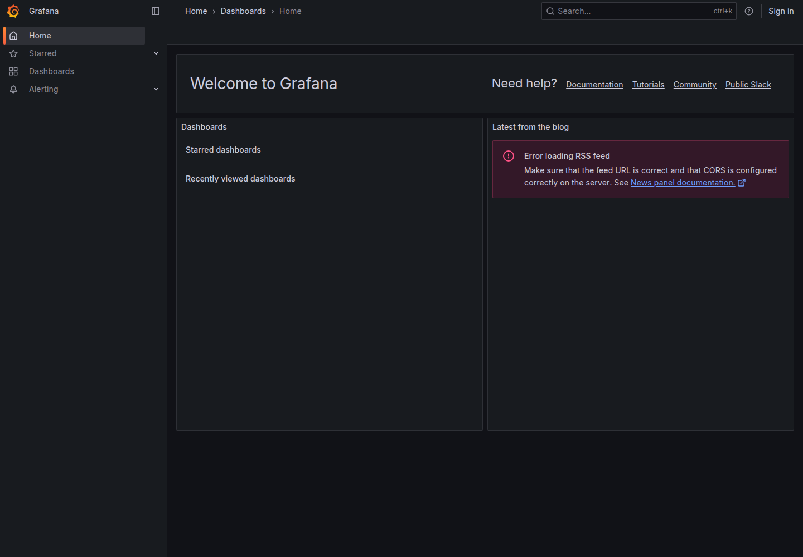
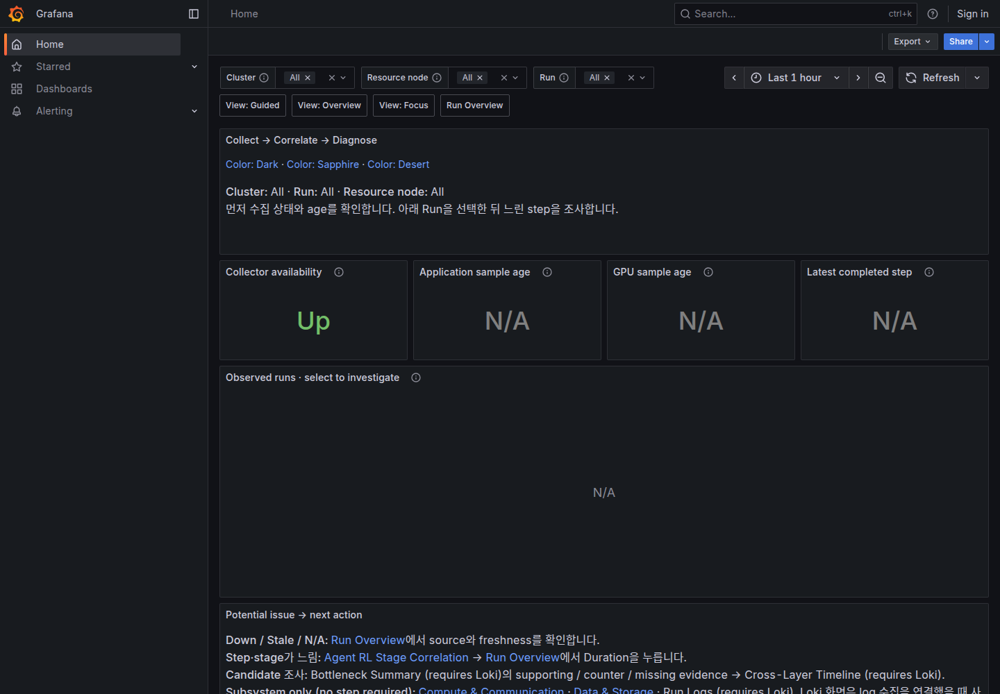
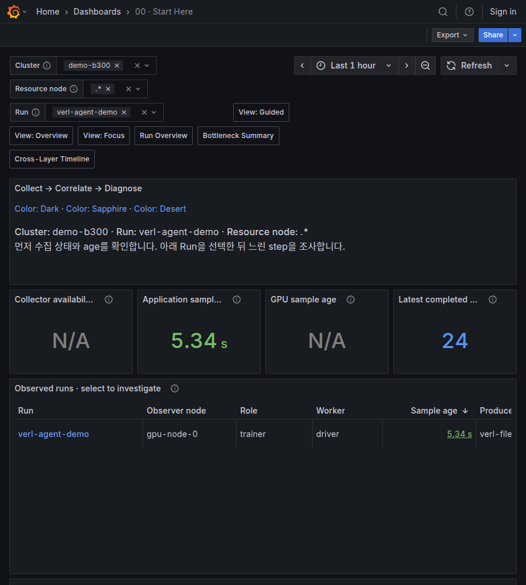
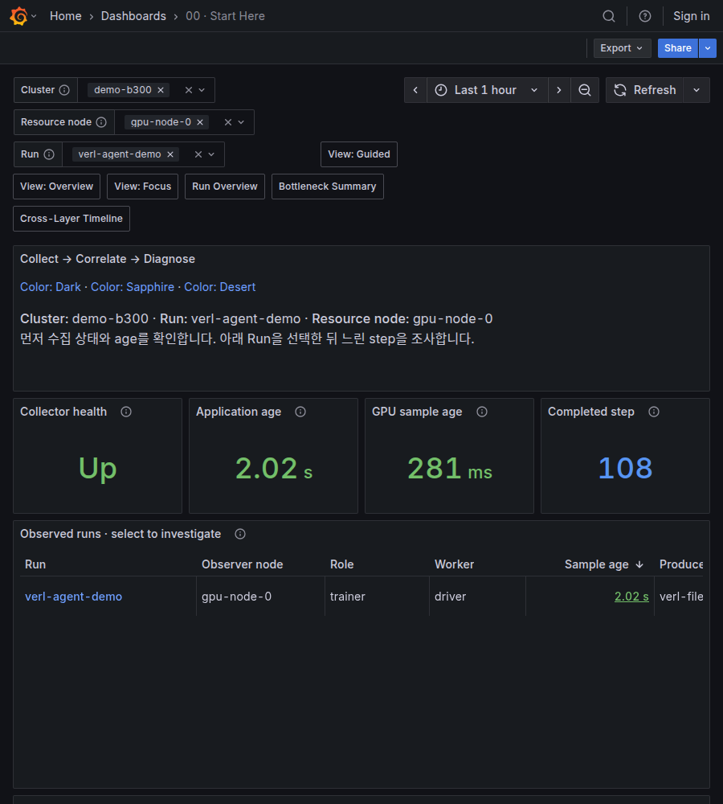

# Fresh User Experience Validation

2026-10-03에 remote `main`의 `dc49a23`을 별도 directory에 clone하고 공개 README부터 따라 사용했습니다.
네 번의 bounded loop에서 설치·CLI·실제 Grafana rendering·investigation navigation을 확인하고 재현된 문제만 수정했습니다.
[Machine-readable 결과](dashboards/user-experience-20261003.json)는 화면별 coverage와 query 결과를 보존합니다.

## A. Initial User Journey

Python 3.12 virtualenv에서 editable 설치, `xltel init`, `doctor`, `install-tools`, `up`, `status`를 실행했습니다.
기존 config·backend·run과 충돌하지 않도록 전용 경로와 port를 사용했습니다.
Missing tool 안내는 동작했지만 Grafana URL은 XLayer 대신 기본 Home으로 연결됐습니다.

Fresh tool 다운로드는 성공했으며 Grafana archive 다운로드가 약 19분 걸렸습니다.
초기 rendering 검사는 같은 버전의 기존 Grafana binary를 읽기 전용으로 재사용했고, 마지막 loop에서는 새로 다운로드한 도구와 별도 wheel 설치로 검증했습니다.
GPU·VERL 없이 진행했으며 application·diagnosis fixture는 `synthetic`입니다.
Normal collector 모드에서 실제 host metric을 따로 확인했고, synthetic 후보를 host의 실제 병목으로 해석하지 않았습니다.

## B. Loop 1 — Onboarding

| Observed | Change | Verification |
| --- | --- | --- |
| Grafana root가 기본 Home/RSS 화면을 표시 | Native default home을 Start Here로 지정 | 실제 root 접속에서 Start Here rendering 확인 |
| CLI URL에서 cluster/node/run을 다시 선택해야 함 | `status`에 scoped Start Here, `run`·`inspect`에 Run Overview URL 추가 | Browser 선택과 CLI URL encoding regression 통과 |

사용자의 custom default home 설정은 보존합니다.
각 loop에서 `down`으로 테스트 stack을 종료하고 다음 실행 전에 PID 정리를 확인했습니다.

## C. Loop 2 — Dashboard Discovery

| Observed | Change | Verification |
| --- | --- | --- |
| 두 collector의 Alloy가 기본 port를 공유해 startup 실패 | `ALLOY_PORT` 설정·검증·forwarding 추가 | 독립 port에서 Loki 포함 startup 성공; 기존 collector 유지 |
| Completed step 표에 내부 metadata와 JSON이 다수 노출 | 핵심 열만 기본 표시; metadata는 frame에 보존 | 실제 표 rendering 및 data link 확인 |
| 여러 target의 Up label이 작은 stat에 겹침 | 선택 범위의 `min(up)`으로 단일 health 표시 | 여러 target fixture와 실제 Grafana에서 확인 |

Collector health는 선택한 범위의 모든 target이 Up일 때 Up입니다.
어느 target이 실패했는지는 `xltel status`나 Prometheus Targets에서 확인합니다.

## D. Loop 3 — Diagnosis Workflow

| Observed | Change | Verification |
| --- | --- | --- |
| Comparison 표의 sampling metadata가 Current/Baseline 비교를 가림 | Signal·Current·Baseline·Delta·Scope·품질 요약을 우선 표시 | 실제 supporting/counter/missing evidence와 비교 표 확인 |
| Diagnosis fixture에 application snapshot/manifest가 없어 일반 Run 탐색에서 찾기 어려움 | 기존 SDK·manifest helper로 synthetic snapshot과 manifest 기록 | Start Here에서 Run 클릭, `inspect`에서 후보 확인 |
| Practice 문서의 nested output이 CLI Run 경로와 다름 | 일반 run root를 사용하고 freshness·Loki 조건 설명 | 문서의 명령으로 fixture 생성·수집·조회 확인 |

실제 클릭 경로는 다음과 같습니다.

```text
Start Here > Run Overview > Step duration > Bottleneck Summary
                                          |
                                          +-> Evidence
                                          +-> Cross-Layer Timeline > Data & Storage
                                                                     |
                                                                     +-> Overview > Focus > Guided
```

Run·cluster·resource node·observer node·record ID·선택 시간 범위를 확인했습니다.
Grafana가 시간 URL을 ISO 형식으로 바꿀 수 있으므로 같은 timestamp인지 비교했습니다.
`examples/investigation/validate_user_journey.py`는 이 synthetic practice 경로를 재현하며 stack 생성·종료는 수행하지 않습니다.

## E. Loop 4 — Regression / Product Quality

| Observed | Change | Verification |
| --- | --- | --- |
| Launcher process group 종료 시 background service도 종료될 수 있음 | `setsid`로 관리 service session 격리; doctor prerequisite 추가 | 실제 lifecycle fixture에서 SID/PGID·기존 ownership 종료 검사 |
| Installer 재실행 시 큰 archive를 다시 다운로드 | 저장한 SHA256과 일치하는 archive만 cache 재사용 | 8개 실제 archive 재사용; 손상된 cache만 재다운로드하는 test |
| 900px에서 Step/Reward 제목이 동일한 말줄임으로 보임 | 짧고 구분되는 stat 제목 적용 | 900/1440px 실제 screenshot과 title truncation 확인 |
| Workspace 안내문 마지막 줄에 내부 스크롤 필요 | Header 높이 1 grid row 추가 | 두 폭에서 paragraph content height가 container 안에 들어옴 |

새 wheel을 별도 virtualenv에 설치하고 checkout 밖에서 init·doctor·up·status·inspect·down을 실행했습니다.
CPU workload가 VERL file logger 형식의 step을 기록하도록 `xltel run`을 실행해 bridge·manifest·final export와 workload exit code 0을 확인했습니다.
이 workload는 실제 VERL 학습이 아닙니다.
Archive cache 검사는 local integrity 확인이며 publisher signature 검증을 추가한 것은 아닙니다.

## F. Optional Loop 5

실행하지 않았습니다.
추가 readability 확인과 소규모 수정은 마지막 regression loop에 포함했으며 새로운 feature나 전체 UI rewrite를 추가하지 않았습니다.

## G. Before / After

| Before | After |
| --- | --- |
| Grafana 기본 Home | XLayer Start Here |
| Run/cluster/node를 수동 선택 | CLI의 scoped URL |
| 내부 metadata가 늘어나는 step/comparison 표 | 핵심 열 우선, Inspect에서 상세 frame 확인 |
| 좁은 화면의 구분 불가능한 stat 제목 | Collector health·Application age·Completed step·Reward mean |









### 전체 Layout 점검 범위

Loki가 활성화된 10개 dashboard와 접힌 subsystem row의 117개 panel을 1440px·900px에서 각각 rendering했습니다.
DOM의 text rectangle·font size·title ellipsis와 screenshot을 함께 확인했습니다.
Table/legend가 의도적으로 clip·scroll하는 내용까지 geometry detector가 표시하므로 이를 실제 overflow와 구분했습니다.

표 본문은 14px, 안내문은 16px, 주요 stat 값은 36px였습니다.
Graph legend의 일부 값은 Grafana native 12px이며 dashboard JSON으로 모든 native 글꼴을 일괄 변경하지 않았습니다.
긴 legend·표는 스크롤하고 긴 제목은 tooltip으로 확인할 수 있습니다.
Canvas axis 글꼴은 DOM 검사 대상이 아니므로 screenshot으로 확인했습니다.

## H. Tests

- 전체 CPU regression: **591 passed, 0 skipped**; 실제 `promtool` 사용.
- Shell syntax, `compileall`, `git diff --check` 통과.
- Sphinx strict documentation build 통과.
- 실제 Grafana 12.1.0 provisioning: Loki off/on, 별도 port 및 fresh wheel 실행 확인.
- 최종 browser journey: 1440px의 35회, 900px의 29회 datasource 요청에서 HTTP/query error 없음.
- 두 폭에서 각각 9개 화면의 클릭·Run/Node/Step/time context 검사 통과.

## I. Remaining Issues

이번에는 실제 VERL training·Docker cgroup·3FS ClickHouse·Ollama·물리 multi-node를 재실행하지 않았습니다.
Optional native source 미설정 panel은 N/A로 남겼으며 synthetic 데이터로 실제 source 검증을 대신하지 않았습니다.
Dark theme의 두 desktop 폭을 확인했으며 모든 browser·mobile·색상 theme 조합을 검증한 것은 아닙니다.

동일 fixture를 Alloy restart 이후 replay하면 comparison row가 중복되는 경우를 관찰했습니다.
Production report revision/dedup 계약은 이번 UX 수정에 포함하지 않았으며 replay 조사 시 재검토할 항목입니다.
Default native 12px legend는 browser zoom이나 panel 확대가 필요할 수 있습니다.

## J. Cleanup Verification

이번 검증이 만든 clone·두 virtualenv·도구 archive/binary·config/state/run·synthetic exporter·browser artifact를 정리했습니다.
작은 결과 JSON과 대표 screenshot, source 변경만 저장소에 보존했습니다.
새 Docker container·network·volume·image는 생성하지 않았습니다.
기존 monitoring stack·Docker container·VERL 환경·run·config는 변경하거나 삭제하지 않았으며 backend health를 다시 확인했습니다.

`xltel down`은 관리 process와 PID state를 종료하며 user config·run 결과·log를 삭제하지 않습니다.
작은 lock/config snapshot은 정상적으로 보존되는 운영 state입니다.
