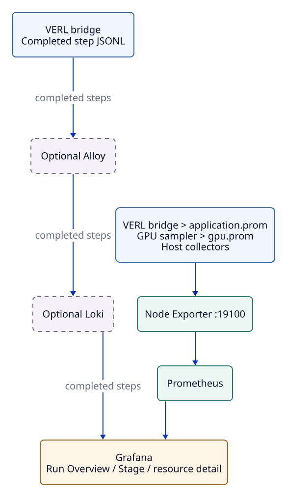
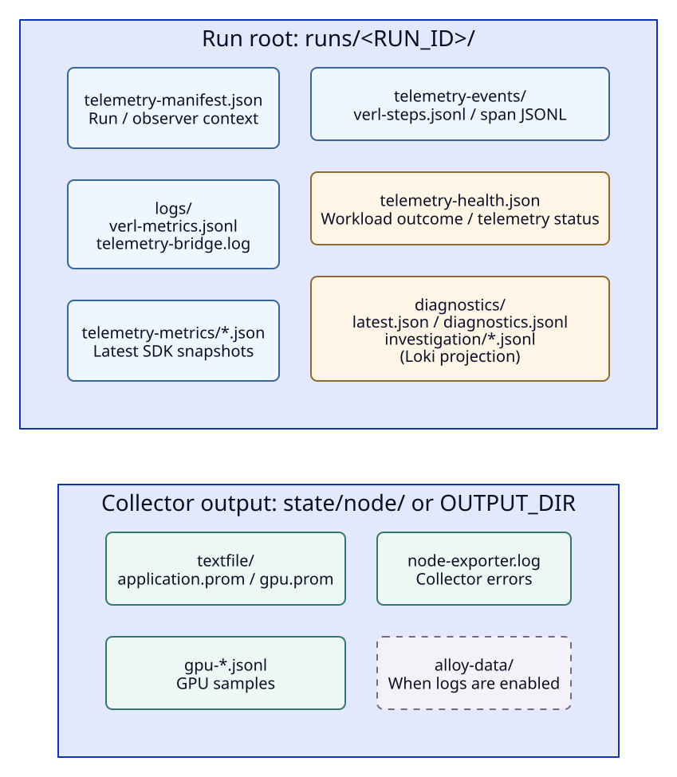

# Connect an Existing VERL Run

실행 가능한 VERL 명령·NVIDIA GPU가 있는 사용자를 위한 단일 host 연결입니다.
아직 없다면 [synthetic demo](monitoring.md#try-the-demo)부터 확인합니다.
Process·파일은 [Architecture](architecture.md), 추가 subsystem은 [Cross-Layer Integration](agent-rl.md)을 참고합니다.

## What This Adds

VERL wrapper는 기존 명령에 file logger를 붙이고 bridge를 함께 실행합니다.
Bridge는 완료된 step을 최신 metric snapshot과 누적 step event로 나눠 기록합니다.
Node collector는 snapshot·GPU·host 정보를 Node Exporter로 노출하고 monitoring server가 이를 Prometheus와 Grafana에 연결합니다.



완료 step 하나가 실제로 어떤 이름의 metric과 event가 되는지는 [step 7 예제](architecture.md#follow-one-completed-step)를 확인합니다.
기본 연결만으로는 vLLM queue·Ray task·3FS service latency·tool event가 생기지 않습니다.

| 연결 방법 | 기본적으로 얻는 정보 | 추가 연결이 필요한 정보 |
| --- | --- | --- |
| `run`의 VERL wrapper | 완료 step·stage duration과 file logger에 있는 reward·token/throughput scalar | vLLM queue, GPU, host, storage 지표 |
| `up`의 node collector | GPU utilization·power·temperature와 host CPU·memory·network·disk·filesystem | Native vLLM/Ray endpoint, 3FS service latency |
| 선택적 SDK / EventRecorder | 직접 기록한 worker metric·tool span | Application의 직접 계측과 실행 환경에 SDK 설치 |

File logger 연결은 VERL 환경에 SDK를 설치하지 않아도 됩니다.
Custom worker·tool에서 SDK를 import하면 해당 환경에도 설치합니다.
실제 producer·scope는 [수집 목록](metrics.md#what-is-actually-collected)을 확인합니다.
GPU 없는 collector는 `ENABLE_GPU_METRICS=0`을 사용하며 이 값이 VERL training 방식을 바꾸지는 않습니다.

## 1. Prepare One Config File

[Telemetry 환경](index.md#prepare-a-checkout)의 `.venv`에는 VERL이나 CUDA PyTorch가 설치되지 않으므로 이미 동작하는 VERL 환경의 Python을 따로 사용합니다.
아래 예제는 server·node collector·VERL이 같은 machine에서 실행되는 경우입니다.

```bash
xltel init
xltel config path
xltel doctor
xltel install-tools
```

새 config는 `$HOME/.config/xlayer/config.toml`이며 `init`은 기존 설정을 유지합니다.
기본 경로의 기존 `config.conf`가 있으면 그 파일을 계속 사용합니다.
기존 `verl-local.conf`는 `xltel --config FILE ...` 또는 `XLAYER_CONFIG`로 지정합니다.
새 config는 실행마다 Run ID를 자동 생성하며, TOML의 `[workload] command = [...]`에 기존 launcher를 저장하면 `xltel run`만으로 실행할 수도 있습니다.
기존 Bash config는 `VERL_COMMAND=(...)` 배열을 유지하며 읽을 때 실행되는 trusted 파일입니다.
설정 우선순위와 전체 명령은 [CLI Reference](cli.md)에 있습니다.

Wrapper가 명령에서 `verl.trainer.main_ppo` 또는 `verl.experimental.fully_async_policy.fully_async_main`을 찾으면 `trainer.logger=["console","file"]`을 추가합니다.
Bash launcher는 `VERL_FILE_LOGGER_PATH` 전달과 `trainer.logger`의 `file` 설정을 담당하며 `file`이 빠진 명시적 logger는 거부됩니다.
Trainer mode를 숨긴 launcher는 `xltel run --mode async -- <기존 명령>`을 사용하거나 TOML의 `[telemetry]`에 `EXECUTION_MODE = "async"`를 설정합니다.

기본 `auto`는 trainer mode를 감지하고 rollout server의 `mode=async`만으로 판정하지 않습니다.

`install-tools`는 `$HOME/telemetry/tools`에 node와 server 도구를 준비합니다.
처음 한 번만 실행하면 되고, NVIDIA driver·VERL·3FS는 설치하지 않습니다.

## 2. Start Server, Node, and VERL

Script가 monitoring server와 GPU node collector를 background로 시작하고 둘 다 준비됐는지 확인합니다.
실패하면 시작한 process를 정리하고 `$HOME/telemetry/state/verl-local/`의 log 경로를 알려줍니다.

```bash
xltel up
```

`Monitoring ready`가 출력되면 같은 terminal에서 기존 VERL 명령을 telemetry wrapper와 함께 실행합니다.

```bash
xltel run -- /path/to/verl-env/bin/python -m verl.trainer.main_ppo ...
```

새 config의 기본값은 `NODE_NAME=gpu-local`, `CLUSTER_NAME=training-cluster`, run parent `$HOME/telemetry/runs`입니다.
Script가 target·snapshot 경로·run/node 이름을 맞춥니다.
`run`은 마지막 telemetry export 후 원래 VERL exit code를 반환합니다.

`RUN_ID=auto`는 매 실행의 고유 ID를 만들며, 고정 ID를 설정한 경우 새 학습마다 변경합니다.
Collector는 같은 parent의 새 run을 발견하므로 ID만 바뀌면 재시작할 필요가 없습니다.
Server·collector는 학습 종료 후에도 유지되고 새 terminal에서도 같은 config로 `down`할 수 있습니다.

Process 기록·log는 `$HOME/telemetry/state/verl-local/`에 있습니다.
Run parent나 collector 입력을 바꿨다면 `down` → `up`으로 갱신합니다.

`status`는 managed process, backend 응답, target과 GPU·VERL sample freshness를 구분하며 `--json`도 제공합니다.

```bash
xltel status
```

`up`·`down`은 Linux `flock`으로 동시 실행을 막고, 새 PID 기록에는 process 시작 시각과 boot ID를 함께 저장합니다.
예전 두 필드 PID 기록은 이전 방식대로 읽을 수 있지만 boot ID 검사는 새로 시작한 process부터 적용됩니다.

## 3. Check the First Completed Step

`http://127.0.0.1:13000`을 열고 원격 접속은 [SSH tunnel](monitoring.md#open-the-dashboards)을 사용합니다.
Start Here에서 collector·sample age를 확인하고, 실행 출력의 Run Overview 링크를 엽니다.
Stage·engine 상세는 Stage Correlation에서 확인하며 기본 Cluster·Node는 `training-cluster`·`gpu-local`입니다.
Stage·reward·throughput은 step 완료 시, GPU·host는 별도 주기로 갱신됩니다.

`inspect`는 configured/latest run의 metric·event·진단 결과를 읽으며 `xltel inspect RUN_ID`로 다른 run도 선택합니다.
Native endpoint의 실시간 수집 상태는 같은 config의 `sources` 명령으로 확인합니다.

```bash
xltel inspect
```



위 파일 순서로 확인하고 `application.prom`에 값이 있으면 target·시간·Cluster/Node/Run filter를 봅니다.
Snapshot은 최신 step, logger·event JSONL은 이력을 보존합니다.
원래 시각 없는 replay는 `unknown`으로 남아 시간 기반 목록에서 제외됩니다.
새 step이 완료될 때까지 live bridge가 유지되는지 확인합니다.
긴 step 동안 이전 값이 보일 수 있으므로 [sample age](dashboards.md#agent-rl-stage-correlation)를 함께 봅니다.

### Check Telemetry Completeness

Wrapper는 workload의 exit code와 별도로 `telemetry-health.json`을 기록합니다.
최종 bridge export가 실패하면 artifact가 남아 있어도 실패 상태를 유지합니다.
Bridge·diagnostics의 생존, 마지막 output 갱신 시각, 최종 export 결과와 진단의 missing source를 `show_run`에서 함께 확인합니다.
`complete`는 연결한 telemetry 처리의 완료 상태이며 모든 subsystem의 관측이나 workload correctness를 보증하지 않습니다.

`pending`은 첫 output 이전, `delayed`는 오래된 output입니다.
긴 step도 간격이 늘 수 있어 workload stall로 단정하지 않습니다.
기본 age 기준 300초는 `TELEMETRY_HEALTH_MAX_AGE_SECONDS`로 바꿉니다.
`partial`은 sidecar 종료·최종 export 실패/누락·evidence 부족이며 workload exit code는 유지합니다.

Wrapper는 workload의 임의 인자를 로그에 출력하지 않습니다.
Workload 자체의 로그나 외부 launcher가 출력하는 credential은 별도로 관리합니다.
정상 종료와 signal 종료 모두 새 workload session의 소유권을 확인해 남은 자식에 TERM을 보내고, 제한시간 이후 KILL로 정리합니다.
별도 session으로 분리된 작업이나 기존 Ray cluster는 종료 대상으로 포함하지 않습니다.

## Inspect or Refresh a Subsystem

Run 결과는 `inspect`, native endpoint의 scrape 상태와 Explore 링크는 `sources`로 확인합니다.
Run이나 step이 없어도 `sources`와 `sources threefs`를 사용할 수 있습니다.

```bash
xltel sources
```

vLLM의 동적 endpoint가 바뀌면 source JSON을 수정하고 `sources refresh`를 실행합니다.
이미 native job이 있는 server는 재시작하지 않아도 됩니다. 최초 연결은 `down` → `up`이 필요합니다.
3FS 단독 조회와 subsystem log 설정은 [Subsystem inspection](agent-rl.md#inspect-one-subsystem)을 참고합니다.

## Add Sources When Needed

기본 연결이 동작한 뒤 필요한 값만 기존 TOML의 `[telemetry]`에 추가합니다.
Boolean은 `true`/`false`, 경로는 따옴표로 감싼 문자열이며 `$HOME` 대신 `~` 또는 절대 경로를 사용합니다.
설정 형식과 우선순위는 [CLI Configuration](cli.md#configuration)이 기준입니다.

| 원하는 기능 | Config에서 추가할 값 | 이어서 읽을 문서 |
| --- | --- | --- |
| Run Logs와 Run Overview의 완료 step 목록 | `ENABLE_LOGS = true`; server·node 재시작 | [Loki 연결](monitoring.md#add-run-logs-with-loki) |
| vLLM·Ray endpoint | `TELEMETRY_SOURCES_FILE`; 최초 server 재시작, 이후 `sources refresh` | [Native endpoint](agent-rl.md#register-native-endpoints) |
| 자동 진단과 선택적 3FS ClickHouse | `DIAGNOSTICS_CONFIG`; 새 run 시작 | [Diagnostics](agent-rl.md#add-diagnostics) |
| 다른 저장 위치·node 이름 | `TELEMETRY_RUNS_ROOT`·`TELEMETRY_HOME`·`NODE_NAME`; 기존 run 위치는 유지 | [구현 구조](architecture.md#what-each-file-is-for) |

`xltel`은 명령을 실행한 host의 process를 관리합니다.
Monitoring host에서는 `up --role server`, 각 collector host에서는 `up --role node`를 사용하며 원격 host를 한 번에 배포하지는 않습니다.
[Monitoring Guide](monitoring.md#expand-to-multiple-nodes)와 [node mapping](agent-rl.md#map-multiple-nodes-to-a-run)의 주소·port·label 설정으로 연결합니다.
기본 wrapper 옵션은 `xltel run --help`, 추가 source metadata 등 advanced 옵션은 `bash scripts/run_verl_with_telemetry.sh --help`에서 확인합니다.
Step event를 Grafana에서 보려면 Loki가 필요하며, 로컬 JSONL 확인에는 필요하지 않습니다.

## If Data Is Missing

| 증상 | 먼저 확인할 곳 |
| --- | --- |
| Server가 시작되지 않음 | 설치 결과, `$HOME/telemetry/state/server/startup-summary.json`, 사용 중인 port |
| GPU도 보이지 않음 | `nvidia-smi`, `$HOME/telemetry/state/verl-local/node.log`, Prometheus `telemetry` target |
| GPU는 보이지만 run이 없음 | Config의 `RUN_ID`, wrapper log, collector가 읽는 `telemetry-metrics` 경로 |
| JSON은 있지만 panel이 비어 있음 | `application.prom`, Prometheus target, 시간·cluster·node·run filter |
| Stage 값이 없음 | 첫 step 완료 여부, VERL `file` logger 지원, `telemetry-bridge.log` |
| Run Overview의 완료 step 목록만 비어 있음 | `ENABLE_LOGS`, step event 파일, Alloy·Loki 수집과 보존 기간 |
| vLLM panel이나 Ray·3FS 진단 근거가 없음 | vLLM·Ray의 native target과 실제 metric 이름; 3FS는 ClickHouse 설정·데이터 |

```bash
xltel down
```

Server와 node를 따로 조사할 때에는 기존 `verl_local.sh --config FILE server|node`를 foreground로 실행합니다.
