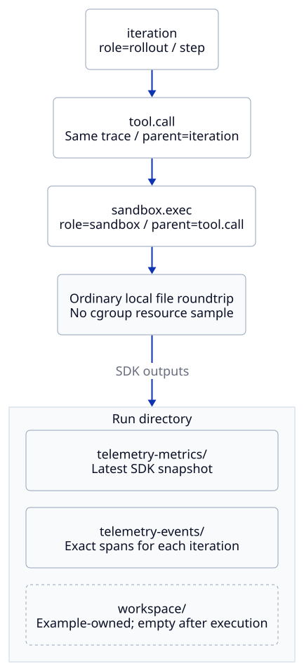

# Examples

이 디렉터리는 실행 가능한 연결 예제와 사용자가 복사할 설정을 제공합니다.
일반적인 VERL 도입 순서는 [README의 Start Here](../README.md#start-here)를 따릅니다.
과거 실환경 검증의 결과 JSON은 [docs/validation](../docs/validation/README.md)에 있으며 실행 예제와 구분합니다.

## Choose an Example

Optional dependency는 해당 예제를 사용할 때만 필요합니다.

| 목적 | 예제 | 필요한 환경 / 확인 결과 |
| --- | --- | --- |
| SDK metric·tool·sandbox context를 처음 확인 | [application/quickstart.py](application/quickstart.py) | CPU와 Python만 필요합니다. Snapshot·exact span·parent 연결을 확인합니다. |
| 기존 VERL 명령을 한 host에서 연결 | `xltel init`의 TOML config | [Quickstart](../docs/verl-quickstart.md)를 따릅니다. 기존 Bash 예제는 [verl-local.conf](verl-local.conf)로 유지합니다. |
| Monitoring server 설정을 복사 | [monitoring-server.conf](monitoring-server.conf) | Collector 주소를 바꾸고 [monitoring 절차](../docs/monitoring.md#monitor-one-gpu-node)를 따릅니다. |
| Multi-node 설정을 한 번 정의 | [cluster/inventory.toml](cluster/inventory.toml) | `xltel cluster validate/render`로 기존 설정을 생성합니다. [배치와 topology 게시](../docs/multi-node.md#1-configure)는 별도이며 실제 discovery·Run 소유권이 아닙니다. |
| vLLM·Ray endpoint 등록 | [verl/native-sources.json](verl/native-sources.json) | 실제 endpoint만 남기고 주소를 수정합니다. 3FS exporter는 별도 설치된 경우에만 사용합니다. |
| Mooncake KV storage 수집·직접 분석 | [mooncake/native-sources.json](mooncake/native-sources.json), [mooncake/prometheus.json](mooncake/prometheus.json) | Store 배포의 기본 connector·master·client 관측 설정입니다. [HTTP 연결 방법과 version 범위](../docs/agent-rl.md#observe-mooncake-kv-storage)를 확인합니다. |
| Rule diagnosis와 multi-node scope 설정 | [verl/diagnostics.json](verl/diagnostics.json), [multinode/diagnostics.json](multinode/diagnostics.json) | Backend 주소·cluster·node·device를 실제 배치에 맞춥니다. 첫 설정의 3FS section은 해당 source가 없으면 제거합니다. |
| GPU 없이 전체 synthetic dashboard 확인 | [synthetic-demo.toml](synthetic-demo.toml), [live-demo/](live-demo/) | Metric·native source fixture와 diagnosis/log/span을 연결합니다. [Try the Demo](../docs/monitoring.md#try-the-demo)를 사용하며 실제 성능 측정이 아닙니다. |
| Logical checkpoint bytes·duration·outcome SDK 예제 | [application/checkpoint_io.py](application/checkpoint_io.py) | CPU payload save/load를 기록합니다. 실제 VERL 자동 연결·physical I/O 성능·durability 검증은 아닙니다. |
| Docker로 monitoring server 배치 | [dashboards/](dashboards/README.md) | Docker Compose와 실행 중인 node collector가 필요합니다. 공통 metrics dashboard 5개와 Overview·Focus workspace 2개를 사용합니다. |
| Docker tool을 VERL AgentLoop에 연결 | [sandbox/verl_lab_swebench_tools.py](sandbox/verl_lab_swebench_tools.py), [calculator_tools.py](sandbox/calculator_tools.py) | SWE-Bench adapter는 private verl-lab 접근 권한·모델·dataset·grader image와 Docker가 필요합니다. Calculator 예제는 해당 tool runtime을 사용합니다. [sandbox guide](../docs/agent-rl.md#observe-an-agent-sandbox)를 먼저 읽습니다. |
| 실제 sandbox trace/cgroup 확인 | [sandbox/validate_smoke.py](sandbox/validate_smoke.py), [validate_docker_cgroup.py](sandbox/validate_docker_cgroup.py) | 전자는 저장된 smoke 결과를 읽고 후자는 실제 임시 Docker container를 실행합니다. |
| Collector run discovery·freshness 확인 | [investigation/validate.py](investigation/validate.py) | Prometheus 실행 파일이 필요합니다. CPU SDK fixture로 logical node 두 개를 검사합니다. |
| Synthetic dashboard query coverage 검사 | [investigation/validate_demo_coverage.py](investigation/validate_demo_coverage.py) | 실행 중인 Prometheus·선택적 Loki와 provision된 dashboard JSON을 읽습니다. 비어 있는 query나 NaN을 실패로 기록합니다. |
| 실제 Grafana investigation 클릭 검증 | [investigation/validate_user_journey.py](investigation/validate_user_journey.py) | Optional Playwright·Chromium과 Loki 포함 stack, synthetic diagnosis practice Run이 필요합니다. Stack과 fixture는 직접 준비합니다. |
| JSONL·snapshot cache 비용 확인 | [investigation/validate_runtime.py](investigation/validate_runtime.py) | CPU fixture로 1만·10만 record와 1,000-worker snapshot의 cold/warm 조회를 비교합니다. `warm_parsed_bytes`는 cache 한도 초과 시 재파싱도 포함하며 전체 diagnosis 지연 측정은 아닙니다. |
| Baseline·signature 정확성과 처리 비용 비교 | [research/system_review_benchmark.py](research/system_review_benchmark.py) | 이전 revision과 같은 synthetic history를 분석합니다. Python 시간·추가 allocation·backend 요청 수를 비교하며 실제 VERL·GPU·storage 성능이 아닙니다. |
| Robust diagnosis·Graph·Path 평가 | [research/performance_diagnosis_benchmark.py](research/performance_diagnosis_benchmark.py) | 독립 raw-input fault oracle와 실제 engine·SDK 비용 비교. [지원 범위 / 통계 한계](../docs/performance-diagnosis.md)를 확인합니다. |
| 실제 async SDK dependency 기록 | [research/trajectory_dependency_demo.py](research/trajectory_dependency_demo.py) | CPU generation·queue·parallel tool의 실제 JSONL과 blocking path. GPU·framework 자동 tracing 예제가 아닙니다. |
| GPU·clock·multi-node correlation 확인 | [multinode/validate_local.py](multinode/validate_local.py) | GPU 2개·Node Exporter·Prometheus가 필요합니다. 한 host의 logical node이며 물리 multi-node 학습 검증이 아닙니다. |
| 별도 guest kernel·clock·collector 검증 | [multinode/validate_vms.py](multinode/validate_vms.py) | KVM·QEMU·cloud-localds와 Ubuntu cloud image가 필요합니다. GPU 없이 VM 두 개에서 collector와 clock failure/recovery를 검사합니다. |
| CPU 3노드 설정·실제 수집·부분 장애 | [multinode/validate_cpu_contracts.py](multinode/validate_cpu_contracts.py) | Docker·기존 Prometheus/Node Exporter/Loki/Alloy 사용. [실행 및 범위](multinode/README.md)를 확인하며 shared kernel을 물리 clock 검증으로 해석하지 않습니다. |
| 작은 GPU instrumentation smoke | [verl/gpu_smoke.py](verl/gpu_smoke.py) | PyTorch·CUDA가 필요합니다. 작은 REINFORCE loop이며 실제 VERL benchmark가 아닙니다. |
| Selected-rank profiling·NCCL 비교 | [pytorch/](pytorch/), [verl/torch-profiler.yaml](verl/torch-profiler.yaml) | [Run Analysis](../docs/dashboards.md#run-analysis)의 launcher를 사용합니다. PyTorch·CUDA·NCCL 또는 실제 VERL 환경이 필요합니다. |
| Optional local LLM diagnosis | [local-llm.conf](local-llm.conf), [local-llm/prometheus.json](local-llm/prometheus.json) | [Ollama 설정](../docs/local-llm.md)을 먼저 완료합니다. Training GPU와 diagnosis GPU의 경쟁을 피합니다. |
| LLM 입력 fixture·출력 contract 평가 | [local-llm/evaluate.py](local-llm/evaluate.py) | `--generate-only`는 모델 없이 입력을 만듭니다. 실제 추론은 Ollama가 필요하며 semantic 정확성은 별도 검토합니다. |

## CPU SDK Quickstart

GPU·VERL·Docker·monitoring server 없이 작은 file roundtrip의 실제 duration과 span을 기록합니다.
아래 output은 새 directory여야 합니다.

```bash
python -m examples.application.quickstart --output artifacts/sdk-example
python -m xlayer_telemetry.show_run artifacts/sdk-example
```



`show_run`의 summary/manifest가 없다는 안내는 이 최소 SDK 예제에서는 정상입니다.
`trajectory_id`와 `sandbox_id`는 event attribute에만 기록하며 Prometheus label에 추가하지 않습니다.
이 예제는 sandbox runtime이나 container isolation을 만들지 않습니다.
Cgroup·NVMe telemetry도 수집하지 않으므로 file bytes를 device I/O나 trajectory별 resource attribution으로 해석하지 않습니다.
실제 runtime에서는 같은 API의 span을 자신의 실행 코드에 연결하고, cgroup sampler·node collector를 [sandbox guide](../docs/agent-rl.md#sample-the-sandbox-worker-cgroup)에 따라 별도로 설정합니다.

## Configuration and Validation

기본 CLI config는 TOML이며 `.conf`는 trusted local Bash 설정입니다.
JSON/YAML은 해당 adapter나 service의 입력입니다.
`/path/to`, `.internal`, `.example` 주소는 자신의 환경으로 바꿔야 합니다.
설정 파일을 원본 위치에서 수정하기보다 개인 설정 디렉터리로 복사하면 checkout을 바꿔도 실험 설정을 보존하기 쉽습니다.

검증 script의 `--help`에서 필요한 옵션을 확인하고 별도의 output directory를 사용합니다.
`investigation/validate.py`와 `multinode/validate_local.py`는 자체 임시 backend를 시작하고 종료하지만, `scripts/validate_stack.sh`는 Compose service를 검증 후에도 유지합니다.
Sandbox Docker 검사에서는 임시 container가 실행되며 실제 local I/O가 발생합니다.
과거의 `passed` 보고서는 현재 host에서 검증을 다시 실행한 결과를 대신하지 않습니다.
